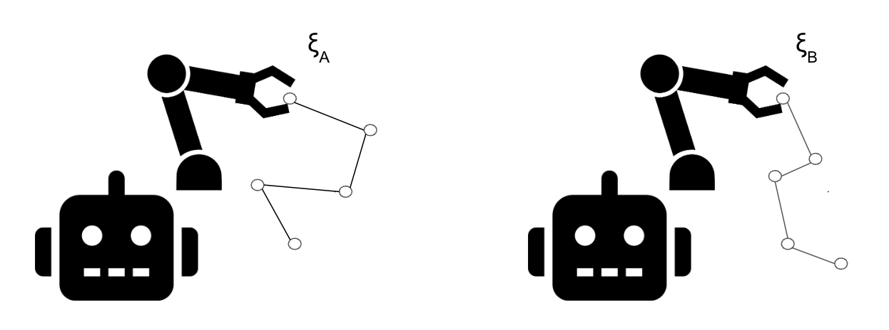

::: {.callout-note title="Intended Learning Outcomes"}

By the end of **Chapter “Learning”** you will be able to

- **Formulate** utility‑learning as a supervised problem: map human‑preference datasets to a parameterised model $u_\theta$ and write the Bradley–Terry likelihood for pairwise data.  
- **Derive** and **minimise** the binary‑cross‑entropy (maximum‑likelihood) loss for comparisons, implementing gradient‑based optimisation with difference features.  
- **Contrast** point (MLE) and Bayesian (posterior) estimation paradigms, explaining when uncertainty quantification is critical.  
- **Re‑parameterise** utilities as log‑policies and **apply** *Direct Preference Optimisation* (DPO), including KL regularisation against a reference policy.  
- **Connect** DPO to variational inference by maximising the evidence lower bound (ELBO) that trades off data fit and KL distance to the prior.  
- **Construct** Gaussian‑process preference models; **perform** Laplace approximation to obtain posterior means and credible intervals for utilities.  
- **Approximate** Bayesian neural‑network posteriors with Metropolis–Hastings MCMC and **interpret** ensemble predictions and weight‑space trajectories.  
- **Evaluate** learned utilities or policies on held‑out comparisons, assessing ranking accuracy and calibration of posterior uncertainty.  
- **Integrate** demonstrations, comparisons, ratings, and physical corrections into a unified learning pipeline for robotics tasks.  
- **Critically appraise** the computational and sample‑efficiency trade‑offs between supervised and Bayesian preference‑learning methods.
:::

Designing a good utility function (or reward function) for a complex AI or robotics task by hand is notoriously difficult and error-prone. Instead of manually specifying what constitutes "good” behavior, we can learn a utility function from human preferences. In this chapter, we explore how a to learn preferences from a fixed dataset of human feedback. We discuss both supervised learning and Bayesian approaches to utility learning, and exemplify them with applications in robotics.

## The Supervised Learning Problem

Informed by our discussion in @sec-background, we will assume that human feedback over "objects" (states, outcomes, or trajectories $y$) can be derived from a utility function $u(y)$. As in other learning problems, we choose a parameterized model $u_\theta(x)$ and adjust $\theta$ so that $u_\theta$ agrees with the human-provided preferences as much as possible.

To concretize this, we can consider a class of Bradley-Terry models, which are the IIA models for pairwise comparison. The probability that $y$ is preferred to $y'$ is 

$$
\mathbb{P}(y \succ y' \mid \theta) = \sigma (u_\theta(y) - u_\theta(y'))
$$

where $\sigma(z)=\frac{1}{1+e^{-z}}$ is the sigmoid function. The human is more likely to prefer $y$ over $y'$ if $u_\theta(y)$ is larger than $u_\theta(y')$.

At the heart of learning from human preferences lies a latent utility function — a function that assigns numerical value to states, trajectories, or outcomes according to a human’s (possibly unspoken) preferences. The goal of a learning algorithm is to infer this function from observed feedback, which may come in the form of demonstrations, ratings, rankings, or pairwise comparisons. But how exactly do we represent and update our belief about this hidden utility function?

Two major paradigms in statistical learning provide different answers: point estimation and posterior estimation.

In point (also known as Maximum Likelihood) estimation, we seek a single "best guess" for the utility function---typically a function $u_\theta(x)$ from a parameterized family (e.g. linear models, neural nets), with parameters $\theta \in \mathbb{R}^d$. Given data $\mathcal{D}$ from human feedback, we choose the parameter $\hat{\theta}$ that best explains the observed behavior. Formally,
$$
\hat{\theta} = \arg\max_\theta \mathbb{P}(\mathcal{D} \mid \theta).
$$

We pick the parameters that make the observed data most probable under our model. Once $\hat{\theta}$ is selected, we can use $u_{\hat{\theta}}$ for downstream evaluation or optimization tasks.

In contrast, posterior estimation takes a fully Bayesian view. Instead of committing to one estimate, we maintain a distribution over utility functions. That is, we place a prior $p(\theta)$ over parameters (or over functions $u$ more generally), and update this to a posterior after observing data $\mathcal{D}$:

$$
\mathbb{P}(\theta \mid \mathcal{D}) \;=\; \frac{\mathbb{P}(\mathcal{D} \mid \theta)\, \mathbb{P}(\theta)}{\mathbb{P}(\mathcal{D})}
$$

The posterior expresses uncertainty over which utility functions are compatible with the human feedback, based on prior knowledge, as expressed by the prior $\mathbb{P}(\theta)$. From this distribution, we can make predictions (e.g., using the posterior mean or modal utility), quantify confidence, or even actively select new queries to reduce uncertainty, the topic of @sec-active. Posterior estimation is especially valuable when human feedback is sparse, and we have prior information on what utility functions may be likely.

The next two sections instantiate these two perspectives. In @subsec-pointestimation, we explore point estimation via supervised learning, treating preference data as labeled examples and fitting a utility model. In @subsec-bayesianestimation we shift to posterior estimation with Bayesian methods like Gaussian processes and Bayesian neural networks, which explicitly models uncertainty around the estimate.

## Point Estimation via Maximum Likelihood
Given a dataset of comparisons $D=\{(y_i, y_i')\}_{i=1}^m$, we can fit $\theta$ by maximizing the likelihood of the human’s choices under a Bradley-Terry model. This likelihood is given by
$$
\prod_{i=1}^m \sigma(u_\theta (y_i) - u_\theta (y_i')).
$$
Taking logs, we can minimize a _binary cross-entropy loss_,
$$
\mathcal{L}(\theta) = -\sum_{i=1}^m \left[ \sigma(u_\theta(y_i - u_\theta(y_i')) \right]
$$
This is a straightforward supervised learning problem – essentially logistic regression – on pairwise difference features.

::: {.callout-note title="Example"}

Suppose a human’s utility for an outcome can be described by a quadratic function (unknown to the learning algorithm). We collect pairwise preferences and then train a Bradley-Terry utility model $u_\theta(x)$.

```{python}
import numpy as np

# True utility function (unknown to learner), e.g. u*(x) = -(x-5)^2 + c for some constant c 
def true_utility(x):
    return -(x-5)**2  # (peak at x=5)

# Generate synthetic pairwise preference data
np.random.seed(42)
n_pairs = 20
X1 = np.random.uniform(0, 10, size=n_pairs)  # 20 random x-values
X2 = np.random.uniform(0, 10, size=n_pairs)  # 20 more random x-values
# Determine preferences according to true utility
prefs = (true_utility(X1) > true_utility(X2)).astype(int)  # 1 if X1 preferred, else 0

# Parametric model for utility: u_theta(x) = w0 + w1*x + w2*x^2  (quadratic form)
# Initialize weights
w = np.zeros(3)
lr = 0.01       # learning rate
reg = 1e-3      # L2 regularization strength
for epoch in range(1000):
    # Compute predictions via logistic model
    util_diff = (w[0] + w[1]*X1 + w[2]*X1**2) - (w[0] + w[1]*X2 + w[2]*X2**2)
    pred = 1 / (1 + np.exp(-util_diff))      # σ(w·(phi(X1)-phi(X2)))
    # Gradient of cross-entropy loss
    grad = np.array([0.0, 0.0, 0.0])
    error = pred - prefs  # (sigma - y)
    # Features for X1 and X2
    phi1 = np.vstack([np.ones(n_pairs), X1, X1**2]).T
    phi2 = np.vstack([np.ones(n_pairs), X2, X2**2]).T
    phi_diff = phi1 - phi2
    # Gradient: derivative of loss w.rt w = (sigma - y)*φ_diff (averaged) + reg
    grad = phi_diff.T.dot(error) / n_pairs + reg * w
    # Update weights
    w -= lr * grad

print("Learned weights:", w)
```

After training, we can compare the learned utility function $u_\theta(x)$ to the true utility $u^*(x)$. Below we plot the two functions:

```{python}
import matplotlib.pyplot as plt

# Plot true vs learned utility curves
xs = np.linspace(0, 10, 200)
true_vals = true_utility(xs)
learned_vals = w[0] + w[1]*xs + w[2]*xs**2

plt.figure(figsize=(6,4))
plt.plot(xs, true_vals, label="True Utility", linewidth=3)
plt.plot(xs, learned_vals, label="Learned Utility", linestyle="--", linewidth=3)
plt.xlabel("State x")
plt.ylabel("Utility")
plt.title("True vs. Learned Utility Function")
plt.legend()
plt.show()
```

The learned curve closely matches the true utility up to an affine transformation. The algorithm successfully recovered a utility function that orders states almost the same as the true utility $u^*(x)$. In general, learning from comparisons can infer the *relative* utility of options (which item is preferred), although the absolute scale of $u_\theta$ is unidentifiable without further assumptions. Supervised learning on preferences has been widely used for ranking problems and preference-based reward learning.

:::

### Reparameterization as a Policy

In standard preference learning, we often learn a utility function and then use it to define a policy. However, in some settings it is more natural to reparameterize the learning problem, and consider *policies* instead of utility functions. We can define 
$$
\pi_\theta (y) = \exp (u_\theta (y)).
$$
Then, we have that $\mathbb{P}[(y, y')] = \frac{\pi_\theta (y)}{ \pi_\theta(y) + \pi_\theta (y')}$, which means that $\pi$ (up to normalization) gives the probabilities that $y$ is chosen from $\{y, y'\}$ under a Bradley-Terry model with utility function $u$. With this reparameterization, the likelihood of a datapoint $(y, y')$ is given by
$$
\sigma\left( \log \pi_\theta (y) - \log \pi_\theta (y')  \right).
$$
Taking a negative log, we arrive at
$$
\mathcal{L}(\theta) = -\log \sigma\left( \log \pi_\theta (y) - \log \pi_\theta (y')  \right),
$$
the so-called *Direct Preference Optimization* loss @rafailov2023direct (without regularization). It encourages $\pi_\theta$ to assign greater probability mass to $y$ than $y'$, pushing the policy toward outputs that are preferred by humans. Because this is a differentiable, supervised loss, it can be optimized with standard gradient-based techniques. One ingredient that is missing from the full problem is the use of prior knowledge, as given by a base model.

### Using a Base Model

In many settings of relevance, we have some prior policy $\pi_{\text{ref}}$ that we would like to "fine-tune" with preference data. We provide details on how this can be understood as approximating a Bayesian update. As a short conclusion, one process of fine-tuning leads to a variation of the supervised learning loss we consider above, 
$$
\mathcal{L}_{\text{DPO}}(\theta) = -\log \sigma\left( \log \frac{\pi_\theta (y)}{\pi_{\text{ref}}(y)} - \log \frac{\pi_\theta (y')}{\pi_{\text{ref} }(y')} \right).
$$
This loss was proposed in @rafailov2023direct, and is called "Direct Preference Learning".
<!--
:::{callout-note title="Details"}

In many cases, we have prior information on the preferences, given by a utility function $u_{\text{ref}}$ or, equivalently, a policy $\pi_{\text{ref}} \propto \exp u_{\text{ref}}$, in addition to a dataset $\mathcal D = \{(y_i, y'_i)\}_{i=1}^m$. We will denote samples from the prior data as $z \sim \pi_{\text{ref}}$, and assume that the comparisons in $\mathcal D$ are sampled i.i.d. from $\pi_{\text{ref}}$. We would like to "update" our prior information encoded in $\pi_{\text{ref}}$ with the human feedback $\mathcal D$. A helpful view is that this is a variational approximation to a Bayesian update. Denote the joint distribution $(\mathcal D, z)$ as $p(\mathcal D, z)$. We view $z$ as the samples $(y_1, y_1', y_2, y_2', \dots, y_m, y_m')$ and $\mathcal D$ as the realization of the preferences $y_i \succ y_i'$ resp. $y_i \prec y_i'$.

We can write for an arbitrary $\pi_\theta (z)$
$$
\log p(\mathcal D) = \int \pi_\theta (z) \log p(x) \mathrm d z = \int \pi_\theta(z) \log \frac{p(x, z)}{p(z \mid x)} \mathrm d z = \underbrace{\int \pi_\theta (z)\log \frac{p(\mathcal D, z)}{\pi_\theta (z)} \mathrm d z }_{- \mathcal L (\theta)} + \underbrace{\int \pi_\theta(z)\log\frac{\pi_\theta(z)}{p(z\mid \mathcal D)}\mathrm dz}_{\operatorname{KL}(\pi_\theta(z)\|p(z\mid \mathcal D))}.
$$
As the Kullback-Leibler divergence is non-negative, $\mathcal L (\theta)$, is a lower bound on the likelihood $\log p(\mathcal D)$, and equal to the likelihood if $\pi_\theta(z) = p(z\mid \mathcal D)$, hence if $\pi_\theta (z)$ is the posterior based on dataset $\mathcal D$. It is therefore reasonable to maximize the negative of the loss, $- \mathcal L(\theta)$:
$$
\begin{align*}
- \mathcal{L}(\theta)
&= \int \pi_\theta(z)\log\frac{p(\mathcal D, z)}{\pi_\theta(z)}\mathrm dz \\
&= \int \pi_\theta(z)[\log p(\mathcal D\mid z) + \log \pi_{\text{ref}}(z) - \log \pi_\theta(z)]\mathrm dz \\
&= \int \pi_\theta(z)\log p(\mathcal D\mid z)\mathrm d z + \int \pi_\theta(z) \log \frac{\pi_{\text{ref}}(z)}{\pi_\theta(z)} \mathrm dz\\
&= \int \pi_\theta(z)\log p(\mathcal D\mid z)\mathrm d z + d_{\text{KL}} (\pi_\theta \| \pi_{\text{ref}}).
\end{align*}
$$
This formulation means that we would like to maximize the likelihood $\int \pi_\theta(z)\log p(\mathcal D\mid z)\mathrm d z$ of the comparisons $\mathcal D$ we observe. As you will check in an appendix, the policy maximizing $- \mathcal{L}(\theta)$ satisfies
$$
\pi_\theta (z) = \frac{1}{Z}\pi_{\text{ref}}(z) \exp(\log (p(\mathcal D\mid z))) = \frac1Z\pi_{\text{ref}}(y) p(\mathcal D\mid z)) = \pi_{\text{ref}}(z) \sigma ( u_\theta(y) - u_\theta(y')).
$$
We can rewrite this as 
$$
u_\theta (y) = \log \frac{\pi_\theta (y) }{\pi_{\text{ref}} (y)} + \log Z.
$$
:::
-->

Let us see Direct Preference Optimization in action in a code example.

```{python}
import numpy as np
import matplotlib.pyplot as plt
import matplotlib.animation as animation
from scipy.special import logsumexp

# --- Setup: 1D input x, discrete actions y ---
np.random.seed(0)
x = 5.0  # fixed input
Y = np.linspace(-4, 4, 100)  # discrete action space
n_actions = len(Y)

# --- True reward function (unknown to learner) ---
def true_reward(x, y):
    return -((y - np.sin(x))**2)  # reward peak near y = sin(x)

R_true = true_reward(x, Y)

# --- Reference policy: fixed Gaussian-like distribution ---
def ref_policy(y):
    logits = -0.5 * (y / 2.0)**2  # log probs of N(0, 2^2)
    return np.exp(logits - logsumexp(logits))

pi_ref = ref_policy(Y)

# --- Preference data from reward samples ---
def sample_preference(x, Y, R_fn, temperature=1.0):
    logits = R_fn(x, Y) / temperature
    probs = np.exp(logits - logsumexp(logits))
    sampled = np.random.choice(len(Y), size=2, replace=False, p=probs)
    y_plus, y_minus = sampled if R_fn(x, Y[sampled[0]]) > R_fn(x, Y[sampled[1]]) else sampled[::-1]
    return y_plus, y_minus

n_pairs = 100
pair_indices = [sample_preference(x, Y, true_reward) for _ in range(n_pairs)]

# --- DPO loss and gradient ---
def dpo_loss_and_grad(theta, y_pos_idx, y_neg_idx, pi_ref):
    logits = theta + np.log(pi_ref + 1e-8)
    logp_pos = logits[y_pos_idx] - logsumexp(logits)
    logp_neg = logits[y_neg_idx] - logsumexp(logits)
    s = logp_pos - logp_neg
    sigma = 1 / (1 + np.exp(-s))
    loss = -np.log(sigma + 1e-8)
    softmax = np.exp(logits - logsumexp(logits))
    grad = - (1 - sigma) * (np.eye(n_actions)[y_pos_idx] - np.eye(n_actions)[y_neg_idx]) + sigma * softmax
    return loss, grad

# --- Training loop with history tracking ---
theta = np.zeros(n_actions)
lr = 0.05
n_steps = 100
history = []

for step in range(n_steps):
    total_grad = np.zeros_like(theta)
    for y_pos_idx, y_neg_idx in pair_indices:
        _, grad = dpo_loss_and_grad(theta, y_pos_idx, y_neg_idx, pi_ref)
        total_grad += grad
    theta -= lr * total_grad / n_pairs
    logits_snapshot = theta + np.log(pi_ref + 1e-8)
    pi_snapshot = np.exp(logits_snapshot - logsumexp(logits_snapshot))
    history.append(pi_snapshot)

# --- Animation setup ---
fig, ax = plt.subplots(figsize=(7, 4))
line_true, = ax.plot(Y, R_true, 'k--', label='True Reward')
line_ref, = ax.plot(Y, pi_ref, 'g-', label='Reference Policy')
line_learned, = ax.plot([], [], 'b-', label='Learned Policy')

# Add preference pair indicators
pref_lines = [ax.axvline(Y[idx], color='blue', linestyle=':', alpha=0.3) for idx, _ in pair_indices]
pref_lines += [ax.axvline(Y[idx], color='red', linestyle=':', alpha=0.3) for _, idx in pair_indices]

ax.set_ylim(-0.025, 0.025)
ax.set_title("DPO Policy Evolution")
ax.set_ylabel("Probability")
ax.set_xlabel("y")
ax.legend()

def update(frame):
    pi_snapshot = history[frame]
    line_learned.set_data(Y, pi_snapshot)
    ax.set_title(f"DPO Policy Evolution (Step {frame + 1})")
    return [line_learned]

from IPython.display import HTML
from matplotlib import rc
rc('animation', html='jshtml')

ani = animation.FuncAnimation(fig, update, frames=n_steps, interval=100, blit=True)
HTML(ani.to_jshtml())
```

It is not necessary to consider Bradley-Terry models, but full lists, or accept-reject sampling are straightforward. Supervised learning of utility is powerful due to its simplicity, but it typically provides only point estimates of $u_\theta$. Next, we consider Bayesian approaches that maintain uncertainty over the utility function, which will be important in @sec-activelearning.

## Posterior Estimation

When feedback data is sparse, as is common in preference learning, it can be advantageous to model uncertainty over the utility function. Bayesian approaches place a prior on the utility function and update a posterior as human feedback is observed. This yields not only a best-guess utility function but also a measure of confidence or uncertainty, which is valuable for active learning, considered in @sec-activelearning and when we care about uncertainty for other reasons, e.g. safety.

A popular Bayesian approach assumes that human preferences are generated from a Gaussian Process (GP). A GP is defined by a mean function $\mu(y)$ and a kernel (covariance function) $k(y,y')$ which encodes assumptions about the smoothness or structure of the utility function. An example of a kernel is the radial basis function kernel $k(y,y') = \sigma_f^2 \exp(-\|y-y'\|^2/(2\ell^2))$ with some length-scale $\ell$.

### Gaussian Process Priors: Laplace Approximation

Recall that under Bradley-Terry, the likelihood of $(y, y')$ given an underlying utility function $u$ is $\sigma(u(A)-u(B))$, yielding a non-Gaussian posterior update. To update our model, we must turn to approximate inference methods. One common and computationally efficient choice is the Laplace approximation, which approximates the true posterior with a Gaussian centered at the maximum a posteriori (MAP) estimate. This involves:

1. Finding the mode of the posterior (i.e., the most probable utility values given the data),
2. Approximating the curvature of the log-posterior around this mode using the Hessian (second derivative),
3. Using this local curvature to construct a Gaussian approximation.

While not exact, this method works well in practice, especially when the posterior is unimodal and the number of comparison pairs is moderate.

```{python}
import numpy as np
import matplotlib.pyplot as plt
from scipy.stats import norm
from scipy.optimize import minimize

# --- Utility function ---
def true_u(y):
    return np.sin(y) + 0.1 * y

# --- RBF Kernel function ---
def rbf_kernel(y1, y2, length_scale=0.8, sigma_f=1.0):
    y1, y2 = np.atleast_2d(y1).T, np.atleast_2d(y2).T
    sqdist = (y1 - y2.T) ** 2
    return sigma_f**2 * np.exp(-0.5 * sqdist / length_scale**2)

# --- Generate synthetic preference data ---
np.random.seed(42)
num_pairs = 10
Y_candidates = np.linspace(0, 10, 100)
true_utilities = true_u(Y_candidates)

# Sample preference pairs
idx_pairs = np.random.choice(len(Y_candidates), size=(num_pairs, 2), replace=True)
Y_pref_pairs = []
for i, j in idx_pairs:
    yi, yj = Y_candidates[i], Y_candidates[j]
    if true_utilities[i] > true_utilities[j]:
        Y_pref_pairs.append((yi, yj))
    else:
        Y_pref_pairs.append((yj, yi))
Y_pref_pairs = np.array(Y_pref_pairs)

# --- Unique x values and indexing ---
Y_all = np.unique(Y_pref_pairs.flatten())
n = len(Y_all)
y_to_idx = {y: i for i, y in enumerate(Y_all)}

# --- GP prior kernel matrix ---
length_scale = 0.8
sigma_f = 1.0
sigma_noise = 1e-6
K = rbf_kernel(Y_all, Y_all, length_scale, sigma_f) + sigma_noise * np.eye(n)

# --- Negative log-posterior function ---
def neg_log_posterior(f):
    prior_term = 0.5 * f.T @ np.linalg.solve(K, f)
    lik_term = 0.0
    for yi, yj in Y_pref_pairs:
        fi, fj = f[y_to_idx[yi]], f[y_to_idx[yj]]
        delta = (fi - fj) / np.sqrt(2)
        lik_term -= np.log(norm.cdf(delta) + 1e-6)
    return prior_term + lik_term

# --- MAP estimation of latent utilities ---
f_init = np.zeros(n)
res = minimize(neg_log_posterior, f_init, method="L-BFGS-B")
f_map = res.x

# --- Laplace approximation: compute W (Hessian of neg log likelihood) ---
W = np.zeros((n, n))
for yi, yj in Y_pref_pairs:
    i, j = y_to_idx[yi], y_to_idx[yj]
    fi, fj = f_map[i], f_map[j]
    delta = (fi - fj) / np.sqrt(2)
    phi = norm.pdf(delta)
    Phi = norm.cdf(delta) + 1e-6
    w = (phi / Phi)**2 + delta * phi / Phi
    w /= 2  # adjust for sqrt(2)
    W[i, i] += w
    W[j, j] += w
    W[i, j] -= w
    W[j, i] -= w

# --- Posterior covariance approximation ---
L = np.linalg.cholesky(K)
K_inv = np.linalg.solve(L.T, np.linalg.solve(L, np.eye(n)))
H = K_inv + W
H_inv = np.linalg.inv(H)

# --- Prediction at test points ---
Y_test = np.linspace(0, 10, 200)
K_s = rbf_kernel(Y_all, Y_test, length_scale, sigma_f)
K_ss_diag = np.diag(rbf_kernel(Y_test, Y_test, length_scale, sigma_f))

# Posterior mean and variance
posterior_mean = K_s.T @ K_inv @ f_map
temp = np.linalg.solve(H, K_s)
posterior_var = K_ss_diag - np.sum(K_s * temp, axis=0)
posterior_std = np.sqrt(np.maximum(posterior_var, 0))

# --- Visualization ---
plt.figure(figsize=(8, 4))
plt.plot(Y_test, true_u(Y_test), 'k--', label="True utility")
plt.plot(Y_test, posterior_mean, 'b-', label="Posterior mean")
plt.fill_between(Y_test,
                 posterior_mean - 1.96 * posterior_std,
                 posterior_mean + 1.96 * posterior_std,
                 color='blue', alpha=0.2, label="95% CI")
plt.scatter(Y_all, [true_u(y) for y in Y_all], c='red', marker='x', label="Observed y")
plt.title("GP Preference Learning (Laplace Approximation, 100 Pairs)")
plt.xlabel("y")
plt.ylabel("Utility")
plt.legend()
plt.tight_layout()
plt.show()
```

Gaussian Process posterior for a utility function (blue mean with $95\%$ confidence band) after observing $5$ points of noisy utility data (red $×$). The true utility function (black dashed) is non-trivial. The GP correctly captures the function’s value around observed regions and expresses high uncertainty in the unobserved middle region. In practice, this uncertainty could guide an algorithm to query more feedback in the region $x \in [4,7]$, see @sec-activelearning.

Gaussian processes are a flexible way to learn utility functions. They naturally handle irregular data and provide principled uncertainty estimates. GP-based preference learning has been applied to tasks like interactive Bayesian optimization, where an algorithm seeks to find the maximum of $u(x)$ by iteratively querying a human which of two options is better @christiano2023deep. One of the limitations of this approach is that it is not well-suited for comparison data, but requires direct observation of utility.

### Neural Network Weight Priors: Bayesian Neural Network Approximations
One principled way to capture uncertainty in Bayesian neural networks is via Markov Chain Monte Carlo (MCMC) methods, which seek to approximate the posterior distribution over model parameters given the data. In this setting, we place a prior over the neural network weights, $p(\theta)$, and define a likelihood function based on observed preferences. Given a dataset $\mathcal{D} = \{(y_i, y_i')\}_{i=1}^m$, the posterior satisfies

$$
\mathbb{P}(\theta \mid \mathcal{D}) \propto \mathbb{P}(\mathcal{D} \mid \theta) \cdot \mathbb{P}(\theta),
$$

While once more the posterior cannot be computed in closed form, MCMC provides a general-purpose approach to approximate sampling from the posterior. The key idea is to construct a Markov chain whose stationary distribution is the target posterior. One of the most widely used algorithms is the Metropolis-Hastings (MH) algorithm. Given a current state $\theta_t$, a new proposal $\theta'$ is generated from a proposal distribution $q(\theta' \mid \theta_t)$, and accepted with probability
$$
A = \min\left(1, \frac{p(\mathcal{D} \mid \theta')  p(\theta')  q(\theta_t \mid \theta')}{p(\mathcal{D} \mid \theta_t) \, p(\theta_t) \, q(\theta' \mid \theta_t)}\right).
$$

When the proposal distribution is symmetric, i.e., $q(\theta' \mid \theta_t) = q(\theta_t \mid \theta')$, the acceptance probability simplifies to a ratio of posterior densities. Over time, the chain yields samples $\theta^{(1)}, \dots, \theta^{(T)} \sim p(\theta \mid \mathcal{D})$, which can be used to compute posterior predictive estimates for the utility function:
$$
\mathbb{E}[u(x)] \approx \frac{1}{T} \sum_{t=1}^T u_{\theta^{(t)}}(x),
$$
with corresponding uncertainty estimates captured via the variance of the predictions across samples. We implement approximate inference based on MCMC as well.

```{python}
import numpy as np
import matplotlib.pyplot as plt
from scipy.stats import norm
from IPython.display import HTML
from matplotlib import rc
import matplotlib.animation as animation
import matplotlib.pyplot as plt
from scipy.stats import norm, gaussian_kde
from sklearn.decomposition import PCA

# --- True latent utility function ---
def true_u(y):
    return np.sin(y) + 0.1 * y

# --- Generate synthetic preference data ---
np.random.seed(0)
Y = np.linspace(0, 10, 40)
u_true = true_u(Y)

# Create pairwise comparisons
pairs = []
for _ in range(50):
    i, j = np.random.choice(len(Y), 2, replace=False)
    if u_true[i] > u_true[j]:
        pairs.append((Y[i], Y[j], 1))  # y_i preferred over y_j
    else:
        pairs.append((Y[j], Y[i], 1))

# --- Define a deep neural network: 3 hidden layers ---
def init_deep_params(hidden_dims=[4, 4, 4]):
    params = {}
    layer_dims = [1] + hidden_dims + [1]
    for i in range(len(layer_dims) - 1):
        W_key = f"W{i+1}"
        b_key = f"b{i+1}"
        params[W_key] = np.random.randn(layer_dims[i+1], layer_dims[i]) * 0.1
        params[b_key] = np.zeros((layer_dims[i+1], 1))
    return params

def deep_forward(y, params):
    y = y.reshape(1, 1)
    num_layers = len(params) // 2
    h = y
    for i in range(1, num_layers):
        h = np.tanh(params[f"W{i}"] @ h + params[f"b{i}"])
    out = params[f"W{num_layers}"] @ h + params[f"b{num_layers}"]
    return out.squeeze()

def deep_utility(y, params):
    return np.array([deep_forward(np.array([yi]), params) for yi in y])

# --- Log likelihood (Bradley-Terry) ---
def deep_log_likelihood(params, pairs):
    ll = 0.0
    for yi, yj, _ in pairs:
        ui = deep_forward(np.array([yi]), params)
        uj = deep_forward(np.array([yj]), params)
        ll += np.log(norm.cdf((ui - uj) / np.sqrt(2)) + 1e-6)
    return ll

# --- Gaussian prior on weights ---
def deep_log_prior(params):
    lp = 0.0
    for v in params.values():
        lp -= 0.5 * np.sum(v**2)
    return lp

# --- Proposal distribution ---
def deep_propose(params, sigma=0.1):
    new_params = {}
    for k, v in params.items():
        new_params[k] = v + np.random.randn(*v.shape) * sigma
    return new_params

# --- Metropolis-Hastings sampling ---
def deep_mh(init_params, pairs, num_iters=2000, burn_in=500):
    samples = []
    current = init_params
    current_lp = deep_log_likelihood(current, pairs) + deep_log_prior(current)

    for i in range(num_iters):
        proposal = deep_propose(current)
        proposal_lp = deep_log_likelihood(proposal, pairs) + deep_log_prior(proposal)
        accept_prob = np.exp(proposal_lp - current_lp)
        if np.random.rand() < accept_prob:
            current = proposal
            current_lp = proposal_lp
        if i >= burn_in:
            samples.append(current)

    return samples

# --- Run MCMC ---
deep_samples = deep_mh(init_deep_params(), pairs, num_iters=40000, burn_in=1000)

# --- Posterior predictions ---
Y_test = np.linspace(0, 10, 200)
deep_preds = np.array([deep_utility(Y_test, s) for s in deep_samples])
deep_mean = deep_preds.mean(axis=0)
deep_std = deep_preds.std(axis=0)

# --- Plot results ---
plt.figure(figsize=(8, 4))
plt.plot(Y_test, true_u(Y_test), 'k--', label='True utility')
plt.plot(Y_test, deep_mean, 'b-', label='Posterior mean')
plt.fill_between(Y_test, deep_mean - 1.96 * deep_std, deep_mean + 1.96 * deep_std,
                 color='blue', alpha=0.2, label='95% CI')
plt.title("3-layer Bayesian Neural Network via MCMC on Preference Data")
plt.xlabel("x")
plt.ylabel("Utility")
plt.legend()
plt.tight_layout()
plt.show()

# Flatten and PCA
def flatten_params(params):
    return np.concatenate([v.flatten() for v in params.values()])

flat_samples = np.array([flatten_params(p) for p in deep_samples])
pca = PCA(n_components=2)
proj_samples = pca.fit_transform(flat_samples)

# Density heatmap from KDE
kde = gaussian_kde(proj_samples.T)
ymin, ymax = proj_samples[:, 0].min(), proj_samples[:, 0].max()
umin, umax = proj_samples[:, 1].min(), proj_samples[:, 1].max()
yy, uu = np.meshgrid(np.linspace(ymin, ymax, 100), np.linspace(umin, umax, 100))
zz = kde(np.vstack([yy.ravel(), uu.ravel()])).reshape(yy.shape)

# Downsample to 80 frames
n_frames = 80
idx = np.linspace(0, len(proj_samples) - 1, n_frames).astype(int)
proj_subset = proj_samples[idx]

# Animation with heatmap
fig, ax = plt.subplots(figsize=(6, 5))
ax.contourf(yy, uu, zz, levels=30, cmap="Blues", alpha=0.5)

line, = ax.plot([], [], 'r-o', markersize=3, alpha=0.8, label="Chain trajectory")
start_point = ax.plot([], [], 'go', label='Start')[0]
end_point = ax.plot([], [], 'ko', label='Current')[0]

ax.set_xlim(ymin - 0.2, ymax + 0.2)
ax.set_ylim(umin - 0.2, umax + 0.2)
ax.set_title("Posterior exploration via Markov chain simulation")
ax.set_xlabel("PCA1")
ax.set_ylabel("PCA2")
ax.legend(loc="upper left")

def update(frame):
    line.set_data(proj_subset[:frame+1, 0], proj_subset[:frame+1, 1])
    start_point.set_data([proj_subset[0, 0]], [proj_subset[0, 1]])
    end_point.set_data([proj_subset[frame, 0]], [proj_subset[frame, 1]])
    return line, start_point, end_point

ani = animation.FuncAnimation(fig, update, frames=n_frames, interval=80, blit=True)
HTML(ani.to_jshtml())
```

## Application to Robotics

To illustrate the setup of a learning problem, consider a robotics setting. Humans have preferences over **trajectories** $y$ (also often denoted $\tau$, Greek *tau* for "trajectory) which are sequences of states $s$ and actions $a$. Humans have preferences $u(y)$, which the robot would like to learn. There are multiple ways to learn about human preferences over trajectories.

We now apply our learnings from this chapter to robotics and different types of human feedback.

### Demonstrations

In Learning from Demonstrations, also known as Inverse Reinforcement Learning, the human provides examples of desired behavior, e.g. tele-operating a robot to show how to perform a task. We will follow the approach in @iliad2019learning. We observe samples $(Y, y)$ and assume that the human has an IIA utility function over "trajectories" $y$, leading to "maximum-entropy inverve reinforcement learning" with likelihood
$$
P(y \mid \theta) = \frac{\exp\{u_\theta(y)\}}{\displaystyle \sum_{y' \in Y} \exp\{u_\theta(y')\}}.
$$
Here, $R_\theta(y)$ is the cumulative reward of a trajectory $y$. The inverse reinforcement learning algorithm then adjusts $\theta$ to maximize the likelihood of the human demonstrations.

### Comparisons

When high-quality demonstrations are hard to obtain, preference queries on trajectories are a viable alternative. 

{#fig-reward-robot-1 width="70%"}

In this data modality, the human is shown both the trajectories above and asked to rank which one is better. Based on iterations of multiple trajectories and ranking, the robot is able to learn human utility.In preference-based learning for robotics, the robot (or algorithm) presents two (or more) trajectories of the task outcome, and the human chooses which one is better. Each such comparison provides a bit of information about the true underlying reward. By asking many queries, the algorithm can home in on the reward function that explains the human’s choices @iliad2019learning.

A concrete example is an agent learning to do a backflip in simulation @christiano2023deep. The agent initially performs random flails. The system then repeatedly shows the human *two video clips* of the agent’s behavior and asks which is closer to a proper backflip. From these comparisons, a reward model is learned that assigns higher value to behaviors more like backflips @christiano2023deep. The agent then uses reinforcement learning to optimize this learned reward, gradually performing better backflips. This process continues, with the human being asked comparisons on trajectories where the algorithm is most uncertain (to maximally inform the reward model) @christiano2023deep.

Such preference-based reward learning has enabled complex skills without explicitly programmed rewards @christiano2023deep. Notably, Christiano *et al.* (2017) showed that an agent can learn Atari game policies and robotic manipulations from a few hundred comparison queries, achieving goals that are hard to specify but easy to judge [@christiano2023deep]. Preferences are often easier for humans than demonstrations: choosing between options is simpler than generating one from scratch @iliad2019learning. However, preference learning can be slow if each query only yields one bit of information. Active learning and combining preferences with other feedback can greatly improve efficiency @iliad2019learning.

### Learning from Critiques and Ratings

Sometimes humans provide feedback in the form of *evaluative scores* or critiques on full trajectories (or partial trajectories). For example, after a robot finishes an attempt at a task, the human might give a noisy utility estimate. This is the premise of the TAMER framework @knox2008tamer.

### Corrections

Robots that physically collaborate with humans can receive physical corrections: the human may push the robot or otherwise intervene to adjust its behavior. Such corrections provide insight into the human’s desired utility. For example, if a household robot is carrying a fragile object too recklessly and the human physically slows it down or re-routes it, that indicates the human’s reward favors safety over speed at that moment.

Learning from physical corrections can be formalized in different ways. One approach is to treat a correction as a demonstration on a small segment: the human’s intervention suggests a better action or trajectory than what the robot was doing. This can be converted into a comparison: “the trajectory after correction is preferred over the original trajectory” for that time segment. The robot can then update its reward function $\theta$ to satisfy $\text{human-corrected behavior})= y \succ y' = \text{robot’s initial behavior}$. Repeated corrections yield a dataset of such pairwise preferences, focused on the states where the robot was wrong @losey2021corrections.

### Combining Multiple Feedback Types

Each feedback modality has strengths and weaknesses. Demonstrations provide a lot of information but can be hard to perform; preferences are easy for humans but are less information-rich; corrections are very informative locally but require physical interaction. Combining these modes can lead to faster and more robust reward learning @iliad2019learning. For example, the DemPref algorithm @iliad2019learning first uses demonstrations to get an initial rough reward model, then uses preference queries to refine it quickly @iliad2019learning. In user studies, such combined approaches learned better rewards with fewer queries than using either alone @iliad2019learning.

| Notation | Meaning / Definition | Domain / Type |
|----------|---------------------|---------------|
| $Y$ | Finite set of objects/trajectories | $\{y_1,\dots ,y_n\}$ |
| $y,y'$ | Generic elements of $Y$ (items in a comparison) | elements of $Y$ |
| $x$ | Exogenous context / feature vector (optional) | $X\subseteq\mathbb R^{d_x}$ |
| $\theta$ | Learnable parameter vector of the utility / policy model | $\mathbb R^{d_\theta}$ |
| $u_\theta(y)$ | Parametric utility (reward) assigned to $y$ | $\mathbb R$ |
| $\pi_\theta(y)=\exp u_\theta(y)$ | Log‑policy re‑parameterisation of $u_\theta$ | positive reals (normalised to a distribution) |
| $\pi_{\text{ref}}$ | Reference/prior policy (e.g. base LM) | probability distribution on $Y$ |
| $\mathcal D=\{(y_i,y'_i)\}_{i=1}^m$ | Dataset of $m$ pairwise comparisons ($y_i\succ y'_i$) | finite list |
| $\sigma(z)=1/(1+e^{-z})$ | Sigmoid function (Bradley–Terry likelihood) | $(0,1)$ |
| $\mathcal L(\theta)$ | Negative log‑likelihood/cross‑entropy loss for comparisons | $\mathbb R_{\ge 0}$ |
| DPO loss | $-\log\sigma\bigl(\log\pi_\theta(y)-\log\pi_\theta(y')\bigr)+\beta \mathrm{KL}\bigl(\pi_\theta\| \pi_{\text{ref}}\bigr)$ | $\mathbb R_{\ge 0}$ |
| $p(\theta)$ | Prior density over model parameters | probability density |
| $p(\mathcal D\mid\theta)$ | Likelihood of data given $\theta$ | probability |
| $p(\theta\mid\mathcal D)$ | Posterior over parameters | probability density |
| $\mathrm{KL}(q\|p)$ | Kullback–Leibler divergence between $q$ and $p$ | $\mathbb R_{\ge 0}$ |
| $\mu(y)$ | Prior mean function of a Gaussian process | $\mathbb R$ |
| $k(y,y')$ | Kernel/covariance function in a GP | $\mathbb R$ |
| $\mathbf K$ | Covariance matrix $[k(y_i,y_j)]_{i,j}$ | $\mathbb R^{n\times n}$ |
| $f$ | Latent utility vector $(u(y_1),\dots,u(y_n))$ in GP models | $\mathbb R^{n}$ |
| $W$ | Hessian of the negative log‑likelihood (Laplace approximation) | $\mathbb R^{n\times n}$ |
| $q(\theta'\mid\theta)$ | Proposal distribution in Metropolis–Hastings | probability density |
| $A$ | MH acceptance prob. $A=\min\bigl(1,\tfrac{p(\mathcal D\mid\theta') p(\theta')}{p(\mathcal D\mid\theta) p(\theta)} \tfrac{q(\theta\mid\theta')}{q(\theta'\mid\theta)}\bigr)$ | $[0,1]$ |

: **Table 1 — Notation used in Chapter “Learning”.**

## Exercises

### Direct Preference Optimization ⭐⭐⭐

Note this question requires a GPU which is provided for free on Google Colab (T4 instance) or through the course cloud credits provided on Ed.\ Direct Preference Optimization (DPO) allows for policy alignment on a preference dataset without the need to train a separate reward model.
The preference dataset is constructed by sampling generations $(y_1, y_2)\sim \pi_{\text{ref}}(\cdot\mid x)$ where $\pi_\text{ref}$ is the base policy to be aligned, and $x$ comes from a set of previously collected prompts. The pairs of generations are then labeled by an annotator for which of the generations is preferred. Denote the preference dataset by $\mathcal{D}=\left\{\left(x^{(i)}, y_+^{(i)}, y_-^{(i)}\right)\right\}_{i=1}^N$,
where $y_+$ and $y_-$ are the preferred and non-preferred generations, respectively. DPO aims to solve the following:
$$
\hat{\pi}=\arg \min_{\pi\in\Pi}\mathbb{E}_{(x, y_+, y_-)\sim\mathcal{D}}\left[-\log\sigma\left(
\beta\log\left(\frac{\pi(y_+ | x)}{\pi_{\text{ref}}(y_+ | x)}\right)-\beta\log\left(\frac{\pi(y_- | x)}{\pi_{\text{ref}}(y_- | x)}\right)\right)\right]
$$
where $\Pi$ is the space of possible polices $\pi$ can take on. $\pi$ is typically parametrized.

(a) **(Written, 6 points)**. Consider the setting where $\pi_{\text{ref}}$ has no conditioning features and randomly outputs one of two possible values, $\mathbf{A}$ or $\mathbf{B}$ (also known as the "Bandit" setting). Suppose that $\pi_{\text{ref}}(\mathbf{A})=p_0$ and $\pi_{\text{ref}}(\mathbf{B})=1-p_0$. Furthermore, assume that the preference dataset $\mathcal{D}$ is infinitely large, sampled from $\pi_{\text{ref}}$, and that the preferred response is selected through a Bradley-Terry reward model where $\mathbf{A}$ has reward score $r_A$ and $\mathbf{B}$ has reward score $r_B$. Set $\Pi=\{\pi_p\mid 0<p<1\}$ where $\pi_p$ is the policy defined by $\pi_p(\mathbf{A})=p$ and $\pi_p(\mathbf{B})=1-p$. The DPO objective is to compute:
$$
\pi_{\hat{p}}=\arg \min_{\pi_p\in \Pi} f(p, p_0, \beta, r_A, r_B),
$$
for a function $f$. Find $f$ by explicitly computing the relevant expectation.

(b) **(Written, 8 points)**. Assume that a solution to the optimization problem in part (a) exists. Find an expression for $\hat{p}$. (Hint: Make sure to know your sigmoid derivative properties! Everything should simplify nicely. You may use the [*logit function*](https://en.wikipedia.org/wiki/Logit) denoted by $\sigma^{-1}$ in your final expression.)

(c) **(Written, 3 points)**. Show that $\lim_{\beta\to\infty}\hat{p}=p_0.$ (Very) briefly explain why this makes sense intuitively based on the role of $\beta$ in KL-constrained reward optimization (we suggest two sentences).

(d) **(Written, 3 points)**. Assume $r_A=r_B$ and $\beta>0$. Notice that $\hat{p}=p_0$. Briefly explain why this makes sense intuitively (we suggest two sentences).

Next, you will fine-tune the lightweight 2 billion parameter Gemma 2 model on the DPO objective. We will use the instruction fine-tuned variant of the model (i.e., designed for chat-based interactions).

1.  **(Coding, 4 points)**. Open the `dpo/dpo.ipynb` file of the PSET's codebase. Execute the first few cells of the notebook until you see the `sample_chat_tokens` and their IDs printed out. The next cell requires you to implement the `get_response_idxs` function in `dpo/dpo.py`.

    To implement it, you must find the indices of the first and last token of the model's response in `sample_chat_tokens`. In the notebook's example, this corresponds to the tokens "As" and "."

2.  **(Coding, 4 points)**. The following cell asks you to implement the `get_response_next_token_probs` function. The next token logits for each token of the chat prompt are provided. Pass them through the softmax function and appropriately index the next token IDs.

        <bos><start_of_turn>user
        Where are you?<end_of_turn>
        <start_of_turn>model
        I am here.<end_of_turn>

    In the example above, we look for the next-token probabilities of
    "I", "am", "here", and "." To do so, you must extract the logits for
    "\\n", "I", "am", and "here" because the probability of generating a
    given token comes from the prediction of the token before. Use the
    return value of `get_response_idxs` as anchor points for indexing.
    Be careful of off-by-one indexing mistakes!

3.  **(Coding, 6 points)**. The training and reference LLM policies are
    loaded for you. We load the training policy in with LoRA for
    computational efficiency during fine-tuning in the next part.
    Implement `compute_dpo_objective` with the objective provided in the
    theory portion for your favorite positive value of $\beta$. Does
    $\beta$ affect the loss printed out? Why or why not? You do not need
    to write why in your submission, but this line of thinking will help
    debug any issues with your DPO loss function.

4.  **(Written + Coding, 6 points)**. Finally, you will fine-tune the
    Gemma model on the DPO loss function with batch size (and dataset
    size) of $1$ by implementing `finetune`. The prompt and completions
    are provided in the notebook. The optimizer, $\beta$, and the number
    of fine-tuning steps have also been provided. Make sure to use
    `torch.no_grad()` on the reference model to prevent unnecessary
    gradients!

    Report the proportion of "because of" occurences before and after
    fine-tuning. Additionally, include a plot of the DPO loss curve.

### Posterior Inference for Mixture Preferences ⭐⭐⭐

(This exercise previews some of the aspects for learning utility functions from the next chapter but is self-contained.) You are part of the ML team on the movie streaming site "Preferential". You receive full preference orderings in the form $y_1 \succ y_2 \succ \cdots \succ y_n$, where $y_1$ is the most, and $y_n$ the least preferred option. The preferences come from $600$ distinct users with $50$ examples per user. Each movie has a $10$-dimensional feature vector $m_y$, and each user has a $10$-dimensional weight vector $v_i$. The preferences for user $i$ follow the random utility model $u(y) = v_i^\top m_y + \varepsilon_y$, where $\varepsilon_y$ is i.i.d. Gumbel distributed. 

Sadly, you lost all user identifiers. Unashamedly, you assume a model where a proportion $p$ of the users have weights $w_1$, and a proportion $1-p$ has weights $w_2$. Each user belongs to one of two groups: users with weights $w_1$ are part of Group 1, and users with weights $w_2$ are part of Group 2.

(a) For a datapoint $(y_1 \succ y_2)$ with label and conditional on $p$, $w_1$ and $w_2$, compute the likelihood $P(y_1\succ y_2 | p, w_1, w_2)$. 

(b) Use the likelihood to simplify the posterior distribution of $p, w_1, w_2$ after updating on $(m_1, m_2)$ leaving terms for the priors unchanged.

(c) Assume priors $p\sim B(1, 1)$, $w_1\sim N (0, \mathbf{I})$, and $w_2\sim N(0, \mathbf{I})$ where $B$ represents the Beta distribution and $\mathcal{N}$ represents the normal distribution (all three sampled independently). You will notice that the posterior from part (b) has no simple closed form, requiring numerical methods. One such method, allowing to approximate sample from the posterior $\pi$, is called Metropolis-Hastings. (The reason why one might want to sample from the posterior will be discussed in @sec-beyond.) Broadly, the idea of Metropolis-Hastings and similar, so-called Markov Chain Monte Carlo methods is the following: Construct a Markov chain $\{x_t\}_{t=1}^\infty$ which has as "ergodic" distribution given by your desired distribution.\footnote{That is, $x_{t}$ is independent of $(x_1, x_2, \dots, x_{t-2})$ conditional on $x_{t-1}$.} By properties of Markov chains, for $t \gg 0$, $x_t$ will be almost as good as sampled from the "ergodic" distribution. In Metropolis-Hastings, the distribution is a proposal $P$ for $x_{t+1}$ is made via sampling from a chosen probability kernel $Q(\bullet | x_t)$ (e.g., adding Gaussian noise). The acceptance probability of the proposal is given by

$$
x_{t+1}=\begin{cases} \tilde Q(\bullet | x_t) & \text{with probability } A, \\ x_t & \text{with probability } 1 - A. \end{cases}
$$
where 
$$
A= \min \left( 1, \frac{\pi(\bullet )Q(x_t | \bullet )}{\pi(x_t)Q( \bullet | x_t)} \right).
$$
We will extract samples from the Markov chain after a "burn-in period", $(x_{T+1}, x_{T+2},\cdots, x_{N})$. 

To build some intuition, suppose we have a biased coin that turns heads with probability $p_{\text{heads}}$. We observe $12$ coin flips to have $9$ heads (H) and $3$ tails (T). If our prior for $p_{\text{H}}$ was $B(1, 1)$, then, by properties of the Beta distribution, our posterior will be $B(1 + 9, 1 + 3)=B(10, 4)$. The Bayesian update is given by

$$
p(p_{\text{H}}|9\text{H}, 3\text{T}) = \frac{p(9\text{H}, 3\text{T} | p_{\text{H}})B(1, 1)(p_{\text{H}})}{\int_0^1 P(9\text{H}, 3\text{T} | p_{\text{H}})B(1, 1)(p_{\text{H}}) \, \mathrm dp_{\text{H}}} =\frac{p(9\text{H}, 3\text{T} | p_{\text{H}})}{\int_0^1 p(9\text{H}, 3\text{T} | p_{\text{H}}) \, \mathrm dp_{\text{H}}}.
$$

**Find the acceptance probability** $A$ in the setting of the biased coin assuming the proposal distribution $Q(\cdot|x_t)=x_t+N(0,\sigma)$ for given $\sigma$. Notice that this choice of $Q$ is symmetric, i.e., $Q(x_t|p)=Q(p|x_t)$ for all $p \in \mathbb R$. Note that it is unnecessary to compute the normalizing constant of the Bayesian update (i.e., the integral in the denominator). This simplification is one of the main practical advantages of Metropolis-Hastings.

(d) Implement Metropolis-Hastings to sample from the posterior distribution of the biased coin in `multimodal_preferences/biased_coin.py`. Attach a histogram of your MCMC samples overlayed on top of the true posterior $B(10, 4)$ by running `python biased_coin.py`.


<!--
:::{.callout-note title="Code"}

```{pyodide-python}
import numpy as np
import matplotlib.pyplot as plt
from scipy.stats import beta

def likelihood(p: float) -> float:
    """
    Computes the likelihood of 9 heads and 3 tails, assuming p_heads is p.

    Args:
    p (float): A value between 0 and 1 representing the probability of heads.

    Returns:
    float: The likelihood value at p_heads=p. Return 0 if p is outside the range [0, 1].
    """
    # YOUR CODE HERE (~1-3 lines)
    pass
    # END OF YOUR CODE


def propose(x_current: float, sigma: float) -> float:
    """
    Proposes a new sample from the proposal distribution Q.
    Here, Q is a normal distribution centered at x_current with standard deviation sigma.

    Args:
    x_current (float): The current value in the Markov chain.
    sigma (float): Standard deviation of the normal proposal distribution.

    Returns:
    float: The proposed new sample.
    """
    # YOUR CODE HERE (~1-3 lines)
    pass
    # END OF YOUR CODE


def acceptance_probability(x_current: float, x_proposed: float) -> float:
    """
    Computes the acceptance probability A for the proposed sample.
    Since the proposal distribution is symmetric, Q cancels out.

    Args:
    x_current (float): The current value in the Markov chain.
    x_proposed (float): The proposed new value.

    Returns:
    float: The acceptance probability
    """
    # YOUR CODE HERE (~4-6 lines)
    pass
    # END OF YOUR CODE


def metropolis_hastings(N: int, T: int, x_init: float, sigma: float) -> np.ndarray:
    """
    Runs the Metropolis-Hastings algorithm to sample from a posterior distribution.

    Args:
    N (int): Total number of iterations.
    T (int): Burn-in period (number of initial samples to discard).
    x_init (float): Initial value of the chain.
    sigma (float): Standard deviation of the proposal distribution.

    Returns:
    list: Samples collected after the burn-in period.
    """
    samples = []
    x_current = x_init

    for t in range(N):
        # YOUR CODE HERE (~7-10 lines)
        # Use the propose and acceptance_probability functions to get x_{t+1} and store it in samples after the burn-in period T
        pass
        # END OF YOUR CODE

    return samples


def plot_results(samples: np.ndarray) -> None:
    """
    Plots the histogram of MCMC samples along with the true Beta(10, 4) PDF.

    Args:
    samples (np.ndarray): Array of samples collected from the Metropolis-Hastings algorithm.

    Returns:
    None
    """
    # Histogram of the samples from the Metropolis-Hastings algorithm
    plt.hist(samples, bins=50, density=True, alpha=0.5, label="MCMC Samples")

    # True Beta(10, 4) distribution for comparison
    p = np.linspace(0, 1, 1000)
    beta_pdf = beta.pdf(p, 10, 4)
    plt.plot(p, beta_pdf, "r-", label="Beta(10, 4) PDF")

    plt.xlabel("p_heads")
    plt.ylabel("Density")
    plt.title("Metropolis-Hastings Sampling of Biased Coin Posterior")
    plt.legend()
    plt.show()


if __name__ == "__main__":
    # MCMC Parameters (DO NOT CHANGE!)
    N = 50000  # Total number of iterations
    T = 10000  # Burn-in period to discard
    x_init = 0.5  # Initial guess for p_heads
    sigma = 0.1  # Standard deviation of the proposal distribution

    # Run Metropolis-Hastings and plot the results
    samples = metropolis_hastings(N, T, x_init, sigma)
    plot_results(samples)
```
:::
-->

(e) Implement Metropolis-Hastings in the movie setting inside `multimodal_preferences/movie_metropolis.py`. You should be able to achieve a $90\%$ success rate with most `fraction_accepted` values above $0.1$. Success is measured by thresholded closeness of predicted parameters to true parameters. You may notice occasional failures that occur due to lack of convergence which we will account for in grading.