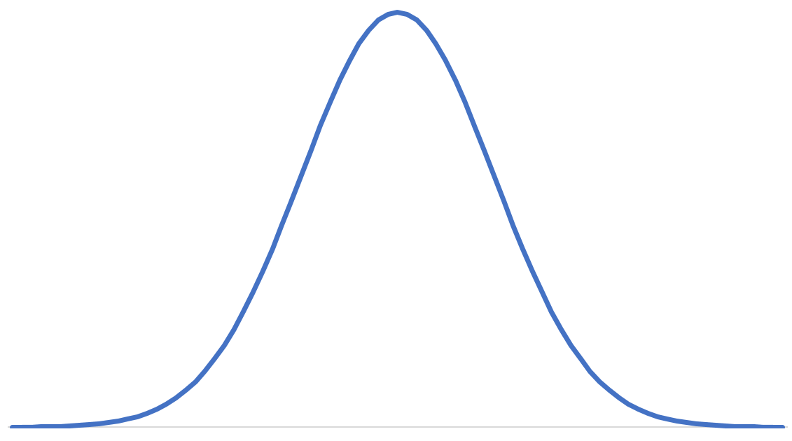
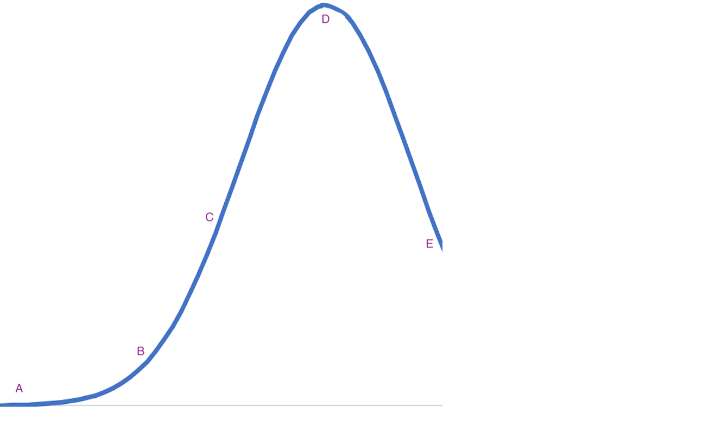

::: {.content-visible when-format="html"}

<iframe
  src="../slides/3.1.active_learning.html"
  style="width:45%; height:225px;"
></iframe>
<iframe
  src="../slides/3.2.metric_elicitation.html"
  style="width:45%; height:225px;"
></iframe>
[Fullscreen - AL](../slides/3.1.active_learning.html){.btn .btn-outline-primary .btn role="button"}
[Fullscreen - ME](../slides/3.2.metric_elicitation.html){.btn .btn-outline-primary .btn role="button"}

:::

::: {.callout-note}
## Intended Learning Outcomes

By the end of this chapter you will be able to:

- **Define** the measurement problem for user preference elicitation and distinguish it from the learning problem in Chapter 3.
- **Derive** the Fisher information for Rasch/Bradley-Terry models and explain why items with $p \approx 0.5$ are most informative.
- **Compare** A-optimal, D-optimal, and E-optimal design criteria for selecting informative queries.
- **Apply** Laplace approximation to update posterior beliefs about user preferences in real-time.
- **Implement** active selection policies that outperform random sampling in sample efficiency.
- **Extend** Fisher information analysis to non-linear scoring functions via local linearization.
- **Apply** information-theoretic acquisition functions to actively select queries for Gaussian Process preference models, building on the GP foundations from Chapters 2-3.
- **Explain** how D-optimal design applies to Direct Preference Optimization (DPO) for LLM alignment and derive the ADPO algorithm.
- **Analyze** active preference learning in robotics, including trajectory comparison and reward function inference.
:::

::: {.callout-note title="Notation"}
Throughout this chapter, we use the following conventions (extending Chapter 2):

| Symbol | Meaning |
|--------|---------|
| $U \in \mathbb{R}^K$ | User embedding/preference vector |
| $V_j \in \mathbb{R}^K$ | Item embedding/appeal vector |
| $Z_j \in \mathbb{R}$ | Item offset (difficulty in Rasch model: $-V_j$) |
| $H_{ij} = U_i^\top V_j + Z_j$ | Latent utility for user $i$ on item $j$ |
| $\mathcal{I}(U)$ | Fisher information (scalar or matrix) |
| $p = \sigma(H)$ | Response probability under logistic model |
| $\Lambda = \Sigma^{-1}$ | Posterior precision matrix |
| $\text{Rel}$ | Reliability: $1 - \text{tr}(\hat{\Sigma}_{\text{err}}) / \text{tr}(\Sigma_U)$ |
:::

In Chapter 2, we developed models for how preferences arise from latent utilities. In Chapter 3, we learned how to estimate these utilities from observed comparisons. This chapter addresses a complementary question: **given that human feedback is expensive, how should we choose which comparisons to request?**

The measurement problem assumes items' appeals are known (or estimated), and aims to efficiently estimate a new user's preferences. The experimenter's goal is to quantify current uncertainty and reduce it as efficiently as possible. This is the domain of *optimal experimental design*, and its key tool is Fisher information.

In the measurement problem, the experimenter is equipped with instruments - items whose parameters are known - and aims to accurately estimate the latent user preference. Depending on the application, this can be done through item-wise judgments, pairwise comparisons, or other interaction modes. The representation of user preference may take the form of a vector or a function, which can range from simple linear models to more complex families. Throughout this chapter, the recurring theme from the experimenter’s perspective is to quantify how much is currently known about the user’s latent preference and to increase this knowledge as efficiently as possible. Statistical tools such as Fisher information and optimal experimental design provide the foundations for achieving this goal.

## Measurement of User Preference Vector
When items’ appeals $V_j$ are known or pre-calibrated, we can learn a new user’s appetite $U$ quickly by choosing informative items online. Asking only easy or only hard items gives near-deterministic responses that teach little. The Rasch model makes this precise. For a candidate item $j$, the Bernoulli success probability is $p_j(U) = \sigma(U + V_j).$ The Fisher information about $U$ from a single response is
$$\mathcal I_j(U) = \mathbb{E} \left[-\frac{\partial^2}{\partial U^2}\log p(Y \mid U, V_j)\right] = p_j(U) (1 - p_j(U)).$$ {#eq-rasch-fisher-info}
This is maximized at $p_j(U)=0.5$. So the best next item is one whose difficulty ($-V_j$) is close to the current estimate of $U$. Active elicitation policies therefore "hover" around the user’s current location, rapidly shrinking uncertainty. Place a Gaussian prior $U \sim \mathcal N(0,\sigma_0^2)$. After observing independent items $\mathcal J$, a Laplace (or IRLS) update for $U$ uses the score and observed information
$$S(U) = \sum_{j\in\mathcal J} (y_j - p_j(U)), \qquad \mathcal I(U) = \sum_{j\in\mathcal J}p_j(U) (1 - p_j(U)) + \tau_0, \quad \tau_0 = \sigma_0^{-2}. $$ {#eq-rasch-score-info}
A Newton step is $\hat U \leftarrow \hat U + S(\hat U)\mathcal I(\hat U)^{-1}.$ The approximate posterior variance is $\widehat{\mathrm{Var}}(U) \approx \mathcal I(\hat U)^{-1}.$ An item-selection rule that maximizes expected \textbf{incremental} information picks $j_t = \arg\max_j \; p_j(\hat U_{t-1}) (1 - p_j(\hat U_{t-1})).$ For evaluation, we can use reliability. With population variance $\mathrm{Var}(U^\star)=\sigma_U^2$, reliability is the fraction of total variance explained by the test rather than estimation noise:
$$
\text{Rel} \approx 1 - \frac{1}{N}\sum_{i=1}^N \frac{\widehat{\mathrm{Var}}(U_i)}{\sigma_U^2}.
$$ {#eq-reliability}
Below, the code simulates many users, a bank of calibrated items, and compares an Fisher policy to a random policy. We track reliability after each query count $t$.

First, we set up the simulation with $N$ users, $M$ calibrated items, and define helper functions for Bayesian updating:

```{pyodide-python}
#| autorun: true
import numpy as np
import matplotlib.pyplot as plt

# ICML-style figure settings
plt.rcParams.update({
    "figure.figsize": (5, 3.5),
    "figure.dpi": 150,
    "figure.autolayout": True,
    "font.size": 8,
    "axes.labelsize": 8,
    "axes.titlesize": 9,
    "xtick.labelsize": 7,
    "ytick.labelsize": 7,
    "legend.fontsize": 7,
    "lines.linewidth": 1.0,
})

sigmoid = lambda x: 1.0 / (1.0 + np.exp(-x))
rng = np.random.default_rng(42)

# Simulation parameters
N = 200           # number of users
M = 200           # number of calibrated items
T = 40            # queries per user
sigma_U = 1.0     # population SD of user abilities
sigma0 = 1.0      # prior SD for each user

# Generate true user abilities and item difficulties
U_true = rng.normal(0, sigma_U, size=N)
V = np.sort(rng.normal(0, 1.0, size=M))

print(f"Simulating {N} users, {M} items, {T} queries each")
print(f"User abilities range: [{U_true.min():.2f}, {U_true.max():.2f}]")
print(f"Item difficulties range: [{V.min():.2f}, {V.max():.2f}]")
```

Next, we define the Bayesian update rule and the two item selection policies—Fisher-active (maximizing information) and random:

```{pyodide-python}
#| autorun: true
def new_user_state():
    """Initialize user state with prior."""
    return {"U_hat": 0.0, "tau": 1.0/(sigma0**2), "var": sigma0**2}

def update_user(state, vj, y):
    """Single Newton-IRLS update after observing response y to item j."""
    U, tau = state["U_hat"], state["tau"]
    p = sigmoid(U + vj)
    S, I = (y - p), p * (1 - p)  # score and Fisher info
    state["U_hat"] = U + S / (I + tau + 1e-12)
    state["tau"] = tau + I
    state["var"] = 1.0 / (state["tau"] + 1e-12)

def choose_item_fisher(state, V, asked_mask):
    """Select item maximizing Fisher information at current estimate."""
    cand = np.where(~asked_mask)[0]
    if cand.size == 0: return None
    vals = sigmoid(state["U_hat"] + V[cand])
    info = vals * (1.0 - vals)
    return cand[np.argmax(info + 1e-6 * rng.random(size=cand.size))]

def choose_item_random(state, V, asked_mask):
    """Select item uniformly at random."""
    cand = np.where(~asked_mask)[0]
    return rng.choice(cand) if cand.size > 0 else None

print("Update and selection functions defined.")
```

Now we run the simulation, comparing both policies across all users:

```{pyodide-python}
#| autorun: true
def run_policy(policy_fn, V, T):
    """Run policy for all users and track MSE/reliability curves."""
    states = [new_user_state() for _ in range(N)]
    asked = np.zeros((N, M), dtype=bool)
    mse_curve, rel_curve = [], []

    for t in range(1, T + 1):
        for i in range(N):
            j = policy_fn(states[i], V, asked[i])
            if j is None: continue
            y = 1 if rng.random() < sigmoid(U_true[i] + V[j]) else 0
            update_user(states[i], V[j], y)
            asked[i, j] = True

        U_hat = np.array([s["U_hat"] for s in states])
        Var_hat = np.array([s["var"] for s in states])
        mse_curve.append(np.mean((U_hat - U_true)**2))
        rel_curve.append(1.0 - np.mean(Var_hat) / sigma_U**2)

    return np.array(mse_curve), np.array(rel_curve)

# Run both policies
mse_act, rel_act = run_policy(choose_item_fisher, V, T)
mse_rnd, rel_rnd = run_policy(choose_item_random, V, T)
print("Simulation complete!")
```

Finally, we visualize the results comparing Fisher-active vs random item selection:

```{pyodide-python}
#| autorun: true
fig, axes = plt.subplots(1, 2, figsize=(9, 3.5))

axes[0].plot(np.arange(1, T+1), mse_rnd, 'o-', label="Random", alpha=0.7)
axes[0].plot(np.arange(1, T+1), mse_act, 's-', label="Fisher-active", alpha=0.7)
axes[0].set_xlabel("Queries per user"); axes[0].set_ylabel("MSE of U")
axes[0].set_title("Estimation Error vs Queries"); axes[0].legend(); axes[0].grid(True, alpha=0.3)

axes[1].plot(np.arange(1, T+1), rel_rnd, 'o-', label="Random", alpha=0.7)
axes[1].plot(np.arange(1, T+1), rel_act, 's-', label="Fisher-active", alpha=0.7)
axes[1].set_xlabel("Queries per user"); axes[1].set_ylabel("Reliability")
axes[1].set_title("Reliability vs Queries"); axes[1].legend(); axes[1].grid(True, alpha=0.3)

plt.tight_layout()
plt.show()

print(f"Final MSE  | Random: {mse_rnd[-1]:.4f} | Fisher: {mse_act[-1]:.4f}")
print(f"Final Rel. | Random: {rel_rnd[-1]:.3f}  | Fisher: {rel_act[-1]:.3f}")
```

In practice, a single “ability” parameter may not capture the diversity of user preferences. Factor models generalize Rasch by giving each user a $K$-dimensional embedding $U_i \in \mathbb R^K$ and each item a $K$-dimensional embedding $V_j \in \mathbb R^K$, plus optional bias $Z_j$. The linear predictor is $H_{ij} = U_i^\top V_j + Z_j$ where $p(Y_{ij}=1 \mid U_i, V_j, Z_j) = \sigma(H_{ij}).$ For a given user $U$ and an item $j$ with known parameters, the Bernoulli log-likelihood is
$$\ell(U; y, j) = y \log \sigma(H) + (1-y)\log (1-\sigma(H))$$ {#eq-factor-loglik}
The gradient with respect to $U$ is $\nabla_U \ell = (y - \sigma(H)) V_j.$ The expected Fisher Information per item is the negative expected Hessian:
$$
\mathcal I_j(U) = \mathbb E[\nabla_U \ell \nabla_U \ell^\top ] = \sigma(H)(1-\sigma(H)) V_j V_j^\top.
$$ {#eq-factor-fisher-info}
So each queried item contributes a rank-1 matrix in the direction of $V_j$, scaled by the variance term $\sigma(H)(1-\sigma(H))$. For a sequence of items ${j_t}$, the cumulative information is
$$\mathcal I(U) = \sum_t \sigma(H_{j_t})(1-\sigma(H_{j_t})) V_{j_t} V_{j_t}^\top.$$ {#eq-cumulative-fisher-info}

In multiple dimensions, information is a matrix. Classical optimal design ofers various heuristics. For example, A-optimality suggests minimization of trace of posterior covariance $\propto \mathrm{tr}(\mathcal I^{-1})$. D-optimality maximizes $\det(\mathcal I)$, i.e. maximizes volume shrinkage of the posterior ellipsoid. E-optimality maximizes the minimum eigenvalue of $\mathcal I$. Thus adaptive measurement picks the next item $j$ to maximize an acquisition function such as $\det(\mathcal I+\mathcal I_j)$. We also use reliability as the evaluation metric here. If $\Sigma_U$ is the population covariance and $\widehat{\Sigma}_{\text{err}}$ the average posterior covariance, then $\text{Reliability} = 1 - \mathrm{tr}(\widehat{\Sigma}_{\text{err}}) \mathrm{tr}(\Sigma_U)^{-1}.$ This generalizes the Rasch reliability to multi-dimensional latent traits. Below is a toy simulation with 2-dimensional users and items, comparing random item selection vs D-optimal Fisher active selection:

First, set up the factor model simulation with K-dimensional user and item embeddings:

```{pyodide-python}
#| autorun: true
import numpy as np
import matplotlib.pyplot as plt

sigmoid = lambda x: 1.0 / (1.0 + np.exp(-x))
rng = np.random.default_rng(0)

N, M, K, T = 100, 300, 2, 30  # users, items, factors, queries
U_true = rng.normal(0, 1, size=(N, K))
V = rng.normal(0, 1, size=(M, K))
Z = rng.normal(0, 0.3, size=(M,))

def new_user_state():
    return {"U_hat": np.zeros(K), "Sigma": np.eye(K) * 2.0}

print(f"Factor model: {N} users, {M} items, K={K} dimensions")
```

Define the Bayesian update and D-optimal selection:

```{pyodide-python}
#| autorun: true
def update_user(state, vj, zj, y):
    """Update posterior with one item response via Laplace approximation."""
    U, S = state["U_hat"], state["Sigma"]
    p = sigmoid(U @ vj + zj)
    I_j = p * (1 - p) * np.outer(vj, vj)
    Sigma_new = np.linalg.inv(np.linalg.inv(S) + I_j)
    state["U_hat"] = U + Sigma_new @ ((y - p) * vj)
    state["Sigma"] = Sigma_new

def choose_item_Dopt(state, asked_mask, V, Z):
    """Select item maximizing D-optimal log-det gain."""
    Prec = np.linalg.inv(state["Sigma"])
    cand = np.where(~asked_mask)[0]
    scores = []
    for j in cand:
        W = sigmoid(state["U_hat"] @ V[j] + Z[j])
        W = W * (1 - W)
        scores.append(np.log(np.linalg.det(Prec + W * np.outer(V[j], V[j]))))
    return cand[np.argmax(scores)]

def choose_random(state, asked_mask, V, Z):
    return rng.choice(np.where(~asked_mask)[0])

print("Update and selection functions defined.")
```

Run simulation comparing D-optimal vs random selection:

```{pyodide-python}
#| autorun: true
def run_policy(policy_fn):
    states = [new_user_state() for _ in range(N)]
    asked = np.zeros((N, M), dtype=bool)
    mse_curve, rel_curve = [], []
    for t in range(T):
        for i in range(N):
            j = policy_fn(states[i], asked[i], V, Z)
            y = int(rng.random() < sigmoid(U_true[i] @ V[j] + Z[j]))
            update_user(states[i], V[j], Z[j], y)
            asked[i, j] = True
        U_hat = np.array([s["U_hat"] for s in states])
        err_tr = np.mean([np.trace(s["Sigma"]) for s in states])
        mse_curve.append(np.mean(np.sum((U_hat - U_true)**2, axis=1)))
        rel_curve.append(1 - err_tr / np.trace(np.cov(U_true.T)))
    return np.array(mse_curve), np.array(rel_curve)

mse_rand, rel_rand = run_policy(choose_random)
mse_act, rel_act = run_policy(choose_item_Dopt)
print("Simulation complete!")
```

Visualize results:

```{pyodide-python}
#| autorun: true
fig, axes = plt.subplots(1, 2, figsize=(9, 3.5))
xs = np.arange(1, T + 1)

axes[0].plot(xs, mse_rand, 'o-', label="Random", alpha=0.7)
axes[0].plot(xs, mse_act, 's-', label="D-opt", alpha=0.7)
axes[0].set_xlabel("Queries"); axes[0].set_ylabel("MSE")
axes[0].set_title("Estimation Error"); axes[0].legend(); axes[0].grid(True, alpha=0.3)

axes[1].plot(xs, rel_rand, 'o-', label="Random", alpha=0.7)
axes[1].plot(xs, rel_act, 's-', label="D-opt", alpha=0.7)
axes[1].set_xlabel("Queries"); axes[1].set_ylabel("Reliability")
axes[1].set_title("Reliability"); axes[1].legend(); axes[1].grid(True, alpha=0.3)

plt.tight_layout(); plt.show()
```

We next discuss the measurement problem of user preference with pairwise data. Recall from Chapter 2 that the Bradley-Terry model specifies the probability that user $i$ prefers item $j$ over item $k$ as $p_{i}(j \succ k)=\sigma (U^\top(V_j-V_k) + Z_j-Z_k)$ with feature $x_{jk}= V_j - V_k \in \mathbb R^2$ and offset $b_{jk}=Z_j-Z_k$. For a single observation $y \in \{0,1\}$ of $j \succ k$ the per-pair log-likelihood is
$$\ell(U; y, i, j, k)= y \log p + (1-y) \log (1-p_i).$$ {#eq-pairwise-loglik}

Score and expected Fisher information for (U):
$$\nabla_U \ell=(y-p),x_{jk}, \qquad \mathcal I_{jk}(U)=\mathbb E[-\nabla^2_U \ell] = w x_{jk} x_{jk}^\top,$$ {#eq-pairwise-score-fisher}
where $w = p(1-p)$. For a sequence of queried pairs ${(j_t,k_t)}$ the cumulative information is $\mathcal I(U)=\sum_t w_t,x_t x_t^\top.$ With a Gaussian prior $U \sim \mathcal N(0, \Sigma_0)$ and a Laplace approximation, the posterior precision updates additively:
$$
\Lambda_{t}=\Sigma_t^{-1}=\Sigma_{0}^{-1}+\sum_{s\le t} w_s,x_s x_s^\top.
$$ {#eq-pairwise-precision-update}
A single Newton step for the posterior mean after observing ((x,y)) is
$$
\hat U \leftarrow \hat U + \Sigma_{t}^{\ }(y-p),x,\qquad p=\sigma(\hat U^\top x+b),\quad
\Sigma_t = \left(\Lambda_{t-1}+w,xx^\top\right)^{-1}.
$$ {#eq-pairwise-newton-step}
This is the logistic-regression one-step IRLS update specialized to one new example. We evaluate candidates at the current $(\hat U,\Sigma)$. Write $x$ for $x_{jk}$ and $w=\sigma(\hat U^\top x+b)\big(1-\sigma(\hat U^\top x+b)\big)$. Let $\Lambda=\Sigma^{-1}$. Using Sherman–Morrison to get closed forms for standard criteria:

* D-optimal (log-det gain): $\Delta_D(j,k) = \log \det ( \Lambda + w xx^\top) - \log \det \Lambda = \log (1 + w x^\top \Sigma x).$
Pick the pair that maximizes $\log(1 + w x^\top\Sigma x)$.

* A-optimal (trace drop of covariance): $\Delta_A(j,k);=;\mathrm{tr}(\Sigma)-\mathrm{tr}\big((\Lambda+w,xx^\top)^{-1}\big)
  = \frac{w,x^\top\Sigma^2 x}{1+w,x^\top\Sigma x}.$

* E-optimal (raise the worst-direction information): Exact update of $\lambda_{\min}(\mathcal I)$ needs an eigen update. A practical proxy is to maximize $\Delta_E^{\text{proxy}}(j,k)= w,x^\top\Sigma x,$ which targets directions where current uncertainty $x^\top\Sigma x$ is large.

End-to-end toy pipeline (rank 2, known items, active D-opt vs random). First, define helper functions for D-optimal gain and Bayesian updates:

```{pyodide-python}
#| autorun: true
import numpy as np
import matplotlib.pyplot as plt

sigmoid = lambda x: 1.0 / (1.0 + np.exp(-x))

def d_opt_gain(Sigma, x, w):
    """D-optimal log-det gain: log(1 + w x^T Sigma x)"""
    return np.log1p(w * x @ Sigma @ x)

def one_step_update(U_hat, Sigma, x, b, y):
    """Sherman-Morrison update for posterior mean and covariance."""
    p = sigmoid(U_hat @ x + b)
    w = p * (1 - p)
    Sx = Sigma @ x
    Sigma_new = Sigma - (w / (1.0 + w * (x @ Sx))) * np.outer(Sx, Sx)
    U_new = U_hat + Sigma_new @ ((y - p) * x)
    return U_new, Sigma_new

print("Helper functions defined.")
```

Set up simulation parameters and precompute candidate pairs:

```{pyodide-python}
#| autorun: true
rng = np.random.default_rng(0)
N, M, K, T = 200, 60, 2, 30  # users, items, rank, queries

V = rng.normal(0, 1.0, size=(M, K))  # item embeddings
Z = rng.normal(0, 0.3, size=M)       # item biases
U_true = rng.normal(0, 1.0, size=(N, K))  # true user embeddings

# Precompute all pairs and their features
pairs = np.array([(j, k) for j in range(M) for k in range(M) if j < k])
X = V[pairs[:,0]] - V[pairs[:,1]]  # pairwise feature differences
B = Z[pairs[:,0]] - Z[pairs[:,1]]  # pairwise bias differences

print(f"Setup: {N} users, {M} items, {len(pairs)} candidate pairs, {T} queries each")
```

Define selection policies and run the simulation:

```{pyodide-python}
#| autorun: true
def choose_pair_dopt(U_hat, Sigma, X, B):
    """Select pair maximizing D-optimal gain."""
    h = X @ U_hat + B
    p = sigmoid(h)
    w = p * (1 - p)
    gains = np.array([d_opt_gain(Sigma, X[i], w[i]) for i in range(len(X))])
    gains[np.isnan(gains)] = -np.inf
    return int(np.argmax(gains))

def run_policy(active=True):
    Uh = np.zeros((N, K))
    Sigmas = np.tile(np.eye(K) * 2.0, (N, 1, 1))
    mse_curve, rel_curve = [], []

    for t in range(T):
        for i in range(N):
            idx = choose_pair_dopt(Uh[i], Sigmas[i], X, B) if active else rng.integers(len(pairs))
            x, b = X[idx], B[idx]
            y = 1 if rng.random() < sigmoid(U_true[i] @ x + b) else 0
            Uh[i], Sigmas[i] = one_step_update(Uh[i], Sigmas[i], x, b, y)
        mse_curve.append(np.mean(np.sum((Uh - U_true)**2, axis=1)))
        rel_curve.append(1.0 - np.mean(np.trace(Sigmas, axis1=1, axis2=2)) / K)
    return np.array(mse_curve), np.array(rel_curve)

mse_d, rel_d = run_policy(active=True)
mse_r, rel_r = run_policy(active=False)
print("Simulation complete!")
```

Visualize the results:

```{pyodide-python}
#| autorun: true
fig, axes = plt.subplots(1, 2, figsize=(9, 3.5))
xs = np.arange(1, T + 1)

axes[0].plot(xs, mse_r, 'o-', label="Random", alpha=0.7)
axes[0].plot(xs, mse_d, 's-', label="D-opt", alpha=0.7)
axes[0].set_xlabel("Queries per user"); axes[0].set_ylabel("MSE")
axes[0].set_title("Estimation Error"); axes[0].legend(); axes[0].grid(True, alpha=0.3)

axes[1].plot(xs, rel_r, 'o-', label="Random", alpha=0.7)
axes[1].plot(xs, rel_d, 's-', label="D-opt", alpha=0.7)
axes[1].set_xlabel("Queries per user"); axes[1].set_ylabel("Reliability")
axes[1].set_title("Reliability"); axes[1].legend(); axes[1].grid(True, alpha=0.3)

plt.tight_layout(); plt.show()
print(f"Final MSE  | Random: {mse_r[-1]:.3f} | D-opt: {mse_d[-1]:.3f}")
print(f"Final Rel. | Random: {rel_r[-1]:.3f} | D-opt: {rel_d[-1]:.3f}")
```

## Measurement of User Preference Function
Suppose items $j$ have feature vectors $X_j \in \mathbb R^d$. Instead of learning a free scalar parameter $V_j$ for each item, we assume $V_j = W^\top X_j,$ where $W \in \mathbb R^d$ is shared across items. The probability that item $j$ beats item $k$ is $p(j \succ k) = \sigma(V_j - V_k) = \sigma (W^\top(X_j - X_k)).$ This is simply logistic regression on pairwise feature differences. Given one comparison outcome $y \in \{0,1\}$ for pair $(j,k)$ with difference $x_{jk} = X_j - X_k$,
$$\ell(W) = y\log \sigma(W^\top x_{jk}) + (1-y)\log(1-\sigma(W^\top x_{jk})).
$$ {#eq-logistic-loglik}
Gradient: $\nabla_W \ell = (y - p) x_{jk}, \quad p = \sigma( W^\top x_{jk} ).$ Fisher Information (expected negative Hessian): $\mathcal I(W) = \mathbb E\big[(y-p)^2 x_{jk}x_{jk}^\top\big] = p(1-p),x_{jk}x_{jk}^\top.$

With Gaussian prior $W \sim \mathcal N(0,\sigma_0^2 I)$, a Laplace approximation yields posterior covariance $\Sigma \approx (\sigma_0^{-2}I + \sum_t p_t(1-p_t) x_t x_t^\top)^{-1}.$ So, as in the Rasch case, Fisher information accumulates to form posterior precision. At each step, pick a candidate pair $(j,k)$ and compute
$$
\Delta_D(j,k) = \log \det(\Lambda + w x_{jk} x_{jk}^\top) - \log\det(\Lambda), \quad w = p(1-p),
$$ {#eq-d-optimal-criterion}
where $\Lambda = \Sigma^{-1}$. This is the D-optimal criterion, maximizing the expected log-determinant gain in information. A-optimal or E-optimal criteria are similarly defined. We’ll simulate item features, a ground-truth $W$, and comparisons. Then we compare active D-optimal elicitation vs random pair selection for estimating $W$. Performance metrics are MSE of $\hat W$ vs true $W$, and reliability.

First, set up the simulation with item features and ground-truth weights:

::: {.callout-note title="Code"}
```{pyodide-python}
#| autorun: true
import numpy as np
import matplotlib.pyplot as plt

sigmoid = lambda x: 1.0 / (1.0 + np.exp(-x))
rng = np.random.default_rng(0)

d = 5          # feature dimension
M = 50         # items
T = 100        # queries (pairs)
sigma0 = 2.0   # prior SD

X = rng.normal(0, 1, (M, d))
W_true = rng.normal(0, 1, d)
print(f"Setup: {M} items, {d}-dim features, {T} queries")
```
:::

Define the Fisher gain and Bayesian update functions:

::: {.callout-note title="Code"}
```{pyodide-python}
#| autorun: true
def fisher_gain(Sigma, x, w):
    """D-optimal log-det gain."""
    Sx = Sigma @ x
    denom = 1 + w * (x @ Sx)
    Sigma_new = Sigma - (w / denom) * np.outer(Sx, Sx)
    return np.log(np.linalg.det(Sigma) / np.linalg.det(Sigma_new))

def update(W_hat, Sigma, x, y):
    """Newton update with Laplace covariance."""
    p = sigmoid(W_hat @ x)
    w = p * (1 - p)
    Sx = Sigma @ x
    denom = 1 + w * (x @ Sx)
    Sigma_new = Sigma - (w / denom) * np.outer(Sx, Sx)
    W_new = W_hat + Sigma_new @ ((y - p) * x)
    return W_new, Sigma_new

pairs = np.array([(j, k) for j in range(M) for k in range(M) if j < k])
Xdiff = X[pairs[:, 0]] - X[pairs[:, 1]]
print(f"Functions defined. {len(pairs)} candidate pairs.")
```
:::

Run the simulation comparing D-optimal vs random selection:

::: {.callout-note title="Code"}
```{pyodide-python}
#| autorun: true
def run_policy(active=True):
    W_hat = np.zeros(d)
    Sigma = np.eye(d) * sigma0**2
    mse_hist, rel_hist = [], []

    for t in range(T):
        if active:
            gains = [fisher_gain(Sigma, x, sigmoid(W_hat @ x) * (1 - sigmoid(W_hat @ x)))
                     for x in Xdiff]
            idx = np.argmax(gains)
        else:
            idx = rng.integers(len(Xdiff))

        x = Xdiff[idx]
        y = rng.random() < sigmoid(W_true @ x)
        W_hat, Sigma = update(W_hat, Sigma, x, y)
        mse_hist.append(np.sum((W_hat - W_true)**2))
        rel_hist.append(1 - np.trace(Sigma) / (d * np.var(W_true)))
    return np.array(mse_hist), np.array(rel_hist)

mse_act, rel_act = run_policy(True)
mse_rnd, rel_rnd = run_policy(False)
print("Simulation complete!")
```
:::

Visualize the results:

::: {.callout-note title="Code"}
```{pyodide-python}
#| autorun: true
fig, axes = plt.subplots(1, 2, figsize=(9, 3.5))

axes[0].plot(mse_rnd, label="Random", alpha=0.7)
axes[0].plot(mse_act, label="D-optimal", alpha=0.7)
axes[0].set_xlabel("Queries"); axes[0].set_ylabel("MSE")
axes[0].set_title("Estimation Error"); axes[0].legend(); axes[0].grid(True, alpha=0.3)

axes[1].plot(rel_rnd, label="Random", alpha=0.7)
axes[1].plot(rel_act, label="D-optimal", alpha=0.7)
axes[1].set_xlabel("Queries"); axes[1].set_ylabel("Reliability")
axes[1].set_title("Reliability"); axes[1].legend(); axes[1].grid(True, alpha=0.3)

plt.tight_layout(); plt.show()
```
:::

So far we set $V_j=W^\top X_j$. Suppose instead that items are scored by a non-linear function
$$V_j = f_\theta(X_j),\qquad \theta\in\mathbb{R}^p, \qquad p(j \succ k) = \sigma (f_\theta(X_j) - f_\theta(X_k))$$ {#eq-nonlinear-scoring}
We want an online procedure that chooses the next comparison $(j,k)$ to learn $\theta$ quickly. Exact Bayesian design is intractable for general $f_\theta$. There is a simple and effective approximation that keeps all the math and code lightweight: local Gaussian posterior over $\theta$ via Laplace + first-order model. Work at the current estimate $\hat\theta$. Linearize the non-linear scorer around $\hat\theta$:
$$
f_\theta(X_j) \approx f_{\hat\theta}(X_j) + J_j\Delta\theta, \qquad
J_j \equiv \left.\frac{\partial f_\theta(X_j)}{\partial \theta}\right| _{\theta = \hat\theta} \in \mathbb{R}^{1\times p}.
$$ {#eq-linearization}
The pairwise logit for $(j,k)$ becomes
$$\underbrace{f_\theta(X_j)-f_\theta(X_k)}_{\text{logit}} \approx \underbrace{f_{\hat\theta}(X_j)-f_{\hat\theta}(X_k)}_{\text{offset}} + \underbrace{(J_j-J_k)}_{\phi_{jk}}\Delta\theta.$$ {#eq-pairwise-logit-approx}

Define the local "design vector" $\phi_{jk}\in\mathbb{R}^{1\times p}$. With a Gaussian prior $\theta\sim\mathcal N(0,\sigma_0^2 I)$ and Bernoulli likelihood, the Laplace posterior around $\hat\theta$ is
$$
\theta \mid \mathcal D \approx \mathcal N(\hat\theta,;\Sigma),\qquad
\Sigma^{-1} = \sigma_0^{-2} I + \sum_{t} w_t \phi_t^\top \phi_t
$$ {#eq-laplace-posterior}
where $w_t = p_t(1-p_t)$ with $p_t = \sigma\big(f_{\hat\theta}(X_{j_t})-f_{\hat\theta}(X_{k_t})\big)$.
This is exactly the same structure as the linear case, with (x_{jk}) replaced by $\phi_{jk}=J_j-J_k$. You only need Jacobian rows $J_j$. At the current $(\hat\theta \Sigma)$ and for a candidate $(j,k)$, compute $p=\sigma\big(f_{\hat\theta}(X_j)-f_{\hat\theta}(X_k)\big)$ and $w = p(1-p)$.Compute $\phi = J_j-J_k$ at $\hat \theta$. Then use any standard optimal design score with Sherman–Morrison:

* D-optimal (log-det gain): $\Delta_D(j,k) = \log ( 1 + w\phi \Sigma \phi^\top )$.
* A-optimal (trace drop): $\Delta_A(j,k) = \dfrac{w \phi \Sigma^2 \phi^\top }{ 1+w \phi \Sigma \phi^\top}$.
* E-optimal proxy: $\Delta_E^{\text{proxy}}(j,k) = w \phi \Sigma \phi^\top$.

Pick the pair with the largest gain. This is tractable because it only needs a vector–matrix–vector product with $\Sigma$ and a Jacobian row. Mutual-information acquisition like BALD reduces to the same formulas under the Laplace Gaussian approximation. Maximizing (\Delta_D) is a good default.

<!-- Note to work more on this expansion -->

We use a tiny two-layer network $f_\theta(x)=a^\top \tanh(Bx)$ with $\theta=(a,B)$. We derive $J_j$ analytically. First, define the network and its Jacobian:

```{pyodide-python}
#| autorun: true
import numpy as np
import matplotlib.pyplot as plt

sigmoid = lambda x: 1.0 / (1.0 + np.exp(-x))
rng = np.random.default_rng(3)

# Network dimensions
d, h, M, T = 6, 8, 80, 120  # feature dim, hidden units, items, queries

# Item features and ground-truth parameters
X = rng.normal(0, 1, size=(M, d))
a_star = rng.normal(0, 0.8, size=(h,))
B_star = rng.normal(0, 0.6, size=(h, d))

def f_theta(a, B, x):
    """Two-layer network: a^T tanh(Bx)"""
    return a @ np.tanh(B @ x)

def f_batch(a, B, X):
    """Batch evaluation over all items."""
    return a @ np.tanh(B @ X.T)

def J_row(a, B, x):
    """Jacobian ∂f/∂θ at x, with θ = [a, vec(B)]."""
    t = np.tanh(B @ x)
    sech2 = 1.0 - t**2
    dfa = t  # ∂f/∂a
    dfB = (a[:, None] * sech2[:, None]) * x[None, :]  # ∂f/∂B
    return np.concatenate([dfa, dfB.ravel()])

V_star = f_batch(a_star, B_star, X)  # true scores
print(f"Network: {d}→{h}→1, {h + h*d} parameters, {M} items")
```

Set up Laplace approximation state and update functions:

```{pyodide-python}
#| autorun: true
p_dim = h + h*d  # total parameters
theta_hat = np.zeros(p_dim)
Sigma = np.eye(p_dim) * 4.0

def split_theta(theta):
    return theta[:h], theta[h:].reshape(h, d)

def update(theta, Sigma, j, k, y):
    """Laplace update after observing comparison (j,k) with outcome y."""
    a, B = split_theta(theta)
    pjk = sigmoid(f_theta(a, B, X[j]) - f_theta(a, B, X[k]))
    w = pjk * (1 - pjk)
    phi = J_row(a, B, X[j]) - J_row(a, B, X[k])
    Sphi = Sigma @ phi
    Sigma_new = Sigma - (w / (1 + w * (phi @ Sphi))) * np.outer(Sphi, Sphi)
    theta_new = theta + Sigma_new @ ((y - pjk) * phi)
    return theta_new, Sigma_new

def d_opt_gain(Sigma, phi, w):
    return np.log1p(w * (phi @ (Sigma @ phi)))

pairs = np.array([(j, k) for j in range(M) for k in range(M) if j < k])
print(f"Setup complete: {len(pairs)} candidate pairs")
```

Run the active learning loop comparing D-optimal vs random selection:

```{pyodide-python}
#| autorun: true
def run(active=True):
    theta, S = theta_hat.copy(), Sigma.copy()
    mse_hist, rel_hist = [], []

    for t in range(T):
        a, B = split_theta(theta)
        if active:
            # Heuristic: evaluate on subset of pairs with small |logit|
            logits = f_batch(a, B, X)
            cand_idx = rng.choice(len(pairs), size=min(2000, len(pairs)), replace=False)
            deltas = logits[pairs[cand_idx, 0]] - logits[pairs[cand_idx, 1]]
            sel = cand_idx[np.argsort(np.abs(deltas))[:400]]
            gains = [d_opt_gain(S, J_row(a, B, X[j]) - J_row(a, B, X[k]),
                     sigmoid(logits[j]-logits[k])*(1-sigmoid(logits[j]-logits[k])))
                     for j, k in pairs[sel]]
            j, k = pairs[sel[np.argmax(gains)]]
        else:
            j, k = pairs[rng.integers(len(pairs))]

        y = 1 if rng.random() < sigmoid(V_star[j] - V_star[k]) else 0
        theta, S = update(theta, S, j, k, y)
        err = theta - np.concatenate([a_star, B_star.ravel()])
        mse_hist.append(float(err @ err))
        rel_hist.append(1 - np.trace(S) / (np.trace(S) + p_dim))
    return np.array(mse_hist), np.array(rel_hist)

mse_act, rel_act = run(active=True)
mse_rnd, rel_rnd = run(active=False)
print("Simulation complete!")
```

Visualize results:

```{pyodide-python}
#| autorun: true
fig, axes = plt.subplots(1, 2, figsize=(9, 3.5))
x = np.arange(1, T+1)

axes[0].plot(x, mse_rnd, 'o-', label="Random", alpha=0.7, markevery=10)
axes[0].plot(x, mse_act, 's-', label="D-opt", alpha=0.7, markevery=10)
axes[0].set_xlabel("Queries"); axes[0].set_ylabel("MSE in θ")
axes[0].set_title("Parameter Estimation Error"); axes[0].legend(); axes[0].grid(True, alpha=0.3)

axes[1].plot(x, rel_rnd, 'o-', label="Random", alpha=0.7, markevery=10)
axes[1].plot(x, rel_act, 's-', label="D-opt", alpha=0.7, markevery=10)
axes[1].set_xlabel("Queries"); axes[1].set_ylabel("Reliability")
axes[1].set_title("Reliability Proxy"); axes[1].legend(); axes[1].grid(True, alpha=0.3)

plt.tight_layout(); plt.show()
```

## Active Query Selection for Gaussian Process Models {#sec-active-learning}

The previous sections developed Fisher information for optimal query selection in *parametric* preference models—the Rasch model (Section 1) and linear scoring functions (Section 2). However, Chapter 2 introduced Gaussian Processes (GPs) as a flexible nonparametric alternative for reward modeling, and Chapter 3 covered GP inference via Laplace approximation. Here we address the natural question: **how do we actively select queries when using GPs?**

The key insight is that GP uncertainty—quantified by the posterior variance—naturally guides query selection. Unlike parametric models where Fisher information depends only on the current parameter estimate, GP uncertainty varies across the input space, being higher far from observed data and lower near it.

### Information-Theoretic Acquisition Function

For GP preference learning, we seek queries that maximize information gain about the reward function. Given a dataset $\mathcal{D}$ and a candidate query $Q = (x_A, x_B)$, the acquisition function measures the expected reduction in uncertainty about $r$:
$$
a(Q) = I(r; y \mid \mathcal{D}, Q) = H(y \mid \mathcal{D}, Q) - \mathbb{E}_{r \sim p(r \mid \mathcal{D})}[H(y \mid r, Q)]
$$ {#eq-gp-acquisition}

**Interpretation of the two terms:**

1. **$H(y \mid \mathcal{D}, Q)$**: Predictive entropy—how uncertain is the query outcome under our current model? High when $p(A \succ B) \approx 0.5$.

2. **$\mathbb{E}_r[H(y \mid r, Q)]$**: Expected conditional entropy—how uncertain would the query be if we knew the true reward function? Low for "easy" comparisons, high for inherently noisy comparisons.

The acquisition function trades off these two terms: we want queries where the *model* is uncertain (high predictive entropy) but a *human* could provide a clear answer (low expected conditional entropy).

### Practical Computation

Using the Laplace approximation from Chapter 3 (@sec-gp-inference), the acquisition function can be computed as:
$$
a(x_A, x_B) = h\left(\Phi\left(\frac{\mu_A - \mu_B}{\sqrt{2\sigma_{\text{noise}}^2 + g(x_A, x_B)}}\right)\right) - m(x_A, x_B)
$$ {#eq-gp-acquisition-practical}

where:
- $\mu_A, \mu_B$ are the GP posterior means at $x_A, x_B$
- $g(x_A, x_B) = \sigma_A^2 + \sigma_B^2 - 2\text{Cov}(r(x_A), r(x_B))$ captures uncertainty from both points
- $h(p) = -p\log_2 p - (1-p)\log_2(1-p)$ is binary entropy
- $\Phi$ is the standard normal CDF
- $m(x_A, x_B)$ is a correction term for human noise

**Key property:** The trivial query $Q = (x, x)$ (comparing an item to itself) is a *global minimizer*, not maximizer, of this acquisition function. This contrasts with some other methods that can get stuck on uninformative queries.

First, we define the RBF kernel and helper functions for the simulation:

```{pyodide-python}
#| autorun: true
import numpy as np
import matplotlib.pyplot as plt
np.random.seed(42)

def rbf_kernel(X1, X2, sigma_f=1.0, length_scale=0.7):
    """Compute RBF kernel matrix between two sets of points."""
    sq_dist = np.sum(X1**2, 1, keepdims=True) + np.sum(X2**2, 1) - 2*X1@X2.T
    return sigma_f**2 * np.exp(-sq_dist / (2 * length_scale**2))

sigmoid = lambda x: 1.0 / (1.0 + np.exp(-np.clip(x, -500, 500)))
binary_entropy = lambda p: -p*np.log2(p+1e-10) - (1-p)*np.log2(1-p+1e-10)

# True reward function (unknown to the learner)
def true_reward(x):
    return np.sin(2 * x) + 0.3 * x

# Visualize the true reward
X_grid = np.linspace(-3, 3, 100).reshape(-1, 1)
plt.figure(figsize=(5, 3.5))
plt.plot(X_grid, true_reward(X_grid), 'k-', lw=2)
plt.xlabel('x'); plt.ylabel('r(x)')
plt.title('True Reward Function (Unknown to Learner)')
plt.grid(True, alpha=0.3)
plt.show()
```

Next, we implement a GP model for active preference learning. The `fit` method uses Laplace approximation (Newton's method) to find the posterior mode, and `acquisition` computes the information gain for a candidate query:

```{pyodide-python}
#| autorun: true
class GPActivePreference:
    def __init__(self, X_pool, sigma_noise=0.1):
        self.X_pool = X_pool
        self.sigma_noise = sigma_noise
        self.comparisons = []  # list of (i, j, y) where y=1 means i>j
        self.r = np.zeros(len(X_pool))
        self.Sigma = rbf_kernel(X_pool, X_pool) + 1e-4*np.eye(len(X_pool))

    def fit(self):
        """Fit GP using Laplace approximation (Newton's method)."""
        if len(self.comparisons) == 0:
            return
        m = len(self.X_pool)
        self.K = rbf_kernel(self.X_pool, self.X_pool) + 1e-4*np.eye(m)
        self.K_inv = np.linalg.inv(self.K)

        # Newton's method for mode finding
        self.r = np.zeros(m)
        for _ in range(10):
            grad, W = np.zeros(m), np.zeros(m)
            for i, j, y in self.comparisons:
                p = sigmoid(self.r[i] - self.r[j])
                grad[i] += (y - p); grad[j] -= (y - p)
                W[i] += p * (1 - p); W[j] += p * (1 - p)
            H = -np.diag(W + 1e-6) - self.K_inv
            self.r -= np.linalg.solve(H, grad - self.K_inv @ self.r)
        self.W = W
        self.Sigma = np.linalg.inv(self.K_inv + np.diag(W + 1e-6))

    def acquisition(self, i, j):
        """Information gain acquisition: entropy of predicted comparison."""
        if len(self.comparisons) == 0:
            return 0.5
        var_diff = self.Sigma[i,i] + self.Sigma[j,j] - 2*self.Sigma[i,j]
        pred_std = np.sqrt(2*self.sigma_noise**2 + var_diff)
        p_pred = sigmoid((self.r[i] - self.r[j]) / pred_std)
        return binary_entropy(p_pred)

    def select_query(self):
        """Select the query with maximum information gain."""
        m = len(self.X_pool)
        best_score, best_pair = -np.inf, (0, 1)
        for i in range(m):
            for j in range(i+1, m):
                score = self.acquisition(i, j)
                if score > best_score:
                    best_score, best_pair = score, (i, j)
        return best_pair

    def add_comparison(self, i, j):
        """Simulate oracle response and update model."""
        r_true = true_reward(self.X_pool.flatten())
        p = sigmoid(r_true[i] - r_true[j])
        y = 1 if np.random.rand() < p else 0
        self.comparisons.append((i, j, y))
        self.fit()

print("GPActivePreference class defined successfully.")
```

Now we run the simulation, comparing active (information-theoretic) query selection against random selection:

```{pyodide-python}
#| autorun: true
# Setup
X_pool = np.linspace(-3, 3, 30).reshape(-1, 1)
n_queries = 25
r_true = true_reward(X_pool.flatten())

# Active selection
gp_active = GPActivePreference(X_pool)
mse_active = []

# Random selection
gp_random = GPActivePreference(X_pool)
mse_random = []

# Run comparison
for t in range(n_queries):
    # Active: select most informative query
    i, j = gp_active.select_query()
    gp_active.add_comparison(i, j)
    mse_active.append(np.mean((gp_active.r - r_true)**2))

    # Random: select query uniformly at random
    i, j = np.random.choice(len(X_pool), 2, replace=False)
    gp_random.add_comparison(i, j)
    mse_random.append(np.mean((gp_random.r - r_true)**2))

print(f"Simulation complete: {n_queries} queries collected for each method.")
```

Finally, we visualize the results. The left panel shows how estimation error decreases with more comparisons; the right panel shows the learned reward functions:

```{pyodide-python}
#| autorun: true
fig, axes = plt.subplots(1, 2, figsize=(9, 3.5))

# Learning curves
axes[0].plot(range(1, n_queries+1), mse_random, 'o-', label='Random', alpha=0.7)
axes[0].plot(range(1, n_queries+1), mse_active, 's-', label='Active (Info Gain)', alpha=0.7)
axes[0].set_xlabel('Number of comparisons')
axes[0].set_ylabel('MSE of reward estimate')
axes[0].set_title('GP Active vs Random Query Selection')
axes[0].legend(); axes[0].grid(True, alpha=0.3)

# Learned rewards
axes[1].plot(X_pool, r_true, 'k--', lw=2, label='True reward')
axes[1].plot(X_pool, gp_active.r, 'b-', lw=2, label='Active GP')
axes[1].plot(X_pool, gp_random.r, 'r-', lw=2, alpha=0.7, label='Random GP')
axes[1].fill_between(X_pool.flatten(),
                     gp_active.r - 2*np.sqrt(np.diag(gp_active.Sigma)),
                     gp_active.r + 2*np.sqrt(np.diag(gp_active.Sigma)),
                     alpha=0.2, color='blue', label='±2σ (Active)')
axes[1].set_xlabel('x'); axes[1].set_ylabel('r(x)')
axes[1].set_title(f'Learned Rewards after {n_queries} Comparisons')
axes[1].legend(); axes[1].grid(True, alpha=0.3)

plt.tight_layout()
plt.show()

print(f"Final MSE - Active: {mse_active[-1]:.4f}, Random: {mse_random[-1]:.4f}")
print(f"Active achieves {mse_random[-1]/mse_active[-1]:.1f}x lower error")
```

### When to Use GP Active Learning

| Scenario | Recommendation |
|----------|----------------|
| Nonlinear reward structure | GP strongly preferred |
| Low-to-moderate dimensions ($d \lesssim 10$) | GP works well |
| Expensive human feedback | Active learning essential |
| Need uncertainty quantification | GP provides this naturally |
| Large datasets ($n > 1000$) | Consider sparse GP approximations |
| Very high dimensions | Linear models may be more practical |

## Active Learning for Direct Preference Optimization {#sec-adpo}

We now turn to a specific, important application: **active learning for DPO (Direct Preference Optimization)** in large language model alignment. Chapter 2 introduced DPO and its connection to Bradley-Terry; here we show how to apply active learning principles to reduce the number of human comparisons needed.

### The DPO Setting

Recall from @sec-llm-example that DPO directly optimizes a policy $\pi_\theta$ on preference data without learning an explicit reward model. The key insight is that DPO implicitly assumes Bradley-Terry preferences:
$$
p(y_w \succ y_l \mid x) = \sigma\left(\beta \log \frac{\pi_\theta(y_w \mid x)}{\pi_{\text{ref}}(y_w \mid x)} - \beta \log \frac{\pi_\theta(y_l \mid x)}{\pi_{\text{ref}}(y_l \mid x)}\right)
$$ {#eq-dpo-bradley-terry}

**Challenge:** Large language models have billions of parameters, making exact Fisher information computation intractable. How can we apply the D-optimal design principles from Sections 1-2?

### The Log-Linear Policy Assumption

The key insight is to approximate the policy as **log-linear** in the last-layer features:
$$
\pi(y \mid x; \theta) \propto \exp(\phi(x, y)^\top \theta)
$$ {#eq-log-linear-policy}

where $\phi(x, y)$ is the feature representation from the model's last layer. This assumption is justified by the **neural tangent kernel** perspective: for sufficiently large networks, the dynamics during training are approximately linear in the parameters.

Under this assumption, the DPO loss Hessian takes the form:
$$
H(\theta) = \sum_{i=1}^n p_i(1-p_i) \cdot \Delta\phi_i \Delta\phi_i^\top
$$ {#eq-dpo-hessian}

where $\Delta\phi_i = \phi(x_i, y_{w,i}) - \phi(x_i, y_{l,i})$ is the feature difference between winning and losing responses, and $p_i$ is the predicted preference probability.

**Key observation:** This Hessian is exactly the **Fisher information matrix** for the DPO model! The D-optimal criterion becomes:
$$
\max_S \log\det\left(\sum_{i \in S} p_i(1-p_i) \cdot \Delta\phi_i \Delta\phi_i^\top\right)
$$ {#eq-dpo-d-optimal}

### The ADPO Algorithm

The **Active DPO (ADPO)** algorithm applies D-optimal design to select preference comparisons:

::: {.callout-note title="Algorithm: Active DPO (ADPO)"}
**Input:** Reference policy $\pi_{\text{ref}}$, prompt set $\{x_i\}$, response pairs $\{(y_{i,1}, y_{i,2})\}$, budget $T$

**Initialize:** $\theta_0 = \theta_{\text{ref}}$, $S_0 = \emptyset$

**For** $t = 1, \ldots, T$:

1. **Compute features:** For each candidate pair $(x_i, y_{i,1}, y_{i,2})$:
   - $\Delta\phi_i = \phi(x_i, y_{i,1}) - \phi(x_i, y_{i,2})$
   - $p_i = \sigma(\beta(\log\pi_{\theta_{t-1}}(y_{i,1}|x_i) - \log\pi_{\theta_{t-1}}(y_{i,2}|x_i)))$

2. **D-optimal selection:** Select query maximizing:
   $$i^* = \arg\max_i \log\det\left(I + p_i(1-p_i) H_t^{-1} \Delta\phi_i \Delta\phi_i^\top\right)$$ {#eq-adpo-selection}
   where $H_t$ is the current Fisher information matrix

3. **Query oracle:** Obtain human preference $y_t$ for pair $(x_{i^*}, y_{i^*,1}, y_{i^*,2})$

4. **Update:** $S_t = S_{t-1} \cup \{(i^*, y_t)\}$, retrain $\theta_t$ on $S_t$ using DPO loss

**Return:** Final policy $\pi_{\theta_T}$
:::

### Theoretical Guarantees

Under standard regularity conditions, ADPO achieves the following convergence rate:

::: {.callout-important title="ADPO Convergence"}
Let $\theta^*$ be the optimal policy parameters. With $n$ actively selected comparisons, ADPO achieves:
$$
\|\hat\theta_n - \theta^*\| = O\left(\frac{d}{\sqrt{n}}\right)
$$ {#eq-adpo-convergence}
where $d$ is the effective dimension (rank of the Fisher information). This matches the minimax optimal rate for $d$-dimensional estimation.
:::

The key insight is that D-optimal design ensures the Fisher information grows proportionally to $n$, leading to $O(1/\sqrt{n})$ estimation error.

### ADPO+ for Offline Settings

In many practical settings, we have access to a fixed pool of unlabeled preference pairs (e.g., model outputs) but cannot generate new queries. **ADPO+** adapts the algorithm for this offline setting:

1. **Pool-based selection:** Instead of synthesizing queries, select from the existing pool
2. **Batch selection:** Select $b$ queries at once to enable parallel annotation
3. **Diversity regularization:** Add penalty for selecting similar queries

The D-optimal criterion naturally encourages diversity: selecting redundant queries provides diminishing information gain.

### Empirical Guidance: When Does Active Learning Help?

| Factor | Active Learning Beneficial? |
|--------|---------------------------|
| **Annotation cost** | High cost → Active learning essential |
| **Data heterogeneity** | Diverse prompts → More room for strategic selection |
| **Budget constraints** | Limited budget → Active learning shows larger gains |
| **Model capacity** | Larger models → Active learning helps reduce overfitting |
| **Query pool size** | Large pool → More room for intelligent selection |

**Practical recommendation:** Active learning for DPO provides the largest gains when:
- Annotation budget is limited (< 10K comparisons)
- Prompts cover diverse topics or difficulty levels
- The goal is sample efficiency over raw performance

::: {.callout-tip title="Comparison: GP Active Learning vs. ADPO"}
| Aspect | GP Active Learning | ADPO |
|--------|-------------------|------|
| Model | Nonparametric (GP) | Parametric (neural network) |
| Scalability | $O(n^3)$ | $O(d^2 n)$ with approximations |
| Use case | Small datasets, need uncertainty | LLM alignment, large models |
| Acquisition | Information gain | D-optimal design |
| Theoretical basis | Mutual information | Fisher information |

Both approaches share the core insight: **use model uncertainty to guide query selection**.
:::

## Case Study 1: Performance Metric Elicitation {#sec-metric-elicitation}

In binary classification problems, selecting an appropriate performance metric that aligns with the real-world task is crucial. The problem of *metric elicitation* aims to characterize and discover the performance metric of a practitioner, reflecting the rewards or costs associated with correct or incorrect classification. For instance, in medical contexts such as diagnosing a disease or determining the appropriateness of a treatment, trade-offs are made for incorrect decisions. Not administering a treatment could lead to the worsening of a disease (a false negative), whereas delivering the wrong treatment could cause adverse side effects worse than not treating the condition (a false positive). Rather than choosing from a limited set of default choices like the F1-score or weighted accuracy, metric elicitation considers the process of devising a metric that best matches the preferences of practitioners or users. This is achieved by querying an "oracle" who provides feedback on proposed potential metrics through pairwise comparisons. Since queries to humans are often expensive, the goal is to minimize the number of comparisons needed.

The motivation for the pairwise comparison aspect of metric elicitation [@pmlr-v89-hiranandani19a] stems from a rich history of literature in psychology, economics, and computer science [@pref1; @pref2; @pref3; @pref4; @ab], demonstrating that humans are often ineffective at providing absolute feedback on aspects such as potential prices, user interfaces, or even ML model outputs (hence the comparison-based structure of RLHF, for instance). Additionally, confusion matrices accurately capture binary metrics such as accuracy, $F_\beta$, and Jaccard similarity by recording the number of false positives, true positives, false negatives, and true negatives obtained by a classifier. The main goal of this section is to introduce two binary-search procedures that can approximate the oracle's performance metric for two types of metrics (linear and linear-fractional performance metrics) by presenting the oracle with confusion matrices generated by various classifiers. Essentially, we are learning an optimal threshold for classification given a decision boundary for a binary classification problem.

First, we introduce some relevant notation that will later be used to formalize notions of oracle queries, classifiers, and metrics. In this context, $X \in \mathcal{X}$ represents an input random variable, while $Y \in \{0, 1\}$ denotes the output random variable. We learn from a dataset of size $n$, denoted by $\{(x, y)_i\}^n_{i=1}$, which is generated independently and identically distributed (i.i.d.) from some distribution $\mathbb{P}(X, Y)$. The conditional probability of the positive class, given some sample $x$, is denoted by $\eta(\vec{x}) = \mathbb{P}(Y=1 | X=x)$. The marginal probability of the positive class is represented by $\zeta = \mathbb{P}(Y=1)$. The set of all potential classifiers is $\mathcal{H} = \{h : \mathcal{X} \rightarrow \{0,1\}\}$. The confusion matrix for a classifier $h$ is $C(h, \mathbb{P}) \in \mathbb{R}^{2 \times 2}$, where $C_{ij}(h, \mathbb{P}) = \mathbb{P}(Y=i, h=j)$ for $i, j \in \{0,1\}$. These entries represent the false positives, true positives, false negatives, and true negatives, ensuring that $\sum_{i,j}C_{ij}=1$. The set of all confusion matrices is denoted by $\mathcal{C}$. Since $FN(h, \mathbb{P}) = \zeta - TP(h, \mathbb{P})$ and $FP(h, \mathbb{P}) = 1 - \zeta - TN(h, \mathbb{P})$, $\mathcal{C}$ is actually a 2-dimensional space, not a 4-dimensional space.

Any hyperplane in the $(tp, tn)$ space is given by $\ell := a \cdot tp + b \cdot tn = c$, where $a, b, c \in \mathbb{R}$. 
Given a classifier $h$, we define a performance metric $\phi : [0, 1]^{2 \times 2} \rightarrow \mathbb{R}$. The value 
$\phi(C(h))$, which represents the performance of a classifier with respect to a certain metric, is referred to as the 
*utility* of the classifier $h$. We assume, without loss of generality, that a higher value of $\phi$ indicates a better 
performance metric for $h$. Our focus is to recover some metric $\phi$ using comparisons between confusion matrices $C(h)$, determined by classifiers $h$, which approximates the oracle's "ground-truth" metric $\phi^*$. Next, we introduce two classes of performance metrics—*Linear Performance Metrics (LPM)* and *Linear-Fractional Performance Metrics (LFPM)*—for which we will present two elicitation algorithms. 

An LPM, given constants $\{a_{11}, a_{01}, a_{10}, a_{00}\} \in \mathbb{R}^{4}$, is defined as $\phi(C) = a_{11} TP + a_{01} FP + a_{10} FN + a_{00} TN = m_{11} TP + m_{00} TN + m_{0}$, where $m_{11} = (a_{11} - a_{10})$, $m_{00} = (a_{00} - a_{01})$, and $m_{0} = a_{10} \zeta + a_{01} (1 - \zeta)$. This reparametrization simplifies the metric by reducing dimensionality, making it more tractable for elicitation. 
One example of an LPM is *weighted accuracy*, defined as $WA = w_1TP + w_2TN$, where adjusting $w_1$ and $w_2$ controls 
the relative importance of different types of misclassification. An LFPM, defined by constants $\{a_{11}, a_{01}, a_{10}, a_{00}, b_{11}, b_{01}, b_{10}, b_{00}\} \in \mathbb{R}^{8}$, is given by:
$$\phi(C) = \frac{a_{11} TP + a_{01} FP + a_{10} FN + a_{00} TN}{b_{11} TP + b_{01} FP + b_{10} FN + b_{00} TN} = \frac{p_{11} TP + p_{00} TN + p_{0}}{q_{11} TP + q_{00} TN + q_{0}},$$ {#eq-lfpm-definition}

where $p_{11} = (a_{11} - a_{10})$, $p_{00} = (a_{00} - a_{01})$, $q_{11} = (b_{11} - b_{10})$, $q_{00} = (b_{00} - b_{01})$, 
$p_{0} = a_{10} \zeta + a_{01} (1 - \zeta)$, and $q_{0} = b_{10} \zeta + b_{01} (1 - \zeta)$. This parametrization also 
simplifies the elicitation process by reducing the number of variables. Common LFPMs include the $F_\beta$ score and Jaccard 
similarity, defined as:

$$F_{\beta} = \frac{TP}{\frac{TP}{1+\beta^{2}} - \frac{TN}{1+\beta^{2}} + \frac{\beta^{2} \zeta + 1 - \zeta}{1+\beta^{2}}}, \quad JAC = \frac{TP}{1 - TN}.$$ {#eq-lfpm_metrics}

Setting $\beta = 1$ gives the F1 score, which is widely used as a classification metric. Since we are considering all possible metrics in the LPM and LFPM families, we need to make certain assumptions about $\mathcal{C}$. Particularly, we will assume that $g(t) = \mathbb{P}[\eta(X) \geq t]$ is continuous and strictly decreasing for $t \in [0, 1]$; essentially, $\eta$ has positive density and zero probability.

Additionally, $\mathcal{C}$ is convex, closed, and contained within the rectangle $[0, \zeta] \times [0, 1-\zeta]$, and is rotationally symmetric around its center, $(\frac{\zeta}{2}, \frac{1-\zeta}{2})$, where the axes represent the proportion of true positives and negatives. The only vertices of $\mathcal{C}$ are $(0, 1-\zeta)$ and $(\zeta, 0)$, corresponding to predicting all $0$'s or all $1$'s on a given dataset. Therefore, $\mathcal{C}$ is strictly convex, and any line tangent to it is tangent at exactly one point, corresponding to one particular confusion matrix. Next, recall that an LPM is represented in terms of three parameters ($\phi = m_{11}TP + m_{00}TN + m_0$). We have just seen that this LPM and its corresponding confusion matrix correspond to a certain point on the boundary of $\mathcal{C}$. We first note that this point is independent of $m_0$. Additionally, we only care about the relative weightings of $m_{11}$ and $m_{00}$, not their actual values—they are scale invariant. Therefore, we can parametrize the space of LPMs as $\varphi_{LPM} = \{\mathbf{m} = (\cos \theta, \sin \theta) : \theta \in [0, 2\pi]\}$, where $\cos \theta$ corresponds to $m_{00}$ and $\sin \theta$ corresponds to $m_{11}$. As we already know, we can recover the Bayes classifier given $\mathbf{m}$, and it is unique, corresponding to one point on the boundary of $\mathcal{C}$ due to its convexity. The supporting hyperplane at this point is defined as $\bar{\ell}_{\mathbf{m}} := m_{11} \cdot tp + m_{00} \cdot tn = m_{11} \overline{TP}_{\mathbf{m}} + m_{00} \overline{TN}_{\mathbf{m}}$. We note that if $m_{00}$ and $m_{11}$ have opposite signs, then $\bar{h}_m$ is the trivial classifier predicting all 1's or all 0's, since either predicting true positives or true negatives results in negative reward. This corresponds to a supporting hyperplane with a positive slope, so it can only be tangent at the vertices. Additionally, the boundary $\partial \mathcal{C}$ can be split into upper and lower boundaries ($\partial \mathcal{C}_{+}, \partial \mathcal{C}_{-}$), corresponding to $\theta \in (0, \pi/2)$ and $\theta \in (\pi, 3\pi/2)$ respectively (and whether $m_{00}, m_{11}$ are positive or negative). We also define the notions of Bayes optimal and inverse-optimal classifiers. Given a performance metric $\phi$, we define:

-   The *Bayes utility* as $\bar{\tau} := \sup_{h \in \mathcal{H}} \phi(C(h)) = \sup_{C \in \mathcal{C}} \phi(C)$; 
    this is the highest achievable utility (using the metric $\phi$) over all classifiers $h \in $\mathcal{H}$ for a given problem.
-   The *Bayes classifier* as $\bar{h} := \arg \max_{h \in \mathcal{H}} \phi(C(h))$; this is the classifier $h$ corresponding to the Bayes utility.
-   The *Bayes confusion matrix* as $\bar{C} := \arg \max_{C \in \mathcal{C}} \phi(C)$; this is the confusion matrix 
    corresponding to the Bayes utility and classifier.

Similarly, the inverse Bayes utility, classifier, and confusion matrix can be defined by replacing "$\sup$" with "$\inf$"; they represent the classifier and confusion matrix corresponding to the lower bound on utility for a given problem. We also have the following useful proposition:

::: {.callout-note title="proposition"}
::: {#prp-prp3.1}
Let $\phi \in \varphi_{LPM}$. Then

::: {.content-visible when-format="html"}
$$\bar{h}(x) = \left\{\begin{array}{lr}
\unicode{x1D7D9} \left[\eta(x) \geq \frac{m_{00}}{m_{11} + m_{00}}\right], & m_{11} + m_{00} \geq 0 \\
\unicode{x1D7D9} \left[\frac{m_{00}}{m_{11} + m_{00}} \geq \eta(x)\right], & \text { o.w. }
\end{array}\right\}$$  {#eq-eq3.45}
:::

::: {.content-visible when-format="pdf"}
$$\bar{h}(x) = \left\{\begin{array}{lr}
\mathbbm{1}\left[\eta(x) \geq \frac{m_{00}}{m_{11} + m_{00}}\right], & m_{11} + m_{00} \geq 0 \\
\mathbbm{1}\left[\frac{m_{00}}{m_{11} + m_{00}} \geq \eta(x)\right], & \text { o.w. }
\end{array}\right\}$$  {#eq-eq3.46}
:::

is a Bayes optimal classifier with respect to $\phi$. The inverse Bayes classifier is given by $\underline{h} = 1 - \bar{h}$.
:::
:::

This is a simple derivation based on the fact that we only get rewards from true positives and true negatives. 
Essentially, if we recover an LPM, we can use it to determine the best-performing classifier, obtained by placing 
a threshold on the conditional probability of a given sample, that corresponds to a confusion matrix. Therefore, 
the three notions of Bayes utility, classifier, and confusion matrix are functionally equivalent in our setting.

We will now formalize the problem of metric elicitation. Given two classifiers $h$ and $h'$ (or equivalently, 
two confusion matrices $C$ and $C'$), we define an *oracle query* as the function:

::: {.content-visible when-format="html"}
$$\Gamma\left(h, h^{\prime}\right)=\Omega\left(C, C^{\prime}\right)=\unicode{x1D7D9}\left[\phi(C)>\phi\left(C^{\prime}\right)\right]=: \unicode{x1D7D9} \left[C \succ C^{\prime}\right],$$ {#eq-oracle}
:::

::: {.content-visible when-format="pdf"}
$$\Gamma\left(h, h^{\prime}\right)=\Omega\left(C, C^{\prime}\right)=\mathbbm{1}\left[\phi(C)>\phi\left(C^{\prime}\right)\right]=: \mathbbm{1} \left[C \succ C^{\prime}\right],$$ {#eq-oracle}
:::

which represents the classifier preferred by the practitioner. We can then define the metric elicitation problem for populations:

::: {.callout-note title="definition"}
::: {#def-def3.1}
Suppose the true (oracle) performance metric is $\phi$. The goal is to recover a metric $\hat{\phi}$ by 
querying the oracle for as few pairwise comparisons of the form $\Omega\left(C, C^{\prime}\right)$ so that 
$\|\phi - \hat{\phi}\|_{--} < \kappa$ for a sufficiently small $\kappa > 0$ and for any suitable norm $\|\cdot\|_{--}$.
:::
:::

In practice, we do not have access to the true probability distribution or the population, which would 
provide the true values of $C$ and $C'$. However, we can subtly alter this problem description to use 
$\hat{C}$ and $\hat{C}^{\prime}$, which are derived from our dataset of $n$ samples:

::: {.callout-note title="definition"}
::: {#def-def3.2}
Suppose the true (oracle) performance metric is $\phi$. The aim is to recover a metric $\hat{\phi}$ 
by querying the oracle for as few pairwise comparisons of the form $\Omega\left(\hat{C}, \hat{C}^{\prime}\right)$ 
so that $\|\phi - \hat{\phi}\|_{--} < \kappa$ for a sufficiently small $\kappa > 0$ and for any suitable norm $\|\cdot\|_{--}$.
:::
:::

As is common in theoretical ML research, we solve the population problem and then consider ways to extend this to 
practical settings where we only have limited datasets of samples. In our case, this corresponds to calculating the 
confusion matrices from a portion of the dataset we have access to.

### Linear Performance Metric Elicitation {#sec-orgb6dac4e}

For LPM elicitation, we need one more proposition.

::: {.callout-note title="proposition"}
::: {#prp-prp3.2}
For a metric $\psi$ (quasiconvex and monotone increasing in TP/TN) or
$\phi$ (quasiconcave and monotone increasing), and parametrization
$\rho^+$/$\rho^-$ of upper/lower boundary, composition
$\psi \circ \rho^-$ is quasiconvex and unimodal on \[0, 1\], and
$\phi \circ \rho^+$ is quasiconcave and unimodal on \[0, 1\].
:::
:::

Quasiconcavity and quasiconvexity are slightly more general variations on concavity and convexity. Their main useful property in our setting is that they are unimodal (they have a singular extremum), so we can devise a binary-search-style algorithm for eliciting the Bayes optimal and inverse-optimal confusion matrices for a given setting, as well as the corresponding $\phi$'s. We first note that to maximize a quasiconcave metric, in which $\phi$ is monotonically increasing in $TP$ and $TN$, we note that the resulting maximizer (and supporting hyperplane) will occur on the upper boundary of $\mathcal{C}$. We thus set our initial search range to be $[0, \pi/2]$ and repeatedly divide it into four regions. Then, we calculate the resulting confusion matrix on the 5 resulting boundaries of these regions and query the oracle $4$ times. We repeat this in each iteration of the binary search until a maximizer is found.

::: {.callout-note title="remark"}
::: {#rem-explaination_binary_search}
In the case of quasiconcave and quasiconvex search ranges, a slightly more sophisticated variation on typical 
binary search must be used. To illustrate this, consider the two distributions in @fig-bsearch:

::: {#fig-bsearch layout-ncol=2}
{#fig-normal-distribution width="45%"}
{#fig-normal-distribution-copy width="45%"}
:::

For both the symmetric and skewed distributions, if we were to divide the search range into two portions and compare $A$, $C$, and $E$, we would find that $C > A$ and $C > E$. In both cases, this does not help us reduce our search range, since the true maximum could lie on either of the two intervals (as in the second case), or at $C$ itself (as in the first case). Therefore, we must make comparisons between all five points $A, B, C, D, and E$. This allows us to correctly restrict our search range to $[B, D]$ in the first case and $[C, E]$ in the second. These extra search requirements are due to the quasiconcavity of the search space we are considering, in which there exists a maximum but we need to make several comparisons at various points throughout the search space to be able to reduce its size in each iteration.
:::
:::

```pseudocode
#| label: alg-lpm
\begin{algorithm}
    \caption{Quasiconcave Metric Maximization}
    \begin{algorithmic}
        \State \textbf{input:} $\epsilon > 0$ and oracle $\Omega$
        \State \textbf{initialize:} $\theta_a = 0, \theta_b = \frac{\pi}{2}$
        \While{$|\theta_b - \theta_a| > \epsilon$}
            \State set $\theta_c = \frac{3\theta_a+\theta_b}{4}$, $\theta_d = \frac{\theta_a+\theta_b}{2}$, and $\theta_e = \frac{\theta_a+3\theta_b}{4}$
            
            \State obtain $h\theta_a, h\theta_c, h\theta_d, h\theta_e, h\theta_b$ using Proposition 1
            
            \State Compute $C\theta_a, C\theta_c, C\theta_d, C\theta_e, C\theta_b$ using (1)
            
            \State Query $\Omega(C\theta_c, C\theta_a), \Omega(C\theta_d, C\theta_c), \Omega(C\theta_e, C\theta_d)$, and $\Omega(C\theta_b, C\theta_e)$

            \If{$q_{i,j}$ is ambiguous}
                \State request $q_{i,j}$'s label from reference
            \Else
                \State impute $q_{i,j}$'s label from previously labeled queries
            \EndIf
            
            \If{$C\theta' \succ C\theta'' \succ C\theta'''$ for consecutive $\theta < \theta' < \theta''$}
                \State assume the default order $C\theta \prec C\theta' \prec C\theta''$
            \EndIf

            \If{$C\theta' \succ C\theta'' \succ C\theta'''$ for consecutive $\theta < \theta' < \theta''$}
                \State assume the default order $C\theta \prec C\theta' \prec C\theta''$
            \EndIf
            
            \If{$C\theta_a \succ C\theta_c$} 
                \State Set $\theta_b = \theta_d$ 
            \ElsIf{$C\theta_a \prec C\theta_c \succ C\theta_d$} 
                \State Set $\theta_b = \theta_d$ 
            \ElsIf{$C\theta_c \prec C\theta_d \succ C\theta_e$} 
                \State Set $\theta_a = \theta_c$ 
                \State Set $\theta_b = \theta_e$ 
            \ElsIf{$C\theta_d \prec C\theta_e \succ C\theta_b$} 
                \State Set $\theta_a = \theta_d$ 
            \Else 
                \State Set $\theta_a = \theta_d$ 
            \EndIf
        \EndWhile
        \State \textbf{output:} $\vec{m}, C$, and $\vec{l}$, where $\vec{m} = m_l(\theta_d), C = C\theta_d$, and $\vec{l} := (\vec{m}, (tp, tn)) = (\vec{m}, C)$
    \end{algorithmic}
\end{algorithm}
```

To elicit LPMs, we run @alg-lpm, querying the oracle in each iteration, and set the elicited metric $\hat{m}$ (which is the maximizer on $\mathcal{C}$) to be the slope of the resulting hyperplane, since the metric is linear.

::: {.callout-note title="remark"}
::: {#rem-explaination_lpm}
To find the minimum of a quasiconvex metric, we flip all instances of
$\prec$ and $\succ$, and use an initial search range of $[\pi, 3\pi/2]$;
we use this algorithm, which we refer to as @alg-lfpm, in our
elicitation of LFPMs.
:::
:::

Next, we provide a Python implementation of @alg-lpm.

::: {.callout-note title="code"}
```{pyodide-python}
#| autorun: true
def get_m(theta):
    """
    Inputs: 
    - theta: the value that parametrizes m
    Outputs:
    - m_0 and m_1 for the LPM
    """

    return (math.cos(theta), math.sin(theta))

def lpm_elicitation(epsilon, oracle):
    """
    Inputs:
    - epsilon: some epsilon > 0 representing threshold of error
    - oracle: some function that accepts 2 confusion matrices and
        returns true if the first is preferred and false otherwise
    Outputs:
    - estimate for m, which is used to compute the LPM as described above
    """

    a = 0
    b = math.pi/2
    while (b - a > epsilon):
        c = (3 * a + b) / 4
        d = (a + b) / 2
        e = (a + 3 * b) / 4

        m_a, m_b, m_c, m_d, m_e = (get_m(x) for x in [a,b,c,d,e]) # using definition of m
        c_a, c_b, c_c, c_d, c_e = (get_c(x) for x in [m_a, m_b, m_c, m_d, m_e]) # compute classifier from m's then calculate confusion matrices
        
        response_ac = oracle(c_a, c_c)
        response_cd = oracle(c_c, c_d)
        response_de = oracle(c_d, c_e)
        response_eb = oracle(c_e, c_b)

        # update ranges to keep the peak
        if response_ac:
            b = d
        elif response_cd:
            b = d
        elif response_de:
            a = c
            b = e
        elif response_eb:
            a = d
        else:
            a = d
    return get_m(d), get_c(d)
```
:::

### Linear-Fractional Performance Metric Elicitation {#sec-lfpm-elicitation}

Now, we present the next main result, which is an algorithm to elicit linear-fractional performance metrics. For this task, we will need the following assumption: Let $\phi \in \varphi_{L F P M}$. We assume $p_{11}, p_{00} \geq 0, p_{11} \geq q_{11}, p_{00} \geq q_{00},$ $p_{0}=0, q_{0}=$ $\left(p_{11}-q_{11}\right) \zeta+\left(p_{00}-q_{00}\right)(1-\zeta)$, and $p_{11}+p_{00}=1$.

These assumptions guarantee that the LFPM $\phi$ which we are trying to elicit is monotonically increasing in $TP$ and $TN$, just as in the LPM elicitation case. We first provide motivation and an overview of the approach for LFPM elicitation and then present pseudocode for the algorithm.

The general idea of the algorithm is to use @alg-lpm to obtain a maximizer and a minimizer for the given dataset; these result in two systems of equations involving the true LFPM $\phi^*$ with 1 degree of freedom. Then, we run a grid search that is independent of oracle queries to find the point where solutions to the systems match pointwise on the resulting confusion matrices; this occurs close to where the true metric lies.

More formally, suppose that the true metric is
$$\phi^{*}(C)=\frac{p_{11}^{*} T P+p_{00}^{*} T N}{q_{11}^{*} T P+q_{00}^{*} T N+q_{0}^{*}}.$$  {#eq-eq3.48}
Then, let $\bar{\tau}$ and $\underline{\tau}$ represent the maximizer and minimizer of $\phi$ over $\mathcal{C}$, respectively. There exists a hyperplane 
$$\begin{aligned}
\bar{\ell}_{f}^{*}:=\left(p_{11}^{*}-\bar{\tau}^{*} q_{11}^{*}\right) t p+\left(p_{00}^{*}-\bar{\tau}^{*} q_{00}^{*}\right) t n=\bar{\tau}^{*} q_{0}^{*},
\end{aligned}$$ {#eq-upper-hyperplane}

which touches $\mathcal{C}$ at $\left(\overline{T P}^{*}, \overline{T N}^{*}\right)$ on $\partial \mathcal{C}_{+}$. Correspondingly, there also exists a hyperplane
$$\underline{\ell}_{f}^{*}:=\left(p_{11}^{*}-\underline{\tau}^{*} q_{11}^{*}\right) t p+\left(p_{00}^{*}-\underline{\tau}^{*} q_{00}^{*}\right) \operatorname{tn}=\underline{\tau}^{*} q_{0}^{*},$$ {#eq-eq3.49}
which touches $\mathcal{C}$ at $\left(\underline{TP}^{*}, \underline{T N}^{*}\right)$ on $\partial \mathcal{C}_{-}$. While we are unable to obtain @eq-eq3.48 and @eq-eq3.49 directly, we can use @alg-lpm to get a hyperplane
$$\bar{\ell}:=\bar{m}_{11} t p+\bar{m}_{00} t n= \bar{m}_{11} \overline{T P}^{*}+\bar{m}_{00} \overline{T N}^{*} = \bar{C}_{0},$$  {#eq-eq3.51}
which is equivalent to $\bar{\ell}_{f}^{*}$ (@eq-eq3.48) up to a constant
multiple. From here, we can obtain the system of equations

$$p_{11}^{*}-\bar{\tau}^{*} q_{11}^{*}=\alpha \bar{m}_{11}, p_{00}^{*}-\bar{\tau}^{*} q_{00}^{*}=\alpha \bar{m}_{00}, \bar{\tau}^{*} q_{0}^{*}=\alpha \bar{C}_{0},$$  {#eq-eq3.52}
where $\alpha > 0$ (we know it is $\geq0$ due to our assumptions earlier
and because $\bar{m}$ is positive, but if it is equal to $0$ then
$\phi^*$ would be constant. So, our resulting system of equations is
$$\begin{aligned}
    p_{11}^{\prime}-\bar{\tau}^{*} q_{11}^{\prime}=\bar{m}_{11}, p_{00}^{\prime}-\bar{\tau}^{*} q_{00}^{\prime}=\bar{m}_{00}, \bar{\tau}^{*} q_{0}^{\prime}=\bar{C}_{0}.
\end{aligned}$$  {#eq-eq3.53}

Now, similarly, we can approximate @eq-eq3.49 using the algorithm we defined
for quasiconvex metrics (@alg-lfpm), where we altered the search range
and comparisons. After finding the minimizer, we obtain the hyperplane
$$\underline{\ell}:=\underline{m}_{11} t p+\underline{m}_{00} t n=\underline{m}_{11} \underline{TP}^{*}+\underline{m}_{00} \underline{TN}^{*} = \underline{C}_{0},$$  {#eq-eq3.54}
which is equivalent to $\underline{\ell}_{f}^{*}$ (@eq-eq3.49) up to a constant
multiple. So then, our system of equations is
$$p_{11}^{*}-\underline{\tau}^{*} q_{11}^{*}=\gamma \underline{m}_{11}, p_{00}^{*}-\underline{\tau}^{*} q_{00}^{*}=\gamma \underline{m}_{00}, \underline{\tau}^{*} q_{0}^{*}=\gamma \underline{C}_{0},$$  {#eq-eq3.55}
where $\gamma <0$ (for a reason analogous to why we have $\alpha >0$),
meaning our resulting system of equations is 
$$\begin{aligned}
    p_{11}^{\prime \prime}-\underline{\tau}^{*} q_{11}^{\prime \prime}=\underline{m}_{11}, p_{00}^{\prime \prime}-\underline{\tau}^{*} q_{00}^{\prime \prime}=\underline{m}_{00}, \underline{\tau}^{*} q_{0}^{\prime \prime}=\underline{C}_{0}.
\end{aligned}$$  {#eq-eq3.56}

@eq-eq3.55 and @eq-eq3.56 form the two systems of equations mentioned in our overview
of the algorithm. Next, we demonstrate that they have only one degree of
freedom. Note that if we know $p_{11}'$, we could solve both systems of
equations as follows: 
$$\begin{aligned}
    p_{00}^{\prime}  &=1-p_{11}^{\prime}, q_{0}^{\prime}=\bar{C}_{0} \frac{P^{\prime}}{Q^{\prime}}\\
    q_{11}^{\prime}  &=\left(p_{11}^{\prime}-\bar{m}_{11}\right) \frac{P^{\prime}}{Q^{\prime}} \\
    q_{00}^{\prime}&=\left(p_{00}^{\prime}-\bar{m}_{00}\right) \frac{P^{\prime}}{Q^{\prime}},
\end{aligned}$$   {#eq-eq3.57}
where
$P^{\prime}=p_{11}^{\prime} \zeta+p_{00}^{\prime}(1-\zeta)$ and
$Q^{\prime}=P^{\prime}+\bar{C}_{0}-$
$\bar{m}_{11} \zeta-\bar{m}_{00}(1-\zeta).$

Now, suppose we know $p_{11}'$. We could use this value to solve both systems @eq-eq3.55 and @eq-eq3.56, yielding two metrics, $\phi'$ and $\phi''$, from the maximizer and minimizer, respectively. Importantly, when $p_{11}^{*} / p_{00}^{*}=p_{11}^{\prime} / p_{00}^{\prime}=p_{11}^{\prime \prime} / p_{00}^{\prime \prime}$, then $\phi^{*}(C)=\phi^{\prime}(C) / \alpha=-\phi^{\prime \prime}(C) / \gamma$. Essentially, when we find a value of $p_{11}'$ that results in $\phi'$ and $\phi''$ h aving constant ratios at all points on the boundary of $\mathcal{C}$, we can obtain $\phi^*$, as it is derivable from $\phi'$ and $\alpha$ (or, alternatively, $\phi''$ and $\gamma$).

We will perform a grid search for $p_{11}'$ on $[0,1]$. For each point in our search, we will compute $\phi'$ and $\phi''$. Then, we will generate several confusion matrices on the boundaries and calculate the ratio $\phi'' / $\phi'$ for each. We will select the value of $p_{11}'$ for which the ratio $\phi'' / \phi'$ is closest to constant and use it to compute the elicited metric $\hat{\phi}$. The pseudocode for LFPM elicitation is given in @alg-lfpm.

```pseudocode
#| label: alg-lfpm
\begin{algorithm}
    \caption{Grid Search for Best Ratio}
    \begin{algorithmic}
        \State \textbf{Input:} $k, \Delta$.
        \State \textbf{Initialize:} $\sigma_{\text{opt}} = \infty, p'_{11,\text{opt}} = 0$.
        \State Generate $C_1, \dots, C_k$ on $\partial C_+$ and $\partial C_-$ (Section 3).
        \State Generate $C_1, \dots, C_k$ on $\partial C_+$ and $\partial C_-$ (Section 3).
        \For{$p'_{11} = 0; \; p'_{11} \leq 1; \; p'_{11} = p'_{11} + \Delta$}
            \State Compute $\phi'$, $\phi''$ using Proposition 4. 
            \State Compute array $r = \left[ \frac{\phi'(C_1)}{\phi''(C_1)}, \dots, \frac{\phi'(C_k)}{\phi''(C_k)} \right]$.
            \State Set $\sigma = \text{std}(r)$.
            \If{$\sigma < \sigma_{\text{opt}}$}
                \State Set $\sigma_{\text{opt}} = \sigma$ and $p'_{11,\text{opt}} = p'_{11}$.
            \EndIf
        \EndFor
        \State \textbf{Output:} $p'_{11,\text{opt}}$.
    \end{algorithmic}
\end{algorithm}
```

We provide a Python implementation as below.

::: {.callout-note title="code"}
```{pyodide-python}
#| autorun: true
def lfpm_elicitation(k, delta):
    """
    Inputs:
    - k: the number of confusion matrices to evaluate on
    - delta: the spacing for the grid search
    Outputs:
    - p_11', which will allow us to compute the elicited LFPM
    """

    sigma_opt = np.inf
    p11_opt = 0
    C = compute_confusion_matrices(k) # generates k confusion matrices to evaluate on

    for i in range(int(1/delta)):
        p11 = i * delta
        phi1 = compute_upper_metric(p11) # solves the first system of equations with p11 
        phi2 = compute_lower_metric(p11) # solves the second system of equations with p11 
        utility_1 = [phi1(c) for c in C] #calculate phi for both systems of equations
        utility_2 = [phi2(c) for c in C]

        r = []
        for i in range(k):
            r.append(utility_1[i] / utility_2[i])
        sigma = np.std(r)

        if(sigma < sigma_opt):
            sigma_opt = sigma
            p11_opt = p11
    return p11_opt
```
:::

In summary, to elicit LFPMs, we utilize a special property of the LPM minimizer and maximizer on $\mathcal{C}$--namely, that we can use the corresponding supporting hyperplanes to form a system of equations that can be used to approximate $\phi^*$ if one parameter ($p_{11}'$) is found, and that this parameter can be found using an oracle-independent grid search. Importantly, these algorithms can be shown to satisfy significant theoretical guarantees. We provide formal statement and intuitive interpretation of these guarantees here, with their proofs available in the appendix of the original paper. First, we define the oracle noise $\epsilon_{\Omega}$, which arises from the oracle potentially flipping the comparison output on two confusion matrices that are close enough in utility.

Given $\epsilon, \epsilon_{\Omega} \geq 0$ and a metric $\phi$ satisfying our assumptions, @alg-lpm or @alg-lfpm finds an approximate maximizer/minimizer and supporting hyperplane. Additionally, the value of $\phi$ at that point is within $O\left(\sqrt{\epsilon_{\Omega}} + \epsilon\right)$ of the optimum, and the number of queries is $O\left(\log \frac{1}{\epsilon}\right)$. Let $\mathbf{m}^{*}$ be the true performance metric. Given $\epsilon > 0$, LPM elicitation outputs a performance metric $\hat{\mathbf{m}}$, such that $\left\|\mathbf{m}^{*} - \hat{\mathbf{m}}\right\|_{\infty} \leq \sqrt{2} \epsilon + \frac{2}{k_{0}} \sqrt{2 k_{1} \epsilon_{\Omega}}$. These results ensure that @alg-lpm and @alg-lfpm find an appropriate maximizer and minimizer in the search space, within a certain range of accuracy that depends on oracle and sample noise, and within a certain number of queries. Both of these statements are guaranteed by the binary search approach.

Let $h_{\theta}$ and $\hat{h}_{\theta}$ be two classifiers estimated using $\eta$ and $\hat{\eta}$, respectively. Further, let $\bar{\theta}$ be such that $h_{\bar{\theta}} = \arg \max _{\theta} \phi\left(h_{\theta}\right)$. Then $\|C(\hat{h}_{\bar{\theta}}) - C\left(h_{\bar{\theta}}\right)\|_{\infty} = O\left(\left\|\hat{\eta}_{n} - \eta\right\|_{\infty}\right)$. This result indicates that the drop in elicited metric quality caused by using a dataset of samples rather than population confusion matrices is bounded by the drop in performance of the decision boundary $\eta$. These three guarantees together ensure that oracle noise and sample noise do not amplify drops in performance when using metric elicitation; rather, these drops in performance are bounded by the drops that would typically occur when using the standard machine learning paradigm of training a decision boundary and using a pre-established metric. For further interesting exploration of the types of problems that can be solved using the framework of metric elicitation, we refer the reader to [@nips], which performs metric elicitation to determine the oracle's ideal tradeoff between the classifier's overall performance and the discrepancy between its performance on certain protected groups.

### Multiclass Performance Metric Elicitation

Although the previous section only described metric elicitation for binary classification problems, the general framework can still be applied to multiclass classification problems[@NEURIPS2019_1fd09c5f]. Consider the case of classifying subtypes of leukemia [@YangNaiman+2014+477+496]. We can train a neural network to predict conditional probability of a certain leukemia subtype given certain gene expressions. However, it may not be appropriate to classify the subtype purely based on whichever one has the highest confidence. For instance, a treatment for leukemia subtype C1 may be perfect for cases of C1, but it may be ineffective or harmful for certain other subtypes. Therefore, the final response from the classifier may not be as simple as as choosing the class with the highest conditional probability, just like how the threshold for binary classification may not always be 50%. With multiclass metric elicitation, we can show confusion matrices to an oracle (like the doctor in the leukemia example) to determine which classifier has the best tradeoffs. In [@NEURIPS2019_1fd09c5f], the authors focus on eliciting linear performance metrics, which is what we will describe in this chapter. Most of the notation from Binary Metric Elicitation still persists, just modified to provide categorical responses. $X \in \mathcal{X}$ is the input random variable. $Y \in [k]$ is the output random variable, where $[k]$ is the index set $\{1, 2, \dots, k\}$.

The dataset of size $n$ is denoted by $\{(\vec{x}, y)\}_{i=1}^n$ generated independently and identically from $\mathbb{P}(X, Y)$. $\eta_i(\vec{x}) = \mathbb{P}(Y=i | X=\vec{x})$ gives the conditional probability of class $i \in [k]$ given an observation. $\xi_i = \mathbb{P}(Y=i)$ is the marginal probability of class $i \in [k]$. The set of all classifiers is $\mathcal{H} = \{h : \mathcal{X} \rightarrow \Delta_k\}$, where $\Delta_k$ is (k-1) dimensional simplex. In this case, the outputs of classifiers are 1-hot vectors of size $k$ where the only index with value 1 is the predicted class and all other positions have a value of 0. The confusion matrix for a classifier, $h$, is $C(h, \mathbb{P}) \in \mathbb{R}^{k \times k}$, where:

$$C_{ij}(h, \mathbb{P}) = \mathbb{P}(Y=i, h=j) \text{\qquad for } i, j \in [k]$$  {#eq-eq3.59}

Note that the confusion matrices are $k\times k$ and store the joint probabilities of each type of classification for each possible class. This means that the sum of row $i$ in the confusion matrix equals $\xi_i$, because this is equivalent to adding over all possible classifications. Since we know the sums of each row, all diagonal elements can be reconstructed from just the off-diagonal elements, so a confusion matrix $C(h, \mathbb{P})$ can be expressed as a vector of off-diagonal elements, $\vec{c}(h, \mathbb{P}) = \textit{off-diag}(C(h, \mathbb{P}))$, and $\vec{c} \in \mathbb{R}^q$ where $q := k^2 - k$. The vector $\vec{c}$ is called the vector of *'off-diagonal confusions.'* The space of off-diagonal confusions is $\mathcal{C} = \{\vec{c}(h, \mathbb{P}) : h \in \mathcal{H}\}$.

In cases where the oracle would care about the exact type of misclassification (i.e. misclassifying and object from class 1 as class 2), this off-diagonal confusion matrix is necessary. However, there are many cases where the performance of a classifier is determined by just the probability of correct prediction for each class, which just requires the diagonal elements. In these cases, we can define the vector of *'diagonal confusions'* as $\vec{d}(h, \mathbb{P}) = \textit{diag}(C(h, \mathbb{P})) \in \mathbb{R}^k$. The space of diagonal confusions is $\mathcal{D} = \{\vec{d}(h, \mathbb{P}) : h \in \mathcal{H}\}$.

Finally, the setup for metric elicitation is identical to the one examined in the previous chapter. We still assume access to an oracle that can choose between two classifiers or confusion matrices, using notation $\Gamma$ for comparing two classifiers and $\Omega$ for comparing confusion matrices, which returns 1 if the first classifier is better and 0 otherwise. We still assume that the oracle behaves according to some unknown performance metric, and we wish to recover this metric up to some small error tolerance (based on a suitable norm). The two different types of confusion vectors result in different algorithms for metric elicitation, which we will explore in later sections.

A Diagonal Linear Performance Metric (DLPM) is a performance metric that only considers the diagonal elements in the confusion matrix. The metric is defined as $\psi(\vec{d}) = \langle \vec{a}, \vec{d} \rangle$, where $\vec{a} \in \mathbb{R}^k$ such that $||\vec{a}||_1 = 1$. It is also called weighted accuracy [@pmlr-v37-narasimhanb15]. The family of DLPMs is denoted as $\varphi_{DLPM}$. Since these only consider the diagonal elements, which we want to maximize, we can focus on only eliciting monotonically increasing DLPMs, meaning that all elements in $\vec{a}$ are non-negative.

Consider the trivial classifiers that only predict a single class at all times. The diagonal confusions when only predicting class $i$ are $\vec{v}_i \in \mathbb{R}^k$ with $\xi_i$ at index $i$ and zero elsewhere. Note that this is the maximum possible value in index $i$, because this represents perfectly classifying all points that have a true class of $i$. We can consider the space of diagonal confusions, visualized in @fig-diag_geom (taken from [@NEURIPS2019_1fd09c5f]). The space of $\mathcal{D}$ is strictly convex, closed, and contained in the box $[0, \xi_1] \times \dots \times [0, \xi_k]$. We also know that the only vertices are $\vec{v}_i$ for each $i \in [k]^{(k-1)}$.

{#fig-diag_geom width="\\textwidth"}

We know that this is strictly convex under the assumption that an object from any class can be misclassified as any other class. Mathematically, the assumption is that $g_{ij}(r) = \mathbb{P} \left[\frac{\eta_i(X)}{\eta_j(X)} \geq r \right]$ $\forall i, j \in [k]$ are continuous and strictly decreasing for $r \in [0, \infty)$.

We can also define the space of binary classification confusion matrices confined to classes $k_1$ and $k_2$, which is the 2-D $(k_1, k_2)$ axis-aligned face of $\mathcal{D}$, denoted as $\mathcal{D}_{k_1, k_2}$. Note that this is strictly convex, since $\mathcal{D}$ itself is strictly convex, and it has the same geometry as the space of binary confusion matrices examined in the previous chapter. Therefore, we can construct an RBO classifier for $\psi \in \varphi_{DLPM}$, parameterized by $\vec{a}$, as follows: 
$$\begin{aligned}
\bar{h}_{k_1, k_2}(\vec{x})= \left\{
\begin{array}{ll}
      k_1, \text{ if } a_{k_1} \eta_{k_1}(\vec{x}) \geq a_{k_2} \eta_{k_2}(\vec{x})\\
k_2, \text{ o.w.}
\end{array}
\right\}.
\end{aligned}$$ {#eq-rbo_eq}

We can parameterize the upper boundary of $\mathcal{D}_{k_1, k_2}$,
denoted as $\partial \mathcal{D}^{+}_{k_1, k_2}$, using a single
parameter $m \in [0, 1]$. Specifically, we can construct a DLPM by
setting $a_{k_1} = m$, $a_{k_2} = 1 - m$, and all others to 0. Using
[@eq-rbo_eq], we can get the diagonal confusions, so varying $m$ parameterizes
$\partial \mathcal{D}^{+}_{k_1, k_2}$. The parameterization is denoted
as $\nu(m; k_1, k_2)$.

#### Diagonal Linear Performance Metric Elicitation

Suppose the oracle follows a true metric, $\psi$, that is linear and
monotone increasing across all axes. If we consider the composition
$\psi \circ \nu(m; k_1, k_2): [0, 1] \rightarrow \mathbb{R}$, we know it
must be concave and unimodal, because $\mathcal{D}_{k_1, k_2}$ is a
convex set. Therefore, we can find the value of $m$ that maximizes
$\psi \circ \nu(m; k_1, k_2)$ for any given $k_1$ and $k_2$ using a
binary search procedure.

Since the RBO classifier for classes $k_1$ and $k_2$ only rely on the
relative weights of the classes in the DLPM (see [@eq-rbo_eq]), finding
the value of $m$ that maximizes $\psi \circ \nu(m; k_1, k_2)$ gives us
the true relative ratio between $a_{k_1}$ and $a_{k_2}$. Specifically,
from the definition of $\nu$, we know that
$\frac{a_{k_2}}{a_{k_1}} = \frac{1-m}{m}$. We can therefore simply
calculate the ratio between $a_1$ and all other weights to reconstruct
an estimate for the true metric. A python implementation of this
algorithm is provided below.

First, we define a helper function to construct DLPM weights for points on the upper boundary of restricted diagonal confusions:

::: {.callout-note title="code"}
```{pyodide-python}
#| autorun: true
import numpy as np

def rbo_dlpm(m, k1, k2, k):
    """
    Constructs DLPM weights for the upper boundary of the
    restricted diagonal confusions, given a parameter m.
    This is equivalent to ν(m; k1, k2).

    Inputs:
    - m: parameter (between 0 and 1) for the upper boundary
    - k1: first axis for this face
    - k2: second axis for this face
    - k: number of classes
    Outputs:
    - DLPM weights for this point on the upper boundary
    """
    new_a = np.zeros(k)
    new_a[k1] = m
    new_a[k2] = 1 - m
    return new_a

print("RBO DLPM helper function defined.")
```
:::

Now we implement the main DLPM elicitation algorithm. The algorithm iterates over each class pair, using binary search to find the optimal ratio between weights:

::: {.callout-note title="code"}
```{pyodide-python}
#| autorun: true
def dlpm_elicitation(epsilon, oracle, get_d, k):
    """
    Inputs:
    - epsilon: error threshold for binary search
    - oracle: function that accepts 2 confusion matrices and
        returns true if the first is preferred
    - get_d: function that accepts dlpm weights and returns
        diagonal confusions
    - k: number of classes
    Outputs:
    - estimate for true DLPM weights
    """
    a_hat = np.zeros(k)
    a_hat[0] = 1

    for i in range(1, k):
        # Binary search for optimal ratio between a_0 and a_i
        a, b = 0, 1  # search bounds

        while (b - a > epsilon):
            c = (3 * a + b) / 4
            d = (a + b) / 2
            e = (a + 3 * b) / 4

            # Get diagonal confusions for each point
            d_a, d_c, d_d, d_e, d_b = (get_d(rbo_dlpm(x, 0, i, k))
                for x in [a, c, d, e, b])

            # Query oracle for each pair
            response_ac = oracle(d_a, d_c)
            response_cd = oracle(d_c, d_d)
            response_de = oracle(d_d, d_e)
            response_eb = oracle(d_e, d_b)

            # Update ranges to keep the peak
            if response_ac:
                b = d
            elif response_cd:
                b = d
            elif response_de:
                a, b = c, e
            elif response_eb:
                a = d
            else:
                a = d

        midpt = (a + b) / 2
        a_hat[i] = (1 - midpt) / midpt

    return a_hat / np.sum(a_hat)

print("DLPM elicitation algorithm defined.")
```
:::

To use this algorithm for metric elicitation on a real dataset, we need
to supply the "oracle" and "get_d" functions. The oracle function is an
interface to an expert who judges which of two confusion matrices is
better. The get_d function will need to construct a classifier given the
DLPM weights, following the principles of the RBO classifier from [@eq-rbo_eq],
and calculate the confusion matrix from a validation set.

Using the same oracle feedback noise model from the binary metric elicitation, we can make the following guarantees:

::: {.callout-note title="proposition"}
::: {#prop-prop_dlpm}
Given $\epsilon, \epsilon_\Omega \geq 0$, and a 1-Lipschitz DLPM
$\varphi^*$ parameterized by $\vec{a}^*$. Then the output $\hat{a}$ of
the DLPM elicitation algorithm after $O((k-1)\log\frac{1}{\epsilon})$
queries to the oracle satisfies
$||\vec{a}^* - \hat{a}||_\infty \leq O(\epsilon + \sqrt{\epsilon_\Omega})$,
which is equivalent to
$||\vec{a}^* - \hat{a}||_2 \leq O(\sqrt{k}(\epsilon + \sqrt{\epsilon_\Omega}))$.
:::
:::

In other words, the maximum difference between the estimate and true value along any component (indicated by the L-infinity norm) is linearly bounded by the sum of the epsilon specified by the algorithm and the square root of the oracle's correctness guarantee ($\epsilon_\Omega$).

## Case Study 2: Active Preference Learning in Robotics {#sec-robotics-case-study}

How exactly do robots learn human preferences from just the pairwise comparisons, if they need to learn how to act in the environment itself? The comparisons in turn help robots learn the reward function of the human, which allows them to further take actions in real settings. Let's say there are two trajectories $\xi_A$ and $\xi_B$ that might be taken as the next course of action in any context, like choosing the next turn, or choosing the next chatGPT response. The robot is offering both to a human for comparison. To answer which of them is better, the human would ask themselves if $R(\xi_A)$ or $R(\xi_B)$ is bigger, with $R(\xi) = w * \phi(\xi)$ being the reward function. In this equation $w$ and $\phi(\xi)$ are vectors of weights and features of the trajectory, so alternatively, we can express this as:

$$R(\xi) = \begin{bmatrix} w_1 \\ w_2 \\ ... \\ w_N \end{bmatrix} \cdot \begin{bmatrix} \phi_1(\xi) \\ \phi_2(\xi) \\ ... \\ \phi_N(\xi) \end{bmatrix}$$ {#eq-reward_eq}

If one says that they preferred $\xi_2$ less than $\xi_1$ then it means $\xi_2 < \xi_1 \implies R(\xi_2) < R(\xi_1) \implies w * \phi(\xi_2) < w * \phi(\xi_1) \implies 0 < w * (\phi(\xi_1) - \phi(\xi_2)) \implies 0 < w * \Phi$. Alternatively, if one preferred $\xi_2$ more than $\xi_1$, the signs would be flipped, resulting in $0 > w * \Phi$. The two results can be represented in the N-dimensional space, where when it is split by the decision boundary, it creates half-spaces indicating preferences for each of the sides. For example we can see how a query between two items can split the plain into two halves, indicating preference towards one of the items. Such an image can be extended into bigger dimensions, where a line would become a separating hyperplane. If one is to truly believe the answers of one person, they would remove everything from the other side of the hyperplane that does not agree with the received human preference. But since humans are noisy, that approach is not optimal, thus most applications up-weight the indicated side of the plane to emphasize that points on that side are better, and down-weight the other side as they do not agree with the provided comparison.

How should someone choose which queries to conduct, otherwise, what is the most informative query sequence? After completing one query, the next query should be orthogonal to the previous one so that the potential space consistent with the preferences decreases in half. The intuition behind that is the potential space has all of the reward functions that agree with the provided answers, so to find a specific reward function for a human, decreasing the space narrows down the possible options. The original query created the blue space, and a new one created a red space, resulting in a purple intersection of the two which is still consistent with both of the queries's results. The image shows that the purple portion is exactly half of the blue portion.

{#fig-2dspace width="40%"}

Mathematically, from [@pmlr-v87-biyik18a] this can be expressed as set $F$ of potential queries $\phi$, where $F = \{\phi: \phi = \Phi(\xi_A) - \Phi(\xi_B), \xi_A, \xi_B \in \Xi\}$ (defining that a query is the difference between the features of two trajectories). Using that, the authors define a human update function $f_{\phi}(w) = \min(1, \exp(I^T\phi))$ that accounts for how much of the space will still be consistent with the preferences. Finally, for a specific query, they define the minimum volume removed as $\min\{\mathbb{E}[1 - f_{\phi}(w)], \mathbb{E}[1 - f_{-\phi}(w)]\}$ (expected size of the two sides of the remaining space after it is split by a query - purple area in @fig-2dspace), and the final goal is to maximize that amount over all possible queries since it is optimal to get rid of as much space as possible to narrow down the options for the reward function: $\max_{\phi} \min\{ \mathbb{E}[1 - f_{\phi}(w)], \mathbb{E}[1 - f_{-\phi}(w)]\}$. Effectively this is finding such $\phi$ that maximizes the information one can get by asking the next comparison query. While this approach uses minimum volume removed, there can be other metrics inside the $\max$ function. Some applications like movie recommendations do not require extra constraints, however in robotics one might want to add more constraints that satisfy certain rules, so that the resulting query follows the dynamics of the physical world.

The first real example of learning reward functions from pairwise comparisons is a 2D driving simulator from [@pmlr-v87-biyik18a]. The setting involves a 3-lane road with an autonomous car being controlled by the computer. The queries conducted for this problem are two different trajectories presented to the human, and they are asked to evaluate which one of them is better. For the features that contribute to the reward function, it is important to consider that robots might not find some of the information as informative for the learning process as a human would. For this example, the underlying features included the distance between lane boundaries, distance to other cars, and the heading and speed of the controlled car. The weights toward the last feature were weighted the highest according to the authors, since it takes a lot of effort for the car to change or correct its direction.

At the start of the learning process, the car had no direction learned and was moving all over the road. In the middle of learning after 30 queries, the simulator learned to follow the direction of the road and go straight but still experienced collisions. After 70 queries, the simulator learned to avoid collisions, as well as keep the car within the lane without swerving.

#### Active Learning for Pairwise Comparisons

We have discussed that pairwise comparisons should be selected to maximize the minimum volume of remaining options removed. The question that can come out of the driving example is does it really matter to follow that goal or does random choice of queries performs as well? It turns out that indeed most AL algorithms (purposefully selecting queries) over time converge with the performance of the random query selection, so in long term the performance is similar. However, what is different is that AL achieves better performance earlier, which in time-sensitive tasks can be a critical factor. One example of such a setting can be exoskeletons for humans as part of the rehabilitation after surgery [@Li_2021]. Different people have significantly different walking patterns as well as rehabilitation requirements, so the exoskeleton needs to adapt to the human as soon as possible for a more successful rehabilitation. Figure @fig-robotics demonstrates the difference in the time needed between the two approaches. In general, in robotics, the time differences that might seem small to a human might be detrimental to the final performance.

![Performance of AL and random query selection algorithms in the task of exoskeleton learning with human preferences. [@Li_2021]](Figures/robo_graph.png){#fig-robotics width="60%"}

In conclusion, pairwise comparisons show to be a great way of learning linear reward functions, but at times present challenges or incapabilities that can be further improved with additional incorporations of approaches like AL. That improves many applications in terms of time spent getting to the result in case of exoskeleton adjustments, as well as getting to a middle ground between polar behaviors in applications like negotiations.

### Application: Guiding Human Demonstrations in Robotics

A strong approach to learning policies for robotic manipulation is imitation learning, the technique of learning behaviors from human demonstrations. In particular, interactive imitation learning allows a group of humans to contribute their own demonstrations for a task, allowing for scalable learning. However, not all groups of demonstrators are equally helpful for interactive imitation learning.

The ideal set of demonstrations for imitation learning would follow a single, optimal method for performing the task, which a robot could learn to mimic. Conversely, *multimodality*, the presence of multiple optimal methods in the demonstration set, is challenging for imitation learning since it has to learn from contradicting information for how to accomplish a task. A common reason for multimodality is the fact that different people often subconsciously choose different paths for execution, as illustrated in @fig-multimodalexecution.

![Examples of two different ways to insert a nut onto a round peg. The orange demonstration picks up the nut from the hole while the blue demonstration picks up the nut from the side [@gandhi2022eliciting]](Figures/multimodal_peg.png){#fig-multimodalexecution width="50%"}

Gandhi et al. [@gandhi2022eliciting] identifies whether demonstrations are compatible with one another and offer an active elicitation interface to guide humans to provide better demonstrations in interactive imitation learning. Their key motivation is to allow multiple users to contribute demonstrations over the course of data collection by guiding users towards compatible demonstrations. To identify whether a demonstration is "compatible" with a base policy trained with prior demonstrations, the researchers measure the *likelihood* of demonstrated actions under the base policy, and the *novelty* of the visited states. Intuitively, low likelihood and low novelty demonstrations should be excluded since they represent conflicting modes of behavior on states that the robot can already handle, and are therefore incompatible. This concept of compatibility is used for filtering a new set of demonstrations and actively eliciting compatible demonstrations. In the following subsections, we describe the process of estimating compatibility and active elicitation in more detal.

#### Estimating Compatiblity

We want to define a compatibility measure $\mathcal{M}$, that estimates the performance of policy $\pi_{base}$ that is retrained on a union of $\mathcal{D}_{base}$, the known base dataset, and $\mathcal{D}_{new}$, the newly collected dataset. To define this compatibility measure in a way that is easy to compute, we can use two interpretable metrics: likelihood and novelty. The likelihood of actions $a_{new}$ in $\mathcal{D}_{new}$ is measured as the negative mean squared error between actions predicted by the base policy and this proposed action:

$$likelihood(s_{new}, a_{new}) = -\mathbb{E}[|| \pi_{base}(s_{new}) - a_{new} ||^2_2].$$ {#eq-likelihood}

The novelty of the state $s_{new}$ in $\mathcal{D}_{new}$ is the standard deviation in the predicted actions under base policy:

$$novelty(s_{new}) = \mathrm{Var}[\pi_{base}(s_{new})].$$ {#eq-novelty}

We can plot likelihood and novelty on a 2D plane, as shown in @fig-likelihood_novelty, and identify thresholds on
likelihood and novelty, denoted as $\lambda$ and $\eta$ respectively.
Intuitively, demonstrations with low likelihood in low novelty states
should be excluded, because this indicates that there is a conflict
between the base behavior and the new demonstration due to
multimodality. Note that in high novelty states, the likelihood should
be disregarded because the base policy does not have a concrete idea for
how to handle these states anyways so more data is needed.

![Examples of plots of likelihood and novelty for compatible and
incompatible operators
[@gandhi2022eliciting]](Figures/likelihood_novelty.png){#fig-likelihood_novelty
width="80%"}

The final compatibility metric, parameterized by the likelihood and
novelty thresholds $\lambda$ and $\eta$, is
$\mathcal{M}(\mathcal{D}_{base}, (s_{new}, a_{new})) \in [0, 1]$,
defined as:

$$\begin{aligned}
    \mathcal{M} = \begin{cases} 
        1 - \min(\frac{\mathbb{E}[|| \pi_{base}(s_{new}) - a_{new} ||^2_2]}{\lambda}, 1) & \text{ if } \text{novelty}(s_{new}) < \eta \\
        1 & \text{ otherwise }
       \end{cases}.
\end{aligned}$$  {#eq-eq3.63}

Note that $\lambda$ and $\eta$ need to be specified by hand. This is
accomplished by assuming the ability to collect *a priori incompatible*
demonstrations to identify reasonable thresholds that remove the most
datapoints in the incompatible demonstrations while keeping the most
datapoints in the compatible demonstrations.

#### Case Studies with Fixed Sets

The researchers evaluate the utility of the compatibility metric on three tasks: placing a square nut on a square peg, placing a round nut on a round peg, and opening a drawer and placing a hammer inside. For each task, they train a base policy using a "proficient" operator's demonstration while sampling trajectories from other operators for the new set. The naive baseline is to use all datapoints while the $\mathcal{M}$-Filtered demonstrations use the compatibility metric to filter out incompatible demonstrations. The results are presented in @tbl-m_filter_table. As you can see, M-filtering results in equal or greater performance despite using less data than the naive baseline, demonstrating the effectiveness of compatibility-based filtering.

::: {#tbl-m_filter_table}
  --------------- ---------------- ------------------------ --------------- ------------------------ ---------------------- ------------------------
                   Square Nut                                    Round Nut                             Hammer Placement  
  Operator         Naive            $\mathcal{M}$-Filtered       Naive       $\mathcal{M}$-Filtered    Naive                 $\mathcal{M}$-Filtered
  Base Operator      38.7 (2.1)               \-              13.3 (2.3)               \-                  24.7 (6.1)                  \-
  Operator 1         54.3 (1.5)           61.0 (4.4)          26.7 (11.7)         32.0 (12.2)              38.0 (2.0)              39.7 (4.6)
  Operator 2         40.3 (5.1)           42.0 (2.0)          22.0 (7.2)           26.7 (5.0)              33.3 (3.1)              32.7 (6.4)
  Operator 3         37.3 (2.1)           42.7 (0.6)          17.3 (4.6)          18.0 (13.9)              8.0 (0.0)               12.0 (0.0)
  Operator 4         27.3 (3.5)           37.3 (2.1)           7.3 (4.6)           13.3 (1.2)              4.0 (0.0)               4.0 (0.0)
  --------------- ---------------- ------------------------ --------------- ------------------------ ---------------------- ------------------------

  : Success rates (mean/std across 3 training runs) for policies trained
  on $\mathcal{D}_{new}$ by using all the data (Naive) or filtering by
  compatibility ($\mathcal{M}$-Filtered) [@gandhi2022eliciting]
:::

![The phases of the active elicitation interface: (a) initial prompting,
(b) demonstrations with live feedback, and (c) corrective feedback
[@gandhi2022eliciting]](Figures/active_elicitation.png){#fig-active_elicitation
width="80%"}

#### Actively Eliciting Compatible Demonstrations

In the previous section, we assume access to a dataset that has already
been collected, and we see how filtering out incompatible demonstrations
helps improve performance. However, when collecting a new dataset, it
would be better to ensure that operators collect compatible
demonstrations from the start, allowing us to retain as much data as
possible for training.

To actively elicit compatible demonstrations, the researchers set up a
pipeline for live feedback and examples. At the start, operators are
given a task specification and some episodes to practice using the
robot. Then, the active elicitation process begins, as shown in @fig-active_elicitation. Each operator is shown some
rollouts of the base policy to understand the style of the base
operator. Next, the operator provides a demonstration similar to the
ones they were shown. As they record their demonstrations, the interface
provides online feedback, with green indicating compatible actions and
red indicating incompatible actions. If the number of incompatible
state-action pairs (ones where $\mathcal{M}$ is zero) exceeds 5% of the
demonstration length, the demonstration is rejected. However, to provide
corrective feedback, the interface shows the areas of the demonstration
with the highest average incompatibility and also provides an expert
demo that shows what should actually be done. Demonstrators can use this
feedback to provide more compatible demonstrations moving forward.

This process helps improve the demonstration quality in both simulation
and real experiments, as show in @tbl-active_elicitation_results. Specifically, on the real
results, active elicitation outperformed the base policy by 25% and
naive data collection by 55%. Overall, active elicitation is a powerful
tool to ensure that data collected for imitation learning improves the
quality of the learned policy.

::: {#tbl-active_elicitation_results}
  Task                                            Base     Naive    Naive + Filtered   Informed
  ------------------------------------------------- ------------ ------------- ---------------------- --------------
  Round Nut                                      13.3 (2.3)    9.6 (4.6)         9.7 (4.2)          15.7 (6.0)
  Hammer Placement                               24.7 (6.1)   20.8 (15.7)       22.0 (15.5)        31.8 (16.3)
  $\left[ \textup{Real} \right]$ Food Plating       60.0      30.0 (17.3)            \-             85.0 (9.6)

  : Success rates (mean/std across users) for policies trained on
  $\mathcal{D}_{new}$ by using all the data (Naive), filtering by
  compatibility ($\mathcal{M}$-Filtered), or using informed
  demonstration collection [@gandhi2022eliciting]
:::

A fundamental limitation of eliciting compatible demonstrations is the
fact that the "base" demonstrator is considered the ground truth. When
the base demonstrator specifies a preference, all other demonstrators
must abide by it, even if they have strong preferences against it. For
instance, when pouring milk and cereal into a bowl, different people
have different preferences for what is the correct order, but active
elicitation forces all demonstrators to follow the initial preference of
the base operator. The researchers hope that future work can enable
users to override the default demonstration set and follow a base
behavior that better aligns with their preferences. This could enable
multiple modes of behavior to be collected in data while only following
a user's specified preference instead of attempting to collapse all
modes into a single policy.

Looking forward, active elicitation provides a foundation for allowing
robots to query humans about the type of data needed, enabling more
efficient data collection through transparency.

### Foundation Models for Robotic Preference Learning

Recent advances in foundation models have transformed how robots can learn from human preferences. Rather than learning task-specific representations from scratch, these models leverage large-scale pretraining on diverse data sources—including human videos and natural language—to acquire general-purpose representations that transfer effectively to robotic manipulation tasks. This approach dramatically reduces the amount of robot-specific data and human feedback needed for learning.

#### R3M: Learning Visual Representations from Human Video

R3M (Reusable Representations for Robotic Manipulation) [@nair2022r3m] addresses a fundamental challenge in robotic learning: the scarcity of robot data compared to the abundance of human video data. The key insight is that human hands manipulating objects share structural similarities with robotic end-effectors performing similar tasks. By pretraining on the Ego4D dataset—comprising thousands of hours of egocentric human activity videos—R3M learns visual representations that capture manipulation-relevant features.

R3M's training objective combines three complementary losses:

1. **Time-contrastive learning**: Frames that are temporally close should have similar representations, while temporally distant frames should differ. This encourages the model to capture the dynamics of manipulation.

2. **Video-language alignment**: Video clips are aligned with their corresponding natural language descriptions, grounding visual features in semantic concepts like "grasping," "placing," or "opening."

3. **L1 penalty on representations**: Encouraging sparse, compact representations that focus on task-relevant features.

The resulting representations transfer remarkably well to downstream robotic tasks. In experiments on five manipulation tasks (including nut assembly, bin picking, and door opening), R3M representations achieved 2-3x higher success rates compared to training from scratch, while requiring 5-10x fewer demonstrations. Crucially, this means that preference feedback from humans becomes more valuable—each comparison provides more information when the underlying representations already capture manipulation-relevant structure.

#### Voltron: Language-Driven Visual Representations

Voltron [@karamcheti2023voltron] builds on R3M's foundation by more deeply integrating language understanding into the representation learning process. While R3M uses language as an auxiliary training signal, Voltron treats language as a first-class component of the learned representation space.

Voltron's architecture combines:

1. **Masked autoencoding on robot data**: The model learns to reconstruct masked portions of robot observation sequences, developing an understanding of robotic manipulation dynamics.

2. **Language-conditioned representations**: Rather than learning a single representation for each observation, Voltron conditions its representations on natural language task descriptions. This enables the same visual scene to be represented differently depending on the task at hand (e.g., "pick up the red block" vs. "clear the table").

3. **Multimodal alignment**: Joint training ensures that visual and linguistic representations are compatible, enabling effective language-to-vision grounding.

In preference learning contexts, Voltron's language conditioning is particularly valuable. When a human evaluator compares two trajectories, their preferences are often task-specific—the "better" trajectory depends on what the robot is trying to accomplish. Voltron's language-conditioned representations allow reward models to capture these task-dependent preferences more effectively.

Empirical evaluations demonstrate that Voltron achieves state-of-the-art performance on manipulation benchmarks while exhibiting strong sample efficiency. For preference learning applications, this translates to:

- **Fewer comparison queries needed**: Better representations mean each pairwise comparison provides more information about the reward function.
- **Better generalization**: Learned reward functions transfer more effectively to new objects and scenarios.
- **Interpretable feedback**: Language conditioning enables more precise specification of what aspects of behavior humans should evaluate.

These foundation models represent a paradigm shift in robotic preference learning. Rather than treating human feedback as the primary learning signal, they leverage massive pretraining to reduce the burden on human evaluators, making preference-based robotics more practical for real-world deployment.

In summary, this chapter has explored the complexities and innovations
in interAL as applied to large models within robotics. It
begins by investigating pairwise comparisons and their role in
efficiently learning linear reward functions from large datasets,
overcoming limitations in supervised learning. When combined with active
learning techniques, these comparisons supply timely, targeted, and
context-appropriate feedback, enhancing performance in time-critical
applications like exoskeleton adjustments during rehabilitation.

We then shift to imitation learning or inverse reward learning from
demonstrations, emphasizing the difficulties introduced by multimodal
demonstration sets. active elicitation approaches to compile compatible
demonstrations, streamlining the learning process by guiding users to
provide more valuable, steady examples are incredibly promising,
however, to tackling this issue. This method shows promise in refining
the interactive imitation learning data collection pipeline, enabling
more capable and effective robotic training.

Additionally, the chapter examines the integration of foundation models
into robotics, highlighting the transformative innovations of R3M and
Voltron. R3M's pre-training on diverse human activities dramatically
improves robotic manipulation with minimal supervision. Meanwhile,
Voltron builds on these capabilities by incorporating language-driven
representation learning for remarkably adaptable and nuanced robotic
task performance. These models represent significant leaps in robotics
while opening new frontiers for future research and applications.

## Notation Summary

::: {#tbl-notation-chap4}
| Symbol | Meaning |
|--------|---------|
| $U \in \mathbb{R}^K$ | User embedding/preference vector |
| $V_j \in \mathbb{R}^K$ | Item embedding/appeal vector |
| $Z_j \in \mathbb{R}$ | Item offset (difficulty parameter) |
| $H_{ij} = U_i^\top V_j + Z_j$ | Latent utility for user $i$ on item $j$ |
| $\sigma(x) = 1/(1+e^{-x})$ | Logistic sigmoid function |
| $p = \sigma(H)$ | Response/comparison probability |
| $\mathcal{I}(U)$ | Fisher information (scalar or matrix) |
| $\mathcal{I}_j(U) = p_j(1-p_j)$ | Scalar Fisher information for Rasch model |
| $\mathcal{I}_j(U) = p(1-p) V_j V_j^\top$ | Matrix Fisher information for factor model |
| $\Sigma$ | Posterior covariance matrix |
| $\Lambda = \Sigma^{-1}$ | Posterior precision matrix |
| $\Delta_D(j,k)$ | D-optimal acquisition criterion (log-det gain) |
| $\Delta_A(j,k)$ | A-optimal acquisition criterion (trace reduction) |
| $\Delta_E(j,k)$ | E-optimal acquisition criterion (min eigenvalue) |
| $\text{Rel}$ | Reliability: $1 - \text{tr}(\hat{\Sigma}_{\text{err}}) / \text{tr}(\Sigma_U)$ |
| $W \in \mathbb{R}^d$ | Preference function weights |
| $X_j \in \mathbb{R}^d$ | Item feature vector |
| $f_\theta(X_j)$ | Non-linear scoring function |
| $J_j = \partial f_\theta / \partial \theta$ | Jacobian of scoring function |
| $\alpha(x)$ | Acquisition function value |
| $\mathcal{D}$ | Dataset of observations |
| $\phi(C)$ | Performance metric on confusion matrix |
| $C \in \mathbb{R}^{2 \times 2}$ | Confusion matrix |
| $\mathcal{C}$ | Space of achievable confusion matrices |
| $R(\xi)$ | Reward function for trajectory $\xi$ |
| $\Phi(\xi)$ | Feature vector for trajectory $\xi$ |

: Notation used in this chapter
:::

## Discussion Questions

1. How does the reliability metric defined in this chapter relate to classical test theory in psychometrics? What assumptions underlie this correspondence?

2. Why does D-optimal design maximize the log-determinant of the information matrix rather than the trace? In what situations might A-optimal (trace-based) selection be preferable?

3. The local linearization approach for non-linear scoring functions trades off accuracy for tractability. What are the conditions under which this approximation is most accurate? When might it fail?

4. Active preference learning assumes that items' appeals are known or pre-calibrated. How might estimation errors in item parameters affect the efficiency of active selection strategies?

5. The metric elicitation framework assumes an oracle with a consistent underlying preference. How would you modify the approach to handle an oracle whose preferences evolve over time or exhibit inconsistencies?

6. In the robotics case studies, pairwise comparisons are used to learn reward functions. What are the advantages and disadvantages of pairwise comparisons versus direct reward labeling for robotic learning?

7. Foundation models like R3M and Voltron leverage pretraining on human video data. What types of robotic tasks might benefit most from this approach? What tasks might still require substantial robot-specific data?

8. The active elicitation framework for imitation learning identifies "compatible" demonstrations. How might this concept of compatibility be extended to multi-agent settings where different agents have legitimately different optimal behaviors?

## Exercises

We place ⭐, ⭐⭐, and ⭐⭐⭐ for exercises we deem relatively easy, medium, and hard.

### Fisher Information Maximum ⭐
Show that for the Rasch model with $p = \sigma(U + V_j)$, the Fisher information $\mathcal{I}_j(U) = p(1-p)$ is maximized when $p = 0.5$. What does this imply about the optimal difficulty of items for measuring a user's ability?

### Sherman-Morrison Update ⭐⭐
Derive the Sherman-Morrison formula for efficiently updating the posterior covariance when adding a single rank-1 observation. Specifically, show that if $\Sigma^{-1} \gets \Sigma^{-1} + w \cdot vv^\top$, then $\Sigma \gets \Sigma - \frac{w \cdot \Sigma vv^\top \Sigma}{1 + w \cdot v^\top \Sigma v}$.

### D-Optimal vs A-Optimal ⭐⭐
Construct a 2D example where D-optimal and A-optimal criteria select different items for the next query. Interpret the difference geometrically in terms of the posterior ellipsoid.

### Pairwise Fisher Information ⭐⭐
For the Bradley-Terry model $p(j \succ k | U) = \sigma(U^\top(V_j - V_k))$, derive the Fisher information matrix for $U$ given a single pairwise comparison. How does this relate to the single-item case?

### Active Selection Implementation ⭐⭐⭐
Extend the D-optimal pairwise selection simulation to include all three optimality criteria (A, D, E). Compare their sample efficiency on a synthetic dataset of 50 items with 3-dimensional user preferences. Which criterion performs best under different prior uncertainty structures?

### Noisy Oracle Elicitation ⭐⭐⭐
Extend the LPM elicitation algorithm to handle noisy oracle responses where the oracle flips its answer with probability $\epsilon < 0.5$. How does the query complexity scale with $\epsilon$?

### Local Linearization Analysis ⭐⭐⭐
Consider a scoring function $f_\theta(x) = a^\top \tanh(Bx)$ with $\theta = (a, B)$. Analytically derive the Jacobian $J_j = \partial f_\theta(X_j) / \partial \theta$. Under what conditions on the hidden activations $\tanh(BX_j)$ is the local Gaussian approximation most accurate?

### Compatibility Metric Design ⭐⭐
In the active elicitation framework for imitation learning, the compatibility metric depends on thresholds $\lambda$ and $\eta$. Design an algorithm that automatically selects these thresholds from a held-out validation set of demonstrations. What objective should the algorithm optimize?