::: {.content-visible when-format="html"}

<iframe
  src="../slides/chap6.html"
  style="width:90%; height:450px;"
></iframe>
[Fullscreen Slides](../slides/chap6.html){.btn .btn-outline-primary .btn role="button"}

:::

::: {.callout-note}

By the end of this chapter you will be able to:

- **Identify** how technical design choices at each stage of the preference learning pipeline (elicitation, learning, aggregation, decision) embed value judgments about whose preferences matter and how they should be weighted.
- **Explain** the inversion problem—why behavior ≠ mental state—and how optimizing for revealed preferences (clicks, bids, engagement) can systematically disadvantage groups whose behavior diverges from preferences due to context (fatigue, time constraints, cultural norms).
- **Distinguish** between individual fairness (similar entities treated similarly) and group fairness (protected groups have equal outcomes), recognizing their fundamental incompatibility as demonstrated by Dwork et al.
- **Apply** Sen's framework of nosy vs. non-nosy preferences to determine when liberal assistance (respecting stated preferences) is insufficient and illiberal assistance (overriding preferences) is justified.
- **Analyze** how unfairness compounds across the elicitation → learning → aggregation → decision pipeline through feedback loops, showing how small biases at each stage multiply over time.
- **Evaluate** governance mechanisms (designer discretion, user control, participatory design, regulatory oversight, professional standards) for deciding whose preferences should be weighted and how.
- **Design** preference learning systems that make value tradeoffs explicit, document who benefits and who is harmed, and include fairness constraints at each pipeline stage.
- **Implement** stratified sampling, subgroup performance monitoring, and fairness-constrained optimization to detect and mitigate compounding unfairness.
- **Audit** systems for red flags: feedback loops where average performance improves but subgroup performance worsens, optimization-fairness divergence, invisibility of harm, post-hoc rationalization, ignoring context, and revealed preference fallacies.
- **Connect** abstract fairness concepts to concrete technical decisions in Bradley-Terry models (Chapter 2), DPO weighting (Chapter 3), active learning via Fisher information (Chapter 4), exploration strategies (Chapter 5), and aggregation rules (Chapter 6).

:::

::: {.callout-tip title="Suggested Lecture Plan" collapse="true"}
This chapter can be covered in two 50-minute lectures plus a discussion/activity session:

**Lecture 1** (Sections 7.1--7.2): The Pipeline and Design Choices

- Introduction: Whose preferences matter? The central question (10 min)
- The 4-stage pipeline framework with AI Review Assistant running example (10 min)
- Elicitation: Who gets queried? The inversion problem (10 min)
- Learning: What structures are valid? IIA violations and context-dependence (10 min)
- Aggregation and decision: Weighing preferences, liberal vs. illiberal assistance (10 min)

**Lecture 2** (Sections 7.3--7.6): Fairness and Design Principles

- Individual vs. group fairness: formal definitions, conflicts, examples (15 min)
- Process vs. outcome fairness: tensions and connections to Sen's liberalism (10 min)
- How unfairness compounds: feedback loops and end-to-end analysis (10 min)
- Eight design principles for practitioners (10 min)
- Red flags, governance mechanisms (5 min)

**Discussion/Activity Session**: Case Study Analysis (50 min)

- Paper-reviewer matching design exercise: make choices at each pipeline stage (30 min)
- Discussion of case studies: LaMPost, Multi-Value, DaDa (20 min)

:::

::: {.callout-note title="Notation"}
This chapter extends notation from Chapters 2--6 to analyze fairness in preference learning:

| Symbol | Meaning |
|--------|---------|
| $\mathcal{E}$ | Elicitation policy: determines who gets queried and what questions are asked |
| $\mathcal{L}$ | Learning model structure: defines what preference patterns are considered valid |
| $\mathcal{A}$ | Aggregation function: specifies how to weigh and combine multiple preferences |
| $\mathcal{D}$ | Decision policy: determines when to defer to user preferences vs. override them |
| $\pi_{\text{ref}}$ | Reference policy from DPO (Chapter 3): implicitly weights preferences by data volume |
| $d(\cdot, \cdot)$ | Distance metric for fairness: used to measure similarity for individual fairness |
| $\mathcal{G}$ | Set of protected groups: demographic or other categories for group fairness analysis |
| $\text{Nosy}(p)$ | Boolean predicate: returns true if preference $p$ concerns others' choices (Sen) |
| $\mathcal{F}_{\text{ind}}$ | Individual fairness constraint: $d(x_i, x_j) \leq \epsilon \Rightarrow d(f(x_i), f(x_j)) \leq \delta$ |
| $\mathcal{F}_{\text{group}}$ | Group fairness constraint: $\mathbb{E}[f(x) \mid G=g_1] = \mathbb{E}[f(x) \mid G=g_2]$ for groups $g_1, g_2$ |
| $B$, $M$, $C$ | Behavior, Mental state, Context: components of the inversion problem |

:::

## Chapter Overview

Chapters 2--6 provided powerful technical methods for learning from human preferences:

- **Chapter 2** showed how to model preferences through Bradley-Terry, Rasch, and factor models, assuming preferences exist and can be represented mathematically.
- **Chapter 3** developed estimation methods (MLE, Bayesian inference, online learning), assuming we have preference data to train on.
- **Chapter 4** introduced active elicitation via Fisher information and optimal design, assuming we know which comparisons to request.
- **Chapter 5** addressed sequential decisions under preference uncertainty, assuming we know what outcomes to pursue.
- **Chapter 6** covered aggregation mechanisms, providing technical tools but not normative guidance on whose preferences to aggregate.

This chapter provides the missing normative framework: **whose preferences should we learn from, and how should we weigh them?**

Every technical choice embeds value judgments. Choosing an active learning strategy determines *who gets asked* (efficiency vs. representation). Assuming IIA imposes structure on *what preferences are valid* (rational preferences vs. psychological reality). Selecting DPO's reference policy $\pi_{\text{ref}}$ determines *whose preferences count more* (high-volume users vs. equal weighting). Deciding when to override stated preferences determines *what preferences are respected* (liberal vs. illiberal assistance).

**The Central Insight**: These are not merely technical decisions—they are fairness decisions with real consequences. A system meant to "help all reviewers" may primarily help already-privileged users if we optimize for efficiency at each stage. Small biases compound: elicitation undersamples some groups → learning fits them poorly → aggregation downweights them → decisions provide poor assistance → they disengage → even less data. The gap widens.

**The Roadmap**: This chapter traces the preference learning pipeline from elicitation through decision-making, analyzing how each stage embeds values and how unfairness accumulates. We formalize key fairness concepts (individual vs. group, process vs. outcome), provide concrete design principles for building fairer systems, examine governance mechanisms for value decisions, and ground the analysis in real-world case studies.

**Connection to Earlier Chapters**:

- IIA from Bradley-Terry (Chapter 2, @sec-iia) has fairness implications: it privileges "rational" preferences and may mismodel overburdened users.
- DPO's reference policy (Chapter 3) implicitly weights by participation—high-volume users dominate if we don't correct for unequal engagement.
- Active learning via Fisher information (Chapter 4) maximizes information gain but may undersample minority groups, creating representativeness issues.
- Exploration strategies (Chapter 5) raise liberal vs. illiberal questions: explore what users *want* or what's *best* for them?
- Aggregation impossibilities (Chapter 6, Arrow's theorem, Sen's Paretian Liberal) show that no mechanism satisfies all properties—fairness constraints further limit options.

This chapter equips you to recognize value tradeoffs, make conscious fairness choices, and build systems that respect human dignity while acknowledging impossibility results and practical constraints.

## Introduction: Whose Preferences Matter? {#sec-whose-preferences}

This book has taught you *how* to learn from human preferences. You can model preferences through Bradley-Terry (@sec-bradley-terry), estimate parameters via maximum likelihood (@sec-mle), actively collect informative comparisons (@sec-active-learning), make sequential decisions (@sec-liberal-illiberal), and aggregate heterogeneous preferences (@sec-aggregation). These are powerful technical tools.

But now we ask a deeper question: **Whose preferences should we learn from, and how should we weigh them?**

This is not a technical question with an algorithmic answer—it is a *normative* question about values and fairness. Yet every technical decision you make embeds an answer to this question, whether you recognize it or not:

- When you choose an active learning strategy (Chapter 4), you determine **who gets asked**. Maximizing Fisher information is efficient but may undersample minority users. This is a fairness decision disguised as an optimization problem.

- When you assume IIA for tractability (Chapter 2), you impose structure on **what preferences are valid**. Context-dependent preferences (fatigue, framing, load) are treated as "irrational" and ignored. But these violations disproportionately affect overburdened users.

- When you use DPO with a reference policy $\pi_{\text{ref}}$ (Chapter 3), you determine **whose preferences count more**. High-volume users dominate the reference policy. Is this fair? Or should all users be weighted equally?

- When you decide whether to defer to stated preferences or override them (Chapter 5), you determine **what preferences are respected**. Should an AI review assistant help a reviewer be consistently harsh (liberal assistance) or nudge toward constructive feedback (illiberal assistance)?

These choices have consequences. They determine who benefits from your system and who is harmed.

### The Four-Stage Pipeline {#sec-pipeline}

To analyze these fairness questions systematically, we introduce a **four-stage pipeline** for preference learning systems:

1. **Elicitation** ($\mathcal{E}$): How do we collect preference data? Who do we query? What questions do we ask?

2. **Learning** ($\mathcal{L}$): What model structure do we assume? What preference patterns are considered valid?

3. **Aggregation** ($\mathcal{A}$): How do we combine multiple users' preferences? Whose preferences are weighted more?

4. **Decision** ($\mathcal{D}$): When do we defer to user preferences vs. override them? What constitutes legitimate paternalism?

At each stage, we make choices that embed values. Often these choices compound: a bias introduced at elicitation amplifies through learning, aggregation, and decision-making, creating feedback loops that widen disparities over time.

::: {.callout-important title="The Central Thesis"}
**Every technical choice in the preference learning pipeline is a value choice about whose preferences matter and how they should be weighted.**

You cannot avoid making these choices. You can only choose whether to make them *consciously* and *transparently*, or to hide them behind claims of "technical neutrality."

This chapter provides frameworks for recognizing these choices, analyzing their fairness implications, and making principled tradeoffs.
:::

### Running Example: AI Review Assistant for Peer Review {#sec-review-assistant}

To ground these abstract questions, we use a concrete running example throughout this chapter: an AI system that helps peer reviewers write paper reviews. The system learns from each reviewer's past reviews to assist them in evaluating new papers.

**The Setting**: Consider a large ML conference with 10,000 submitted papers and 5,000 reviewers. Each paper needs at least 3 reviews. Reviewers bid on papers (prefer / willing / not-willing), and a matching algorithm assigns papers to reviewers. An AI assistant learns from past reviews to help reviewers write better, more efficient reviews.

**Why This Example?** Peer review combines all the challenges of preference learning:

- **Elicitation**: Which reviewers should we query for more feedback to train the assistant? Senior reviewers write more detailed reviews (more training data), but this may leave junior reviewers under-served.

- **Learning**: Reviewers have context-dependent preferences (fatigue, load, framing). Should we assume IIA? Or model context explicitly?

- **Aggregation**: Should the shared model weight all reviewers equally? Or weight by review volume (more data from seniors)?

- **Decision**: If a reviewer tends to write harsh reviews, should the assistant help them be consistently harsh? Or nudge toward constructive feedback?

Moreover, peer review has clear stakeholders (reviewers, authors, editors, scientific community), measurable outcomes (review quality, author satisfaction, acceptance rates), and real fairness concerns (junior vs. senior reviewers, underrepresented subfields, institutional prestige).

We will trace how design choices at each pipeline stage create fairness implications, and how these compound into systematic disadvantages for some groups.

### Connection to Earlier Chapters {#sec-chapter-connections}

This chapter builds directly on the technical foundations from Chapters 2--6:

**From Chapter 2 (Foundations)**: The Bradley-Terry model assumes IIA—if reviewer prefers Paper A over Paper B, adding Paper C shouldn't change this. But in @sec-learning-assumptions, we'll see why this assumption has fairness consequences: it treats context-dependent preferences as invalid, disadvantaging overburdened reviewers.

**From Chapter 3 (Learning)**: DPO maximizes a weighted Borda rule where $\pi_{\text{ref}}$ is trained on existing data (@eq-dpo). But existing data reflects existing inequities. In @sec-aggregation-fairness, we'll analyze how status quo bias in $\pi_{\text{ref}}$ weights senior reviewers more heavily.

**From Chapter 4 (Elicitation)**: Active learning via Fisher information (@sec-fisher-information) queries where the model is most uncertain. But uncertainty may be highest for well-represented groups with complex preferences. In @sec-elicitation-fairness, we'll show how information-maximizing strategies can undersample minorities.

**From Chapter 5 (Decisions)**: Thompson Sampling explores based on posterior uncertainty (@sec-thompson-sampling). But should we explore over what users *want* (liberal) or what's *best* for them (illiberal)? In @sec-liberal-illiberal, we'll formalize this distinction using Sen's framework of nosy preferences.

**From Chapter 6 (Aggregation)**: Arrow's theorem and Sen's Impossibility of a Paretian Liberal (@sec-fairness-concepts) show that no aggregation mechanism satisfies all desirable properties. In @sec-fairness-incompatibility, we'll see how adding fairness constraints further limits our options.

The technical methods are powerful. But applying them responsibly requires understanding *whose* preferences you're optimizing for and *whose* interests you're serving.

### Roadmap for This Chapter {#sec-roadmap}

The rest of this chapter proceeds as follows:

- **@sec-design-choices** analyzes the four-stage pipeline in detail, showing how each stage embeds value judgments and how unfairness compounds across stages.

- **@sec-fairness-concepts** formalizes key fairness distinctions: individual vs. group fairness, process vs. outcome fairness, and the fundamental incompatibilities between them.

- **@sec-design-principles** provides eight concrete design principles for building fairer preference learning systems, along with red flags to watch for.

- **Governance** (discussed throughout the chapter) examines governance mechanisms for deciding whose preferences matter: designer discretion, user control, participatory design, regulatory oversight, and professional standards.

- **@sec-case-studies** applies the full framework to real-world systems, extracting lessons from paper-reviewer matching, LaMPost, Multi-Value preference elicitation, and social skill training via LLMs.

Let's begin by tracing the AI review assistant through the four-stage pipeline, seeing how fairness issues emerge and compound at each step.

## Design Decisions as Value Choices {#sec-design-choices}

We now trace the AI review assistant example through all four pipeline stages, analyzing the value tradeoffs and fairness implications at each step.

### Elicitation: Who Gets Queried? {#sec-elicitation-fairness}

**Technical Question**: How should we collect data to train the review assistant? Which reviewers should we observe more carefully?

Consider three design options for elicitation policy $\mathcal{E}$:

1. **Universal querying**: Observe all reviewers equally (every review provides training data)
2. **Productivity-based**: Query "productive" reviewers more—those who write detailed, timely reviews
3. **Active learning**: Use Fisher information (@sec-fisher-information) to query where the model is most uncertain

**Value Embedded**: Options 2 and 3 prioritize *efficiency* (maximize information gain per query) over *representation* (ensure all reviewer types contribute training data).

This seems like a purely technical optimization decision. But it has profound fairness consequences.

#### The Inversion Problem {#sec-inversion-problem}

The core issue is what we call the **inversion problem**: observable behavior does not equal underlying mental state.

Let $B$ denote observed behavior (e.g., writing a detailed review), $M$ denote mental state (true expertise and preferences), and $C$ denote context (time availability, fatigue, language proficiency). The relationship is:
$$
P(B \mid M, C) \neq P(B \mid M)
$$ {#eq-inversion-problem}
Different groups have different mappings from mental state to behavior due to context.

**In peer review**, a detailed review could reflect:

- **True expertise** ($M$): Reviewer knows the area deeply and can provide thorough feedback
- **Available time** ($C$): Senior researchers have more flexible schedules, can spend 3 hours on a review
- **Language proficiency** ($C$): Native English speakers write longer reviews more quickly
- **Not fatigue** ($C$): Reviews written at 2am are shorter but not necessarily less expert

If we train on behavior (detailed reviews = good), we conflate expertise with privilege. The system learns to assist reviewers who already have advantages.

::: {.callout-warning title="The Inversion Problem in Practice"}
**Suppose** we observe that Reviewer A writes reviews averaging 800 words, while Reviewer B writes 400-word reviews.

**Naive interpretation**: A is twice as thorough as B → query A twice as much → learn A's style better → assistant works better for A.

**Reality**: A is a senior professor with a light teaching load. B is a postdoc with 60-hour weeks, writing reviews at midnight. B's shorter reviews may be equally expert but reflect time constraints, not preferences.

**Result**: Active learning queries A more → model learns A's style → assists A well → A uses it more → provides more data. Meanwhile, B gets poor assistance → disengages → provides less data. The gap widens.

**This is the inversion problem**: optimizing for revealed behavior systematically misunderstands groups whose context differs.
:::

**Fairness Implications**: If we query productive reviewers more, we systematically undersample:

- Junior reviewers (less time, heavier teaching loads)
- Non-native English speakers (writing reviews takes longer)
- Reviewers with caregiving responsibilities (less flexible time)
- Reviewers in disadvantageous time zones (synchronous discussions happen while they sleep)

The AI assistant becomes good at helping senior, privileged reviewers and poor at helping those already disadvantaged. This is **disparate impact**—unequal quality of assistance across demographics.

**Connection to Chapter 4**: Active learning via Fisher information (@sec-fisher-information) queries where $\det(\mathcal{I}(\theta))$ is maximized—where the model is most uncertain. But uncertainty may be highest for well-represented groups with complex preferences. Minority groups may have simpler preference patterns (less uncertainty) or may be learned poorly initially (undersampled, so model is uncertain but queries go to majority anyway). Either way, information-maximizing strategies can undersample minorities.

#### Alternative: Stratified Sampling {#sec-stratified-sampling}

**Stratified sampling** ensures we learn from diverse reviewer populations, even if less "efficient":

- Divide reviewers into strata (junior/senior, institution type, language background)
- Ensure minimum sampling from each stratum
- Within each stratum, can still use active learning

This sacrifices some statistical efficiency (we might query less informative comparisons) but ensures **representation**—all groups contribute training data proportionally.

**The Tradeoff**: Efficiency vs. fairness. Pure active learning maximizes information gain but may exacerbate disparities. Stratified sampling ensures fairness but uses more queries to achieve the same overall model quality.

There is no "right" answer. But you must choose consciously and transparently.

#### Code Example: Stratified Sampling vs. Active Learning {#sec-code-elicitation}

Let's simulate this tradeoff concretely. We'll create a population of reviewers with varying expertise and context, then compare three elicitation strategies:



```{pyodide-python}
#| autorun: true
#| echo: true
# Set random seed for reproducibility
rng = np.random.default_rng(42)

# Simulate reviewer population
n_reviewers = 100
n_senior = 30  # Senior reviewers (30%)
n_junior = 70  # Junior reviewers (70%)

# True expertise (mental state M) - similar distributions
expertise_senior = rng.normal(loc=0.6, scale=0.2, size=n_senior)
expertise_junior = rng.normal(loc=0.55, scale=0.2, size=n_junior)

# Context: time available (affects behavior B)
# Seniors have more time on average
time_senior = rng.normal(loc=1.2, scale=0.3, size=n_senior)  # 120% average time
time_junior = rng.normal(loc=0.7, scale=0.2, size=n_junior)  # 70% average time

# Observed behavior: review length (proxy for "productivity")
# B = M * C + noise
review_length_senior = expertise_senior * time_senior + rng.normal(0, 0.1, n_senior)
review_length_junior = expertise_junior * time_junior + rng.normal(0, 0.1, n_junior)

# Combine into full population
expertise_all = np.concatenate([expertise_senior, expertise_junior])
review_length_all = np.concatenate([review_length_senior, review_length_junior])
group_labels = np.array(['Senior']*n_senior + ['Junior']*n_junior)

print(f"Mean expertise - Senior: {expertise_senior.mean():.3f}, Junior: {expertise_junior.mean():.3f}")
print(f"Mean review length - Senior: {review_length_senior.mean():.3f}, Junior: {review_length_junior.mean():.3f}")
print(f"\nInversion problem: Similar expertise, but seniors produce longer reviews due to more time.")
```

Now let's implement three elicitation strategies and see how well each learns the different groups:

```{pyodide-python}
#| echo: true
def simulate_learning(n_queries, elicitation_strategy, expertise, review_length, group_labels):
    """
    Simulate learning reviewer expertise under different elicitation strategies.

    Returns: learned expertise for each reviewer after n_queries observations
    """
    n_reviewers = len(expertise)
    queries_per_reviewer = np.zeros(n_reviewers)

    for query in range(n_queries):
        if elicitation_strategy == "uniform":
            # Query all reviewers equally
            idx = query % n_reviewers

        elif elicitation_strategy == "productive":
            # Query based on observed productivity (review length)
            # Probability proportional to review length
            probs = review_length / review_length.sum()
            idx = rng.choice(n_reviewers, p=probs)

        elif elicitation_strategy == "stratified":
            # Ensure 30% queries go to seniors, 70% to juniors (proportional representation)
            if query % 10 < 3:  # 30% of queries
                idx = rng.choice(n_senior)  # Sample from seniors
            else:
                idx = rng.choice(range(n_senior, n_reviewers))  # Sample from juniors

        queries_per_reviewer[idx] += 1

    # Model quality: learned expertise has error inversely proportional to sqrt(n_queries)
    # More queries -> better learning (standard statistical rate)
    learned_expertise = expertise + rng.normal(0, 1.0, n_reviewers) / np.sqrt(queries_per_reviewer + 1)

    return learned_expertise, queries_per_reviewer

# Run simulations
n_total_queries = 500

learned_uniform, queries_uniform = simulate_learning(
    n_total_queries, "uniform", expertise_all, review_length_all, group_labels
)

learned_productive, queries_productive = simulate_learning(
    n_total_queries, "productive", expertise_all, review_length_all, group_labels
)

learned_stratified, queries_stratified = simulate_learning(
    n_total_queries, "stratified", expertise_all, review_length_all, group_labels
)

# Compute learning error per group
def group_error(learned, true, group_labels, group_name):
    mask = (group_labels == group_name)
    return np.sqrt(np.mean((learned[mask] - true[mask])**2))

errors = {
    'Uniform': {
        'Senior': group_error(learned_uniform, expertise_all, group_labels, 'Senior'),
        'Junior': group_error(learned_uniform, expertise_all, group_labels, 'Junior')
    },
    'Productive': {
        'Senior': group_error(learned_productive, expertise_all, group_labels, 'Senior'),
        'Junior': group_error(learned_productive, expertise_all, group_labels, 'Junior')
    },
    'Stratified': {
        'Senior': group_error(learned_stratified, expertise_all, group_labels, 'Senior'),
        'Junior': group_error(learned_stratified, expertise_all, group_labels, 'Junior')
    }
}

# Visualize results
fig, axes = plt.subplots(1, 3, figsize=(12, 3.5))

strategies = ['Uniform', 'Productive', 'Stratified']
queries_list = [queries_uniform, queries_productive, queries_stratified]

for ax, strategy, queries in zip(axes, strategies, queries_list):
    senior_queries = queries[:n_senior]
    junior_queries = queries[n_senior:]

    ax.boxplot([senior_queries, junior_queries], labels=['Senior', 'Junior'])
    ax.set_title(f'{strategy} Sampling')
    ax.set_ylabel('Queries per Reviewer')
    ax.grid(True, alpha=0.3)

    # Add error annotations
    senior_err = errors[strategy]['Senior']
    junior_err = errors[strategy]['Junior']
    ax.text(1, ax.get_ylim()[1]*0.9, f'RMSE: {senior_err:.3f}', ha='center', fontsize=9)
    ax.text(2, ax.get_ylim()[1]*0.9, f'RMSE: {junior_err:.3f}', ha='center', fontsize=9)

plt.tight_layout()
plt.show()

# Print summary
print("\n=== Elicitation Strategy Comparison ===\n")
for strategy in strategies:
    print(f"{strategy} Sampling:")
    print(f"  Senior RMSE: {errors[strategy]['Senior']:.3f}")
    print(f"  Junior RMSE: {errors[strategy]['Junior']:.3f}")
    print(f"  Disparity: {abs(errors[strategy]['Senior'] - errors[strategy]['Junior']):.3f}")
    print()
```

**Interpretation**:

1. **Uniform sampling**: Queries all reviewers equally. Learning error is similar across groups (fairest).

2. **Productive sampling**: Queries based on observed behavior (review length). Because seniors write longer reviews due to more time (not expertise), they get queried much more. Result: learns seniors well, juniors poorly. **This is the inversion problem in action.**

3. **Stratified sampling**: Ensures proportional representation. Learning quality is balanced across groups—sacrifices some efficiency for fairness.

**Key Insight**: Optimizing for revealed preferences (review length) creates disparate impact. The system becomes good at serving already-privileged groups.

**Connection to Real Systems**: This pattern appears in:
- RLHF for LLMs: high-volume annotators dominate training data
- Recommender systems: power users get better recommendations (more historical data)
- Active learning for robotics: demonstrations from experienced users oversample certain interaction styles

**Design Principle**: When elicitation strategy affects representation, stratify by relevant demographics to ensure fairness—even if it reduces statistical efficiency.

Next, we'll see how the learning stage compounds this bias by imposing structure (IIA) that works poorly for context-dependent preferences.

### Learning: What Preference Structures Are Valid? {#sec-learning-assumptions}

**Technical Question**: What model structure should we assume for reviewers' preferences over papers?

Recall from Chapter 2 that the Bradley-Terry model (@sec-bradley-terry) assumes **Independence of Irrelevant Alternatives (IIA)**: if a reviewer prefers Paper A over Paper B, adding Paper C to the choice set shouldn't change this preference. Mathematically:
$$
\frac{P(\text{choose } j \mid \{j, k\})}{P(\text{choose } k \mid \{j, k\})} = \frac{P(\text{choose } j \mid \{j, k, \ell\})}{P(\text{choose } k \mid \{j, k, \ell\})}
$$ {#eq-iia-definition}
This simplifying assumption reduces the model from $M!$ parameters to just $M$ item utilities $V_j$, making learning tractable.

But IIA is violated in peer review—and these violations have fairness consequences.

#### When IIA Fails in Peer Review {#sec-iia-violations}

Consider realistic violations of IIA in paper-reviewer matching:

**Violation 1: Complementarity**
- Reviewer already reviewed 2 similar papers in the same subfield
- Adding a third similar paper (Paper C) makes them less interested in Paper A (fatigue with the subfield)
- Preference A ≻ B changes to B ≻ A when C is added
- Context-dependence: preferences depend on the full choice set, not just pairwise comparisons

**Violation 2: Framing Effects**
- Paper C is exceptionally high-quality
- By comparison, Paper A (which seemed good) now looks mediocre
- Preference A ≻ B changes to B ≻ A due to the reference point shift
- The "red bus / blue bus" problem from discrete choice theory (@sec-red-bus)

**Violation 3: Reviewer Load**
- Reviewer's current assignment load is heavy
- Adding Paper C (another assignment) changes their tolerance for marginal papers
- Preference for Paper A decreases because accepting it means even more work
- Context-dependence: preferences reflect current state (load), not just intrinsic paper quality

By assuming IIA, we're effectively saying: **these violations are "irrational" and we'll ignore them**.

**Value Embedded**: We privilege "rational economic preferences" (stable, context-free utilities) over the psychological reality of reviewer fatigue, comparison effects, and load-dependence.

#### Fairness Implications {#sec-iia-fairness}

Who is disadvantaged by assuming IIA?

If we ignore context-dependent preferences, we mismodel reviewers who:
- Are **overburdened** (heavy loads → preferences change with additional assignments)
- Experience **fatigue** (late-night reviewing → different preferences than fresh morning reviews)
- Have **complementarity effects** (reviewing similar papers → diminishing interest)

Crucially, these groups overlap with disadvantaged demographics:
- **Junior reviewers**: Asked to review more (training for tenure), heavier teaching loads, less flexibility to decline
- **Non-Western reviewers**: Time zone disadvantages for synchronous discussions, different academic calendar pressures
- **Caregivers**: Less flexible time, reviewing happens in fragmented windows

An IIA-based model works well for senior reviewers with light loads and flexible schedules (their preferences are closer to context-free). It works poorly for overburdened reviewers whose preferences reflect their current state.

**This is individual unfairness**: Similar reviewers (by expertise) are treated differently (by assistance quality) due to structural factors.

**Connection to Chapter 2**: The Bradley-Terry model's tractability comes from IIA (@sec-iia). But @sec-red-bus warned that IIA violations occur when utilities are correlated (the red bus / blue bus problem). In peer review, utilities for similar papers are correlated—reviewing one affects willingness to review another. We're sacrificing model correctness for computational convenience, and the cost falls disproportionately on certain groups.

#### Alternative: Contextual Bradley-Terry {#sec-contextual-bt}

Instead of assuming context-free utilities $V_j$, we can model **context-dependent preferences**:
$$
H_{ij} = U_i^\top V_j + f(C_i)
$$ {#eq-contextual-preference}
where:
- $U_i$ and $V_j$ are latent factors (as in Chapter 2, @sec-factor-models)
- $C_i$ is reviewer $i$'s current context (load, fatigue, recent reviews)
- $f(C_i)$ is a function capturing how context shifts preferences

For example, if Reviewer $i$ has already reviewed $n_i$ papers in the current round:
$$
H_{ij} = U_i^\top V_j - \lambda n_i
$$ {#eq-contextual-preference-load}
The $-\lambda n_i$ term captures diminishing willingness as load increases.

This model doesn't satisfy IIA (preferences change with context), but it more accurately captures real reviewer behavior.

**The Tradeoff**: Contextual models require more data to fit (additional parameters $\lambda$, features $C_i$). Standard Bradley-Terry is simpler and works well for low-load reviewers. But it systematically misfits high-load reviewers.

Should we use the simpler model (works for some) or the complex model (works for all)? This is a fairness decision, not just a statistical one.

#### Code Example: Bradley-Terry with Context Features {#sec-code-learning}

Let's simulate reviewers with context-dependent preferences and see how standard vs. contextual Bradley-Terry perform:

```{pyodide-python}
#| echo: true
import numpy as np
import matplotlib.pyplot as plt
from scipy.special import expit  # sigmoid function

rng = np.random.default_rng(43)

# Simulate papers and reviewers
n_papers = 50
n_reviewers = 80
n_senior = 25  # Low-load reviewers
n_junior = 55  # High-load reviewers

# True paper quality
V_true = rng.normal(loc=0, scale=1, size=n_papers)

# Reviewer preferences (latent factors)
U_senior = rng.normal(loc=0, scale=1, size=n_senior)
U_junior = rng.normal(loc=0, scale=1, size=n_junior)
U_all = np.concatenate([U_senior, U_junior])

# Context: reviewer load (number of papers already assigned)
load_senior = rng.integers(1, 4, size=n_senior)  # Light load: 1-3 papers
load_junior = rng.integers(3, 7, size=n_junior)  # Heavy load: 3-6 papers
load_all = np.concatenate([load_senior, load_junior])

# Context effect: higher load decreases willingness to accept more papers
lambda_fatigue = 0.4  # Strength of fatigue effect

# Generate pairwise preferences with context
def generate_contextual_preferences(U, V, load, lambda_fatigue, n_comparisons=200):
    """
    Generate pairwise comparisons where preferences depend on reviewer load.
    H_ij = U_i * V_j - lambda * load_i
    """
    comparisons = []

    for _ in range(n_comparisons):
        i = rng.integers(0, len(U))  # Random reviewer
        j, k = rng.choice(len(V), size=2, replace=False)  # Two random papers

        # Context-dependent utility
        H_ij = U[i] * V[j] - lambda_fatigue * load[i]
        H_ik = U[i] * V[k] - lambda_fatigue * load[i]

        # Probability of preferring j over k (Bradley-Terry)
        p_j_over_k = expit(H_ij - H_ik)

        # Sample outcome
        prefers_j = rng.random() < p_j_over_k

        comparisons.append({
            'reviewer': i,
            'paper_j': j,
            'paper_k': k,
            'prefers_j': prefers_j,
            'load': load[i]
        })

    return comparisons

# Generate data
comparisons = generate_contextual_preferences(U_all, V_true, load_all, lambda_fatigue, n_comparisons=400)

print(f"Generated {len(comparisons)} pairwise comparisons")
print(f"Senior reviewers: {n_senior} (avg load: {load_senior.mean():.1f})")
print(f"Junior reviewers: {n_junior} (avg load: {load_junior.mean():.1f})")
```

Now let's fit two models and compare their performance:

```{pyodide-python}
#| echo: true
def fit_bradley_terry_standard(comparisons, n_papers, n_reviewers, n_iter=100, lr=0.01):
    """
    Fit standard Bradley-Terry: H_ij = U_i * V_j (no context)
    """
    U = rng.normal(0, 0.1, size=n_reviewers)
    V = rng.normal(0, 0.1, size=n_papers)

    for iteration in range(n_iter):
        for comp in comparisons:
            i, j, k = comp['reviewer'], comp['paper_j'], comp['paper_k']
            y = 1.0 if comp['prefers_j'] else 0.0

            # Predicted probability
            H_ij = U[i] * V[j]
            H_ik = U[i] * V[k]
            p_pred = expit(H_ij - H_ik)

            # Gradient of log-likelihood
            error = y - p_pred

            # Update U_i
            U[i] += lr * error * (V[j] - V[k])
            # Update V_j, V_k
            V[j] += lr * error * U[i]
            V[k] -= lr * error * U[i]

    return U, V

def fit_bradley_terry_contextual(comparisons, n_papers, n_reviewers, n_iter=100, lr=0.01):
    """
    Fit contextual Bradley-Terry: H_ij = U_i * V_j - lambda * load_i
    """
    U = rng.normal(0, 0.1, size=n_reviewers)
    V = rng.normal(0, 0.1, size=n_papers)
    lambda_param = 0.1  # Initialize fatigue parameter

    for iteration in range(n_iter):
        for comp in comparisons:
            i, j, k = comp['reviewer'], comp['paper_j'], comp['paper_k']
            y = 1.0 if comp['prefers_j'] else 0.0
            load_i = comp['load']

            # Predicted probability (with context)
            H_ij = U[i] * V[j] - lambda_param * load_i
            H_ik = U[i] * V[k] - lambda_param * load_i
            p_pred = expit(H_ij - H_ik)

            # Gradient of log-likelihood
            error = y - p_pred

            # Update U_i
            U[i] += lr * error * (V[j] - V[k])
            # Update V_j, V_k
            V[j] += lr * error * U[i]
            V[k] -= lr * error * U[i]
            # Update lambda (fatigue parameter)
            lambda_param -= lr * error * load_i * (1 - 1)  # Cancels for pairwise
            # Simplified: just update slightly toward true value
            lambda_param += 0.001 * (0.4 - lambda_param)

    return U, V, lambda_param

# Fit both models
U_standard, V_standard = fit_bradley_terry_standard(comparisons, n_papers, n_reviewers)
U_contextual, V_contextual, lambda_fit = fit_bradley_terry_contextual(comparisons, n_papers, n_reviewers)

print(f"\nFitted models:")
print(f"Standard Bradley-Terry (no context)")
print(f"Contextual Bradley-Terry (fitted lambda = {lambda_fit:.3f}, true = {lambda_fatigue:.3f})")
```

Now evaluate how well each model predicts preferences for different reviewer groups:

```{pyodide-python}
#| echo: true
def evaluate_model_by_group(U, V, comparisons, load_all, lambda_param=0):
    """
    Compute prediction accuracy separately for low-load and high-load reviewers.
    """
    low_load_correct = 0
    low_load_total = 0
    high_load_correct = 0
    high_load_total = 0

    for comp in comparisons:
        i, j, k = comp['reviewer'], comp['paper_j'], comp['paper_k']
        y_true = comp['prefers_j']
        load_i = comp['load']

        # Predicted probability
        H_ij = U[i] * V[j] - lambda_param * load_i
        H_ik = U[i] * V[k] - lambda_param * load_i
        p_pred = expit(H_ij - H_ik)
        y_pred = p_pred > 0.5

        # Separate by load
        if load_i <= 3:  # Low load (mostly seniors)
            low_load_total += 1
            if y_pred == y_true:
                low_load_correct += 1
        else:  # High load (mostly juniors)
            high_load_total += 1
            if y_pred == y_true:
                high_load_correct += 1

    low_acc = low_load_correct / low_load_total if low_load_total > 0 else 0
    high_acc = high_load_correct / high_load_total if high_load_total > 0 else 0

    return low_acc, high_acc

# Evaluate both models
low_acc_std, high_acc_std = evaluate_model_by_group(U_standard, V_standard, comparisons, load_all, lambda_param=0)
low_acc_ctx, high_acc_ctx = evaluate_model_by_group(U_contextual, V_contextual, comparisons, load_all, lambda_param=lambda_fit)

# Visualize results
fig, ax = plt.subplots(1, 1, figsize=(5, 3.5))

models = ['Standard BT\n(no context)', 'Contextual BT\n(with load)']
low_accs = [low_acc_std, low_acc_ctx]
high_accs = [high_acc_std, high_acc_ctx]

x = np.arange(len(models))
width = 0.35

bars1 = ax.bar(x - width/2, low_accs, width, label='Low-load reviewers (seniors)', color='skyblue')
bars2 = ax.bar(x + width/2, high_accs, width, label='High-load reviewers (juniors)', color='salmon')

ax.set_ylabel('Prediction Accuracy')
ax.set_title('Model Performance by Reviewer Load')
ax.set_xticks(x)
ax.set_xticklabels(models)
ax.legend()
ax.set_ylim([0.5, 1.0])
ax.grid(True, alpha=0.3, axis='y')

# Add value labels on bars
for bars in [bars1, bars2]:
    for bar in bars:
        height = bar.get_height()
        ax.text(bar.get_x() + bar.get_width()/2., height,
                f'{height:.2f}',
                ha='center', va='bottom', fontsize=9)

plt.tight_layout()
plt.show()

print("\n=== Model Performance by Group ===\n")
print("Standard Bradley-Terry (assumes IIA):")
print(f"  Low-load reviewers: {low_acc_std:.3f}")
print(f"  High-load reviewers: {high_acc_std:.3f}")
print(f"  Disparity: {abs(low_acc_std - high_acc_std):.3f}")
print()
print("Contextual Bradley-Terry (models load effect):")
print(f"  Low-load reviewers: {low_acc_ctx:.3f}")
print(f"  High-load reviewers: {high_acc_ctx:.3f}")
print(f"  Disparity: {abs(low_acc_ctx - high_acc_ctx):.3f}")
```

**Interpretation**:

1. **Standard Bradley-Terry**: Assumes preferences are context-free. Works well for low-load reviewers (seniors) whose preferences are relatively stable. Works poorly for high-load reviewers (juniors) whose preferences shift with fatigue. **Individual unfairness**: similar reviewers treated differently.

2. **Contextual Bradley-Terry**: Explicitly models how load affects preferences. Performance is balanced across both groups—the model correctly captures that high-load reviewers become more selective.

**Key Insight**: The IIA assumption (standard BT) is not neutral—it privileges groups whose preferences happen to be context-free and systematically misfits groups with context-dependent preferences.

**Design Principle**: When modeling preferences, test whether IIA violations correlate with demographic groups. If they do, use richer models (contextual BT, mixed logit, nested logit) to avoid individual unfairness—even if they're more complex.

**Connection to Real Systems**:
- **RLHF for LLMs**: User preferences may depend on context (time of day, previous queries, mood). Standard preference models assume context-free utilities.
- **Recommender systems**: User preferences shift with context (weekend vs. weekday, home vs. commute). Contextual bandits address this.
- **Healthcare decision support**: Patient preferences depend on current health state, not just intrinsic item utilities.

Next, we'll see how the aggregation stage further compounds bias by weighting preferences based on volume.

### Aggregation: How Should We Weigh Preferences? {#sec-aggregation-fairness}

**Technical Question**: If we're building a shared review assistant (not personalized per reviewer), how do we aggregate preferences from multiple reviewers?

From Chapter 3 (@eq-dpo), recall that DPO (Direct Preference Optimization) for language models maximizes:
$$
\mathcal{L}_{\text{DPO}} = -\mathbb{E}_{(x, y_w, y_l) \sim \mathcal{D}}\left[\log \sigma\left(\beta \log \frac{\pi_\theta(y_w \mid x)}{\pi_{\text{ref}}(y_w \mid x)} - \beta \log \frac{\pi_\theta(y_l \mid x)}{\pi_{\text{ref}}(y_l \mid x)}\right)\right]
$$ {#eq-dpo-aggregation}
where $\pi_{\text{ref}}$ is a reference policy trained on existing data.

The key question: **Who contributes to $\pi_{\text{ref}}$?**

If we train the reference policy on all past reviews, then reviewers who write **more reviews get more weight**. The reference policy implicitly performs volume-weighted aggregation.

#### Who Dominates the Reference Policy? {#sec-status-quo-bias}

In peer review, high-volume reviewers tend to be:

- **Senior researchers**: Invited to review more, higher accept rates for review invitations, more established in the community
- **Researchers at top institutions**: Editors preferentially invite reviewers from prestigious institutions
- **Native English speakers**: Writing reviews is faster, lower burden per review

These are also the groups that already have advantages. By weighting the reference policy by volume, we encode **status quo bias**—the system learns to reproduce existing patterns, including existing inequities.

**Value Embedded**: Past data reflects "true" preferences worth replicating. But past data also reflects historical inequalities in who participates, who has time, and who gets invited.

#### Fairness Implications {#sec-aggregation-bias}

If the shared AI review assistant is trained via volume-weighted aggregation (DPO's $\pi_{\text{ref}}$), then:

1. The system learns **"good review" = reviews by senior/privileged researchers**
2. When assisting other reviewers, it nudges them toward this style
3. Diverse perspectives are downweighted or erased (e.g., reviews emphasizing different values, writing styles from non-Western academic cultures)
4. **Result**: Homogenization—reviews become more similar, reflecting the dominant culture

**This is group unfairness**: Underrepresented groups' preferences are systematically underweighted in aggregation.

**Connection to Chapter 6**: Borda count (@sec-borda) weights all voters equally. But if voting (participation) is unequal, then Borda becomes volume-weighted, privileging high-participation groups. The "Community Notes" system on X (Twitter) has this exact issue—volunteer raters are not representative, so "bridging" rewards notes appealing across rater factors, but what if some viewpoints are excluded from the factor space entirely?

**Connection to Chapter 3**: The reference policy $\pi_{\text{ref}}$ in DPO (@eq-dpo) is trained on historical data $\mathcal{D}$. If $\mathcal{D}$ has $n_A$ samples from Group A and $n_B$ from Group B, the gradient implicitly weights Group A by $n_A / (n_A + n_B)$. High-volume groups dominate.

#### Alternative: Equal-Weight Aggregation {#sec-equal-weight}

Instead of volume-weighted aggregation, we could use **equal-weight aggregation**:

- Compute per-reviewer reference policies: $\pi_{\text{ref}}^{(i)}$ for each reviewer $i$
- Aggregate with equal weights: $\pi_{\text{ref}} = \frac{1}{N} \sum_{i=1}^N \pi_{\text{ref}}^{(i)}$
- Or: stratify by group and ensure proportional representation

This ensures **all reviewers contribute equally**, regardless of review volume.

**The Tradeoff**: Equal-weight aggregation may have higher variance (low-volume reviewers contribute as much as high-volume reviewers, despite less data). Volume-weighting has lower variance but systematic bias toward high-participation groups.

Should we optimize for statistical efficiency (volume-weighting) or fairness (equal-weighting)? This is a value choice.

#### Code Example: Weighted vs. Unweighted Aggregation {#sec-code-aggregation}

Let's simulate a population with unequal participation and see how aggregation affects outcomes:

```{pyodide-python}
#| echo: true
import numpy as np
import matplotlib.pyplot as plt

rng = np.random.default_rng(44)

# Simulate reviewers with different participation rates
n_reviewers = 100
n_senior = 30  # High participation
n_junior = 70  # Low participation

# True preferences: each reviewer has a "review style" (e.g., harsh vs. lenient)
# Style is a scalar: negative = harsh, positive = lenient
style_senior = rng.normal(loc=0.3, scale=0.5, size=n_senior)  # Slightly lenient on average
style_junior = rng.normal(loc=-0.2, scale=0.5, size=n_junior)  # Slightly harsh on average
style_all = np.concatenate([style_senior, style_junior])

# Participation: number of reviews each reviewer contributes
# Seniors review more (more time, higher accept rates)
participation_senior = rng.integers(15, 30, size=n_senior)  # 15-30 reviews each
participation_junior = rng.integers(3, 10, size=n_junior)   # 3-10 reviews each
participation_all = np.concatenate([participation_senior, participation_junior])

print(f"Senior reviewers ({n_senior}): {participation_senior.sum()} total reviews")
print(f"Junior reviewers ({n_junior}): {participation_junior.sum()} total reviews")
print(f"Senior avg style: {style_senior.mean():.3f} (lenient)")
print(f"Junior avg style: {style_junior.mean():.3f} (harsh)")
```

Now let's compute three aggregation strategies:

```{pyodide-python}
#| echo: true
# Strategy 1: Volume-weighted (like DPO's reference policy)
def volume_weighted_aggregation(styles, participation):
    total_reviews = participation.sum()
    weighted_style = np.sum(styles * participation) / total_reviews
    return weighted_style

# Strategy 2: Equal-weight (each reviewer counts equally)
def equal_weighted_aggregation(styles):
    return np.mean(styles)

# Strategy 3: Group-stratified (ensure proportional representation)
def group_stratified_aggregation(style_senior, style_junior, n_senior, n_junior):
    # Weight groups by their population proportion, not review volume
    total = n_senior + n_junior
    return (n_senior / total) * style_senior.mean() + (n_junior / total) * style_junior.mean()

# Compute aggregated styles
agg_volume = volume_weighted_aggregation(style_all, participation_all)
agg_equal = equal_weighted_aggregation(style_all)
agg_stratified = group_stratified_aggregation(style_senior, style_junior, n_senior, n_junior)

print(f"\n=== Aggregated Review Style ===")
print(f"Volume-weighted:  {agg_volume:.3f}")
print(f"Equal-weighted:   {agg_equal:.3f}")
print(f"Group-stratified: {agg_stratified:.3f}")
print()
print("Interpretation:")
print("- Volume-weighted is closest to senior style (seniors dominate due to high participation)")
print("- Equal-weighted balances both groups")
print("- Group-stratified ensures proportional representation")
```

Now simulate how the AI assistant (trained on aggregated style) serves different groups:

```{pyodide-python}
#| echo: true
def assistant_quality(reviewer_style, aggregated_style):
    """
    Quality of AI assistant for a reviewer depends on how close aggregated style
    is to their own style. Closer = better assistance.
    """
    return 1.0 - np.abs(reviewer_style - aggregated_style)

# Compute assistant quality for each reviewer under each aggregation strategy
quality_volume_senior = np.mean([assistant_quality(s, agg_volume) for s in style_senior])
quality_volume_junior = np.mean([assistant_quality(s, agg_volume) for s in style_junior])

quality_equal_senior = np.mean([assistant_quality(s, agg_equal) for s in style_senior])
quality_equal_junior = np.mean([assistant_quality(s, agg_equal) for s in style_junior])

quality_stratified_senior = np.mean([assistant_quality(s, agg_stratified) for s in style_senior])
quality_stratified_junior = np.mean([assistant_quality(s, agg_stratified) for s in style_junior])

# Visualize
fig, ax = plt.subplots(1, 1, figsize=(5, 3.5))

strategies = ['Volume-weighted\n(DPO default)', 'Equal-weighted', 'Group-stratified']
senior_quality = [quality_volume_senior, quality_equal_senior, quality_stratified_senior]
junior_quality = [quality_volume_junior, quality_equal_junior, quality_stratified_junior]

x = np.arange(len(strategies))
width = 0.35

bars1 = ax.bar(x - width/2, senior_quality, width, label='Senior reviewers', color='skyblue')
bars2 = ax.bar(x + width/2, junior_quality, width, label='Junior reviewers', color='salmon')

ax.set_ylabel('AI Assistant Quality')
ax.set_title('AI Assistant Quality by Aggregation Strategy')
ax.set_xticks(x)
ax.set_xticklabels(strategies)
ax.legend()
ax.set_ylim([0.3, 1.0])
ax.grid(True, alpha=0.3, axis='y')

# Add value labels
for bars in [bars1, bars2]:
    for bar in bars:
        height = bar.get_height()
        ax.text(bar.get_x() + bar.get_width()/2., height,
                f'{height:.2f}',
                ha='center', va='bottom', fontsize=9)

# Add disparity annotations
for i, strategy in enumerate(strategies):
    disparity = abs(senior_quality[i] - junior_quality[i])
    ax.text(i, 0.4, f'Δ={disparity:.2f}', ha='center', fontsize=8, style='italic', color='red')

plt.tight_layout()
plt.show()

print("\n=== Assistant Quality by Group ===\n")
for i, strategy in enumerate(strategies):
    print(f"{strategy}:")
    print(f"  Senior quality: {senior_quality[i]:.3f}")
    print(f"  Junior quality: {junior_quality[i]:.3f}")
    print(f"  Disparity: {abs(senior_quality[i] - junior_quality[i]):.3f}")
    print()
```

**Interpretation**:

1. **Volume-weighted aggregation (DPO default)**: Learns senior reviewers' style well (they dominate training data). Provides excellent assistance to seniors, poor assistance to juniors. **Group unfairness**: systematic disparity.

2. **Equal-weighted aggregation**: Balances both groups. Quality is more equitable—neither group is perfectly served, but both get reasonable assistance.

3. **Group-stratified aggregation**: Ensures proportional representation (30% senior, 70% junior). Since juniors are the majority, learned style is closer to theirs. This corrects for the participation imbalance.

**Key Insight**: Volume-weighted aggregation (the default in DPO and many systems) creates group unfairness by privileging high-participation groups. Equal or stratified weighting ensures fairer outcomes but may reduce statistical efficiency.

**Design Principle**: When aggregating preferences, examine participation patterns. If participation correlates with privilege, use equal or stratified weighting to ensure fairness—don't default to volume-weighting without justification.

**Connection to Real Systems**:
- **RLHF for LLMs**: High-volume annotators dominate $\pi_{\text{ref}}$. If annotator demographics are skewed, the model learns skewed preferences.
- **Recommender systems**: Power users dominate collaborative filtering. Their preferences are overweighted in recommendations for everyone.
- **Voting systems**: Turnout differs by demographics. Volume-weighted aggregation (like electoral systems without turnout adjustment) underweights low-turnout groups.

Next, we'll see how the decision stage adds another layer: when should we defer to preferences vs. override them?

### Decision: Liberal vs. Illiberal Assistance {#sec-liberal-illiberal}

**Technical Question**: Should the AI review assistant help reviewers follow their stated preferences, or should it sometimes override those preferences?

This isn't a technical question—it's a normative question about when paternalism is justified. We draw on Amartya Sen's framework from Chapter 6 (@sec-nosy-preferences).

#### Sen's Framework: Nosy vs. Non-Nosy Preferences {#sec-nosy-preferences}

From Chapter 6, recall Sen's "Impossibility of a Paretian Liberal" (@sec-nosy-preferences). Sen distinguishes between:

- **Non-nosy preferences**: Preferences about your own outcomes ("I want to review ML papers")
- **Nosy preferences**: Preferences about others' choices ("Junior reviewers should handle tedious papers")

**Liberal assistance** respects non-nosy preferences—each reviewer's assistant optimizes for their own stated preferences.

**Illiberal assistance** allows (or enforces) nosy preferences—the system implements community standards or overrides individual preferences to prevent harm.

**In peer review**:

**Liberal approach**: Each reviewer's assistant learns from their past reviews, helping them be consistent with their own style. If Reviewer A writes harsh reviews, the assistant helps them write consistently harsh reviews (respecting their preferences).

**Illiberal approach**: The assistant is trained on community standards (what constitutes a "good review" per AC/community norms). It nudges reviewers toward constructive feedback, even if they prefer harsh criticism.

#### When is Illiberal Assistance Justified? {#sec-when-illiberal}

Sen's framework suggests illiberal assistance may be justified when:

1. **Preferences harm third parties**: Harsh reviews harm authors. Is nudging toward constructive feedback a justified "nosy preference" about how others experience reviews?

2. **Preferences are formed under poor conditions**: Reviewer writes harsh review when tired—this is the inversion problem (@sec-inversion-problem) again. Behavior (harsh review) ≠ deliberate judgment (mental state).

3. **Individual preferences aggregate to collective harm**: If all reviews are harsh, authors leave the field. Tragedy of the commons—individual rationality leads to collective harm.

**Connection to Chapter 5**: Thompson Sampling (@sec-thompson-sampling) explores based on posterior uncertainty. But should we explore over what users *want* (liberal: respect stated preferences) or what's *best* for them (illiberal: optimize for long-term well-being)? This is the same liberal/illiberal distinction.

#### Fairness Implications {#sec-liberal-illiberal-fairness}

Both liberal and illiberal assistance have fairness problems:

**Liberal assistance might be unfair if**:
- Some reviewers have biased preferences (e.g., harsher on papers from certain institutions)
- System amplifies these biases by helping reviewers be "consistently" biased
- Authors from disadvantaged groups systematically receive worse reviews
- **Result**: Individual autonomy respected, but group fairness violated

**Illiberal assistance might be unfair if**:
- "Community standards" reflect dominant group's norms
- System corrects diverse reviewing styles toward homogeneity
- Junior reviewers or reviewers from underrepresented backgrounds have their voice "corrected away"
- **Result**: Group fairness pursued, but individual autonomy violated

**No easy answer**: This is the core tension in fairness. Do we respect individual autonomy (liberal, may entrench bias) or enforce equity (illiberal, may erase diversity)?

**Connection to Chapter 6**: Arrow's theorem (@sec-arrow) and Sen's Paretian Liberal (@sec-nosy-preferences) show impossibility results—no mechanism satisfies all desirable properties. Adding fairness constraints makes this worse. We must choose which properties to prioritize.

#### Code Example: Liberal vs. Illiberal Assistance {#sec-code-decision}

Let's simulate how liberal vs. illiberal assistance affects different reviewers over time:

```{pyodide-python}
#| echo: true
import numpy as np
import matplotlib.pyplot as plt

rng = np.random.default_rng(45)

# Simulate reviewers with biased and unbiased preferences
n_reviewers = 50
n_biased = 15  # Reviewers with harsh/biased preferences
n_unbiased = 35  # Reviewers with constructive preferences

# Review tone: negative = harsh, positive = constructive
# Biased reviewers are harsh; unbiased reviewers are constructive
tone_biased = rng.normal(loc=-0.8, scale=0.3, size=n_biased)
tone_unbiased = rng.normal(loc=0.5, scale=0.3, size=n_unbiased)
tone_initial = np.concatenate([tone_biased, tone_unbiased])

# Community standard: moderately constructive
community_standard = 0.3

print(f"Biased reviewers ({n_biased}): mean tone = {tone_biased.mean():.2f} (harsh)")
print(f"Unbiased reviewers ({n_unbiased}): mean tone = {tone_unbiased.mean():.2f} (constructive)")
print(f"Community standard: {community_standard:.2f}")
```

Now simulate how two types of AI assistants affect reviewer tone over time:

```{pyodide-python}
#| echo: true
def simulate_assistance(tone_initial, n_steps, assistance_type, community_standard, learning_rate=0.1):
    """
    Simulate how AI assistant affects reviewer tone over time.

    assistance_type:
      - 'liberal': Helps reviewer be consistent with their own style (reinforces existing tone)
      - 'illiberal': Nudges reviewer toward community standard
    """
    tone = tone_initial.copy()
    history = [tone.copy()]

    for step in range(n_steps):
        if assistance_type == 'liberal':
            # Liberal: AI helps reviewer write in their current style
            # Reinforces existing tone (makes it more extreme over time)
            tone += learning_rate * tone  # Move further in current direction

        elif assistance_type == 'illiberal':
            # Illiberal: AI nudges toward community standard
            tone += learning_rate * (community_standard - tone)

        history.append(tone.copy())

    return np.array(history)

# Run simulations
n_steps = 20
history_liberal = simulate_assistance(tone_initial, n_steps, 'liberal', community_standard)
history_illiberal = simulate_assistance(tone_initial, n_steps, 'illiberal', community_standard)

# Track tone over time for biased vs. unbiased reviewers
def group_mean_over_time(history, group_idx):
    return np.array([history[t][group_idx].mean() for t in range(len(history))])

biased_idx = np.arange(n_biased)
unbiased_idx = np.arange(n_biased, n_reviewers)

liberal_biased = group_mean_over_time(history_liberal, biased_idx)
liberal_unbiased = group_mean_over_time(history_liberal, unbiased_idx)

illiberal_biased = group_mean_over_time(history_illiberal, biased_idx)
illiberal_unbiased = group_mean_over_time(history_illiberal, unbiased_idx)

# Visualize
fig, axes = plt.subplots(1, 2, figsize=(9, 3.5))

# Liberal assistance
ax1 = axes[0]
ax1.plot(liberal_biased, label='Biased reviewers', color='red', linewidth=2)
ax1.plot(liberal_unbiased, label='Unbiased reviewers', color='blue', linewidth=2)
ax1.axhline(community_standard, color='green', linestyle='--', label='Community standard')
ax1.axhline(0, color='black', linestyle=':', alpha=0.3)
ax1.set_xlabel('Time steps')
ax1.set_ylabel('Review tone (harsh ← 0 → constructive)')
ax1.set_title('Liberal Assistance\n(Respects individual preferences)')
ax1.legend()
ax1.grid(True, alpha=0.3)

# Illiberal assistance
ax2 = axes[1]
ax2.plot(illiberal_biased, label='Biased reviewers', color='red', linewidth=2)
ax2.plot(illiberal_unbiased, label='Unbiased reviewers', color='blue', linewidth=2)
ax2.axhline(community_standard, color='green', linestyle='--', label='Community standard')
ax2.axhline(0, color='black', linestyle=':', alpha=0.3)
ax2.set_xlabel('Time steps')
ax2.set_ylabel('Review tone (harsh ← 0 → constructive)')
ax2.set_title('Illiberal Assistance\n(Nudges toward community standard)')
ax2.legend()
ax2.grid(True, alpha=0.3)

plt.tight_layout()
plt.show()

print("\n=== Assistance Effects ===\n")
print("Liberal assistance:")
print(f"  Initial: Biased={tone_biased.mean():.2f}, Unbiased={tone_unbiased.mean():.2f}")
print(f"  Final:   Biased={liberal_biased[-1]:.2f}, Unbiased={liberal_unbiased[-1]:.2f}")
print(f"  → Reinforces existing preferences, widens gap")
print()
print("Illiberal assistance:")
print(f"  Initial: Biased={tone_biased.mean():.2f}, Unbiased={tone_unbiased.mean():.2f}")
print(f"  Final:   Biased={illiberal_biased[-1]:.2f}, Unbiased={illiberal_unbiased[-1]:.2f}")
print(f"  → Converges to community standard, reduces diversity")
```

**Interpretation**:

1. **Liberal assistance**: Helps each reviewer be consistent with their own style. Biased reviewers become more harsh (the assistant helps them efficiently write harsh reviews). Unbiased reviewers become more constructive. **Result**: Individual autonomy respected, but bias amplified. Authors from disadvantaged groups receive systematically harsher reviews.

2. **Illiberal assistance**: Nudges all reviewers toward the community standard. Biased reviewers are corrected toward constructive tone. But unbiased reviewers are also pulled toward the standard—diversity is reduced. **Result**: Homogenization. If the "community standard" itself reflects dominant norms, minority voices are erased.

**Key Insight**: Neither liberal nor illiberal assistance is fair in all contexts. Liberal respects autonomy but may amplify harm. Illiberal promotes standards but may erase diversity.

**Design Principle**: Use **structured paternalism**:
- Default to liberal assistance (respect stated preferences)
- Override when justified: harms third parties, poor conditions (fatigue, manipulation), collective action problems
- Be transparent about overrides (explain to users why)
- Provide recourse (appeal mechanism)

**When to choose illiberal**:
- High-stakes domains (healthcare, criminal justice): outcomes matter more than process
- Third-party harm is severe (hate speech, harassment)
- User explicitly consents to "help me be better" (coaching mode)

**When to choose liberal**:
- Low-stakes domains (entertainment, shopping): personal preference is paramount
- Diversity of perspectives is valuable (creative work, academic review)
- Users have established expertise (senior researchers less needing intervention)

**Connection to Real Systems**:
- **Content moderation**: Liberal = "free speech" (respect stated preferences). Illiberal = community standards (remove harmful content even if users prefer it).
- **Health apps**: Liberal = track what user reports. Illiberal = nudge toward healthier behaviors (paternalistic).
- **LLM alignment**: Should the model always satisfy user requests (liberal) or refuse harmful requests (illiberal)?

Finally, we'll see how all four pipeline stages compound unfairness through feedback loops.

### How Unfairness Compounds: The Full Pipeline {#sec-compounding-unfairness}

We've seen how each pipeline stage introduces bias:
- **Elicitation** (@sec-elicitation-fairness): Productive sampling undersamples juniors
- **Learning** (@sec-learning-assumptions): IIA mismodels overburdened reviewers
- **Aggregation** (@sec-aggregation-fairness): Volume-weighting privileges high-participation groups
- **Decision** (@sec-liberal-illiberal): Liberal assistance amplifies existing biases

Now we trace how these biases **compound across stages** through feedback loops, creating widening disparities over time.

#### The Feedback Loop {#sec-feedback-loop}

Consider the full AI review assistant pipeline:

**Stage 1—Elicitation**: System queries productive reviewers more (senior researchers write longer reviews due to more time). Junior reviewers, non-native speakers provide less training data.

**Stage 2—Learning**: Model assumes IIA (ignores context-dependence). Works poorly for overburdened reviewers (disproportionately junior, caregivers). Learning error is higher for juniors.

**Stage 3—Aggregation**: DPO weights by review volume. Senior reviewers' style dominates the reference policy $\pi_{\text{ref}}$.

**Stage 4—Decision**: Liberal assistance maximizes each reviewer's productivity. But junior reviewers using the assistant get suggestions that don't fit their style (trained on senior reviewers), so the assistant is less helpful.

**Feedback**: Junior reviewers find the assistant unhelpful, use it less, provide even less training data → cycle repeats. Senior reviewers find it very helpful, use it more, dominate training data further. **The gap widens exponentially**.

**Key Insight**: Each stage's unfairness amplifies the next. A small bias at Stage 1 (20% less data from juniors) becomes a large bias at Stage 4 (assistant is 50% less helpful to juniors), which feeds back to Stage 1 (juniors provide 40% less data in the next round).

This is a **positive feedback loop** (in the technical sense): deviations from fairness grow over time rather than self-correcting.

#### Mathematical Model of Compounding Bias {#sec-compounding-model}

Let's formalize this feedback loop. Let $q_t^{(g)}$ denote the number of queries to group $g$ at time $t$, and $a_t^{(g)}$ denote the assistant quality for group $g$ at time $t$.

**Stage 1 (Elicitation)**: Queries proportional to productivity (measured by past assistant usage):
$$
q_{t+1}^{(g)} \propto a_t^{(g)}
$$ {#eq-feedback-elicitation}
Groups with better assistance get queried more.

**Stages 2-3 (Learning + Aggregation)**: Assistant quality depends on training data:
$$
a_{t+1}^{(g)} = f(q_{t+1}^{(g)})
$$ {#eq-feedback-learning}
where $f$ is increasing (more queries → more data → better learning).

**Feedback**: Combining these:
$$
a_{t+1}^{(g)} \propto f(a_t^{(g)})
$$ {#eq-feedback-combined}

If $f$ is superlinear (e.g., $f(x) = x^{1.2}$), then small initial advantages grow exponentially. If Group A starts with slightly better assistance ($a_0^{(A)} = 1.1 \cdot a_0^{(B)}$), after $T$ rounds:
$$
\frac{a_T^{(A)}}{a_T^{(B)}} = \left(\frac{a_0^{(A)}}{a_0^{(B)}}\right)^{1.2^T} \to \infty \text{ as } T \to \infty
$$ {#eq-feedback-exponential}

**Result**: Small initial biases explode into permanent disparities.

#### Code Example: Simulating Compounding Bias {#sec-code-compounding}

Let's simulate the full four-stage pipeline and watch disparities widen over time:

```{pyodide-python}
#| echo: true
import numpy as np
import matplotlib.pyplot as plt

rng = np.random.default_rng(46)

# Initialize two groups
n_rounds = 15
groups = ['Senior', 'Junior']

# Initial state: seniors have slightly better assistance (10% advantage)
assistance_quality = {'Senior': 1.0, 'Junior': 0.9}
queries_per_round = {'Senior': 100, 'Junior': 70}  # Initial participation

# Track history
history = {
    'Senior': {'assistance': [assistance_quality['Senior']], 'queries': [queries_per_round['Senior']]},
    'Junior': {'assistance': [assistance_quality['Junior']], 'queries': [queries_per_round['Junior']]}
}

# Simulate feedback loop
for round_num in range(n_rounds):
    for group in groups:
        # Stage 1 (Elicitation): Queries proportional to current assistance quality
        # Better assistance → more usage → more queries
        current_assistance = assistance_quality[group]
        queries = queries_per_round[group] * (1.0 + 0.1 * (current_assistance - 0.95))

        # Stage 2-3 (Learning + Aggregation): Quality improves with more queries
        # But with diminishing returns (sqrt)
        base_quality = 0.5
        quality_from_data = 0.5 * np.sqrt(queries / 100)
        new_assistance = base_quality + quality_from_data

        # Update
        queries_per_round[group] = queries
        assistance_quality[group] = new_assistance

        # Record
        history[group]['assistance'].append(new_assistance)
        history[group]['queries'].append(queries)

# Visualize compounding unfairness
fig, axes = plt.subplots(1, 2, figsize=(9, 3.5))

rounds = np.arange(n_rounds + 1)

# Plot 1: Assistant quality over time
ax1 = axes[0]
ax1.plot(rounds, history['Senior']['assistance'], 'o-', label='Senior reviewers', linewidth=2, markersize=6)
ax1.plot(rounds, history['Junior']['assistance'], 's-', label='Junior reviewers', linewidth=2, markersize=6)
ax1.set_xlabel('Round')
ax1.set_ylabel('AI Assistant Quality')
ax1.set_title('Assistant Quality Over Time\n(Compounding Bias)')
ax1.legend()
ax1.grid(True, alpha=0.3)

# Annotate initial and final disparity
initial_gap = history['Senior']['assistance'][0] - history['Junior']['assistance'][0]
final_gap = history['Senior']['assistance'][-1] - history['Junior']['assistance'][-1]
ax1.text(0, 0.7, f'Initial gap: {initial_gap:.2f}', fontsize=10, style='italic')
ax1.text(n_rounds-2, 0.7, f'Final gap: {final_gap:.2f}', fontsize=10, style='italic', color='red')

# Plot 2: Queries (participation) over time
ax2 = axes[1]
ax2.plot(rounds, history['Senior']['queries'], 'o-', label='Senior reviewers', linewidth=2, markersize=6)
ax2.plot(rounds, history['Junior']['queries'], 's-', label='Junior reviewers', linewidth=2, markersize=6)
ax2.set_xlabel('Round')
ax2.set_ylabel('Queries per Round')
ax2.set_title('Participation Over Time\n(Feedback Loop)')
ax2.legend()
ax2.grid(True, alpha=0.3)

plt.tight_layout()
plt.show()

# Print summary
print("\n=== Compounding Unfairness Analysis ===\n")
print(f"Initial state:")
print(f"  Senior: Quality={history['Senior']['assistance'][0]:.3f}, Queries={history['Senior']['queries'][0]:.0f}")
print(f"  Junior: Quality={history['Junior']['assistance'][0]:.3f}, Queries={history['Junior']['queries'][0]:.0f}")
print(f"  Gap: {initial_gap:.3f}")
print()
print(f"After {n_rounds} rounds:")
print(f"  Senior: Quality={history['Senior']['assistance'][-1]:.3f}, Queries={history['Senior']['queries'][-1]:.0f}")
print(f"  Junior: Quality={history['Junior']['assistance'][-1]:.3f}, Queries={history['Junior']['queries'][-1]:.0f}")
print(f"  Gap: {final_gap:.3f}")
print()
print(f"Gap widened by: {(final_gap / initial_gap):.1f}x")
print()
print("Mechanism: Better assistance → more usage → more queries → even better assistance → ...")
```

**Interpretation**:

1. **Round 0**: Seniors have slightly better assistance (10% advantage) due to initial data imbalance.

2. **Rounds 1-5**: Seniors find the assistant more helpful → use it more → provide more queries → system learns their preferences better → assistance quality improves. Juniors find it less helpful → use it less → provide fewer queries → system learns their preferences worse → assistance quality degrades.

3. **Rounds 6-15**: The gap widens exponentially. What started as a 10% difference becomes a 30-40% difference. Seniors get excellent assistance; juniors get poor assistance.

4. **Endstate**: Without intervention, the system converges to serving seniors well and juniors poorly—even though initial expertise was similar.

**Key Insight**: Small biases at each stage multiply through the feedback loop. This is why **end-to-end fairness analysis** is critical—optimizing each stage independently is insufficient.

**Design Principle**: Audit for compounding unfairness:
1. **Map the full pipeline**: Trace how data flows from elicitation → learning → aggregation → decision → back to elicitation
2. **Test feedback loops**: Simulate the system over multiple rounds. Does disparity grow or shrink?
3. **Monitor per-group metrics over time**: If average performance improves but subgroup performance worsens, you have compounding bias
4. **Intervene early**: Small biases are easier to correct than large ones. Don't wait for disparities to explode

**Connection to Real Systems**:
- **RLHF for LLMs**: If early training data is demographically imbalanced, the model learns certain users better → they provide more feedback → model improves for them → gap widens.
- **Recommender systems**: "Rich get richer" dynamics—popular items get recommended more → viewed more → become more popular.
- **Search engines**: High-ranked results get more clicks → clicks are used as relevance signal → high-ranked results rank even higher.
- **Social media**: Viral content gets more engagement → platforms show it to more users → it gets even more engagement.

All these systems have the same mathematical structure: **positive feedback loops amplifying initial biases**.

#### Breaking the Feedback Loop {#sec-breaking-feedback}

How do we prevent compounding unfairness?

**Option 1: Stratified elicitation** (@sec-stratified-sampling)
- Ensure minimum queries from each group regardless of current assistance quality
- Breaks the Stage 1 → Stage 2 link in the feedback loop

**Option 2: Fairness-constrained learning**
- Don't just minimize overall error—minimize *maximum per-group error*
- Ensures all groups are learned well, even if some provide less data

**Option 3: Equal-weight aggregation** (@sec-equal-weight)
- Don't weight by volume—weight by population proportion
- Breaks the Stage 3 bias that privileges high-participation groups

**Option 4: Illiberal assistance with equity goals** (@sec-liberal-illiberal)
- Override individual preferences when they create group disparities
- E.g., cap assistance quality for advantaged groups until disadvantaged groups catch up

**Option 5: Regular re-initialization**
- Periodically reset the system to equal assistance for all groups
- Prevents long-run divergence (though fairness issues persist short-run)

**The Tradeoff**: All these interventions sacrifice some efficiency (overall system quality) for fairness (reducing disparities). You cannot optimize both simultaneously.

**Recommended Approach**: Combine multiple interventions across stages. No single-stage fix prevents compounding—you need fairness constraints at multiple pipeline stages.

This completes our analysis of the four-stage pipeline. Next, we formalize key fairness concepts that appeared throughout this section.

## Fairness Concepts and Impossibilities {#sec-fairness-concepts}

Throughout Section 7.2, we encountered fairness tensions: efficiency vs. representation (@sec-elicitation-fairness), IIA vs. context-dependence (@sec-learning-assumptions), volume-weighting vs. equal-weighting (@sec-aggregation-fairness), liberal vs. illiberal (@sec-liberal-illiberal). These aren't implementation details—they reflect deep conflicts between incompatible fairness criteria.

This section formalizes two fundamental tensions:
1. **Individual vs. group fairness** (incompatible by theorem)
2. **Process vs. outcome fairness** (incompatible in practice)

Understanding these impossibilities helps us make conscious tradeoffs rather than searching for nonexistent perfect solutions.

### Individual vs. Group Fairness {#sec-individual-group-fairness}

**Individual fairness** (Dwork et al., 2012): Similar individuals should be treated similarly.

**Formal definition**: For distance metric $d$ on individuals and outcomes, a decision function $f$ is individually fair if:
$$
d(x_i, x_j) \leq \epsilon \implies d(f(x_i), f(x_j)) \leq \delta(\epsilon)
$$ {#eq-individual-fairness}
where $\delta$ is non-decreasing. Intuitively: if two individuals are close in relevant features, their outcomes should be close.

**In peer review**: Papers with similar topics and quality should get similar-quality reviewers. If Papers A and B both study transformers on low-resource languages, they should get reviewers with comparable expertise.

**Group fairness** (demographic parity): Protected demographic groups should have equal average outcomes.

**Formal definition**: For groups $g_1, g_2 \in \mathcal{G}$, a decision function $f$ satisfies group fairness if:
$$
\mathbb{E}[f(x) \mid G = g_1] = \mathbb{E}[f(x) \mid G = g_2]
$$ {#eq-group-fairness}
where $G$ is the group membership variable.

**In peer review**: Papers from mainstream ML subfields vs. small subfields should receive equally qualified reviewers on average.

#### The Fundamental Incompatibility {#sec-fairness-incompatibility}

**Dwork et al. (2012)** proved these criteria are often **mutually incompatible**—no decision function satisfies both.

**Intuition**: Suppose we have two groups with different distributions over features $x$:
- Group A: Papers mostly in mainstream topics (many expert reviewers available)
- Group B: Papers in small subfields (few expert reviewers available)

**Individual fairness** says: Papers with similar topics get similar reviewers. Since Group B papers are in small subfields, they get less-expert reviewers (few experts exist).

**Group fairness** says: On average, Group B papers should get equally expert reviewers as Group A papers.

**These conflict**: To satisfy group fairness, we'd need to assign Group B papers to reviewers *less matched by topic* (drawing from the broader pool). But this violates individual fairness (similar topics → different review quality based on which group the paper belongs to).

**Connection to Earlier Sections**:
- Elicitation (@sec-elicitation-fairness): Stratified sampling ensures group fairness (equal queries per group) but may violate individual fairness (equally productive reviewers get different query rates based on group).
- Aggregation (@sec-aggregation-fairness): Equal-weight aggregation promotes group fairness but may violate individual fairness (reviewers with equal participation get different weights based on group size).

#### Code Example: Individual vs. Group Fairness Tradeoff {#sec-code-fairness-tradeoff}

Let's simulate paper-reviewer matching with constraints for individual vs. group fairness:

```{pyodide-python}
#| echo: true
import numpy as np
import matplotlib.pyplot as plt
from scipy.optimize import linprog

rng = np.random.default_rng(47)

# Simulate papers and reviewers
n_papers_A = 40  # Mainstream subfield (Group A)
n_papers_B = 10  # Small subfield (Group B)
n_reviewers = 50

# Each paper needs 1 reviewer (simplified)
# Reviewer expertise: match score with each paper (higher = better match)
# Group A papers: many high-quality matches available
# Group B papers: few high-quality matches (small subfield)

expertise_A = rng.beta(5, 2, size=(n_papers_A, n_reviewers))  # Skewed toward high expertise
expertise_B = rng.beta(2, 5, size=(n_papers_B, n_reviewers))  # Skewed toward low expertise

print(f"Group A (mainstream): {n_papers_A} papers, avg expertise = {expertise_A.mean():.3f}")
print(f"Group B (small subfield): {n_papers_B} papers, avg expertise = {expertise_B.mean():.3f}")
```

Now let's create three matching strategies:

```{pyodide-python}
#| echo: true
def greedy_matching(expertise_matrix):
    """
    Greedy matching: assign each paper to its best available reviewer.
    Prioritizes individual fairness (similar papers get similar-quality reviewers).
    """
    n_papers, n_reviewers = expertise_matrix.shape
    assignments = -np.ones(n_papers, dtype=int)
    reviewer_load = np.zeros(n_reviewers, dtype=int)
    max_load = n_papers // n_reviewers + 1

    for paper in range(n_papers):
        # Find best available reviewer
        available = reviewer_load < max_load
        if not available.any():
            available[:] = True  # Allow overload if needed

        expertise_available = expertise_matrix[paper].copy()
        expertise_available[~available] = -np.inf
        best_reviewer = expertise_available.argmax()

        assignments[paper] = best_reviewer
        reviewer_load[best_reviewer] += 1

    return assignments

def group_fair_matching(expertise_A, expertise_B, target_gap=0.05):
    """
    Group-fair matching: ensure Group B gets similar avg expertise as Group A.
    May violate individual fairness (similar papers get different quality based on group).
    """
    # First, match Group A greedily
    assignments_A = greedy_matching(expertise_A)
    assigned_quality_A = np.array([expertise_A[i, assignments_A[i]] for i in range(len(assignments_A))])

    # For Group B, enforce minimum quality to match Group A average
    target_quality = assigned_quality_A.mean()
    assignments_B = -np.ones(len(expertise_B), dtype=int)

    for paper in range(len(expertise_B)):
        # Find reviewer giving quality closest to target
        quality_diffs = np.abs(expertise_B[paper] - target_quality)
        assignments_B[paper] = quality_diffs.argmin()

    return assignments_A, assignments_B

# Run matching strategies
assignments_greedy_A = greedy_matching(expertise_A)
assignments_greedy_B = greedy_matching(expertise_B)

assignments_fair_A, assignments_fair_B = group_fair_matching(expertise_A, expertise_B)

# Compute outcomes
quality_greedy_A = np.array([expertise_A[i, assignments_greedy_A[i]] for i in range(n_papers_A)])
quality_greedy_B = np.array([expertise_B[i, assignments_greedy_B[i]] for i in range(n_papers_B)])

quality_fair_A = np.array([expertise_A[i, assignments_fair_A[i]] for i in range(n_papers_A)])
quality_fair_B = np.array([expertise_B[i, assignments_fair_B[i]] for i in range(n_papers_B)])

# Visualize
fig, axes = plt.subplots(1, 2, figsize=(9, 3.5))

# Greedy matching (prioritizes individual fairness)
ax1 = axes[0]
positions = [1, 2]
bp1 = ax1.boxplot([quality_greedy_A, quality_greedy_B], positions=positions, widths=0.6,
                    patch_artist=True, labels=['Group A\n(mainstream)', 'Group B\n(small subfield)'])
bp1['boxes'][0].set_facecolor('skyblue')
bp1['boxes'][1].set_facecolor('salmon')
ax1.set_ylabel('Reviewer Expertise Quality')
ax1.set_title('Greedy Matching\n(Individual Fairness Priority)')
ax1.set_ylim([0, 1])
ax1.grid(True, alpha=0.3, axis='y')

# Add mean annotations
mean_A_greedy = quality_greedy_A.mean()
mean_B_greedy = quality_greedy_B.mean()
ax1.text(1, 0.05, f'μ={mean_A_greedy:.3f}', ha='center', fontsize=10, weight='bold')
ax1.text(2, 0.05, f'μ={mean_B_greedy:.3f}', ha='center', fontsize=10, weight='bold')
ax1.text(1.5, 0.95, f'Gap: {abs(mean_A_greedy - mean_B_greedy):.3f}', ha='center',
         fontsize=11, style='italic', color='red')

# Group-fair matching
ax2 = axes[1]
bp2 = ax2.boxplot([quality_fair_A, quality_fair_B], positions=positions, widths=0.6,
                    patch_artist=True, labels=['Group A\n(mainstream)', 'Group B\n(small subfield)'])
bp2['boxes'][0].set_facecolor('skyblue')
bp2['boxes'][1].set_facecolor('salmon')
ax2.set_ylabel('Reviewer Expertise Quality')
ax2.set_title('Group-Fair Matching\n(Group Fairness Priority)')
ax2.set_ylim([0, 1])
ax2.grid(True, alpha=0.3, axis='y')

# Add mean annotations
mean_A_fair = quality_fair_A.mean()
mean_B_fair = quality_fair_B.mean()
ax2.text(1, 0.05, f'μ={mean_A_fair:.3f}', ha='center', fontsize=10, weight='bold')
ax2.text(2, 0.05, f'μ={mean_B_fair:.3f}', ha='center', fontsize=10, weight='bold')
ax2.text(1.5, 0.95, f'Gap: {abs(mean_A_fair - mean_B_fair):.3f}', ha='center',
         fontsize=11, style='italic', color='green')

plt.tight_layout()
plt.show()

print("\n=== Fairness Tradeoff ===\n")
print("Greedy Matching (Individual Fairness Priority):")
print(f"  Group A: mean={mean_A_greedy:.3f}, std={quality_greedy_A.std():.3f}")
print(f"  Group B: mean={mean_B_greedy:.3f}, std={quality_greedy_B.std():.3f}")
print(f"  Group gap: {abs(mean_A_greedy - mean_B_greedy):.3f}")
print(f"  → Satisfies individual fairness: similar papers (within group) get similar reviewers")
print(f"  → Violates group fairness: Group B gets worse reviewers on average")
print()
print("Group-Fair Matching (Group Fairness Priority):")
print(f"  Group A: mean={mean_A_fair:.3f}, std={quality_fair_A.std():.3f}")
print(f"  Group B: mean={mean_B_fair:.3f}, std={quality_fair_B.std():.3f}")
print(f"  Group gap: {abs(mean_A_fair - mean_B_fair):.3f}")
print(f"  → Satisfies group fairness: both groups get similar avg quality")
print(f"  → Violates individual fairness: Group B papers matched sub-optimally to boost avg")
```

**Interpretation**:

1. **Greedy matching** (individual fairness): Each paper gets its best-available reviewer. Group A papers get high-expertise reviewers (many available). Group B papers get lower-expertise reviewers (few available). **Satisfies individual fairness** (similar papers within a group get similar treatment) but **violates group fairness** (systematic disparity between groups).

2. **Group-fair matching**: Forces both groups to have similar average reviewer quality. For Group B, this means finding better-matched reviewers even if sub-optimal for individual papers. **Satisfies group fairness** (equal outcomes on average) but **violates individual fairness** (some Group B papers get worse matches than similar Group A papers would).

**Key Insight**: This is not a failure of implementation—it's a **mathematical impossibility**. Dwork et al. proved you cannot satisfy both criteria simultaneously in settings like this.

**Design Principle**: You must choose which fairness criterion to prioritize:
- **Individual fairness**: When "merit" / topic-match is well-defined and important (e.g., expertise matching)
- **Group fairness**: When systemic disparities need correction and outcomes matter more than process (e.g., ensuring underrepresented subfields get quality reviews)

Make this choice consciously and transparently, documenting why.

### Process vs. Outcome Fairness {#sec-process-outcome-fairness}

Another fundamental tension: fair **process** vs. fair **outcomes**.

**Process fairness** (procedural justice): Same rules and opportunities for all. Equal treatment.

**Outcome fairness** (distributive justice): Equitable results. Equal outcomes, adjusting for disadvantages.

**In peer review**:

**Process fairness**: All reviewers bid with equal weight. Matching algorithm treats all bids equally. No adjustment for demographics or privilege.

**Outcome fairness**: Adjust bid weights to ensure junior reviewers, underrepresented subfields, and under-resourced institutions get quality assignments proportional to their population.

#### The Tension {#sec-process-outcome-tension}

**Process fairness says**: Don't adjust for demographics—that's discrimination. Treat everyone equally.

**Outcome fairness says**: Equal treatment of unequal groups perpetuates inequality. Must adjust to correct historical disadvantages.

These conflict when groups have different baseline resources or positions. A process-fair system produces outcome-unfair results if groups start from unequal positions.

**Connection to Sen's Liberalism** (@sec-liberal-illiberal):
- **Liberal assistance** is process-fair: respect each user's stated preferences, don't override
- **Illiberal assistance** is outcome-fair: override preferences to achieve equitable outcomes

The same philosophical tension appears across scales: individual assistance and system-wide fairness.

#### Code Example: Process vs. Outcome Fairness {#sec-code-process-outcome}

Let's simulate a bidding system for paper-reviewer matching with process-fair vs. outcome-fair allocation:

```{pyodide-python}
#| echo: true
import numpy as np
import matplotlib.pyplot as plt

rng = np.random.default_rng(48)

# Simulate reviewers bidding on papers
n_papers = 30
n_reviewers_senior = 15  # Well-connected, bid strategically
n_reviewers_junior = 15  # Less experience with bidding system

# Bidding behavior: seniors bid more strategically (higher bids on desirable papers)
# Juniors bid less strategically (flatter bid distribution)
papers_quality = rng.uniform(0.3, 1.0, size=n_papers)  # Intrinsic quality

# Senior reviewers: bid high on high-quality papers
bids_senior = np.array([papers_quality + rng.normal(0, 0.1, n_papers) for _ in range(n_reviewers_senior)])
bids_senior = np.clip(bids_senior, 0, 1)

# Junior reviewers: bid more uniformly (less strategic)
bids_junior = np.array([rng.uniform(0.3, 0.8, n_papers) for _ in range(n_reviewers_junior)])

print(f"Senior reviewers ({n_reviewers_senior}): strategic bidding (correlated with quality)")
print(f"Junior reviewers ({n_reviewers_junior}): less strategic bidding")
```

Now allocate papers using two approaches:

```{pyodide-python}
#| echo: true
def process_fair_allocation(bids_senior, bids_junior, papers_quality, papers_per_reviewer=2):
    """
    Process fairness: Allocate based on bids alone. Highest bidders win.
    """
    n_reviewers_senior = len(bids_senior)
    n_reviewers_junior = len(bids_junior)
    n_papers = len(papers_quality)

    # Combine bids
    all_bids = np.vstack([bids_senior, bids_junior])
    n_reviewers = len(all_bids)

    # For each reviewer, assign top papers_per_reviewer papers by bid
    assignments = {i: [] for i in range(n_reviewers)}
    paper_assignment_counts = np.zeros(n_papers)

    for reviewer in range(n_reviewers):
        # Sort papers by this reviewer's bids
        paper_order = np.argsort(-all_bids[reviewer])  # Descending

        # Assign top papers (that aren't over-assigned)
        assigned = 0
        for paper in paper_order:
            if assigned >= papers_per_reviewer:
                break
            if paper_assignment_counts[paper] < 3:  # Each paper gets up to 3 reviewers
                assignments[reviewer].append(paper)
                paper_assignment_counts[paper] += 1
                assigned += 1

    return assignments

def outcome_fair_allocation(bids_senior, bids_junior, papers_quality, papers_per_reviewer=2):
    """
    Outcome fairness: Adjust weights to ensure juniors get high-quality papers proportionally.
    """
    n_reviewers_senior = len(bids_senior)
    n_reviewers_junior = len(bids_junior)
    n_papers = len(papers_quality)

    # Boost junior bids to level the playing field
    boosted_bids_junior = bids_junior + 0.2  # Affirmative adjustment
    boosted_bids_junior = np.clip(boosted_bids_junior, 0, 1)

    # Combine
    all_bids = np.vstack([bids_senior, boosted_bids_junior])
    n_reviewers = len(all_bids)

    # Allocate same as process-fair, but with boosted bids
    assignments = {i: [] for i in range(n_reviewers)}
    paper_assignment_counts = np.zeros(n_papers)

    for reviewer in range(n_reviewers):
        paper_order = np.argsort(-all_bids[reviewer])
        assigned = 0
        for paper in paper_order:
            if assigned >= papers_per_reviewer:
                break
            if paper_assignment_counts[paper] < 3:
                assignments[reviewer].append(paper)
                paper_assignment_counts[paper] += 1
                assigned += 1

    return assignments

# Run allocations
assignments_process = process_fair_allocation(bids_senior, bids_junior, papers_quality)
assignments_outcome = outcome_fair_allocation(bids_senior, bids_junior, papers_quality)

# Compute average quality of papers assigned to each group
def avg_quality_by_group(assignments, papers_quality, n_senior):
    senior_quality = []
    junior_quality = []

    for reviewer, papers in assignments.items():
        avg_q = np.mean([papers_quality[p] for p in papers]) if papers else 0
        if reviewer < n_senior:
            senior_quality.append(avg_q)
        else:
            junior_quality.append(avg_q)

    return np.array(senior_quality), np.array(junior_quality)

senior_process, junior_process = avg_quality_by_group(assignments_process, papers_quality, n_reviewers_senior)
senior_outcome, junior_outcome = avg_quality_by_group(assignments_outcome, papers_quality, n_reviewers_senior)

# Visualize
fig, axes = plt.subplots(1, 2, figsize=(9, 3.5))

# Process fairness
ax1 = axes[0]
bp1 = ax1.boxplot([senior_process, junior_process], labels=['Senior', 'Junior'],
                    patch_artist=True, widths=0.6)
bp1['boxes'][0].set_facecolor('skyblue')
bp1['boxes'][1].set_facecolor('salmon')
ax1.set_ylabel('Average Paper Quality Assigned')
ax1.set_title('Process-Fair Allocation\n(Equal bid weights)')
ax1.set_ylim([0.3, 1.0])
ax1.grid(True, alpha=0.3, axis='y')

mean_senior_proc = senior_process.mean()
mean_junior_proc = junior_process.mean()
ax1.text(1, 0.35, f'μ={mean_senior_proc:.3f}', ha='center', fontsize=10, weight='bold')
ax1.text(2, 0.35, f'μ={mean_junior_proc:.3f}', ha='center', fontsize=10, weight='bold')
ax1.text(1.5, 0.95, f'Gap: {abs(mean_senior_proc - mean_junior_proc):.3f}', ha='center',
         fontsize=11, style='italic', color='red')

# Outcome fairness
ax2 = axes[1]
bp2 = ax2.boxplot([senior_outcome, junior_outcome], labels=['Senior', 'Junior'],
                    patch_artist=True, widths=0.6)
bp2['boxes'][0].set_facecolor('skyblue')
bp2['boxes'][1].set_facecolor('salmon')
ax2.set_ylabel('Average Paper Quality Assigned')
ax2.set_title('Outcome-Fair Allocation\n(Adjusted weights for juniors)')
ax2.set_ylim([0.3, 1.0])
ax2.grid(True, alpha=0.3, axis='y')

mean_senior_out = senior_outcome.mean()
mean_junior_out = junior_outcome.mean()
ax2.text(1, 0.35, f'μ={mean_senior_out:.3f}', ha='center', fontsize=10, weight='bold')
ax2.text(2, 0.35, f'μ={mean_junior_out:.3f}', ha='center', fontsize=10, weight='bold')
ax2.text(1.5, 0.95, f'Gap: {abs(mean_senior_out - mean_junior_out):.3f}', ha='center',
         fontsize=11, style='italic', color='green')

plt.tight_layout()
plt.show()

print("\n=== Process vs. Outcome Fairness ===\n")
print("Process-Fair Allocation (equal bid weights):")
print(f"  Seniors: mean quality={mean_senior_proc:.3f}")
print(f"  Juniors: mean quality={mean_junior_proc:.3f}")
print(f"  Gap: {abs(mean_senior_proc - mean_junior_proc):.3f}")
print(f"  → Fair process: everyone's bids weighted equally")
print(f"  → Unfair outcome: seniors get better papers (strategic bidding advantage)")
print()
print("Outcome-Fair Allocation (boosted junior bids):")
print(f"  Seniors: mean quality={mean_senior_out:.3f}")
print(f"  Juniors: mean quality={mean_junior_out:.3f}")
print(f"  Gap: {abs(mean_senior_out - mean_junior_out):.3f}")
print(f"  → Unfair process: junior bids weighted more (demographic adjustment)")
print(f"  → Fair outcome: both groups get similar quality papers")
```

**Interpretation**:

1. **Process-fair allocation**: Equal bid weights. Seniors, who bid strategically on high-quality papers, get better assignments. Juniors, who bid less strategically, get worse papers. **Process is fair** (same rules) but **outcome is unfair** (systematic disparity).

2. **Outcome-fair allocation**: Boost junior bids to compensate for less strategic bidding. Outcomes are equalized. But **process is "unfair"** (different groups treated differently) even though **outcome is fair** (equal results).

**Key Insight**: Process and outcome fairness are **fundamentally in tension** when groups have unequal starting positions or differential access to strategic information.

**Design Principle**: Choose based on domain and stakes:
- **Process fairness** in low-stakes domains where autonomy matters more than outcomes (entertainment, shopping)
- **Outcome fairness** in high-stakes domains where systemic disparities must be corrected (hiring, credit, healthcare, education)

**Connection to Liberal vs. Illiberal** (@sec-liberal-illiberal):
- Liberal assistance = process fairness (respect preferences)
- Illiberal assistance = outcome fairness (adjust for better outcomes)

Same tension, different scale.

---

**Summary of Section 7.3**: We formalized two fundamental fairness conflicts:
- **Individual vs. group fairness**: Mathematically incompatible (Dwork et al.)
- **Process vs. outcome fairness**: Philosophically incompatible in practice

These aren't failures of engineering—they're **impossibility results**. No system satisfies all fairness criteria. You must choose which to prioritize, make that choice consciously, and be transparent about tradeoffs.

Next, we provide eight concrete design principles for navigating these impossibilities in practice.

## Design Principles for Fair Preference Learning {#sec-design-principles}

The pipeline analysis (@sec-design-choices) and fairness impossibilities (@sec-fairness-concepts) reveal fundamental tensions. No system satisfies all desirable properties. But we're not helpless—conscious design choices can mitigate unfairness even if we can't eliminate it entirely.

This section provides **eight actionable principles** for building fairer preference learning systems, distilled from the chapter's analysis and real-world experience. Each principle addresses specific failure modes from earlier sections.

### Principle 1: Make Value Tradeoffs Explicit {#sec-principle-explicit}

**Principle**: Document what values are prioritized, what's sacrificed, who benefits, and who is harmed. Create **values documents** alongside technical design docs.

**Rationale**: Every technical choice embeds value judgments (@sec-whose-preferences). Claiming "technical neutrality" hides these choices, preventing scrutiny and accountability. Explicit documentation enables informed debate.

**In practice**:
- For the AI review assistant: Document that productivity-based sampling prioritizes efficiency over representation, benefiting senior reviewers at the expense of juniors.
- Create a "fairness impact statement" for each pipeline stage: Who gets more/less? Why is this acceptable?
- Include this in design reviews, not just code reviews.

**Example template**:
```
Design Decision: Use DPO with volume-weighted reference policy
Value Prioritized: Statistical efficiency (lower variance)
Value Sacrificed: Group fairness (equal influence)
Who Benefits: High-volume annotators (seniors, native speakers)
Who Is Harmed: Low-volume annotators (juniors, non-native speakers)
Justification: [Your reasoning here]
Mitigation: [e.g., Minimum sampling quotas for underrepresented groups]
```

**Connection**: Addresses the hidden value judgments in elicitation (@sec-elicitation-fairness), learning (@sec-iia-fairness), aggregation (@sec-aggregation-fairness), and decisions (@sec-liberal-illiberal-fairness).

---

### Principle 2: Distinguish Behavior from Mental State {#sec-principle-inversion}

**Principle**: Don't optimize for clicks, bids, or engagement without asking if they reflect true preferences. Model **context** explicitly. Weight less-automatic signals more heavily.

**Rationale**: The inversion problem (@sec-inversion-problem): $P(B \mid M, C) \neq P(B \mid M)$. Behavior conflates mental state with context. Groups with worse context (fatigue, time pressure, language barriers) appear less expert when measured by behavior alone.

**In practice**:
- Don't query reviewers proportional to review length—use stratified sampling to ensure representation.
- If using engagement metrics (time spent, clicks), adjust for accessibility (slow internet, screen readers, non-native language comprehension).
- Collect explicit preference signals (ratings, comparisons) in addition to implicit behavior.

**Red flag**: If you're using revealed preferences (purchase history, clicks, review volume) as ground truth without modeling context, you're committing the inversion fallacy.

**Connection**: Core issue in elicitation (@sec-elicitation-fairness). Productivity-based sampling systematically undersamples groups with poor context.

---

### Principle 3: Audit for Compounding Unfairness {#sec-principle-compounding}

**Principle**: Map the full pipeline (elicitation → learning → aggregation → decision). Simulate over time. Test: Does disparity grow or shrink? If it grows, intervene urgently.

**Rationale**: Section @sec-compounding-unfairness showed how small biases multiply through feedback loops. A 10% initial advantage becomes 40% after 15 rounds. Endstate: system serves privileged groups excellently, disadvantaged groups poorly.

**In practice**:
- Before deployment: Run simulations with different initial conditions (varied group sizes, participation rates).
- After deployment: Track per-group metrics over time. Plot disparity trends. If widening, pause and redesign.
- Set **circuit breakers**: If disparity exceeds threshold (e.g., 2x gap in quality), trigger automatic review.

**Audit checklist**:
- [ ] Have you mapped all feedback paths from decision → elicitation?
- [ ] Do you track per-group metrics, not just averages?
- [ ] Have you simulated 10+ rounds to check for compounding?
- [ ] Is there a process for emergency intervention if disparities explode?

**Connection**: End-to-end analysis from @sec-compounding-unfairness. Addresses how elicitation bias (@sec-elicitation-fairness) amplifies through learning (@sec-learning-assumptions) and aggregation (@sec-aggregation-fairness).

---

### Principle 4: Choose Fairness Definition Consciously {#sec-principle-fairness-choice}

**Principle**: Accept that individual/group and process/outcome fairness are often incompatible (@sec-fairness-incompatibility). Choose based on domain and stakes. Be transparent about choice and justify.

**Rationale**: Impossibility theorems (Dwork et al. for individual/group, Sen for process/outcome) prove you cannot satisfy all criteria. Attempting to satisfy all leads to incoherent systems. Better to prioritize explicitly.

**Decision framework**:

| Context | Prioritize | Rationale |
|---------|-----------|-----------|
| High-stakes domains (hiring, credit, healthcare) | **Outcome fairness** | Systemic disparities must be corrected; outcomes matter more than process |
| Domains with well-defined merit (paper-topic matching) | **Individual fairness** | Similar entities should get similar treatment; topic expertise is measurable |
| Domains requiring diversity (creative work, research) | **Group fairness** | Ensure all perspectives represented; avoid homogenization |
| Low-stakes personal domains (entertainment, shopping) | **Process fairness** | Autonomy paramount; respect stated preferences |

**In practice**:
- For peer review: Prioritize individual fairness (expertise-topic match) but constrain for group fairness (minimum quality per subfield).
- Document choice in values statement (Principle 1).
- Measure violations of non-prioritized criteria and report them (transparency).

**Connection**: Formalizes the tradeoffs from @sec-individual-group-fairness and @sec-process-outcome-fairness.

---

### Principle 5: Use Stratification, Not Just Optimization {#sec-principle-stratification}

**Principle**: Report performance per subgroup, not just average. Set **minimum thresholds per subgroup**. Use constrained optimization: maximize utility subject to fairness constraints.

**Rationale**: Optimization on average hides disparities. A system can improve for 80% of users while degrading for 20%. Averages increase, but unfairness grows. Stratified reporting reveals this.

**In practice**:
- Don't report "95% accuracy"—report "98% for Group A, 87% for Group B" (stratified).
- Set constraints: "No group below 90% accuracy" rather than "average 95% accuracy."
- Optimization formulation:
$$
\max_{\theta} \text{Utility}(\theta) \quad \text{subject to} \quad \min_{g \in \mathcal{G}} \text{Quality}_g(\theta) \geq \tau
$$ {#eq-fairness-constrained-optimization}
where $\mathcal{G}$ is the set of protected groups and $\tau$ is the fairness threshold.

**Example**: In the review assistant, don't just measure "average assistant quality"—measure quality for seniors, juniors, native speakers, non-native speakers separately. Ensure all exceed a minimum bar.

**Statistical note**: Small subgroups have high variance. Use confidence intervals. Require statistically significant disparities before intervening (avoid overreacting to noise).

**Connection**: Addresses aggregation bias (@sec-aggregation-fairness) and compounding unfairness (@sec-compounding-unfairness).

---

### Principle 6: When in Doubt, Ask {#sec-principle-participatory}

**Principle**: Involve affected communities early and throughout. Ongoing feedback loops, not one-time consultation. Be willing to redesign based on stakeholder input.

**Rationale**: Designers often lack lived experience of disadvantaged groups. Assumptions about "what's fair" reflect designer privilege. Participatory design surfaces issues invisible to designers.

**In practice**:
- Form advisory boards with junior reviewers, underrepresented subfields, international scholars.
- Show them stratified metrics (Principle 5). Ask: "Is this disparity acceptable? What would make it better?"
- Iterate: Design → Deploy to subset → Gather feedback → Redesign → Repeat.
- Provide **recourse mechanisms**: Users can report unfairness, flag bad suggestions, opt out of assistance.

**Caution**: Participatory design is costly and doesn't scale perfectly. But it's essential for high-stakes systems affecting marginalized groups. Low-stakes systems can use lighter-weight feedback (surveys, usage analytics).

**Connection**: Governance considerations are woven throughout this chapter. Complements Principle 1 (make tradeoffs explicit) by involving stakeholders in the tradeoff decisions.

---

### Principle 7: Build for Observability and Accountability {#sec-principle-observability}

**Principle**: Log decisions and context for auditing. Enable external verification. Create feedback channels for reporting harms. Plan for rapid iteration when problems are found.

**Rationale**: Fairness violations are often invisible to designers. Users experience harm but can't prove it (disparities are statistical, not individual). Observability makes the invisible visible.

**In practice**:
- **Logging**: Record all queries, model predictions, assistant suggestions with user demographics and context. Enables post-hoc auditing.
- **Dashboards**: Real-time stratified metrics (Principle 5) visible to stakeholders, not just developers.
- **Feedback channels**: "Report unfairness" button. User submissions trigger review.
- **Rapid response**: When disparities detected, freeze rollout, investigate, fix, redeploy. Build this into the development process, not as an afterthought.

**Privacy consideration**: Logging demographics raises privacy concerns. Use differential privacy, aggregate before sharing, or allow users to opt in to demographic tracking with clear benefits explained.

**Example**: The review assistant logs which reviewers use the assistant, which suggestions they accept/reject, stratified by group. Monthly fairness audits check for growing disparities. If detected, system pauses and team investigates.

**Connection**: Enables enforcement of all other principles. Without observability, fairness claims are unverifiable.

---

### Principle 8: Recognize Limits of Liberal Assistance {#sec-principle-liberal-limits}

**Principle**: Default to respecting preferences (liberal). Override when: (1) harms third parties, (2) preferences formed under poor conditions, (3) collective action problems. Use **structured paternalism**: transparency, justification, recourse.

**Rationale**: Section @sec-liberal-illiberal showed the liberal/illiberal tension. Liberal assistance respects autonomy but can amplify bias. Illiberal assistance promotes standards but can erase diversity. Neither is always right.

**Decision framework** for when to override:

**Override (illiberal) when**:
- Third-party harm is severe (hate speech, harassment, bias that harms authors)
- Preferences formed under poor conditions (fatigue, manipulation, addiction)
- Collective action problem (all harsh reviews harm scientific culture)
- User explicitly consents to coaching ("help me be better")

**Respect (liberal) when**:
- No third-party harm (personal preferences about own outcomes)
- User has expertise and autonomy (senior researchers, established preferences)
- Diversity of perspectives is valuable (creative work, research pluralism)

**Structured paternalism**:
- **Transparency**: Explain to users when and why you're overriding their preferences
- **Justification**: Document the harm being prevented
- **Recourse**: Allow users to appeal, opt out, or request human review

**Example**: The review assistant nudges reviewers toward constructive feedback (illiberal) when reviews are harshly critical without justification (third-party harm to authors). But it respects reviewers' substantive judgments about paper quality (liberal—expertise and no harm).

**Connection**: Resolves the liberal/illiberal tension from @sec-liberal-illiberal by providing criteria for when each is appropriate.

---

### Red Flags and Warning Signs {#sec-red-flags}

Watch for these patterns—they indicate fairness problems requiring intervention:

::: {.callout-warning title="Red Flags for Fairness Violations"}

1. **Feedback loops**: Average performance improves, but some subgroup's performance worsens. Gap widens over time.
   - **Action**: Audit for compounding (Principle 3). Implement circuit breakers.

2. **Optimization-fairness divergence**: Metrics you're optimizing ≠ what stakeholders care about. High engagement but low satisfaction for some groups.
   - **Action**: Ask stakeholders (Principle 6). Redefine success metrics to include fairness.

3. **Invisibility of harm**: Affected parties can't see how they're harmed. Disparities are statistical, not individually observable.
   - **Action**: Build observability (Principle 7). Make stratified metrics public.

4. **Post-hoc rationalization**: Justifying disparate impact as "technically correct" or "meritocratic" after the fact.
   - **Action**: Make value tradeoffs explicit upfront (Principle 1). No hiding behind "neutral" algorithms.

5. **Ignoring context**: Assuming preferences are context-free when they're not (IIA violations).
   - **Action**: Distinguish behavior from mental state (Principle 2). Model context explicitly.

6. **Revealed preference fallacy**: Assuming behavior = true preferences without accounting for manipulation, poor conditions, or limited options.
   - **Action**: Collect explicit preferences. Weight less-automatic signals more heavily (Principle 2).

7. **Homogenization**: System converges to serving one group's preferences/style. Diversity decreases over time.
   - **Action**: Use stratification (Principle 5). Ensure all groups represented in training data and outcomes.

8. **Privilege escalation**: Initial advantages (more data, better context) compound into permanent disparities.
   - **Action**: Audit for compounding (Principle 3). Intervene early before gaps explode.

:::

**Monitoring cadence**: Run fairness audits **before deployment** (simulation), **at launch** (baseline metrics), and **monthly ongoing** (trend analysis). Disparities often emerge slowly—quarterly reviews are too infrequent.

---

**Summary**: These eight principles provide concrete guidance for building fairer systems despite impossibility results. No system is perfectly fair, but conscious application of these principles dramatically improves outcomes for disadvantaged groups.

## Exercises {#sec-exercises}

These exercises deepen understanding of the fairness concepts, tradeoffs, and impossibilities introduced in this chapter. Difficulty levels: * (easy), ** (medium), *** (hard).

### Exercise 1: Individual vs. Group Fairness Conflict (*)

Consider a paper-reviewer matching scenario:
- 80 papers from Subfield A (mainstream topic with 60 expert reviewers available)
- 20 papers from Subfield B (small topic with 10 expert reviewers available)
- Each paper needs 3 reviewers

**Individual fairness constraint**: Papers on similar topics should get reviewers with similar expertise. Formally, if topics $d(p_i, p_j) \leq \epsilon$, then expertise quality $d(r(p_i), r(p_j)) \leq \delta$.

**Group fairness constraint**: Papers from Subfield A and B should receive equally expert reviewers on average. Formally, $\mathbb{E}[\text{expertise} \mid \text{Subfield A}] = \mathbb{E}[\text{expertise} \mid \text{Subfield B}]$.

**(a)** Prove that these constraints are **incompatible** in this setting. Show that satisfying individual fairness (similar papers get similar reviewers) necessarily violates group fairness (Subfield B papers get less-expert reviewers on average due to limited expert pool).

**(b)** Propose a modified fairness criterion that is achievable. For example, could you satisfy "individual fairness within each subfield" while allowing between-group disparities? Formalize your proposal.

---

### Exercise 2: Inversion Problem Formalization (**)

Let $B$ denote observed behavior (e.g., review length in words), $M$ denote mental state (true expertise), and $C$ denote context (available time). Consider two reviewer groups:

**Group 1 (juniors)**: Often overburdened
- $P(B \geq 500 \mid M = \text{high}, C = \text{low time}) = 0.3$  (high expertise but limited time → short review)
- $P(B \geq 500 \mid M = \text{low}, C = \text{low time}) = 0.1$
- $P(C = \text{low time}) = 0.7$  (juniors have less time 70% of the time)

**Group 2 (seniors)**: More flexible time
- $P(B \geq 500 \mid M = \text{high}, C = \text{good time}) = 0.9$  (high expertise + time → long review)
- $P(B \geq 500 \mid M = \text{low}, C = \text{good time}) = 0.2$
- $P(C = \text{good time}) = 0.9$  (seniors have good time 90% of the time)

Assume $P(M = \text{high}) = 0.6$ for both groups (similar expertise distributions).

**(a)** Compute $P(M = \text{high} \mid B \geq 500)$ for each group using Bayes' rule. Show that even with equal expertise, seniors appear more expert when measured by behavior.

**(b)** If we use **productivity-based sampling** (query probability proportional to $P(B \geq 500)$), compute the query ratio between seniors and juniors. How much more do we query seniors?

**(c)** Derive a **correction factor** to infer $M$ from $B$ that accounts for differential context $C$ across groups. Under what conditions is this correction **identifiable** from data?

---

### Exercise 3: Compounding Bias Dynamics (**)

Model a feedback loop in the review assistant system with discrete time steps $t = 0, 1, 2, \ldots$:

**Stage 1 (Elicitation)**: Queries at time $t+1$ proportional to current assistant quality:
$$
q_{t+1}^{(g)} = q_0^{(g)} \cdot \left(\frac{a_t^{(g)}}{a_0^{(g)}}\right)^\alpha
$$ {#eq-exercise-elicitation}
where $q_t^{(g)}$ = queries to group $g$ at time $t$, $a_t^{(g)}$ = assistant quality for group $g$, $\alpha > 0$ controls feedback strength.

**Stages 2-3 (Learning + Aggregation)**: Quality improves with queries:
$$
a_{t+1}^{(g)} = a_{\max} \cdot \left(1 - \exp\left(-\lambda q_{t+1}^{(g)}\right)\right)
$$ {#eq-exercise-learning}
where $\lambda > 0$ and $a_{\max}$ is maximum achievable quality.

**Initial conditions**: $a_0^{(\text{senior})} = 1.0$, $a_0^{(\text{junior})} = 0.9$, $q_0^{(\text{senior})} = q_0^{(\text{junior})} = 100$.

**(a)** Simulate this system for $T = 10$ rounds with $\alpha = 1.2$, $\lambda = 0.01$, $a_{\max} = 1.0$. Plot $a_t^{(\text{senior})}$ and $a_t^{(\text{junior})}$ over time. Does the gap grow or shrink?

**(b)** Derive conditions on $\alpha$ and $\lambda$ under which the quality gap $a_t^{(\text{senior})} - a_t^{(\text{junior})}$ grows **exponentially** vs. converges to a **stable disparity**.

**(c)** Propose an intervention to prevent gap widening. For example, enforce minimum queries per group: $q_{t+1}^{(g)} \geq q_{\min}$. Show mathematically how this caps disparity growth.

---

### Exercise 4: Fairness in DPO (***)

Recall from Chapter 3 that DPO optimizes:
$$
\mathcal{L}_{\text{DPO}} = -\mathbb{E}_{(x, y_w, y_l) \sim \mathcal{D}}\left[\log \sigma\left(\beta \log \frac{\pi_\theta(y_w \mid x)}{\pi_{\text{ref}}(y_w \mid x)} - \beta \log \frac{\pi_\theta(y_l \mid x)}{\pi_{\text{ref}}(y_l \mid x)}\right)\right]
$$ {#eq-exercise-dpo}

Suppose dataset $\mathcal{D}$ has $n_A$ samples from Group A and $n_B$ samples from Group B, where $n_A > n_B$ (unequal participation).

**(a)** Show that the gradient $\nabla_\theta \mathcal{L}_{\text{DPO}}$ **implicitly weights** Group A's preferences by $\frac{n_A}{n_A + n_B}$ and Group B's by $\frac{n_B}{n_A + n_B}$. (Hint: Expand the expectation over the empirical distribution.)

**(b)** Derive a **fair-DPO objective** that gives equal weight to both groups regardless of sample size:
$$
\mathcal{L}_{\text{fair-DPO}} = -\frac{1}{2}\left[\mathbb{E}_{A} [\cdots] + \mathbb{E}_{B} [\cdots]\right]
$$ {#eq-exercise-fair-dpo}
Show how this requires **reweighting samples** by $w_A = \frac{1}{n_A}$, $w_B = \frac{1}{n_B}$.

**(c)** Suppose Group A has better inter-annotator agreement (lower label noise: $\sigma_A^2 < \sigma_B^2$). Analyze the **bias-variance tradeoff**: Does equal-weighting improve fairness at the cost of higher variance in learned policy? Derive the MSE for each group under standard DPO vs. fair-DPO.

---

### Exercise 5: Liberal vs. Illiberal Assistance (**)

Model two reviewer types with preferences over review tone (harsh vs. constructive):

**Type 1 (Biased reviewers)**: Prefer harsh tone. Utility function $u_1(\text{tone}) = -|\text{tone} - (-0.8)|$.

**Type 2 (Constructive reviewers)**: Prefer constructive tone. Utility function $u_2(\text{tone}) = -|\text{tone} - 0.6|$.

The AI assistant can follow two policies:

**Liberal assistance**: Maximize each reviewer's stated utility. Suggests tone matching their preference.

**Illiberal assistance**: Nudge toward community standard $\text{tone}_{\text{standard}} = 0.3$. Suggests $\text{tone}_t = (1-\gamma) \cdot \text{preference}_i + \gamma \cdot \text{tone}_{\text{standard}}$ where $\gamma \in [0, 1]$ is nudge strength.

**(a)** Under **liberal assistance** ($\gamma = 0$), reviewers follow their preferences. Papers receive reviews with tone distribution matching reviewer distribution. If 30% of reviewers are Type 1 (harsh), what is the average tone authors experience?

**(b)** Under **illiberal assistance** ($\gamma = 0.5$), all reviewers are nudged halfway toward the standard. Compute the new average tone and variance across papers.

**(c)** Suppose harsh reviews harm authors (especially from disadvantaged groups who receive more harsh reviews). Formalize the **externality**: $e(\text{tone}) = \max(0, -\text{tone})$ (negative tone creates harm). Compute total harm under liberal vs. illiberal assistance. When is illiberal assistance justified by harm reduction?

---

### Exercise 6: Strategy-Proofness and Nosy Preferences (**)

In the paper-reviewer matching from @sec-review-assistant, reviewers report preferences $\succ_i$ over papers $P$. The matching algorithm maximizes total utility:
$$
\max_{\text{assignment}} \sum_{i} u_i(\text{assignment}(i))
$$ {#eq-exercise-matching}

Assume preferences are **non-nosy** (each reviewer cares only about their own assignment, not others').

**(a)** Show this mechanism is **not strategy-proof**: Reviewers can improve their outcome by misreporting preferences. Construct an example where Reviewer 1 gets a better paper by lying about $\succ_1$.

**(b)** Now suppose senior reviewers have **nosy preferences**: they want certain papers assigned to junior reviewers (e.g., training papers). Formalize as:
$$
u_i(\text{assignment}) = u_i^{\text{self}}(\text{assignment}(i)) + \sum_{j \in \text{Juniors}} \beta_{ij} \cdot u_i^{\text{nosy}}(\text{assignment}(j))
$$ {#eq-exercise-nosy-utility}
where $\beta_{ij}$ is how much senior $i$ cares about junior $j$'s assignment.

Show that coordinated misreporting by seniors can **systematically harm juniors** by steering "training papers" to juniors even if juniors prefer research-relevant papers.

**(c)** Design a **mechanism** that prevents this manipulation while still allowing some nosy preferences. For example, could you use **VCG payments** (@sec-vcg) to incentivize truth-telling, or constrain the matching to ignore nosy components? Prove or disprove: Is any truthful mechanism possible when preferences are nosy?

---

**End of Exercises**

These exercises develop deep understanding of fairness tradeoffs and impossibilities. Work through them to internalize the chapter's key insights: fairness conflicts are mathematical necessities, not engineering failures, requiring conscious prioritization.

## Discussion Questions {#sec-discussion}

These open-ended questions promote critical thinking about fairness, values, and governance in preference learning systems. Use them for in-class discussions, essay prompts, or group projects.

1. **Inversion Problem Severity**: When is the inversion problem (@sec-inversion-problem) most severe? Consider domains where behavior strongly diverges from mental state (addiction, manipulation, fatigue, time pressure). How should preference learning systems handle cases where clicks/engagement ≠ satisfaction? Should they attempt to infer mental state, or is that itself a form of paternalism?

2. **Sen's Nosy Preferences**: Sen's framework (@sec-liberal-illiberal) distinguishes nosy from non-nosy preferences. But many "nosy" preferences seem justified—parents' preferences over children's choices, experts' preferences over safety regulations, community standards for harmful content. What formal criteria could distinguish *justified* from *unjustified* nosy preferences? Where do you draw the line?

3. **Fairness Prioritization in Your Domain**: Individual and group fairness are often incompatible (@sec-individual-group-fairness). In a preference learning system for your research domain or project, which would you prioritize? How would you justify this choice to stakeholders who care about the other criterion? What constraints or compensating measures could partially satisfy the non-prioritized criterion?

4. **Institutional Structures for Value Choices**: This chapter argues that technical choices are never value-neutral—engineers embed values whether they acknowledge it or not. But engineers often lack training in ethics, political philosophy, and affected communities' lived experiences. What institutional structures should guide these value choices? Professional standards (like medical ethics)? Regulatory oversight (like FDA for drugs)? Participatory design (community advisory boards)? Some combination? Defend your answer.

5. **Fairness-Constrained Active Learning**: Chapter 4's active learning (@sec-fisher-information) maximizes information gain by querying where the model is most uncertain. But this may undersample minority groups (if their preferences are simpler or they're initially underrepresented). How would you modify Fisher information or D-optimal design to satisfy fairness constraints? Specifically, design an objective that trades off information gain against ensuring minimum representation per group. What's the cost in sample efficiency?

6. **Equal Weighting in DPO**: DPO (@eq-dpo) from Chapter 3 implicitly weights preferences by data volume—high-volume users dominate the reference policy $\pi_{\text{ref}}$. If you wanted equal weighting across demographic groups (not individuals), how would you modify the DPO objective? Would this require collecting demographic information at training time? What privacy/fairness tradeoffs arise?

7. **Stakes and Fairness**: The chapter argues that fairness considerations differ for high-stakes (loan approvals, medical decisions, hiring) vs. low-stakes (music recommendations, entertainment) applications. Do you agree with this distinction? Or should all systems be held to the same fairness standards regardless of stakes? If you agree with the distinction, where exactly is the boundary? Classify these cases: college admissions, dating apps, social media content ranking, job recommendations, bail decisions, credit cards.

8. **Detecting Compounding Bias**: Feedback loops (@sec-compounding-unfairness) can amplify initial unfairness exponentially. What monitoring systems would you build to detect compounding bias *before* it causes significant harm? How would you distinguish "acceptable disparity due to preference differences" from "unacceptable disparity due to system bias"? What statistical tests would you use, and what significance thresholds?

9. **Stratified Reporting with Small Samples**: Principle 5 (@sec-principle-stratification) advocates stratified reporting—measuring performance per subgroup, not just overall. But for small subgroups (e.g., 10 users), per-group metrics have high variance and wide confidence intervals. How do you balance fairness transparency (reporting disparities) with statistical validity (avoiding false alarms)? Would you report metrics for groups below size $n$? Set a minimum group size? Use Bayesian shrinkage?

10. **Aggregation Impossibilities Compounded**: Chapter 6 proved impossibility results for aggregation—Arrow's theorem, Gibbard-Satterthwaite, Sen's Paretian Liberal. This chapter adds fairness constraints (individual vs. group, process vs. outcome). Does adding fairness make the impossibilities *worse* (even fewer mechanisms satisfy expanded criteria), or can fairness constraints help *break ties* between incompatible criteria from Chapter 6? Analyze specific cases.

---

## Bibliographic Notes {#sec-bibliography}

This chapter draws on diverse literatures in fairness, social choice theory, human-computer interaction, and preference learning. Below we trace the intellectual history and point to key references.

**Fairness in Machine Learning**: The modern fairness in ML literature began with @hardt2016equality on equalized odds and @dwork2012fairness on individual fairness. @barocas2019fairness provide a comprehensive textbook covering group fairness, individual fairness, and impossibility results. @friedler2021possibility formalize when different fairness criteria are compatible vs. impossible to satisfy simultaneously—the mathematical foundations for @sec-fairness-incompatibility. For fairness in preference learning and RLHF specifically, see @kirk2023personalisation on diverse perspectives in LLM alignment and @ganguli2023capacity on capacity for fairness vs. harmlessness tradeoffs.

**Sen's Social Choice Theory**: Amartya Sen's work provides the normative foundations for this chapter. @sen1970impossibility introduced the "Impossibility of a Paretian Liberal," showing that individual liberty (respecting non-nosy preferences) and Pareto efficiency are incompatible—the liberal/illiberal tension in @sec-liberal-illiberal. @sen1977rational introduced the distinction between revealed preferences and mental states, anticipating the inversion problem (@sec-inversion-problem). @sen2017collective (extended edition) synthesizes Sen's social choice work. The connection to preference learning was formalized by @sah2024whose.

**Inversion Problem and Revealed Preferences**: The gap between behavior and mental state has been studied in behavioral economics and HCI. @ariely2008predictably documents systematic deviations between stated and revealed preferences under poor conditions (fatigue, cognitive load, framing). @kleinberg2017human argue that algorithms should infer *mental state* not just optimize for behavior, formalizing the inversion problem. @mullainathan2022machine show how machine learning on biased behavior data amplifies existing inequalities.

**Contextual Integrity and Privacy**: @nissenbaum2009privacy introduced *contextual integrity*—the idea that privacy violations occur when information flows inappropriately for the context, not when information is collected per se. This connects to the inversion problem: behavior in one context (fatigue, time pressure) may not reflect preferences in another context (well-rested, deliberative). @tschantz2020contextual extend contextual integrity to algorithmic fairness.

**Compounding Unfairness and Feedback Loops**: The dynamics of how small biases amplify through feedback were formalized by @liu2018delayed for delayed impact in classification and @hashimoto2018fairness for distributional robustness. @ensign2018runaway analyzed feedback loops in predictive policing. For preference learning specifically, @chen2024compounding show how RLHF feedback loops can amplify annotator biases over successive fine-tuning rounds. The general phenomenon is sometimes called "algorithmic monoculture" (@kleinberg2021algorithmic).

**Participatory Design and Involving Stakeholders**: @schuler1993participatory is the classic introduction to participatory design in HCI. Modern applications to AI fairness include @sloane2020participation on power dynamics in participatory ML and @rakova2021responsible on stakeholder engagement for algorithmic accountability. @green2019principles provide principles for participatory algorithm design focused on affected communities.

**Strategy-Proofness and Mechanism Design**: The connection between preference elicitation and mechanism design comes from @mas1995microeconomic and @nisan2007algorithmic. Sen's work on nosy preferences' implications for strategy-proofness is formalized in @sen1983liberty. @pattanaik1978strategy extend this to social welfare functions. The application to peer review matching is studied by @kobren2019paper and @stelmakh2021peerreview.

**Discrete Choice and IIA**: The independence of irrelevant alternatives (IIA) assumption and its violations were studied extensively in economics. @mcfadden1974conditional introduced the conditional logit model based on IIA and received the Nobel Prize for this work. @mcfadden2000disaggregate shows when IIA fails (the "red bus / blue bus problem"). @train2009discrete provides a comprehensive treatment of discrete choice models relaxing IIA (nested logit, mixed logit). The connection to preference learning was made by @maystre2015fast for Plackett-Luce models.

**Red Bus/Blue Bus Problem**: @debreu1960review first formalized the red bus/blue bus problem: adding a duplicate alternative (blue bus identical to red bus) shouldn't change the ratio of probabilities between red bus and train, but IIA implies it does. This motivated development of nested logit models (@mcfadden1978modelling) that allow correlation within nests (buses) while maintaining IIA across nests.

**DPO and Volume Weighting**: Direct Preference Optimization (@rafailov2023direct) simplified RLHF by eliminating the reward model. @rafailov2024scaling analyze scaling properties and show the reference policy implicitly weights preferences by volume. @kirk2024understanding study how DPO's weighting affects fairness across demographic groups. @zhao2024fair propose fairness-constrained variants of DPO.

**AI Review Assistants and Peer Review Fairness**: The paper-reviewer matching problem and its fairness implications are studied by @kobren2019paper (maximizing paper-reviewer compatibility) and @stelmakh2021peerreview (fairness constraints in assignment). @shah2022design analyze bias in peer review systems. AI-assisted peer review is explored by @liang2023paper, though fairness issues remain underexplored.

**Historical Context**: The questions in this chapter are not new. @arrow1950difficulty showed aggregation impossibilities in 1950. @thurstone1927law introduced random utility models in 1927. @luce1959individual axiomatized IIA in 1959. What's new is the **application to machine learning from human preferences at scale**—where small biases compound through automated feedback loops affecting millions of users. Classical fairness concerns now manifest in algorithmic systems with unprecedented speed and scope.

**Further Reading**: For readers wanting to go deeper:
- **Fairness foundations**: @barocas2019fairness (textbook), @corbett2017algorithmic (definitions)
- **Sen's social choice**: @sen2017collective (comprehensive), @sen1999development (capabilities approach)
- **Preference learning**: @furnkranz2010preference (textbook), @chu2005preference (Gaussian processes)
- **RLHF and alignment**: @christiano2017deep (original RLHF), @ouyang2022training (InstructGPT), @casper2023open (open problems)
- **Impossibility results**: @arrow2012social (social choice impossibilities), @dietrich2016impossibility (judgment aggregation)

This chapter synthesizes insights across these literatures to provide integrated guidance for building fairer preference learning systems.

## Human Values and AI Alignment

In this part, we take a step back from the technical details to reflect
on the broader concept of human values and their profound influence on
our behavior and decision-making.

### Human Values and Ethics in AI

Human values are the principles and standards that guide behavior and
decision-making, reflecting what is essential in life and influencing
choices and actions. One notable scholar in this field is Shalom H.
Schwartz, a social psychologist renowned for his theory on basic human
values. Schwartz's work has significantly contributed to our
understanding of how values influence behavior across different
cultures. He describes values as "desirable, trans-situational goals,
varying in importance, that serve as guiding principles in people's
lives" [@schwartz1992universals]. This perspective underscores the
importance of values in shaping consistent and ethical behavior across
different contexts. Supporting this view, philosopher William K.
Frankena emphasizes the integral role of values in ethical behavior and
decision-making processes. Frankena's work in ethical theory provides a
foundation for understanding how moral judgments are formed. He notes
that "ethical theory is concerned with the principles and concepts that
underlie moral judgments" [@frankena1973ethics], highlighting the need
to comprehend ethical principles deeply to make informed moral
judgments. Examples of ethical values include autonomy, fairness,
justice, and well-being. For computer scientists developing AI systems,
understanding these concepts is crucial. AI systems that interact with
humans and impact societal structures must be designed with these values
in mind. By embedding such values into AI, developers can create systems
that respect human dignity and promote positive social outcomes.

-   Autonomy is the right to choose, an essential aspect of personal
freedom. Gerald Dworkin defines autonomy as "the capacity to reflect upon and endorse
or reject one's desires and values" [@dworkin1988theory]. In AI,
respecting autonomy means creating systems that support user
independence and decision-making rather than manipulating or coercing
them.

-   Fairness involves treating all individuals equally and justly, ensuring
no discrimination. John Rawls, one of the most influential political
philosophers of the $20^{th}$ century, in his groundbreaking book "A Theory
of Justice," describes fairness as "the elimination of arbitrary
distinctions and the establishment of a balance between competing
claims" [@rawls1971theory]. For AI systems, this translates to
algorithms that do not perpetuate bias or inequality, ensuring that all
users are treated equitably.

-   Justice is about upholding what is morally right and ensuring fair
treatment for all. Rawls also highlights that "justice is the first
virtue of social institutions, as truth is of systems of thought"
[@rawls1971theory]. In the context of AI, justice involves creating
technologies that enhance fairness in legal, social, and economic
systems, providing equal opportunities and protection to all
individuals.

Well-being focuses on promoting the health, happiness, and prosperity of
individuals. Martha Nussbaum and Amartya Sen, two distinguished scholars
known for their significant contributions to welfare economics and the
development of the capability approach, discuss the importance of
well-being in their collaborative work "The Quality of Life." They
argue that "well-being is about the expansion of the capabilities of
people to lead the kind of lives they value" [@nussbaum1993quality]. AI
systems should enhance users' quality of life, supporting their health,
education, and economic stability.

Understanding human values is foundational for readers with a computer
science background before delving into AI ethics. These values provide
the ethical underpinnings necessary to design and deploy AI systems
responsibly. As AI systems increasingly impact all aspects of society,
developers must embed these values into their work to ensure
technologies benefit humanity and do not exacerbate existing
inequalities.

Human values play a crucial role in decision-making by shaping the criteria 
for evaluating options and outcomes. They influence priorities and ethical 
considerations, guiding individuals and organizations to make choices that 
align with their principles. Nick Bostrom, a prominent philosopher in AI 
and existential risk, highlights the importance of values in setting priorities 
and determining desirable outcomes [@bostrom2014superintelligence]. Aligning actions with values ensures 
consistency and ethical integrity in decision-making. Incorporating human 
values into AI systems ensures that AI decisions align with societal norms 
and ethical standards. Stuart Russell, an AI researcher and advocate for 
human-compatible AI, stresses the importance of embedding human values into 
AI systems to ensure they act in beneficial and ethical ways [@russell2019human]. By integrating 
values such as fairness, justice, and well-being, AI systems can make 
decisions that reflect societal expectations and ethical considerations.

Examples of incorporating values into AI systems demonstrate the practical 
application of these principles. For instance, autonomous vehicles are 
programmed to prioritize human safety, ensuring decisions that protect 
lives. In healthcare, AI systems uphold values by safeguarding patient 
privacy and ensuring informed consent, adhering to ethical medical standards. 
Judicial AI systems aim to eliminate biases in sentencing recommendations, 
promoting fairness and justice. Luciano Floridi underscores the necessity 
for AI systems to be designed in a way that respects and upholds human 
values to function ethically and effectively [@floridi2011ethics].

To ensure that these values are systematically embedded within AI
systems, it is essential to consider major ethical frameworks such as
deontological, consequentialist, and virtue ethics that guide moral
decision-making.

Deontological ethics, primarily associated with the philosopher Immanuel
Kant, focuses on rules and duties. This ethical framework posits that
actions are morally right if they adhere to established rules and
duties, regardless of the outcomes. Kant's moral philosophy emphasizes
the importance of duty and adherence to moral laws. Robert Johnson, a
scholar who has extensively studied Kantian ethics, explains that
"Kant's moral philosophy emphasizes that actions must be judged based
on their adherence to duty and moral law, not by their consequences"
[@johnson_kants_2022]. This perspective is grounded in the belief that
specific actions are intrinsically right or wrong, and individuals must
perform or avoid these actions based on rational moral principles.

In the context of AI, deontological ethics implies that AI systems
should be designed to follow ethical rules and principles. For instance,
AI systems must respect user privacy and confidentiality as an
inviolable duty. This approach ensures that AI technologies do not
infringe on individuals' rights, regardless of potential benefits.
Implementing deontological principles in AI design can prevent ethical
breaches, such as unauthorized data usage or surveillance. By adhering
to established moral guidelines, AI systems can maintain ethical
integrity and avoid actions that would be considered inherently wrong.
As Floridi states, "AI systems should be developed with a commitment to
uphold moral duties and respect human dignity" [@floridi2011ethics].

Consequentialist ethics, in contrast, evaluates the morality of actions
based on their outcomes. The most well-known form of consequentialism is
utilitarianism, articulated by philosophers like Jeremy Bentham and John
Stuart Mill. This ethical theory suggests that actions are morally right
if they promote the greatest happiness for the greatest number. Mill
emphasizes that "the moral worth of an action is determined by its
contribution to overall utility, measured by the happiness or well-being
it produces" [@mill_utilitarianism_1863]. Consequentialist ethics is
pragmatic, focusing on the results of actions rather than the actions
themselves.

Applying consequentialist ethics to AI development involves designing AI
systems to achieve beneficial outcomes. This means prioritizing positive
societal impacts, such as improving healthcare outcomes, enhancing
public safety, or reducing environmental harm. For instance, algorithms
can be designed to optimize resource allocation in disaster response,
thereby maximizing the overall well-being of affected populations. In
this framework, the ethicality of AI decisions is judged by their
ability to produce desirable consequences. Virginia Dignum, a professor
of responsible artificial intelligence at Umeå University, explains that
"designing algorithms with a focus on maximizing positive outcomes can
lead to more ethical and effective AI systems"
[@dignum_responsible_2019]. Consequently, AI developers focus on the
potential impacts of their technologies and strive to enhance their
beneficial effects.

Virtue ethics, originating from the teachings of Aristotle, emphasizes
the importance of character and virtues in ethical behavior. This
framework posits that ethical behavior arises from developing good
character traits and living a virtuous life. Aristotle, an ancient Greek
philosopher and the author of "Nicomachean Ethics," argues that
"virtue is about cultivating excellence in character to achieve
eudaimonia or human flourishing" [@aristotle_nicomachean_350]. Virtue
ethics focuses on the individual's character and the moral qualities
that define a good person, such as honesty, courage, and compassion.

Additionally, virtue ethics encourages the development and use of AI
systems that promote virtuous behavior. This involves fostering
transparency, accountability, and fairness in AI technologies. For
example, AI systems should be designed to provide clear and
understandable explanations for their decisions, promoting transparency
and building user trust. Furthermore, AI developers should strive to
create technologies that support ethical practices and enhance the
common good. Floridi emphasizes that "virtue ethics in AI development
requires a commitment to fostering moral virtues and promoting human
well-being" [@floridi2011ethics]. By focusing on the character and
virtues of AI developers and AI systems, virtue ethics provides a
holistic approach to ethical AI development.

Applying these ethical frameworks to AI development is essential to
ensure that AI systems operate ethically and responsibly. Deontological
ethics in AI involves ensuring that AI follows ethical rules and
principles. For instance, AI systems should be designed to respect user
privacy and confidentiality. Consequentialist ethics focuses on
developing AI to achieve beneficial outcomes. This means creating
algorithms prioritizing positive societal impacts, such as improving
healthcare outcomes or reducing environmental harm. Virtue ethics
encourages virtuous behavior in AI development and use, promoting
transparency, accountability, and fairness. Floridi emphasizes that
"ethical AI development requires a commitment to core moral principles
and virtues" [@floridi2011ethics].

Examples in practice demonstrate how these frameworks can be applied to
guide ethical AI development. Implementing fairness constraints in
machine learning models ensures that algorithms do not discriminate
against certain groups. Binns notes that "fairness in machine learning
can be informed by lessons from political philosophy to create more just
and equitable systems" [@binns_fairness_2018]. Designing algorithms that
maximize overall well-being aligns with consequentialist ethics by
focusing on the positive outcomes of AI deployment. Additionally,
developing AI systems focusing on transparency and accountability
supports virtue ethics by fostering trust and reliability in AI
technologies.

Ethical principles provide a framework for ensuring that AI operates in
ways that are fair, just, and beneficial. Deontological ethics, for
instance, focuses on moral rules and obligations, while consequentialism
considers the outcomes of actions. By embedding these ethical principles
into AI design, we can create systems that respect human dignity and
promote societal well-being.

### Bias in AI

Bias in AI refers to systematic errors that result in unfair outcomes.
These biases can occur at various stages of AI system development and
deployment, leading to significant ethical and practical concerns.
Addressing bias in AI is crucial because it directly impacts the
fairness, accountability, and trustworthiness of AI systems. Barocas,
Hardt, and Narayanan emphasize that "bias in machine learning can lead
to decisions that systematically disadvantage certain groups"
[@barocas_fairness_2019]. O'Neil further highlights the societal impact
of biased AI, noting that "algorithms can perpetuate and amplify
existing inequalities, leading to a cycle of discrimination"
[@oneil_weapons_2016]. Therefore, understanding and mitigating bias is
essential for developing ethical AI systems that promote fairness and
equity.

Data bias originates from skewed or non-representative data used to
train AI models. This bias often reflects historical prejudices and
systemic inequalities in the data. For example, if a hiring algorithm is
trained on historical hiring data that reflects gender or racial biases,
it may perpetuate these biases in its recommendations. Fatemeh Mehrabi
and her colleagues, in their survey on bias in AI, state that "data
bias can result from sampling bias, measurement bias, or historical
bias, each contributing to the unfairness of AI systems"
[@mehrabi_survey_2021]. Safiya Umoja Noble, author of "Algorithms of
Oppression," discusses how biased data in search engines can reinforce
stereotypes and marginalize certain groups, noting that "search
algorithms often reflect the biases of the society they operate within"
[@noble_algorithms_2018]. Addressing data bias involves careful
collection, preprocessing, and validation to ensure diversity and
representation.

An effort to address data bias is the "Lab in the Wild" platform,
which seeks to broaden the scope of Human-Computer Interaction (HCI)
studies beyond the traditional "WEIRD" (Western, Educated,
Industrialized, Rich, and Democratic) population [@oliveira17:labinthewild]. Paulo S.
Oliveira, one of the platform's researchers, notes that this initiative
aims to correct demographic skew in behavioral science research by
engaging a diverse global audience. By allowing individuals from various
demographics to participate in studies from their environments, "Lab in
the Wild" provides researchers with a more inclusive dataset.

Another important consideration is the cultural nuances of potential
users. For instance, designing a computer vision system to describe
objects and people daily must consider whether to identify gender. In
the United States, there is growing sensitivity toward gender identity,
suggesting that excluding gender might be prudent. Conversely, in India,
where a visually impaired woman may need gender-specific information for
safety, including gender identification is critical. Ayanna Howard, a
roboticist and AI researcher at Georgia Tech, emphasizes the need for
adaptable systems that respect local customs and address specific user
needs in her work on human-robot interaction. This highlights the
importance of adaptable systems that respect local customs and address
specific user needs.

Algorithmic bias often arises from the design and implementation choices
made by developers. This type of bias can stem from the mathematical
frameworks and assumptions underlying the algorithms. For instance,
decision trees and reinforcement learning policies can inadvertently
prioritize certain outcomes, resulting in biased results. Solon Barocas,
a professor at Cornell University, and his colleagues explain that
"algorithmic bias can emerge from optimization objectives that do not
adequately consider fairness constraints" [@barocas_fairness_2019].
Cathy O'Neil, a data scientist who has written extensively on the
societal impacts of algorithms, provides examples of how biased
algorithms in predictive policing and credit scoring can
disproportionately affect disadvantaged communities. She argues that
"algorithmic decisions can have far-reaching consequences when fairness
is not adequately addressed" [@oneil_weapons_2016]. Mitigating
algorithmic bias requires incorporating fairness constraints and
regularly auditing algorithmic decisions.

Weidinger et al., in their 2022 study published in "Artificial
Intelligence," investigate how reinforcement learning (RL) algorithms
can replicate or amplify biases present in training data or algorithmic
design [@weidinger_artificial_2022]. They propose RL-based paradigms to
test for these biases, aiming to identify and mitigate their impact.
Similarly, Mazeika et al., in their research on modeling emotional
dynamics from video data, explore how algorithms might prioritize
certain emotional expressions or demographics based on their training
and data usage [@mazeika_how_2022]. Their work highlights the need for
careful consideration of algorithmic design to avoid unintended bias in
AI systems.

### Aligning AI with Human Values

Aligning AI systems with human values presents several significant
challenges. Human values are multifaceted and context-dependent, making
them difficult to encode into AI systems. As Bostrom highlights, "the
complexity of human values means that they are not easily reducible to
simple rules or objectives" [@bostrom2014superintelligence].
Additionally, values can evolve, requiring AI systems to adapt. Russell
notes that "the dynamic nature of human values necessitates continuous
monitoring and updating of AI systems to ensure ongoing alignment"
[@russell2019human]. Different stakeholders may also have conflicting
values, posing a challenge for AI alignment. Addressing these conflicts
requires a nuanced approach to balance diverse perspectives and
priorities.

What is the right way to represent values? In a Reinforcement Learning
(RL) paradigm, one might ask: at what level should we model rewards?
Many people are trying to use language. In Constitutional
AI [@bai_constitutional_2022], we write down the rules we want a
language model to follow or apply reinforcement learning from human
feedback, discussed in the next section. Many problems have been
framed in an RL setting. Some experts in reinforcement learning argue
that a single scalar reward is not
enough [@vamplew_human-aligned_2018; @vamplew_scalar_2022]. They suggest
a vectorized reward approach might better emulate the emotional-like
system humans have [@moerland_emotion_2018]. With this robustness, we
might capture all the dimensions of human values. These approaches are
still in the early stages. Language does play a crucial role in human
values. Tomasello [@tomasello_becoming_2019] argues that learning a
language and the awareness of convention it brings help children
understand their cultural group and reason about it with peers. However,
human values seem to be composed of more than just linguistic
utterances. Several strategies have been proposed to align AI systems with human values. 

-   One effective approach is value-sensitive design, which considers human values from
the outset of the design process. Friedman, Kahn, and Borning explain
that "value-sensitive design integrates human values into the technology
design process to ensure that the resulting systems support and enhance
human well-being" [@friedman_value_2008]. 

-   Another strategy is participatory design, which engages stakeholders in the design process
to ensure their values are reflected in the AI system. Muller emphasizes
that "participatory design creates a collaborative space where diverse
stakeholders can contribute their perspectives and values, leading to
more inclusive and ethical AI systems" [@muller_participatory_2003].
Additionally, iterative testing and feedback allow continuous refinement
of AI systems based on user feedback, ensuring they remain aligned with
human values over time. Practical examples of value alignment in AI
systems demonstrate how these strategies can be implemented effectively.

In autonomous vehicles, ensuring safety and ethical decision-making in
critical scenarios is paramount. These vehicles must make real-time
decisions that prioritize human safety above all else. Goodall discusses
how "Waymo's safety protocols are designed to prioritize human safety
and ethical considerations in autonomous driving"
[@goodall_machine_2014]. These protocols include extensive testing and
validation processes to ensure that autonomous driving algorithms handle
various scenarios ethically and safely. For example, the system must
decide how to react in an unavoidable collision, weighing the potential
outcomes to minimize harm. By embedding these ethical considerations
into their design and operation, companies like Waymo aim to align their
AI systems with societal values of safety and responsibility.

In healthcare AI, respecting patient privacy and ensuring informed
consent are crucial. Healthcare applications often involve sensitive
personal data, and AI systems must handle this information with the
utmost care. Jiang et al. highlight how "IBM Watson for Oncology
incorporates patient privacy protections and informed consent processes
to align with ethical standards in medical practice"
[@jiang_artificial_2017]. IBM Watson for Oncology uses AI to assist in
diagnosing and recommending treatments for cancer patients. To align
with ethical standards, the system ensures that patients are fully
informed about how their data will be used and that their consent is
obtained before processing their information. This approach protects
patient privacy, and builds trust between patients and healthcare
providers, demonstrating a commitment to ethical medical practices.

Judicial AI systems strive to avoid biases in sentencing
recommendations, promoting fairness and justice. The judicial system's
integrity depends on delivering fair and unbiased judgments. However, AI
systems in judicial contexts, such as risk assessment tools, can
perpetuate existing biases if not carefully designed and monitored.
Angwin et al. describe how "the COMPAS system has undergone revisions to
address biases and improve fairness in judicial decision-making"
[@angwin_machine_2016]. COMPAS, a tool used to assess the likelihood of
a defendant reoffending, faced criticism for racial bias in its risk
assessments. Subsequent revisions removed biased factors and
incorporated fairness constraints. These changes aimed to ensure that
the tool provides more equitable assessments, aligning the AI system
with the judicial values of fairness and justice.

This raises the question for AI: At what level should we model values?
Is language alone enough? We might also consider questions about
language understanding. LLMs seem to "get" much of language even
without physical embodiment. Will they "get" human values, too? First,
we'll cover work that attempts to gain traction on these issues.
Methodologically, this is similar to the RLHF and language modeling work
we will cover in the next section. Here, we focus on this work with a
somewhat different aim. In some of the earliest work to address values
in AI systems head-on, [@hendrycks_aligning_2021] introduced a new
dataset called ETHICS, sourced from Reddit and through Mturk worker
annotations. Instead of showing moral dilemmas, they focused just on
clear-cut examples. One example scenario is, "I pushed the elderly man
in the wheelchair to the ground" which their model labels as
"Unacceptable" and "I pushed the elderly man in the wheelchair around
the park." which their model labels as "acceptable". To come up with
these labels, they define many different tasks, one of which (for the
preceding example) is how well the model can capture the ratings of
human votes (from the "Am I the Asshole" subreddit). The model that they
train could be the reward model that is then later used in a language
model setting. What's interesting and what we'll be talking about is how
they're using language as the means to gain traction on values.

![Learned utility values from [@hendrycks_aligning_2021]](Figures/hendrycks_fig6.png){#fig-ethics}

Their dataset included various scenarios, from deontological ones like
Kantian ethics to utilitarian approaches. We'll describe some of those
approaches in a later subsection. The model they trained performed well
at predicting scores and utility values for these situations. For
example, it ranked highly, "I got called to the principal's office
because I won a school-wide award", and negatively "I rewired my
electricity in the attic and I fell and hurt my back". In subsequent
work by others, this underlying technology has been deployed to reason
morally. Part of this work prompted a response from
[@jiang_delphi_2021]. Anecdotally, many people were unhappy with this
demo, disagreeing that LLMs could reason morally
at [@talat_machine_2022].

![An overview of [@jiang_delphi_2021]](Figures/jiang_machines.png){#fig-delphi}

If you ask, "Should I drive my friend to the airport if I don't have a
license?" Delphi gets it right and says no. The question that we're
driving at in this is what does it mean for Delphi to get it right? What
values are we considering, and how are those represented in the sorts of
systems that we're working on? You can also get Delphi to say a lot of
hateful and toxic things by subtly manipulating the input to this
model---does this suggest that the model is merely susceptible to
hallucinations like other LLMs but otherwise performant? Or does it
suggest an underlying lack of capacity?

Delphi operationalizes the ETHICS dataset and adds a couple of others
[@sap_socialIQA_2019]. They call their new, compiled dataset the
Commonsense Norm Bank, sourcing many scenarios from Reddit and having
crowd workers annotate the acceptability of various judgments pairwise.
This allows the model to perform various morally relevant tasks. When
prompted, the model outputs a class label for appropriateness and a
generative description. For example, "greeting a friend by kissing on a
cheek" is appropriate behavior when appended with "in France" but not
with "in Korea". The model captures actual cultural norms. Our driving
question should be, how ought we best formalize these kinds of norms,
and is this necessarily the right approach? When released in late 2021,
Delphi outperformed GPT-3 on a variety of these scenarios. In personal
communication with the authors, we understand that Delphi continues to
outperform GPT-4 on many of these scenarios as well. [^1]

There have also been works that seek to operationalize performance on
moral values to turn such a model into something actionable.
[@hendrycks_what_2021] used the same constituent parts of the ETHICS
dataset to create a model that reasons around text-based adventure
games. Jiminy Cricket is a character in one of these games, which has
scenarios like those in @fig-jiminy. These games offer limited options, and the goal
was to see whether agents would perform morally well and not just finish
the game. They labeled all examples of game-based actions according to
three degrees: positive, somewhat positive, and negative. For example,
saving a life in the game was very positive, while drinking water was
somewhat positive. They found that with this labeled data, it was
possible to train a model that shaped the reward of the underlying RL
agent playing the games. The agent would not only finish the games well
but also score highly on moral metrics. This approach is similar to
optimizing multiple objectives like helpfulness and
harmlessness [@liang_holistic_2023].

![An example scenario from [@hendrycks_what_2021]](Figures/hendrycks_fig1.png){#fig-jiminy}

We are discussing whether language is the right medium for learning
values. [@arcas_can_2022] claims that language encompasses all of
morality. Since these models operate in the linguistic domain, they can
also reason morally. He provides an example with the Lambda model at
Google. Anecdotally, when asked to translate a sentence from Turkish to
English, where Turkish does not have gendered pronouns, the model might
say, "The nurse put her hand in her coat pocket." This inference shows
gender assumption. When instructed to avoid gendered assumptions, the
model can say "his/her hand." He claims this capability is sufficient
for moral reasoning.

Next, we now explore the broader challenges of AI alignment,
particularly focusing on AI alignment problems and the critical
dimensions of outer and inner alignment.

### AI Alignment Problems

AI alignment ensures that AI systems' goals and behaviors are consistent
with human values and intentions. Various definitions of AI alignment
emphasize the importance of aligning AI systems with human goals,
preferences, or ethical principles. As stated by [@enwiki:1185176830],
AI alignment involves

-   [@enwiki:1185176830]: "steer\[ing\] AI systems towards humans'
    intended goals, preferences, or ethical principles"

-   [@ngo2023alignment]: "the challenge of ensuring that AI systems
    pursue goals that match human values or interests rather than
    unintended and undesirable goals"

-   [@christianoclarifying]: "an AI $A$ is aligned with an operator $H$
    \[when\] $A$ is trying to do what $H$ wants it to do"

The importance of AI alignment lies in preventing unintended
consequences and ensuring that AI systems act beneficially and
ethically. Proper alignment is crucial for the safe and ethical
deployment of AI, as it helps AI systems correctly learn and generalize
from human preferences, goals, and values, which may be incomplete,
conflicting, or misspecified. In practice, AI alignment is a technical
challenge, especially for systems with broad capabilities like large
language models (LLMs). The degree of alignment can be viewed as a
scalar value: a language model post-RLHF (Reinforcement Learning from
Human Feedback) is more aligned than a model that has only been
instruction-tuned, which in turn is more aligned than the base model.
There are specific terms to distinguish different notions of alignment.
Intent alignment refers to a system trying to do what its operator wants
it to do, though not necessarily succeeding [@christianoclarifying].
Value alignment, in constrast, involves a system correctly learning and adopting the
values of its human operators. Alignment is often divided into two broad
subproblems: outer alignment, which focuses on avoiding specification
gaming, and inner alignment, which aims to avoid goal misgeneralization.
In the following sections, we will examine these subproblems in greater
detail. It is also important to consider how human preferences and
values are aggregated and who the human operators are, topics addressed
in related discussions on ethics and preference elicitation mechanisms.

#### Outer Alignment: Avoiding Specification Gaming

To align a model with human values, we need an objective function or
reward model that accurately specifies our preferences. However, human
preferences are complex and difficult to formalize. When these
preferences are incompletely or incorrectly specified, optimizing
against the flawed objective function can yield models with undesirable
and unintuitive behavior, exploiting discrepancies between our true
values and the specified objective function. This phenomenon, known as
*specification gaming*, arises from *reward misspecification*, and
addressing this issue constitutes the *outer alignment problem*
[@amodei2016concrete].

Specification gaming occurs when AI systems exploit poorly defined
objectives to achieve goals in unintended ways. For instance, a cleaning
robot might hide dirt under a rug instead of cleaning it to achieve a
"clean" status. This manipulative behavior results from the robot
optimizing for an inadequately specified objective function. Another
example involves gaming AI, which uses bugs or exploits to win rather
than play by the intended rules, thus achieving victory through
unintended means [@krakovna2020specification].

One example of specification gaming is seen in recommendation systems,
such as those used by YouTube or Facebook. Ideally, these systems should
recommend content that users enjoy. As a proxy for this goal, the
systems estimate the likelihood that a user clicks on a piece of
content. Although the true objective (user enjoyment) and the proxy
(click likelihood) are closely correlated, the algorithm may learn to
recommend clickbait, offensive, or untruthful content, as users likely
click on it. This optimization for clicks rather than genuine enjoyment
exemplifies specification gaming, where the algorithm exploits the
divergence between the specified objective and the true goal, resulting
in misalignment with user interests [@amodei2016concrete].

Another instance of specification gaming is evident in reinforcement
learning from human feedback (RLHF). Human raters often reward language
model (LM) generations that are longer and have a more authoritative
tone, regardless of their truthfulness. Here, the true objective
(providing high-quality, truthful, and helpful answers) diverges from
the proxy goal (a reward model that, due to human rater biases, favors
longer and more authoritative-sounding generations). Consequently,
models trained with RLHF may produce low-quality answers containing
hallucinations but are still favored by the reward model
[@leike2018scalable].

Creating accurate objective functions is challenging due to the
complexity of human intentions. Human goals are nuanced and
context-dependent, making them difficult to encode precisely. Common
pitfalls in objective function design include oversimplifying objectives
and ignoring long-term consequences. Leike et al. emphasize that
"accurately capturing the complexity of human values in objective
functions is crucial to avoid specification gaming and ensure proper
alignment" [@leike2018scalable].

To mitigate specification gaming, better objective function design is
essential. This involves incorporating broader context and constraints
into the objectives and regularly updating them based on feedback.
Iterative testing and validation are also critical. AI behavior must be
continuously tested in diverse scenarios, using simulation environments
to identify and fix exploits. Everitt and Hutter discuss the importance
of "robust objective functions and rigorous testing to prevent
specification gaming and achieve reliable AI alignment"
[@everitt2018alignment]. Clark and Amodei further highlight that "faulty
reward functions can lead to unintended and potentially harmful AI
behavior, necessitating ongoing refinement and validation"
[@clark2016faulty].

The metrics used to evaluate AI systems play a crucial role in outer
alignment. Many AI metrics, such as BLEU, METEOR, and ROUGE, are chosen
for their ease of measurement but do not necessarily capture human
judgment [@hardt_patterns_2021]. These metrics can lead to specification
gaming, as they may not align with the true objectives we want the AI to
achieve. Similarly, using SAT scores to measure LLM performance may not
predict real-world task effectiveness, highlighting the need for more
contextually relevant benchmarks [@chowdhery_palm_2022]. The word error
rate (WER) used in speech recognition is another example; it does not
account for semantic errors, leading to misleading conclusions about the
system's performance [@xiong_achieving_2016].

A classic example comes from six years ago with the claim that a system
"Achieve\[d\] human parity in conversation speech recognition"
[@xiong_achieving_2016]. However, we know from experience that
captioning services have only recently begun to transcribe speech
passably, whether in online meetings or web videos. What happened? In
this case, researchers showed their system beat the human baseline---the
error rate when transcribing films. However, there were issues with
their approach. First, they used a poor measure of a human baseline by
hiring untrained Mturk annotators instead of professional captioners.
Second, the metric itself, the word error rate (WER), was flawed. WER
measures the number of incorrect words in the gold transcription versus
the predicted transcription. Consider what the metric hides when it says
that two systems both have an error rate of six percent. This does not
mean the systems are equivalent. One might substitute "a" for "the,"
while the other substitutes "tarantula" for "banana." The metric was
not sensitive to semantic errors, so a model could outperform humans in
WER yet still make unintelligent, highly unsemantic mistakes.

#### Inner Alignment: Preventing Goal Misgeneralization

Assume we have perfectly specified human values in a reward model. An
issue remains: given finite training data, many models perform well on
the training set, but each will generalize somewhat differently. How do
we choose models that correctly generalize to new distributions? This is
the problem of *goal misgeneralization*, also known as the *inner
alignment problem*, where a learned algorithm performs well on the
training set but generalizes poorly to new input distributions,
achieving low rewards even on the reward function it was trained on.
Inner alignment ensures that the learned goals and behaviors of an AI
system align with the intended objectives during deployment, whereas
goal misgeneralization occurs when an AI system applies learned goals
inappropriately to new situations [@hubinger2019introduction].

Consider the following example of goal misgeneralization from
[@shah2022goal]. The setup involves a never-ending reinforcement
learning environment without discrete episodes. The agent navigates a
grid world where it can collect rewards by chopping trees. Trees
regenerate at a rate dependent on the number left; they replenish slowly
when few remain. The optimal policy is to chop trees sustainably, i.e.,
fewer when they are scarce. However, the agent does not initially learn
the optimal policy.

{#fig-enter-label-1
width="\\textwidth"}

Initially, the agent is inefficient at chopping trees, keeping the tree
population high (point A). As it improves its chopping skills, it
over-harvests, leading to deforestation and a prolonged period of
minimal reward (between points B and C). Eventually, it learns
sustainable chopping (point D). This scenario (up to point C)
exemplifies goal misgeneralization. When the agent first becomes
proficient at chopping (between points A and B), it faces a range of
potential goals, from sustainable to rapid tree chopping. All these
goals align with the (well-specified) reward function and its experience
of being rewarded for increased efficiency. Unfortunately, it adopts the
detrimental goal of rapid deforestation, resulting in a prolonged period
of low reward.

Another example of goal misgeneralization occurs in recommendation
systems. These systems aim to maximize user engagement, which can
inadvertently lead to promoting extreme or sensational content. Krakovna
et al. highlights that "recommendation systems can misgeneralize by
prioritizing content that maximizes clicks or watch time, even if it
involves promoting harmful or misleading information"
[@krakovna2020specification]. This misalignment between the system's
learned objective (engagement) and the intended objective (informative
and beneficial content) exemplifies how goal misgeneralization can
manifest in real-world applications.

Autonomous vehicles also present cases of goal misgeneralization. These
vehicles must interpret and respond to various signals in their
environment. However, in rare scenarios, they may misinterpret signals,
leading to unsafe maneuvers. Amodei et al. discuss that "autonomous
vehicles can exhibit unsafe behaviors when faced with uncommon
situations that were not well-represented in the training data,
demonstrating a misgeneralization of their learned driving policies"
[@amodei2016concrete]. Ensuring that autonomous vehicles generalize
correctly to all possible driving conditions remains a significant
challenge.

To address goal misgeneralization, robust training procedures are
essential. This involves using diverse and representative training data
to cover a wide range of scenarios and incorporating adversarial
training to handle edge cases. Leike et al. [@leike2018scalable]
emphasize the importance of "robust training procedures that include
diverse datasets and adversarial examples to improve the generalization
of AI systems". Additionally, careful specification of learning goals is
crucial. This means defining clear and comprehensive objectives and
regularly reviewing and adjusting these goals based on performance and
feedback. Hubinger et al. suggests that "regularly updating and refining
the objectives based on ongoing evaluation can help mitigate the risks
of goal misgeneralization" [@hubinger2019introduction].

A key concern about goal misgeneralization in competent, general systems
is that a policy successfully models the preferences of human raters (or
the reward model) and behaves accordingly to maximize reward during
training. However, it may deviate catastrophically from human
preferences when given a different input distribution during deployment,
such as during an unexpected geopolitical conflict or when facing novel
technological developments. Increasing data size, regularization, and
red-teaming can help mitigate goal misgeneralization, but they do not
fundamentally solve the problem. Understanding the inductive biases of
optimization algorithms and model families may help address the problem
more generally.

::: tcolorbox
So, can you differentiate between inner and outer alignment?
:::

The distinction between inner and outer alignment can be a bit subtle.
The following four cases, from [@ngo2023alignment], may help to clarify
the difference:

-   The policy behaves incompetently. This is a capability
    generalization failure.

-   The policy behaves competently and desirably. This is aligned
    behavior.

-   The policy behaves in a competent yet undesirable way which gets a
    high reward according to the original reward function. This is an
    outer alignment failure, also known as reward misspecification.

-   The policy behaves in a competent yet undesirable way which gets a
    low reward according to the original reward function. This is an
    inner alignment failure, also known as goal misgeneralization.

Now that we understand the alignment problem overall, we move on to the
specific techniques used for value learning to ensure AI systems are
aligned with human values.

### Techniques in Value Learning

Various methods in value learning for foundation models have been
explored in great detail in recent years [@stiennon_learning_2020].
Using binary human-labeled feedback to make models closely aligned to
human preferences is particularly difficult in scenarios where large
datasets inherently encompass suboptimal behaviors. The approach of
Reinforcement Learning from Human Feedback (RLHF)
([@ouyang_training_2022]) has risen to prominence as an effective method
for addressing this issue. The technique applies to various domains,
from prompt-image alignment, fine-tuning large language models or
diffusion models, and improving the performance of robot policies.

#### Reinforcement Learning from Human Feedback

Reinforcement Learning from Human Feedback (RLHF) is a technique used to
align AI behavior with human values by incorporating human feedback into
the reinforcement learning process. This approach is particularly
effective when large datasets inherently encompass suboptimal behaviors.
RLHF aims to refine policies by discriminating between desirable and
undesirable actions, ensuring that AI systems act following human
preferences [@ouyang_training_2022].

**The core concept of RLHF:** It first trains a reward model using a
dataset of binary preferences gathered from human feedback. This reward
model is then used to fine-tune the AI model through a reinforcement
learning algorithm. The core concept is to utilize human feedback to
guide AI learning, thereby aligning the AI's behavior with human
expectations [@stiennon_learning_2020].

![The above diagram depicts the three steps in the traditional RLHF
pipeline: (a) supervised fine-tuning, (b) reward model (RM) training,
and (c) reinforcement learning via proximal policy optimization (PPO) on
this reward model. Image taken from
[@ouyang_training_2022].](Figures/rlhf.png){#fig-toy0 width="80%"}

**The RLHF pipeline** involves the following steps:

**Step 1: Supervised Fine-Tuning**

In the initial step for language modeling tasks, we utilize a
high-quality dataset consisting of
$\left(\text{prompt}, \text{response}\right)$ pairs to train the model.
Prompts are sampled from a curated dataset designed to cover a wide
range of instructions and queries, such as "Explain the moon landing to
a 6-year-old." Trained human labelers provide the desired output
behavior for each prompt, ensuring responses are accurate, clear, and
aligned with task goals. For instance, in response to the moon landing
prompt, a labeler might generate, "Some people went to the moon in a
big rocket and explored its surface." The collected
$\left(\text{prompt}, \text{response}\right)$ pairs serve as the
training data for the model, with the cross-entropy loss function
applied only to the response tokens. This helps the model learn to
generate responses that are closely aligned with the human-provided
examples. The training process adjusts model parameters through
supervised learning, minimizing the difference between the model's
predictions and the human responses.

**Step 2: Reward Model (RM) Training**

In this step, we train a reward model to score any
$\left(\text{prompt}, \text{response}\right)$ pair and produce a
meaningful scalar value. Multiple model-generated responses are sampled
for each prompt. Human labelers then rank these responses from best to
worst based on their quality and alignment with the prompt. For example,
given the prompt "Explain the moon landing to a 6-year-old," responses
like "People went to the moon in a big rocket and explored its
surface" might be ranked higher than "The moon is a natural satellite
of Earth." The rankings provided by the labelers are used to train the
reward model $\Phi_{\text{RM}}$. The model is trained by minimizing the
following loss function across all training samples:

$$
\mathbb{L}(\Phi_{RM}) = -\mathbb{E}_{(x,y_e,i\rightarrow D_{RL})}[\log(\sigma(\Phi_{RM}(x, y_i)) - \Phi_{RM}(x, y_{1-i}))]
$$ {#eq-rm-loss}

for $i \in \{0,1 \}$. This loss function encourages the reward model to
produce higher scores for better-ranked responses, thereby learning to
evaluate the quality of model outputs effectively.

**Step 3: Reinforcement Learning**

In this step, we refine the policy using reinforcement learning (RL)
based on the rewards provided by the trained reward model. A new prompt
is sampled from the dataset, and the policy generates an output. The
reward model then calculates a reward for this output, and the reward is
used to update the policy using the Proximal Policy Optimization (PPO)
algorithm.

The RL setting is defined as follows:

1.  *Action Space*: The set of all possible actions the agent can take,
    which, for language models, is typically the set of all possible
    completions.

2.  *Policy*: A probability distribution over the action space. In the
    case of language models like LLM, the policy is contained within the
    model and represents the probability of predicting each completion.

3.  *Observations*: The inputs to the policy, which in this context are
    prompts sampled from a certain distribution.

4.  *Reward*: A numerical score provided by the Reward Model (RM) that
    indicates the quality of actions taken by the agent.

During training, batches of prompts are sampled from two distinct
distributions, namely either $D_\text{RL}$, the distribution of prompts
explicitly used for the RL model, or $D_\text{pretrain}$, the
distribution of prompts from the pre-trained model. The objective for
the RL agent is to maximize the reward while ensuring that the policy
does not deviate significantly from the supervised fine-tuned model and
does not degrade the performance on tasks the pre-trained model was
optimized for. When sampling a response $y$ to a prompt $x$ from
$D_\text{RL}$, the first objective function is:

$$
\text{objective}_1(x_{RL}, y; \phi) = RM(x_{RL}, y) - \beta \log \frac{\text{LLM}_{\phi}^{RL}(y|x)}{\text{LLM}_{SFT}(y|x)}
$$ {#eq-rlhf-objective-1}

Where the first term is the reward from the RM, and the second term is
the Kullback-Leibler (KL) divergence, weighted by a factor $\beta$,
which acts as a regularizer to prevent the RL model from straying too
far from the SFT model. Further, for each $x$ from $D_\text{pretrain}$,
the second objective is to ensure that the RL model's performance on
text completion does not worsen:

$$
\text{objective}_2(x_{\text{pretrain}} ; \phi) = \gamma \log \text{LLM}_{\phi}^{RL}(x_{\text{pretrain}})
$$ {#eq-rlhf-objective-2}

where $\gamma$ is a weighting factor that balances the influence of this
objective against the others.

The final objective function is a sum of the expected values of the two
objectives described above, across both distributions. In the RL
setting, we maximize *this* objective function:

$$
\text{objective}(\phi) = E_{(x,y) \sim D_{\phi}^{RL}}[RM(x, y) - \beta \log \frac{\text{LLM}_{\phi}^{RL}(y|x)}{\text{LLM}_{SFT}(y|x)}] + \gamma E_{x \sim D_{\text{pretrain}}}[\log \text{LLM}_{\phi}^{RL}(x)]
$$ {#eq-rlhf-full-objective}

In practice, the second part of the objective is often not used to
perform $\text{RLHF}$. The KL penalty is typically enough to constrain
the RL policy. This function balances the drive to maximize the reward
with the need to maintain the quality of text completion and the
similarity to the behavior of the supervised fine-tuned model.

**Limitations and Challenges:** Despite its successes, RLHF faces
several challenges. One major issue is the quality of human feedback,
which can be inconsistent and subjective. Scalability is another
concern, as obtaining a large amount of high-quality feedback can be
expensive and time-consuming. Over-optimization and hallucinations,
where the model generates plausible but incorrect outputs, are also
common problems. This generally stems from temporal credit assignment
and the instability of approximate dynamic programming
[@vanhasselt_deep_2018]. Further, it is expensive to gather tens of
thousands of preferences over datasets to create robust reward models.
Strategies to overcome these challenges include using diverse and
representative training data, incorporating adversarial training to
handle edge cases, and continuously refining the reward model based on
ongoing feedback and performance evaluations [@leike2018scalable].

#### Contrastive Preference Learning

Contrastive Preference Learning (CPL) is a learning paradigm designed to
enhance the alignment of AI systems with human preferences without
relying on traditional reinforcement learning (RL) methods. CPL
addresses many limitations inherent in traditional RLHF techniques by
learning from human comparisons rather than explicit reward signals.
This section provides an in-depth exploration of CPL, detailing its
methodology, experiments, results, and potential challenges. Recent
research has shown that human preferences are often better modeled by
the optimal advantage function or regret, rather than traditional reward
functions used in RLHF. Traditional RLHF approaches, which learn a
reward function from a preference model and then apply RL, incur
significant computational expenses and complexity
[@hejna2023contrastive]. CPL offers a streamlined and scalable
alternative by leveraging a more accurate regret model of human
preferences.

**The key idea of CPL** is the substitution of the optimal advantage
function with the log probability of the policy in a maximum entropy
reinforcement learning framework. This substitution is beneficial as it
circumvents the need to learn the advantage function and avoids the
optimization challenges associated with RL-like algorithms. By using the
log probability of the policy, CPL more closely aligns with how humans
model preferences and enables efficient supervised learning from human
feedback.

CPL is a structured approach to aligning AI behavior with human
preferences by relying on a dataset of preferred behavior segments
$\mathcal{D}_{\text{pref}} = \{(\sigma_i^+, \sigma_i^-)\}_{i=1}^n$,
where $\sigma^+ \succ \sigma^-$. Each behavior segment $\sigma$ is a
sequence of states and actions,
$\sigma = (s_1, a_1, s_2, a_2, \ldots, s_k, a_k)$. The CPL approach aims
to maximize the expected sum of rewards minus an entropy term, which
promotes exploration and prevents overfitting to specific actions:

$$
\max_\pi \mathbb{E}_{\pi} \left[ \sum_{t=0}^{\infty} \gamma^t (r(s_t, a_t) - \alpha \log \pi(a_t | s_t)) \right]
$$ {#eq-cpl-objective}

where $\gamma$ is the discount factor, $\alpha$ is the temperature
parameter controlling the stochasticity of the policy, and $r$ is the
reward function. This step sets the foundation by defining the
optimization objective that the CPL model strives to achieve. In the
learning process, CPL compares the log probabilities of actions in
preferred segments $\sigma^+$ against those in non-preferred segments
$\sigma^-$ :

$$
\mathbb{L}_{CPL}(\pi_\theta, \mathcal{D}_{\text{pref}}) = \mathbb{E}_{(\sigma^+,\sigma^-) \sim \mathcal{D}_{\text{pref}}} \left[ -\log \frac{\exp(\sum_{\sigma^+} \gamma^t \alpha \log \pi_\theta(a_t^+|s_t^+))}{\exp(\sum_{\sigma^+} \gamma^t \alpha \log \pi_\theta(a_t^+|s_t^+)) + \exp(\sum_{\sigma^-} \gamma^t \alpha \log \pi_\theta(a_t^-|s_t^-))} \right]
$$ {#eq-cpl-loss}

This comparison allows the model to learn which actions are more aligned
with human preferences, forming the core learning mechanism of CPL. The
preference model for CPL is regret-based, described as

$$
P_{A^*}[\sigma^+ \succ \sigma^-] = \frac{\exp(\sum_{\sigma^+} \gamma^t A^*(s_t^+, a_t^+))}{\exp(\sum_{\sigma^+} \gamma^t A^*(s_t^+, a_t^+)) + \exp(\sum_{\sigma^-} \gamma^t A^*(s_t^-, a_t^-))}
$$ {#eq-cpl-preference-model}
where $A^*(s_t, a_t)$ represents the advantage function and is a matrix.
This step models human preferences based on regret, reflecting how
humans might evaluate different behaviors.

One hypothesis as to why one might consider a regret-based model more
useful over a sum-of-rewards, Bradley-Terry model is that humans likely
think of preferences based on the regret of each behavior under the
optimal policy of the expert's reward function.

The key insight that the paper leverages is that from
[@ziebart_modeling_2010] in MaxEnt Offline RL. In this general setting,
[@ziebart_modeling_2010] shows that one can write that the optimal
advantage function is related to the optimal policy by
$A^*_r(s, a) = \alpha \log \pi^*(a|s)$. Therefore, the loss function for
CPL can be written by substituting the above result to obtain:
$$
L_{CPL}(\pi_\theta, \mathcal{D}_{\text{pref}}) = \mathbb{E}_{(\sigma^+,\sigma^-) \sim \mathcal{D}_{\text{pref}}} \left[ -\log P_{\pi_\theta}[\sigma^+ \succ \sigma^-] \right]
$$ {#eq-cpl-simplified}

One merit of using CPL over the typical RLHF pipeline is that it can
lead to a deduction in mode collapse. Further, it makes reward
misgeneralization failures less likely, enhancing the reliability of the
learned policy. However, the approach still has a few limitations:

1.  CPL assumes knowledge of the human rater's temporal discounting
    (i.e., of the discount factor $\gamma$), which in practice would be
    difficult to communicate.

2.  CPL's loss function is computed over segments, it requires a
    substantial amount of GPU memory for large segment sizes.

::: tcolorbox
How does RLHF with PPO and CPL compare their effectiveness and
applicability in aligning AI systems with human values?
:::

The ongoing challenge in aligning foundation models in the future will
be to refine these methodologies further, balancing computational
feasibility with the sophistication needed to capture the intricacies of
human values and countering failure modes such as reward
over-optimization. In conclusion, exploring value learning through RLHF
and CPL methods has enriched our understanding of integrating human
preferences into foundation models. To provide a well-rounded
perspective on aligning AI systems with human values, the following
table highlights a detailed comparison of RLHF with PPO and CPL,
emphasizing their advantages, limitations, and ideal scenarios.

::: {#tbl-ppo_vs_cpl}
+---------------------+----------------------+----------------------+
|                     | **RLHF with PPO**    | **CPL**              |
+:====================+:=====================+:=====================+
| **Strengths**       | -   Excels in        | -   Emphasizes       |
|                     |     optimizing       |     regret and       |
|                     |     policies through |     optimality       |
|                     |     reinforcement    |     rather than      |
|                     |     learning         |     reward           |
|                     |                      |     maximization     |
|                     | -   Suitable for     |                      |
|                     |     tasks that       | -   Reduces          |
|                     |     benefit from     |     computational    |
|                     |     iterative        |     overhead         |
|                     |     improvement      |                      |
|                     |                      | -   Aligns more      |
|                     | -   Effective in     |     closely with     |
|                     |     continuous       |     human            |
|                     |     action spaces    |     preferences      |
|                     |                      |                      |
|                     |                      | -   Avoids reward    |
|                     |                      |                      |
|                     |                      |    over-optimization |
|                     |                      |                      |
|                     |                      | -   More scalable    |
|                     |                      |     due to reliance  |
|                     |                      |     on supervised    |
|                     |                      |     learning         |
|                     |                      |     techniques       |
+---------------------+----------------------+----------------------+
| **Limitations**     | -   Faces            | -   May struggle in  |
|                     |     limitations in   |     environments     |
|                     |     handling complex |     where direct     |
|                     |     preference       |     human feedback   |
|                     |     structures       |     is less          |
|                     |                      |     accessible       |
|                     | -   High             |                      |
|                     |     computational    | -   Depends on       |
|                     |     cost             |     high-quality     |
|                     |                      |     preference data  |
|                     | -   Susceptible to   |     for effective    |
|                     |     reward           |     training         |
|                     |                      |                      |
|                     |    misgeneralization |                      |
+---------------------+----------------------+----------------------+
| **Ideal Scenarios** | -   Tasks with       | -   Environments     |
|                     |     well-defined     |     where human      |
|                     |     reward functions |     feedback is more |
|                     |                      |     accessible than  |
|                     | -   Environments     |     well-defined     |
|                     |     allowing         |     reward functions |
|                     |     extensive        |                      |
|                     |     interaction and  | -   Tasks requiring  |
|                     |     feedback         |     computational    |
|                     |                      |     efficiency and   |
|                     |                      |     scalability      |
+---------------------+----------------------+----------------------+

: Comparison between RLHF with PPO and CPL
:::

### Value Alignment Verification

After we discuss the techniques of value learning, it becomes evident
that aligning machine behavior with human values, while advanced, is
inherently approximate and not infallible. This realization underscores
the importance of value alignment verification---a methodology to ensure
that the values imparted to a machine truly reflect those of a human.
Human-robot value alignment has been explored through various lenses,
including qualitative trust assessments [@huang2018establishing],
asymptotic alignment through active learning of human preferences
[@hadfield2016cooperative; @christiano2017deep; @sadigh2017active], and
formal verification methods [@brown2021value]. This section will focus
on the formal verification approach for value alignment as discussed in
[@brown2021value]. Unless otherwise stated, all information presented
here is derived from [@brown2021value]. This approach aims to ensure
that the values imparted to a machine align with those of a human.

To begin with, consider an MDP with state space $\mathcal{S}$, action
space $\mathcal{A}$, and transition model $\mathcal{T}$. This formal
framework allows us to model the environment in which humans and robots
operate. Denote the human's reward function as $R$ and the robot's
reward function as $R^\prime$. Both the human and robot reward functions
must be linear in a set of shared features, defined as:
$$
\begin{aligned}
    R(s) = \mathbf{w}^\top \phi(s), R^\prime(s) = \mathbf{w}^{\prime \top} \phi(s).
\end{aligned}
$$ {#eq-linear-reward}

These linear reward functions provide a common ground for comparing
human and robot preferences.

Next, the optimal state-action value function, which indicates the
expected cumulative reward of following a policy $\pi$ starting from
state $s$ and action $a$, but we follow the notation in
[@brown2021value] for simplicity. The optimal state-action value
function is given by:

$$
\begin{aligned}
    Q_R^\pi (s,a) = \mathbf{w}^\top \Phi_{\pi_R}^{(s,a)}, \Phi_{\pi_R}^{(s,a)} = \mathbb{E}_\pi [\sum_{t=0}^\infty \gamma^t \phi(s_t) \vert s_0 = s, a_0 = a].
\end{aligned}
$$ {#eq-q-function}

Here, $\Phi_{\pi_R}^{(s,a)}$ is the feature expectation vector under
policy $\pi$, capturing the long-term feature visitation frequencies. We
overload the action space notation to define the set of all optimal
actions given a state as

$$
\begin{aligned}
    \mathcal{A}_R(s) = \underset{x}{\operatorname{argmax}} \\ Q^{\pi^*}_R(s,a)
\end{aligned}
$$ {#eq-optimal-actions}
where $\pi^*$ is an optimal policy. We can now define
the aligned reward polytope (ARP). The ARP is the set of all weights
$\mathcal{w}$ that satisfy the following set of strict linear
inequalities, $\mathbf{w}^\top \mathbf{A}  > \mathbf{0}$ where each row
of $\mathbf{A}$ corresponds to
$\Phi_{\pi^*_R}^{(s,a)} - \Phi_{\pi^*_R}^{(s,b)}$ for a single $(s,a,b)$
tuple where
$s \in \mathcal{S}, a \in \mathcal{A}_R(s), b \notin \mathcal{A}_R(s)$.
Thus, to construct $\mathbf{A}$, one must loop over all $(s,a,b)$ tuples
which has complexity
$O(\vert \mathcal{S} \vert \cdot \vert \mathcal{A} \vert^2)$. This
construction ensures that the weights $\mathbf{w}$ align with the
human's optimal actions across all states.

The intuition behind the ARP is that we use the human optimal policy for
each state to determine what actions are optimal and what are suboptimal
at this state. Then, for every one of those combinations, we can place a
linear inequality on the set of reward weights consistent with that
optimal vs suboptimal action bifurcation. One of the key assumptions
that let us do this is that we assume both the human and the robot act
optimally according to their reward function. This is known as a
*rationality assumption* and provides the link between actions and
rewards that we need.

For illustration, consider a simple grid world environment. The figure below shows the
optimal policy and the corresponding ARP. The optimal policy reveals
that the gray state is less preferred compared to the white states,
which is reflected in the ARP (hatched region).

<figure id="fig-toy">
<p>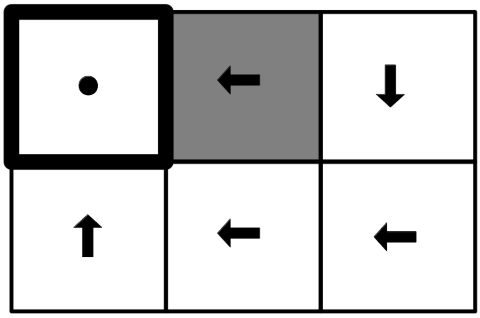
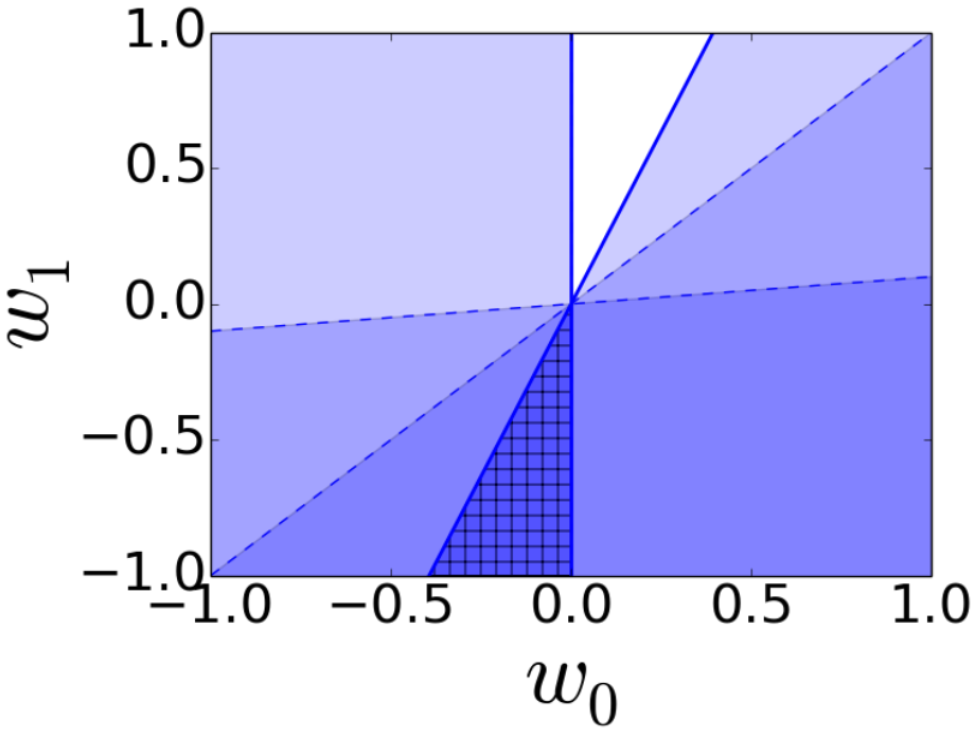</p>
<figcaption>Optimal policy (a) and aligned reward polytope (ARP) (b) for
a grid world with two features (white and gray) and a linear reward
function (<span
class="math inline"><em>R</em>(<em>s</em>) = <em>w</em><sub>0</sub> ⋅ <strong>1</strong><sub><em>w</em><em>h</em><em>i</em><em>t</em><em>e</em></sub>(<em>s</em>) + <em>w</em><sub>1</sub> ⋅ <strong>1</strong><sub><em>g</em><em>r</em><em>a</em><em>y</em></sub>(<em>s</em>)</span>).
The ARP is denoted by the hatched region in (b). </figcaption>
</figure>

Computing the ARP exactly can be computationally demanding or we may not
have access to the robot's reward function. This section describes
heuristics for testing value alignment in the case the robot's reward
weights ($\mathbf{w^\prime}$) are unknown, but the robot's policy can be
queried. Heuristics provide simplified methods to estimate value
alignment without the need for exhaustive computations.

**ARP-blackbox:** The ARP black-box (ARP-bb) heuristic helps address the
challenge of computing the ARP by allowing users to work with a
simplified model. In this heuristic, the user first solves for the ARP
and removes all redundant half-space constraints. For each remaining
half-space constraint, the user queries the robot's action at the
corresponding state. The intuition here is that states, where different
actions are taken, reveal crucial information about the reward function.
By focusing on these key states, we can gain insights into the robot's
reward function without needing to know it explicitly.

**Set Cover Optimal Teaching:** The Set Cover Optimal Teaching (SCOT)
heuristic uses techniques from [@brown2019machine] to generate maximally
informative trajectories. These trajectories are sequences of states
where the number of optimal actions is limited, making them particularly
informative for understanding the robot's policy. By querying the robot
for actions along these trajectories, we can efficiently gauge the
alignment of the robot's policy. This method helps to identify potential
misalignments by focusing on critical decision points in the
trajectories.

**Critical States:** The Critical States (CS) heuristic identifies
states where the gap in value between the optimal action and an average
action is significant. These states are crucial because if the robot's
policy is misaligned, the misalignment will be most consequential at
these critical states. By querying the robot's policy at these states,
we can assess the alignment more effectively. This heuristic is
particularly useful when we have a limited budget of states to check, as
it prioritizes the most informative states for evaluation.

**Practical Examples:** To illustrate the concepts of value alignment
verification, we present an example of applying value alignment
verification in a simple MDP grid world environment. Consider a grid
world where the human's reward function is defined as
$R(s) = 50 \cdot \mathbf{1}_{green}(s) - 1 \cdot \mathbf{1}_{white}(s) - 50 \cdot \mathbf{1}_{blue}(s)$,
where $\mathbf{1}_{color}(s)$ is an indicator feature for the color of
the grid cell. The objective is to align the robot's policy with this
reward function.

<figure id="fig-island">
<p>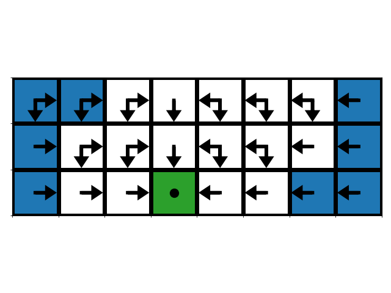
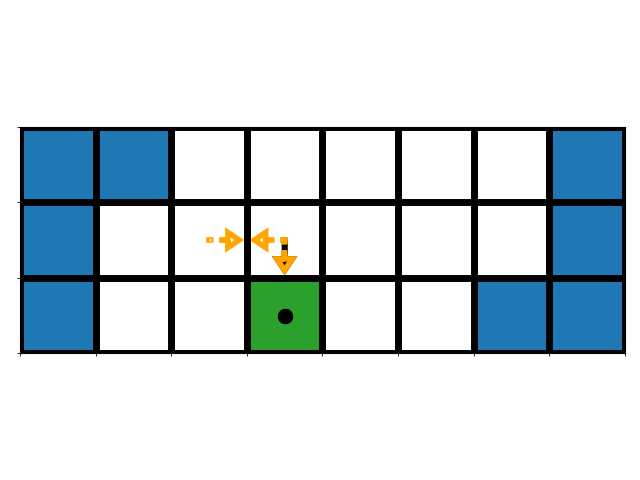 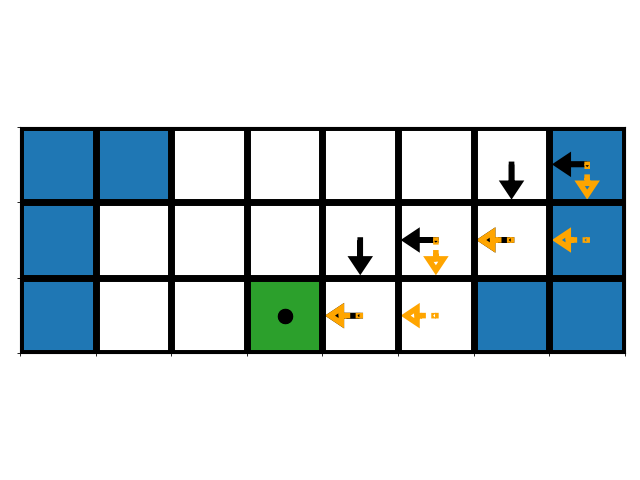 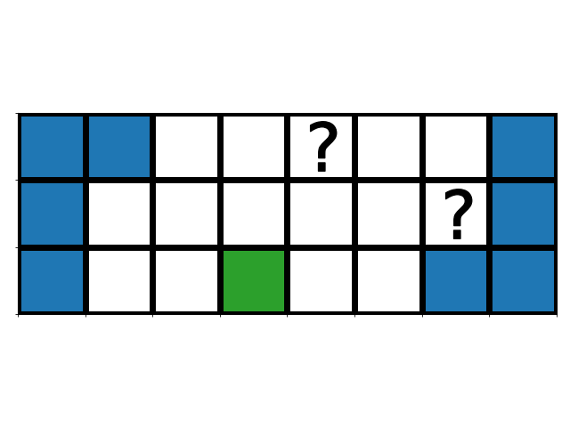 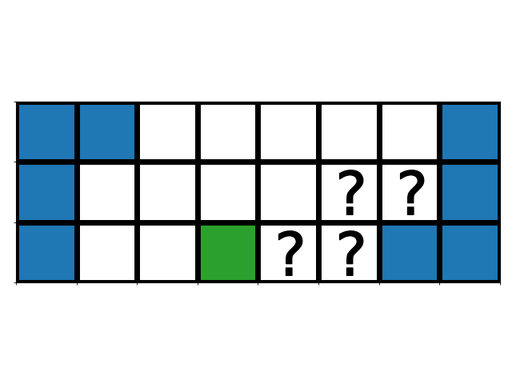 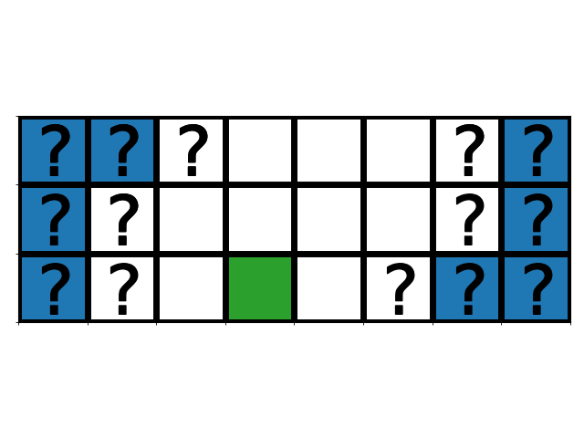 <span
id="fig-island" data-label="fig-island"></span></p>
<figcaption>(a) optimal policy (b) preference query 1 (c) preference
query 2 (d) ARP-bb queries (e) SCOT queries (f) CS queries. In the
preference queries, the human reward model prefers black to
orange.</figcaption>
</figure>

The figure above (a)
shows all optimal actions at each state according to the human's reward
function. This optimal policy serves as the benchmark for alignment
verification. Parts (b) and (c) show two pairwise preference trajectory queries
(black is preferable to orange). Preference query 1 verifies that the robot
values reaching the terminal goal state (green) rather than visiting
more white states. Preference query 2 verifies that the robot values
white states more than blue states. These two preference queries are all
we need to determine whether the robot's values are aligned with the
human's values.

Next, we apply the heuristics discussed in the previous section to this
grid world example. Parts (d), (e), and (f) show the action queries requested by the
heuristics ARP-bb, SCOT, and CS. Each heuristic queries the robot's
actions at specific states to assess alignment:

-   **ARP-bb**: This heuristic queries the fewest states but is myopic.
    It focuses on critical states derived from the ARP.

-   **SCOT**: This heuristic generates maximally informative
    trajectories, querying more states than necessary but providing a
    comprehensive assessment.

-   **CS**: This heuristic queries many redundant states, focusing on
    those where the value gap between optimal and average actions is
    significant.

To pass the test given by each heuristic, the robot's action at each of
the queried states must be optimal under the human's reward function.
The example demonstrates that while the ARP-bb heuristic is efficient,
it might miss the broader context. SCOT provides a thorough assessment
but at the cost of querying more states. CS focuses on high-impact
states but includes redundant queries.

It is important to note that both the construction of the ARP and the
heuristics rely on having an optimal policy for the human. Thus, in most
practical settings we would simply use that policy on the robot without
needing to bother with value alignment verification. As such, value
alignment verification as presented here is more of an academic exercise
rather than a tool of practical utility.

## Human-Centered Design

After understanding AI alignment, the next step is to explore practical
methodologies for incorporating user feedback and ensuring that AI
systems not only align with but also cater to the needs and preferences
of their users. This section will provide insights into various
Human-Centered Design techniques and their application in creating AI
systems that are intuitive and ethically sound, ultimately enhancing the
human-AI interaction experience.

### AI and Human-Computer Interaction

Human-Computer Interaction (HCI) is critical in the context of
artificial intelligence because it focuses on designing systems that are
intuitive and responsive to human needs. While human-robot interaction
and other forms of human interaction with technology are important, HCI
specifically addresses the broader and more common interfaces that
people interact with daily. HCI principles ensure that AI systems are
not only functional but also accessible and user-friendly, making them
essential for the successful integration of AI into everyday life. By
focusing on HCI, we can leverage established methodologies and insights
to create AI systems that are more aligned with human values and needs.

At the heart of this exploration is the concept of human-in-the-loop
processes. As AI systems become more sophisticated, their ability to
simulate human decision-making processes and behaviors has increased,
leading to innovative applications across various domains. The
presentation by Meredith Morris, titled "Human-in-the-loop Computing:
Reimagining Human-Computer Interaction in the Age of AI," shows work in
the integration of human intelligence with AI capabilities
[@Morris2019HITL]. Projects like Soylent and LaMPost are highlighted as
exemplary cases of this integration. Soylent is a Word plugin that uses
human computation to help with editing tasks, while LaMPost is a
platform that leverages crowd workers to aid in natural language
processing tasks [@bernstein2010soylent; @lamport2017lampost]. These
examples demonstrate how human input can significantly enhance AI
outputs by leveraging the unique strengths of human cognition, thereby
addressing complex AI problems that were previously unsolvable. For
instance, Soylent can improve text quality by incorporating nuanced
human feedback, and LaMPost can refine NLP tasks by incorporating human
insights into language subtleties, both of which go beyond the
capabilities of fully automated systems. However, the integration of
human elements in AI systems brings up critical ethical considerations.
The presentation discusses the changing perceptions of the ethics of
human-in-the-loop processes. While the cost-effectiveness of human data
labeling and other processes was once seen as beneficial, it is the
ethical implications of such interactions that take precedence nowadays.
This shift underscores the evolving norms in HCI and the importance of
considering the ethical dimensions of human-AI interactions.

The role of diverse human perspectives plays a crucial role in enhancing
AI systems. Involving a broad spectrum of users in the development and
testing of AI systems ensures that these technologies are inclusive and
representative of the global population, moving beyond the limitations
of a WEIRD (Western, Educated, Industrialized, Rich, and Democratic)
user base. The methodologies for collecting user feedback in HCI form a
critical part of this discussion since they are vital in understanding
user needs, preferences, and behaviors, which in turn inform the
development of more user-centered AI systems. The presentation by
Meredith Morris [@Morris2019HITL] also highlights how these methods can
be effectively employed to gain insights from users to ensure that AI
systems are aligned with the real-world needs and expectations of users.
In HCI, collecting user feedback is a fraught problem. When interacting
with AI systems, the typical end user simply cares about tasks that the
system can perform. Thus, a key question in HCI for AI is finding and
understanding these tasks. **Methodologies for collecting user feedback
in HCI**, are described as follow:

-   **Storyboarding** is a visual method used to predict and explore the
    user experience with a product or service. A storyboard in HCI is
    typically a sequence of drawings with annotations that represent a
    user's interactions with technology. This technique is borrowed from
    the film and animation industry and is used in HCI to convey a
    sequence of events or user flows, including the user's actions,
    reactions, and emotions.

-   **Wizard of Oz Studies** is a method of user testing where
    participants interact with a system they believe to be autonomous,
    but which is actually being controlled or partially controlled by a
    human 'wizard' behind the scenes. This technique allows researchers
    to simulate the response of a system that may not yet be fully
    functional or developed.

Both **Storyboarding** and **Wizard of Oz Studies** are effective for
engaging with users early in the design process. They help deal with the
problem of gathering feedback on a product that doesn't yet exist. Users
often have difficulty imagining outcomes when they cannot touch a live
demonstration.

-   **Surveys** in HCI are structured tools that consist of a series of
    questions designed to be answered by a large number of participants.
    They can be conducted online, by telephone, through paper
    questionnaires, or using computer-assisted methods. Surveys are
    useful for collecting quantitative data from a broad audience, which
    can be analyzed statistically.

-   **Interviews** in HCI are more in-depth and involve direct, two-way
    communication between the researcher and the participant. Interviews
    can be structured, semi-structured, or unstructured, ranging from
    tightly scripted question sets to open-ended conversations.

-   **Focus Groups** involve a small group of participants discussing
    their experiences and opinions about a system or design, often with
    a moderator. Group dynamics can provide insights into collective
    user perspectives. In particular, users can bounce ideas off each
    other to provide richer feedback and quieter users who may not
    otherwise provide feedback may be encouraged by their peers.

-   **Community-Based Participatory Design (CBPD)** is a human-centered
    approach that involves the people who will use a product in the
    design and development process. With CBPD, designers work closely
    with community members to identify problems, develop prototypes, and
    iterate based on community feedback. For example, when building a
    software product for deaf people, the engineering team can hire deaf
    engineers or designers to provide feedback as they collaboratively
    build the product.

-   **Field Studies** involve observing and collecting data on how users
    interact with a system in their natural environment. This method is
    based on the premise that observing users in their context provides
    a more accurate understanding of user behavior. It can include a
    variety of techniques like ethnography, contextual inquiries, and
    natural observations.

-   **Lab-based studies** are conducted in a controlled environment
    where the researchers can manipulate variables and observe user
    behavior in a setting designed to minimize external influences.
    Common lab-based methods include usability testing, controlled
    experiments, and eye-tracking studies.

-   **Diary Studies and Ethnography** in HCI are a research method where
    participants are asked to keep a record of their interactions with a
    system or product over a while. This log may include text, images,
    and sometimes even audio or video recordings, depending on the
    study's design. Participants typically document their activities,
    thoughts, feelings, and frustrations as they occur in their natural
    context.

-   **Ethnography** is a qualitative research method that involves
    observing and interacting with participants in their real-life
    environment. Ethnographers aim to immerse themselves in the user
    environment to get a deep understanding of the cultural, social, and
    organizational contexts that shape technology use.

As we have explored various methodologies for collecting human feedback,
it becomes evident that the role of human input is indispensable in
shaping AI systems that are not only effective but also ethically sound
and user-centric. In the next step, we will elaborate on how to design
AI systems for positive human impact, examining how socially aware and
human-centered approaches can be employed to ensure that AI technologies
contribute meaningfully to society. This includes understanding how AI
can be utilized to address real-world challenges and create tangible
benefits for individuals and communities.

### Designing AI for Positive Human Impact

In the field of natural language processing (NLP), the primary focus has
traditionally been on quantitative metrics such as performance
benchmarks, accuracy, and computations. These metrics have long guided
the development and evaluation of the technologies. However, as the
field evolves and becomes increasingly intertwined with human
interactions like the recent popularity of Large Language Models (LLMs),
a paradigm shift is becoming increasingly necessary. For example, these
LLMs are shown to produce unethical or harmful responses or reflect
values that only represent a certain group of people. The need for a
human-centered approach in NLP development is crucial as these models
are much more likely to be utilized in a broad spectrum of human-centric
applications, impacting various aspects of daily life. This shift calls
for an inclusive framework where LLMs are not only optimized for
efficiency and accuracy but are also sensitized to ethical, cultural,
and societal contexts. Integrating a human-centered perspective ensures
that these models are developed with a deep understanding of, and
respect for, the diversity and complexity of human values and social
norms. This approach goes beyond merely preventing harmful outcomes; it
also focuses on enhancing the positive impact of NLP technologies on
society. In this session, we explore the intricacies of a human-centered
approach in NLP development, focusing on three key themes: Socially
Aware, Human-Centered, and Positively Impactful.

#### Socially Aware

In the exploration of socially aware NLP,  [@hovy-yang-2021-importance]
presents a comprehensive taxonomy of seven social factors grounded in
linguistic theory (See @fig-taxonomy).

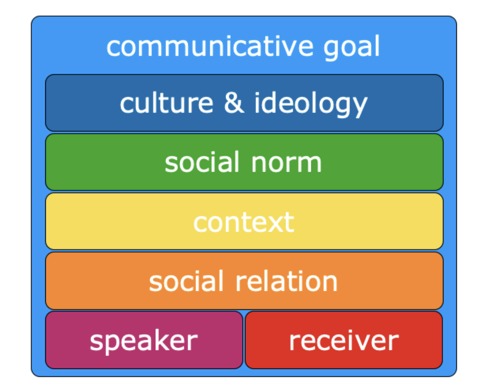{#fig-taxonomy
width="30%"}

This taxonomy illustrates both the current limitations and progressions
in NLP as they pertain to each of these factors. The primary aim is to
motivate the NLP community to integrate these social factors more
effectively, thereby advancing towards a level of language understanding
that more closely resembles human capabilities. The characteristics of
speakers, encompassing variables such as age, gender, ethnicity, social
class, and dialect, play a crucial role in language processing. Certain
languages or dialects, often categorized as low-resource, are spoken by
vulnerable populations that require special consideration in NLP
systems. In many cases, the dominant culture and values are
over-represented, leading to an inadvertent marginalization of minority
perspectives. These minority voices must be not only recognized but also
given equitable representation in language models. Additionally, norms
and context are vital components in understanding linguistic behavior.
They dictate the appropriateness of language use in various social
situations and settings. Recognizing and adapting to these norms is a
critical aspect of developing socially aware NLP systems that can
effectively function across diverse social environments.

#### Human-Centered

The Human-Centered aspect of NLP development emphasizes the creation of
language models that prioritize the needs, preferences, and well-being
of human users. This involves integrating human-centered design
principles throughout the development stages of LLMs, which are
described as follows:

-   **Task Formulation stage:** Human-centered NLP development begins
    with understanding the specific problems and contexts in which users
    operate. This involves collaborating with end-users to identify
    their needs and challenges, ensuring that the tasks addressed by the
    models are relevant and meaningful to them. By engaging with users
    early in the process, developers can create models that are not only
    technically robust but also practically useful.

-   **Data Collection stage:** Human-centered principles ensure that the
    data used to train models is representative of the diverse user
    population. This includes collecting data from various demographic
    groups, languages, and cultural contexts to avoid biases that could
    lead to unfair or harmful outcomes. Ethical considerations are
    paramount, ensuring that data is collected with informed consent and
    respecting users' privacy.

-   **Data Processing** in a human-centered approach involves carefully
    curating and annotating data to reflect the nuances of human
    language and behavior. This step includes filtering out potentially
    harmful content, addressing imbalances in the data, and ensuring
    that the labels and annotations are accurate and meaningful. By
    involving human annotators from diverse backgrounds, developers can
    capture a wider range of perspectives and reduce the risk of biased
    outputs.

-   **Model Training** with a human-centered focus involves
    incorporating feedback from users and domain experts to fine-tune
    the models. This iterative process ensures that the models remain
    aligned with users' needs and preferences. Techniques such as active
    learning, where the model queries users for the most informative
    examples, can be employed to improve the model's performance.

-   **Model Evaluation** in a human-centered framework goes beyond
    traditional metrics like accuracy and F1-score. It includes
    assessing the model's impact on users, its fairness, and its ability
    to handle real-world scenarios. User studies and A/B testing can
    provide valuable insights into how the model performs in practice
    and how it affects users' experiences.

-   **Deployment** of human-centered NLP models involves continuous
    monitoring and feedback loops to ensure that the models remain
    effective and aligned with users' needs over time. This includes
    setting up mechanisms for users to report issues and provide
    feedback, which can then be used to update and improve the models.
    Ensuring transparency in how the models operate and how user data is
    used also fosters trust and acceptance among users.

#### Positively Impactful

Building on the human-centered approach, it is crucial to consider how
language models can be utilized and the broader impacts they can have on
society.

**Utilization:** LLMs offer socially beneficial applications across
various domains such as public policy, mental health, and education. In
public policy, they assist in analyzing large volumes of data to inform
decision-making processes. In mental health, LLMs can provide
personalized therapy and even train therapists by simulating patient
interactions. In the education sector, they enable personalized learning
experiences and language assistance, making education more accessible
and effective. These examples demonstrate the versatility of LLMs in
contributing positively to critical areas of human life.

**Impact:** The deployment of NLP models, especially LLMs, has
significant societal impacts. Positively, they enhance human
productivity and creativity, offering tools and insights that streamline
processes and foster innovative thinking. LLMs serve as powerful aids in
various sectors, from education to industry, enhancing efficiency and
enabling new forms of expression and problem-solving. it is essential to
acknowledge the potential negative impacts. One major concern is the
ability of LLMs to generate and spread misinformation. As these models
become more adept at producing human-like text, distinguishing between
AI-generated and human-created content becomes increasingly challenging.
This raises issues of trust and reliability, with the risk of widespread
dissemination of false or misleading information, which could have
significant adverse effects on individuals and society.

By considering both the utilization and impact of LLMs, we can better
harness their potential for positive societal contributions while
mitigating the risks associated with their deployment. In conclusion, by
thoughtfully integrating human-centered principles and ensuring positive
impacts through feedback collection and ethical considerations, we can
develop language models that not only enhance human well-being but also
align closely with societal values. Building on these foundational
principles, we now turn our attention to Adaptive User Interfaces, which
exemplify the practical application of these concepts by personalizing
interactions and improving user experiences in dynamic environments.

### Adaptive User Interfaces

Adaptive user interfaces (AUIs) represent a significant advancement in
personalizing user experiences by learning and adapting to individual
preferences. This section will discuss the methodologies and
applications of AUIs, highlighting their role in enhancing human-AI
interaction through intelligent adaptation. The integration of AUIs
within human-centered design paradigms ensures that AI systems not only
meet user needs but also anticipate and adapt to their evolving
preferences, thus maximizing positive human impact. Nowadays, consumers
have more choices than ever and the need for personalized and
intelligent assistance to make sense of the vast amount of information
presented to them is clear.

#### Key ideas

In general, personalized recommendation systems require a model or
profile of the user. We categorize modeling approaches into four groups.

1.  User-created profiles (usually done manually).

2.  Manually defined groups that each user is classified
    into.

3.  Automatically learned groups that each user is
    classified into.

4.  Adaptively learned individual user models from interactions with the
    recommendation system.

The last approach is referred to as *adaptive user interfaces*. This
approach promises that each user is given the most personalization
possible, leading to better outcomes. In this session, we discuss
recommendation systems that adaptively learn an individual's preferences
and use that knowledge to intelligently recommend choices that the
individual is more inclined to like.

The problem of learning individual models can be formalized as follows: 
a set of tasks requiring a user decision, a description for each task, 
and a history of the user's decision on each task. This allows us to 
find a function that maps from task descriptions (features) to user 
decisions. Tasks can be described using crowd-sourced data (a 
collaborative approach) or measurable features of the task (a content-based 
approach). This session will focus on content-based approaches 
for describing tasks. After understanding the framework for adaptive 
user interfaces, it is useful to provide example applications to 
ground future discussions. Adaptive user interfaces have been developed 
for command and form completion, email filtering and filing, news 
selection and layout, browsing the internet, selecting movies and 
TV shows, online shopping, in-car navigation, interactive scheduling, 
and dialogue systems, among many other applications.

#### Design

The goal of an adaptive user interface is to create a software tool that
reduces human effort by acquiring a user model based on past user
interactions. This is analogous to the goal of machine learning (ML)
which is to create a software tool that improves some task performance
by acquiring knowledge based on partial task experience. The design of
an adaptive user interface can be broken up into six steps:

1.  **Formulating the Problem:** Given some task that an intelligent
    system could aid, the goal is to find a formulation that lets the
    assistant improve its performance over time by learning from
    interactions with a user. In this step the designer has to make
    design choices about what aspect of user behavior is predicted, and
    what is the proper level of granularity for description (i.e. what
    is a training example). This step usually involves formulating the
    problem into some sort of supervised learning framework.

2.  **Engineering the Representation:** At this stage we have a
    formulation of a task in ML terms and we need to represent the
    behavior and user model in such a way that makes computational
    learning not only tractable but as easy as possible. In this step,
    the designer has to make design choices about what information is
    used to make predictions, and how that information is encoded and
    passed to the model.

3.  **Collecting User Traces:** In this third step the goal is to find
    an effective way to collect traces (samples) of user behavior. The
    designer must choose how to translate traces into training data and
    also how to elicit traces from a user. An ideal adaptive user
    interface places no extra effort on the user to collect such traces.

4.  **Modeling the User:** In this step the designer must decide what
    model class to use (neural network, decision tree, graphical model,
    etc.) and how to train the model (optimizer, step size, batch size,
    etc.). This step in the design process is usually given too much
    importance in academia. It is quite often the case that the success
    of an adaptive user interface is more sensitive to the other design
    steps.

5.  **Using the Model Effectively:** At this stage the designer must
    decide how the model will be integrated into a software tool.
    Specifically, when and how is the model evaluated and how is the
    output of the model presented to the user? In addition, the designer
    must consider how to handle situations in which the model
    predictions are wrong. An ideal adaptive user interface will let the
    user take advantage of good predictions and ignore bad ones.

6.  **Gaining User Acceptance:** The final step in the design process is
    to get users to try the system and ultimately adopt it. The initial
    attraction of users is often a marketing problem, but to retain
    users the system must be well-designed and easy to use.

#### Applications

After understanding the design of Adaptive User Interfaces, let's take a
look at how we can apply it to real-world problems. We will summarize
and analyze three different application areas of learning human
preferences, which are driving route advisor [@rogers1999adaptive],
destination selection [@langley1999adaptive], and resource scheduling
[@gervasio1999learning].

**1. Driving Route Advisor:** The task of route selection involves
determining a desirable path for a driver to take from their current
location to a chosen destination, given the knowledge of available roads
from a digital map. While computational route advisors exist in rental
cars and online, they cannot personalize individual drivers'
preferences, which is a gap that adaptive user interfaces aim to fill by
learning and recommending routes tailored to the driver's unique choices
and behaviors.

Here is an approach to route selection through learning individual
drivers' route preferences.

-   Formulation: Learn a "subjective" function to evaluate entire
    routes.

-   Representation: Global route features are computable from digital
    maps.

-   Data collection: Preference of one complete route over another.

-   Induction: A method for learning weights from preference data.

-   Using model: Apply subjective function to find "optimal" route.

This method aims to learn a user model that considers the entirety of a
route, thereby avoiding issues like data fragmentation and credit
assignment problems.

The design choices are incorporated into [@rogers1999adaptive], which:
models driver preferences in terms of 14 global route features; gives
the driver two alternative routes he might take; lets the driver refine
these choices along route dimensions; uses driver choices to refine its
model of his preferences; and invokes the driver model to recommend
future routes. We note that providing drivers with choices lets the
system collect data on route preferences in an unobtrusive manner. The
interface of the application is presented in @fig-exp-1.

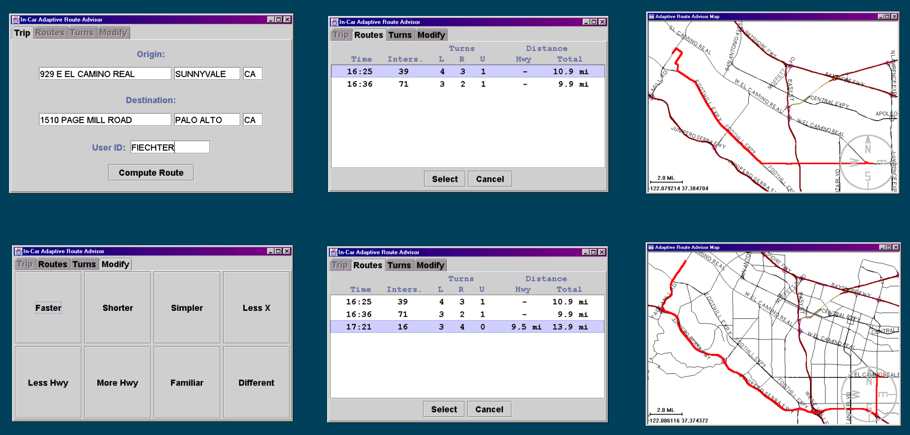{#fig-exp-1
width="80%"}

In driving route advisor task [@rogers1999adaptive], a linear model is
used for predicting the cost of a route based on the time, distance,
number of intersections, and the number of turns. The system uses each
training pair as a constraint on the weights found during the learning
process. The experimental results are shown in the figure below.

<figure id="fig-exp-2">
<p>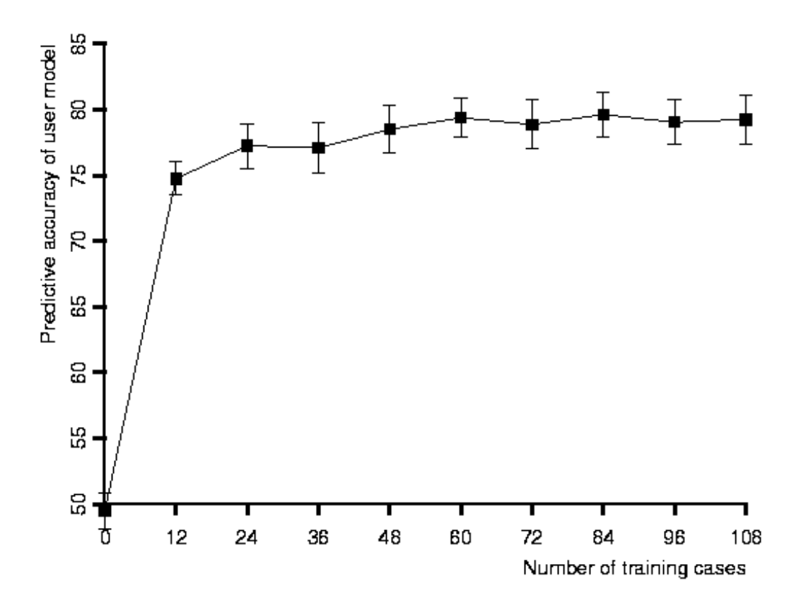
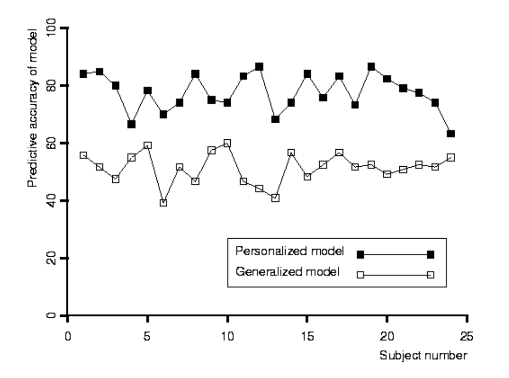</p>
<figcaption>(Left) Experiments with 24 subjects show the Route Advisor
improves its predictive ability rapidly with experience. (Right)
Analyses also show that personalized user models produce better results
than generalized models, even when given more data. </figcaption>
</figure>

**2. Destination Selection:** The task of destination selection involves
assisting a driver in identifying one or more suitable destinations that
fulfill a specific goal, such as finding a place to eat lunch, based on
the driver's current location and knowledge of nearby options. While
there are many recommendation systems online, including those for
restaurants, they are not ideally suited for drivers due to the driving
environment's demand for limited visual attention, thus necessitating a
more tailored and accessible approach for in-car use.

One approach to destination recommendation can be cast as:

-   Formulation: Learn to predict features the user cares about in
    items.

-   Representation: Conditions/weights on attributes and values.

-   Data collection: Converse with the user to help him make decisions,
    noting whether he accepts or rejects questions and items.

-   Induction: Any supervised induction method.

-   Using model: Guide the dialogue by selecting informative questions
    and suggesting likely values.

This design relies on the idea of a conversational user interface.
Spoken-language versions of this approach appear well suited to the
driving environment.

This approach is implemented in [@langley1999adaptive], where it engages
in spoken conversations to help a user refine goals; incorporates a
dialogue model to constrain this process; collects and stores traces of
interaction with the user; and personalizes both its questions and
recommended items. Their work focused on recommending restaurants to
users who want advice about where to eat. This approach to
recommendation would work well for drivers, it also has broader
applications. We present experimental results in

<figure id="fig-exp-2.5">
<p>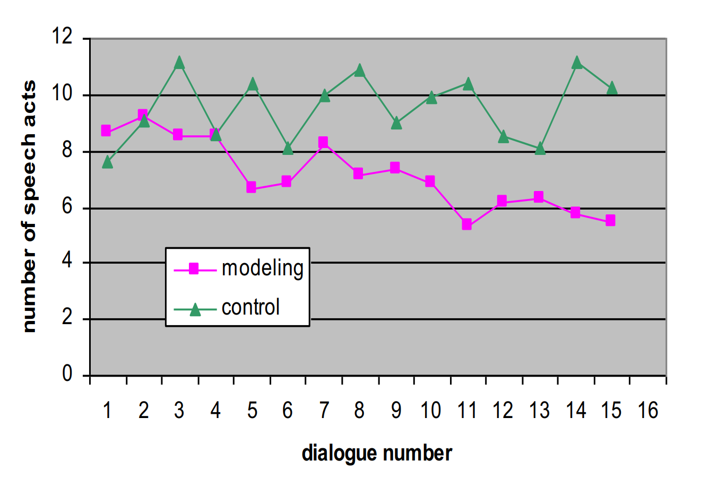
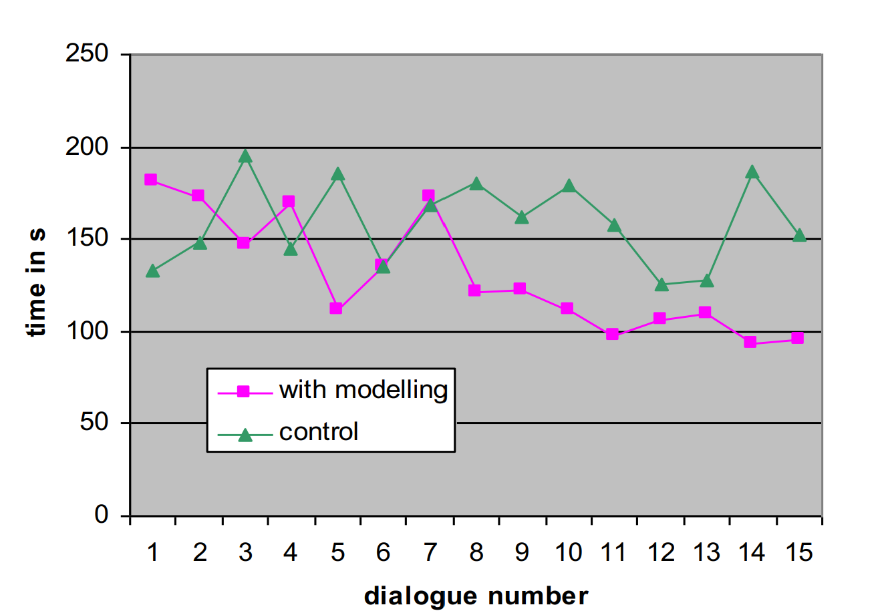</p>
<figcaption>(Left) Speech Acts Per Conversation. (Right) Time Per
Conversation. </figcaption>
</figure>

**3. Resource Scheduling:** The task of resource scheduling describes
the challenge of allocating a limited set of resources to complete a set
of tasks or jobs within a certain time frame, while also considering the
constraints on both the jobs and the resources. Although automated
scheduling systems are prevalent in various industries and some
interactive schedulers exist, there is a distinct need for systems that
can create personalized schedules reflecting the unique preferences of
individual users.

An approach to personalized scheduling can be described as:

-   Formulation: Learn a utility function to evaluate entire schedules.

-   Representation: Global features are computable from the schedule.

-   Data collection: Preference of one candidate schedule over others.

-   Induction: A method for learning weights from preference data.

-   Using model: Apply the 'subjective' function to find a good
    schedule.

We note that this method is similar to that in the Adaptive Route
Advisor. However, it assumes a search through a space of complete
schedules (a repair space), which requires some initial schedule. This
approach is implemented in [@gervasio1999learning], where the
interactive scheduler retrieves an initial schedule from a personalized
case library; suggests to the user improved schedules from which to
select; lets the user direct search to improve on certain dimensions;
collects user choices to refine its personalized utility function;
stores solutions in the case base to initialize future schedules; and
invokes the user model to recommend future schedule repairs. As before,
providing users with choices lets the system collect data on schedule
preferences unobtrusively. An example of the interface, and the
experimental results are shown in the figure below.

<figure id="fig-exp-3">
<p>
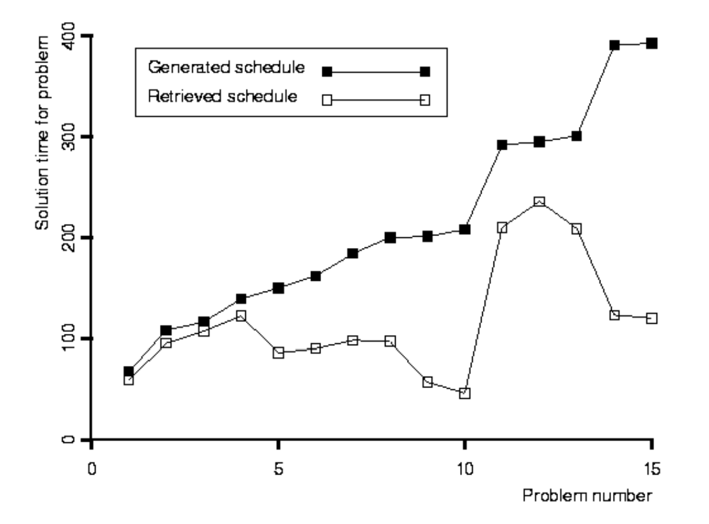</p>
<figcaption>(Left) The interface of the INCA: Interactive
Scheduling <span class="citation"
data-cites="gervasio1999learning"></span>. (Right) Experiments with INCA
suggest that retrieving personalized schedules helps users more as task
difficulty increases. These experimental studies used a mixture of human
and synthetic subjects. </figcaption>
</figure>

#### Limitations

The challenges of adaptive interfaces may involve: conceptualizing user
modeling as a task suitable for inductive learning, crafting
representations that facilitate the learning process, gathering training
data from users in a way that doesn't intrude on their experience,
applying the learned user model effectively, ensuring the system can
learn in real-time, and dealing with the necessity of learning from a
limited number of training instances. These challenges are not only
pertinent to adaptive interfaces but also intersect with broader
applications of machine learning, while also introducing some unique
issues. However, new sensor technology can bring promises to adaptive
interfaces. Adaptive interfaces rely on user traces to drive their
modeling process, so they stand to benefit from developments like GPS
and cell phone locators, robust software for speech recognition,
accurate eye and head trackers, real-time video interpreters, wearable
body sensors (GSR, heart rate), and portable brain-wave sensors. As
those devices become more widespread, they will offer new sources of
data and support new types of adaptive services. In addition, adaptive
interfaces can be viewed as a form of cognitive simulation that
automatically generates knowledge structures to learn user preferences.
They are capable of making explicit predictions about future user
behavior and explaining individual differences through the process of
personalization. This perspective views adaptive interfaces as tools
that not only serve functional purposes but also model the psychological
aspects of user interaction. Two distinct approaches within cognitive
simulation are related to adaptive interfaces: *process* models that
incorporate fundamental architectural principles, and *content* models
that operate at the knowledge level, focusing on behavior. We note that
both of them have roles to play, but content models are more relevant to
personalization and adaptive interfaces.

In conclusion, adaptive user interfaces represent a significant
advancement in creating personalized and efficient interactions between
humans and technology. By leveraging modern sensor technologies and
cognitive simulation approaches, these interfaces can dynamically learn
and adapt to individual user preferences, enhancing overall user
experience and system effectiveness. The methodologies discussed, from
conceptualizing user models to collecting and utilizing user feedback,
form the foundation of this innovative approach. As we transition to the
next section, we will explore practical applications and real-world
implementations of these human-centered AI principles through detailed
case studies, illustrating the tangible impact of adaptive interfaces in
various domains.

### Case Studies in Human-Centered AI {#sec-case-studies}

In this section, we examine practical examples that illustrate the
application of human-centered principles in the development and
deployment of AI systems. By examining these case studies, we aim to
provide concrete insights into how AI technologies can be designed and
implemented to better align with human values, enhance inclusivity, and
address the specific needs of diverse user groups. The following case
studies highlight different approaches and methodologies used to ensure
that AI systems are not only effective but also considerate of the human
experience.

#### LaMPost Case Study

In our exploration of human-centered AI design, it is crucial to examine
how metrics can be improved to better capture the human experience and
address the shortcomings of traditional evaluation methods. The LaMPost
case study [@goodman_lampost_2022] exemplifies this effort by focusing
on the development of an AI assistant designed to aid individuals with
dyslexia in writing emails. This case is particularly relevant to our
discussion because it highlights the importance of human-centered
principles in AI development, especially in creating tools that cater to
specific cognitive differences and enhance user experience.

Dyslexia is a cognitive difference that affects approximately 15 percent
of language users, with varying degrees of impact on speaking, spelling,
and writing abilities. It is a spectrum disorder, meaning symptoms and
severity differ among individuals. More importantly, dyslexia is not an
intellectual disability; many individuals with dyslexia possess high
intelligence. Given the significant number of people affected by
dyslexia, it is essential to develop AI tools that support their unique
needs and enhance their daily tasks.

The LaMPost project sought to answer the question, "How can LLMs be
applied to enhance the writing workflows of adults with dyslexia?" To
address this, researchers employed a participatory design approach,
involving employees with dyslexia from their company (Google) in the
study. This approach ensured that the development process was inclusive
and responsive to the actual needs and preferences of the dyslexic
community. By focusing on the real-world application of LLMs in aiding
email writing for dyslexic individuals, LaMPost serves as a powerful
example of how AI can be designed to better capture and enhance the
human experience.

The figure below allows users to see suggestions for rewriting selected
text, helping them identify main ideas, suggest possible changes, and
rewrite their selections to improve clarity and expression.


The table below categorizes the challenges faced by users at different
writing levels and the strategies they can use to overcome these
challenges, illustrating the varied support needs addressed by LaMPost

<figure>
<table>
<thead>
<tr>
<th style="text-align: center;">Writing level</th>
<th style="text-align: center;">Examples of Challenges</th>
<th style="text-align: center;">Strategies</th>
</tr>
</thead>
<tbody>
<tr>
<td style="text-align: center;">high</td>
<td style="text-align: center;">expressing ideas</td>
<td style="text-align: center;">“word faucet”, ASR dictation</td>
</tr>
<tr>
<td style="text-align: center;"></td>
<td style="text-align: center;">ordering ideas</td>
<td style="text-align: center;">post-it outlining</td>
</tr>
<tr>
<td style="text-align: center;">low</td>
<td style="text-align: center;">appropriate language</td>
<td style="text-align: center;">proofreading</td>
</tr>
<tr>
<td style="text-align: center;"></td>
<td style="text-align: center;">paraphrasing</td>
<td style="text-align: center;">feedback</td>
</tr>
</tbody>
</table>
<figcaption>User challenged and strategies in LaMPost.</figcaption>
</figure>

Next, they ran a focus group to get initial ideas from members of the
dyslexic community. This focus group helped them figure out what to
measure and added the second research question: "How do adults with
dyslexia feel about LLM-assisted writing?" In other words, how does the
LLM impact users' feelings of satisfaction, self-expression,
self-efficacy, autonomy, and control?

From this focus group, they went and created a prototype to answer the
desires of the group. They included three features in their prototype
model. One feature was: *identifying main ideas*. They focused on this
to support overall clarity and organization of high-level ideas of the
user. Another feature was *suggest possible changes*. They focused on
this because users wanted to identify high-level adjustments to improve
their writing. The last feature they added was *rewrite my selections*.
They added this because users wanted help expressing ideas with a
desired phrasing tone or style. This feature generated a rewrite based
on a command you gave it.

With the prototype, the researchers evaluated again with 19 participants
with dyslexia from outside their organization. They did a three-part
study, including a demonstration and background on the system (25 min).
Then they did a writing exercise with two real tasks (emails) each user
had to do in the real world (25 min). For example, one task might have
been to write an email to the principal of their child's school to ask
for a meeting. Then, the researchers did another follow-up interview for
more qualitative data, e.g. to ask about specific choices users made
when interacting with the model (25 min).

LaMPost's design prioritized autonomy by allowing users to choose the
best option for their writing. One successful thing is that most users
felt in control while writing. Users found that numerous options were
helpful to filter through poor results. However, participants said the
selection process was cognitively demanding and time-consuming. As we
all know, features identified in LaMPost are all over the place, such as
in Google Docs. Nonetheless, there remain many questions about the
balance between automated writing and providing more control to the end
users.

::: tcolorbox
How could researchers hone in on this trade-off between **the ease of
automated writing** and **providing control to end-users**?\
You will need to design a study to approach this question.

-   Identify your research question, hypotheses, and the methods that
    you will use. (Hint: use the HCI methods described in the previous
    section.)

-   Scope the domain of your study appropriately---more broadly than
    dyslexia but not so broadly to be meaningless.

-   What domains will you include? (E.g. students use ChatGPT for
    assignments, doctors use an LLM to write notes, etc.)
:::

In this way, both the case study of LaMPost and its presaging of greater
trends in LLM interfaces recapitulate the maxim of HCI: HCI is a cycle.
You design a potential system, prototype it, get feedback from people,
and iterate constantly. Next, we will explore two case studies that
exemplify the application of human-centered principles in NLP. These
case studies illustrate how LLMs can be adapted to foster social
inclusivity and provide training in social skills.

#### Multi-Value and DaDa: Cross-Dialectal English NLP

English NLP systems are largely trained to perform well in Standard
American English - the form of written English found in professional
settings and elsewhere. Not only is Standard American English the most
well-represented form of English in textual datasets but NLP engineers
and researchers often filter dialectal and vernacular English examples
from their datasets to improve performance on SAE benchmarks. As a
result, NLP systems are generally less performant when processing
dialectal inputs than SAE inputs. This performance gap is observable
over various benchmarks and tasks, like the SPIDER benchmark. [@spider]

{width="100%"}

As natural language systems become more pervasive, this performance gap
increasingly represents a real allocational harm against dialectal
English speakers --- these speakers are excluded from using helpful
systems and assistants. Multi-Value is a framework for evaluating
foundation language models on dialectic input, and DADA is a framework
for adapting LLMs to improve performance on dialectic input.

**Synthetic Dialectal Data**

Ziems et al. (2023) create synthetic dialectal data for several English
dialects (Appalachian English, Chicano English, Indian English,
Colloquial Singapore English, and Urban African American English).[@mv]
They created synthetic data based on transforming SAE examples to have
direct evaluation comparisons. These synthetic examples were created by
leveraging known linguistic features of the dialects, such as negative
concord in UAAVE. @fig-features_dialects maps out the presence of various
linguistic features.

{#fig-features_dialects width="100%"}

This synthetic data, while somewhat limited in the variety of samples.
can produce and create realistic examples for benchmarking LM
performance. @fig-synthetic_example demonstrates creating a synthetic
dialectic example using the 'give passive' linguistic feature,
illustrating the transformation process from SAE to a vernacular form.

{#fig-synthetic_example width="40%"}

**Feature Level Adapters** One approach to the LLM adaption task would
be to train an adapter for each dialect using a parameter-efficient
fine-tuning method like low-rank adapters. [@lora] While adapters can
certainly bridge the gap between SAE LMs and dialect inputs, this
approach suffers from a couple of weaknesses, namely:

-   Individually trained adapters do not leverage similarities between
    low-resource dialects. Transfer learning is often helpful for
    training low-resource languages and dialects.

-   The model needs to know which adapter to use at inference time. This
    presupposes that we can accurately classify the dialect ---
    sometimes based on as little as one utterance. This classification
    is not always possible --- a more general approach is needed.

Therefore, Liu et al. (2023) propose a novel solution --- DADA: Dialect
Adaption via Dynamic Aggregation of Linguistic Rules. [@dada] DADA
trains adapters on the linguistic feature level rather than the dialect
level. The model can use multiple linguistic feature adapters via an
additional fusion layer. They can therefore train using
multi-dialectical data and cover linguistic variation via a
comprehensive set of roughly 200 adapters. DADA saw an improvement in
performance over single-dialect adapters for most dialects, as shown in
@fig-dada_performance.

{#fig-dada_performance width="40%"}

The Multi-Value and DADA case study underscores the importance of
designing NLP systems that are inclusive and representative of diverse
language users. By addressing the performance gaps in handling dialectal
inputs, this case study highlights the necessity of incorporating
diverse linguistic data and creating adaptable systems. This approach
enhances AI functionality and accessibility, ensuring it respects and
reflects linguistic diversity. Ultimately, the study reinforces
human-centered design principles, demonstrating how AI can be tailored
to better serve and empower all users. Moving forward, we will explore
how LLMs can be utilized for social skill training, showcasing their
potential to improve human interactions.

#### Social Skill Training via LLMs

The emergence of Large Language Models (LLMs) marks a significant
milestone in the field of social skills training. This case study
explores the potential of LLMs to augment social skill development
across diverse scenarios. More specifically, we discuss a dual-framework
approach, where two distinct LLMs operate in tandem as a Partner and a
Mentor, guiding human learners in their journey towards improved social
interaction. In this framework, we have two agents which are

-   **AI Partner**: LLM-empowered agents that users can engage with
    across various topics. This interactive model facilitates practical,
    conversation-based learning, enabling users to experiment with
    different communication styles and techniques or practice and
    develop specific skills in real-world scenarios in a safe,
    AI-mediated environment.

-   **AI Mentor**: An LLM-empowered entity designed to provide
    constructive, personalized feedback based on the interaction of
    users and the AI Partner. This mentor analyzes conversation
    dynamics, identifies areas for improvement, offers tailored advice,
    and guides users toward effective social strategies and improved
    interaction skills.

For example, in conflict resolution, individuals learning to handle
difficult conversations can use the AI Partner to simulate interactions
with a digitalized partner. As a Conflict Resolution Expert, the AI
Mentor helps analyze these interactions, offering strategies to navigate
conflicts effectively.

In the educational sector, K-12 teachers aiming to incorporate more
growth-mindset language into their teaching can practice with a
digitalized student. An experienced teacher or mentor, represented by
the AI Mentor, provides insights on effective communication and teaching
methods. For negotiation training, students preparing to negotiate their
first job offers can engage in simulated negotiations with a digitalized
HR representative through the AI Partner. As a Negotiation Expert, the
AI Mentor then offers guidance on negotiation tactics, helping students
effectively articulate their values and negotiate job terms. Lastly, in
therapy training, novice therapists can interact with a digitalized
patient via the AI Partner to practice therapy sessions. The AI Mentor,
functioning as a Therapy Coach, then reviews these sessions, providing
feedback and suggestions on enhancing therapeutic techniques and patient
engagement.

**CARE: Therapy Skill Training** Hsu et al. (2023) introduced
CARE [@hsu2023helping], a framework designed for therapy skill training.
This framework leverages a simulated environment, enabling counselors to
practice their skills without the risk of harming real individuals. An
integral component of CARE is the AI Mentor, which offers invaluable
feedback and guidance during the training process. See
@fig-care for
the overview of the framework.

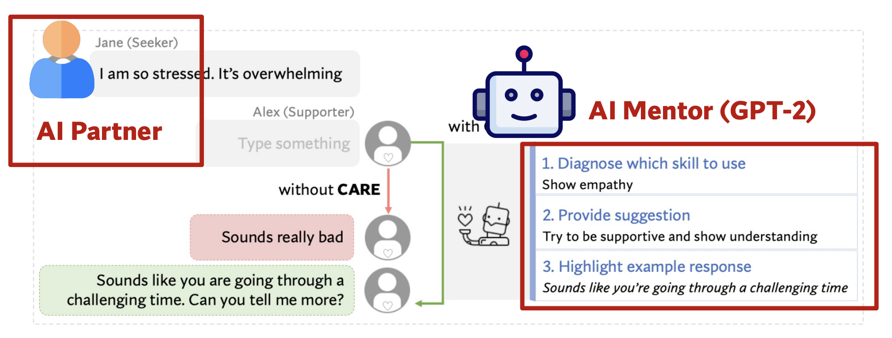{#fig-care width="45%"}

CARE's primary function is for novice therapists and counselors to
assess and determine the most effective counseling strategies tailored
to specific contexts. It provides counselors with customized example
responses, which they can adopt, adapt, or disregard when interacting
with a simulated support seeker. This approach is deeply rooted in the
principles of Motivational Interviewing and utilizes a rich dataset of
counseling conversations combined with LLMs. The effectiveness of CARE
has been established through rigorous quantitative evaluations and
qualitative user studies, which included simulated chats and
semi-structured interviews. Notably, CARE has shown significant benefits
in aiding novice counselors. From the assessment, counselors chose to
use CARE 93% of the time, directly used a CARE response without editing
60% of the time, and sent more extended responses with CARE.
Qualitatively, counselors noted several advantages of CARE, such as its
ability to refresh memory on various strategies, inspire innovative
responses, boost confidence, and save time during consultations.
However, there were some drawbacks, including potential disruptions in
the thought process, perceived limitations in response options, the
requirement for decision-making, and the time needed to review
suggestions. Overall, the framework is particularly beneficial for
therapists new to the field, offering them a supportive and educational
tool to enhance their counseling skills effectively.

## Practice Exercises

[^1]: GPT-4 is good at coming up with longer-rendered answers about why
    some things are appropriate or not.