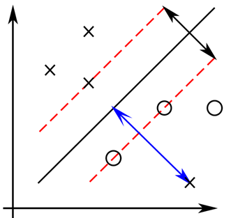
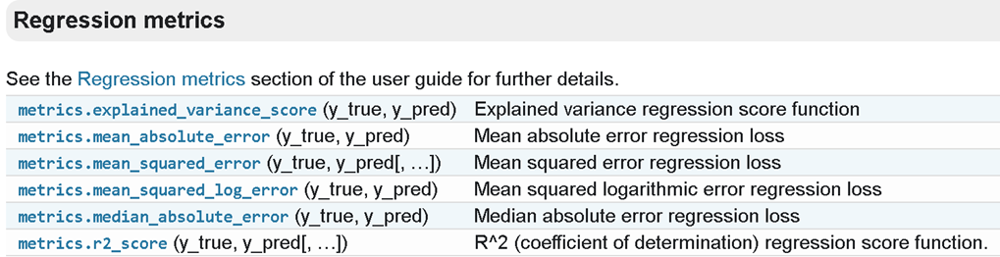
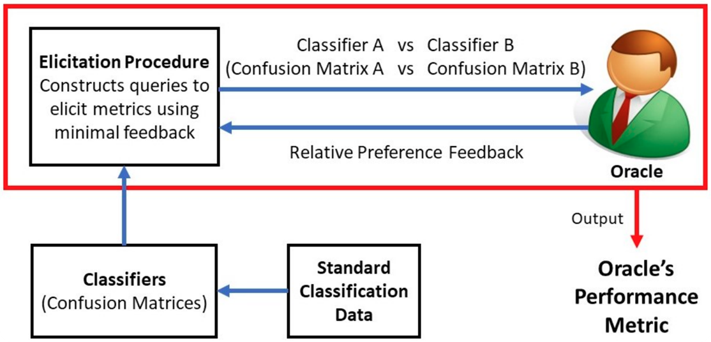

## 1. Evaluating Models

  <ul>
    
    <li style="font-size: medium;">94.1% Accuracy</li>
    <li style="font-size: medium;">90% false positives</li>
    <li style="font-size: medium;">5% false negatives</li>
  </ul>
  <ul>
    
    <li style="font-size: medium;">89.6% Accuracy</li>
    <li style="font-size: medium;">50% false positives</li>
    <li style="font-size: medium;">1% false negatives</li>
  </ul>
  <ul>
    
    <li style="font-size: medium;">80.1% Accuracy</li>
    <li style="font-size: medium;">10% false positives</li>
    <li style="font-size: medium;">20% false negatives</li>
  </ul>

<ul style="margin-top: 20px;">
  <li>What are the tradeoffs of the 3 binary classifiers above? Which would you choose?</li>
  <li>You'll realize that it depends on the context in which the classifier is being used.</li>
  <li>In the case of cancer diagnosis, a false negative could result in death. However, in the context of recidivism prediction, a false positive means unjustly putting someone behind bars for too long.</li>
</ul>

## 1. Evaluating Models

<ul>
  <li>When evaluating models, we need to consider the relative cost/benefit of different kinds of errors.</li>
  <li>The <b>metric</b> is a quantitative description of tradeoffs.</li>
  <li>For many tasks in regression and classification, a variety of popular metrics are available off the shelf.</li>
</ul>

## 1. Evaluating Models
<ul>
  <li>One must be careful in choosing the appropriate metrics for a given task. Metrics are not exchangeable because different metrics evaluate different areas of model performance.</li>
  <li>Cremonesi, Koren, Turrin (2010) found that the RMSE metric used for evaluating models submitted to the Netflix Prize competition did not translate well to top-N ranking accuracy which more directly impacts what users see.</li>
  <li>In some cases, metrics can even be contradictory. The COMPAS model used to predict rescindivism in criminal cases was calibrated on equal accuracy across demographic groups. However, an analysis by ProPublica found "blacks are almost twice as likely as whites to be labeled a higher risk but not actually re-offend," despite the calibration.</li>
</ul>

## 2. Metric Elicitation through Preferences

<ul>
  <li>Determining metrics by interacting with individual stakeholders</li>
  <ul>
    <li>Hiranandani et al. "Performance metric elicitation from pairwise classifier comparisons."</li>
    <li>Hiranandani et. al "Multiclass Performance Metric Elicitation"</li>
    <li>Hiranandani et. al., "Fair Performance Metric Elicitation"</li>
  </ul>
  <li>Metric elicitation from stakeholder groups</li>
  <ul>
    <li>Robertson et. al., "Probabilistic Performance Metric Elicitation</li>
  </ul>
</ul>

## 2. Metric Elicitation through Preferences
<ul>
  <li>Preference elicitation is studied in economics and psychology (Samuelson, 1938; Varian, 2005)</li>
  <li>Elicitation is related to (contextual dueling) bandits, when focused on recovering reward function (Yue et. al. 2012; Dudik et. al. 2015)</li>
  <li>Inverse reinforcement learning generalizes elicitation when reward is transportable (Amin, 2017)</li>
</ul>

## 2. Metric Elicitation through Preferences

<ul>
  <li>We study work by Hiranandani et al. (YEAR) about eliciting linear binary classification metrics in the noise-free setting.</li>
  <li>Assume we have a data generating distribution $\mathcal{P}$ across the space of inputs $X$ and outputs $Y\in\{0, 1\}$. The set of all classifiers is denoted by $\mathcal{H}=\{h:X\mapsto [0, 1]\}$. For a given classifier $h$, its confusion matrix entries $\mathbf{C}(h)$ are</li>
  <ul>
    <li>$TP=\Pr(Y=1, h=1)$</li>
    <li>$FP=\Pr(Y=0, h=1)$</li>
    <li>$FN=\Pr(Y=1, h=0)$</li>
    <li>$TN=\Pr(Y=0, h=0)$</li>
  </ul>
</ul>

## 2. Metric Elicitation through Preferences
<ul>
  <li>The metric used by the <b>oracle</b> to evaluate a classifier $h$ is given by $$\phi^*(h)=1-(a_1^* FP(h) + a_2^* FN(h)).$$</li>
  <li>We do not know $a_1^*$ and $a_2^*$ (which weigh the relative cost of errors between FP and FN) a priori. The objective is to find $\text{argmax}_h \phi^*(h)$ by querying the oracle with pairs of classifiers confusion matrices $\mathcal{C}(h_1), \mathcal{C}(h_2)$ upon which the oracle returns the preferred classifier w.r.t. $\phi^*$. Ideally, we want to minimize the number of queries used (i.e., the query/sample complexity).</li>
</ul>

## 2. Metric Elicitation through Preferences

<ul>
  <li>The above plot illustrates the region of attainable $TP$ and $TN$ values across all classifiers ($\mathcal{H}$). We note that given $TP$ and $TN$, $FN$ and $FP$ are derivable independent of classifier so there are $2$ degrees of freedom.</li>
  <li>The region can be shown to be convex. Since $\phi^*$ is a linear function on it, the optimal classifier must lie on the boundary!</li>
</ul>

## 2. Metric Elicitation through Preferences

<ul>
  <li>As a result, we unroll the boundary and use a binary search style algorithm to construct queries for the oracle.</li>
  <li>The authors found that the resulting classifier was guaranteed to be $\epsilon$-accurate in $O(\log \frac{1}{\epsilon})$ queries. This was true even under system noise (e.g., noisy responses from the oracle using probabilistic extensions).</li>
  <li>Work that came after extended to multiclass classification, more complex metrics, and stakeholder groups.</li>
</ul>