## Overview

*Machine Learning from Human Preferences* explores the challenge of efficiently and effectively eliciting preferences from individuals, groups, and societies and embedding them within AI systems.

## Overview

We focus on **statistical and conceptual foundations** and **strategies for interactively querying humans** to elicit information that improves learning and applications.

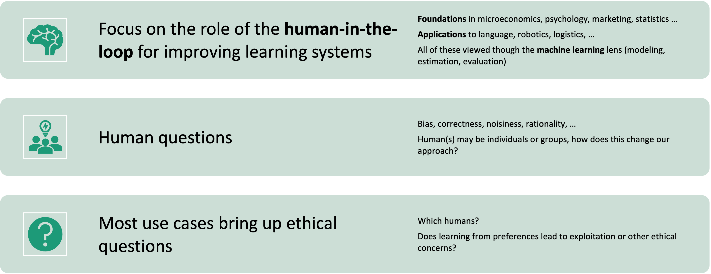{fig-align="center" width="80%"}

## Overview

This class is not exhaustive!

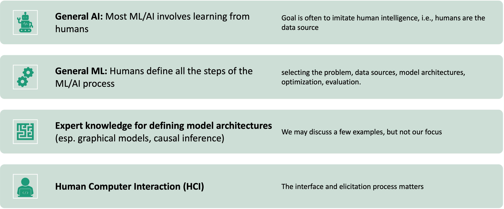{fig-align="center" width="85%"}

## Overview

Feedback can be included at any step of training

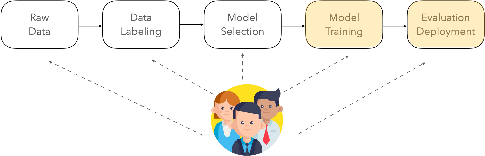{fig-align="center" width="75%"}

::: {.attribution}
@wang2021putting. Slides modified from Diyi Yang.
:::

## Overview

Feedback-Update Taxonomy

::: {.smaller}
|  | Dataset Update | Loss Function Update | Parameter Space Update |
|--|----------------|----------------------|------------------------|
| **Domain** | Dataset modification, Augmentation, Preprocessing, Data generation from constraint, Fairness, weak supervision, Use unlabeled data, Check synthetic data | Constraint specification, Fairness, Interpretability, Resource constraints | Model editing, Rules, Weights, Model selection, Prior update, Complexity |
| **Observation** | Active data collection, Add data, Relabel data, Reweighting data, collecting expert labels, Passive observation | Constraint elicitation, Metric learning, Human representations, Collecting contextual information, Generative factors, concept representations, Feature attributions | Feature modification, Add/remove features, Engineering features |
:::

::: {.attribution}
@Chen2023Perspectives. Slides modified from Diyi Yang.
:::

## Examples: Natural Languages

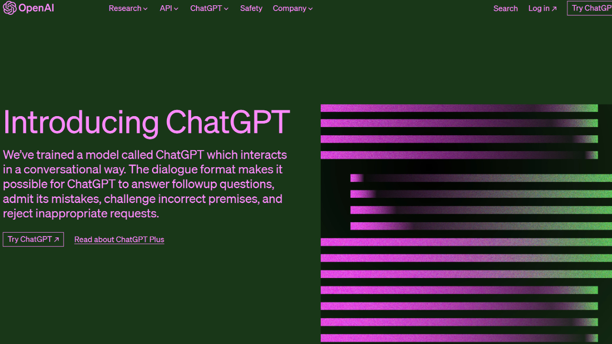{fig-align="center" width="70%"}

## Examples: Natural Languages

Builds on research studying human feedback in language

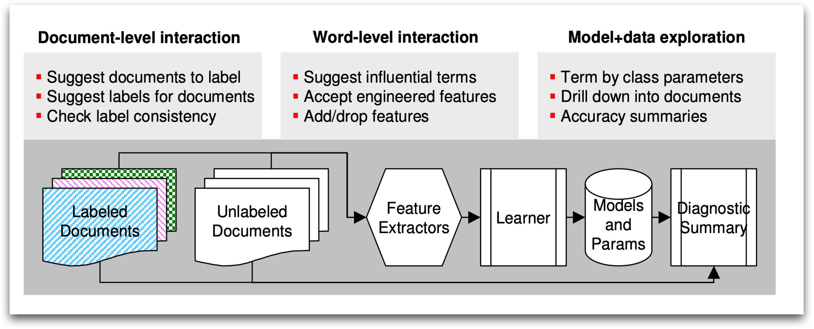{fig-align="center" width="75%"}

[@harpale2004document]{.citation}

## Examples: Natural Languages

:::: {.columns}
::: {.column width="50%"}
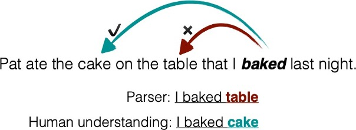
:::
::: {.column width="50%"}
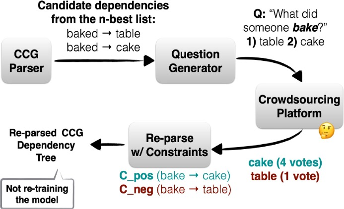
:::
::::

[@he2016human]{.citation}

## Examples: Natural Languages

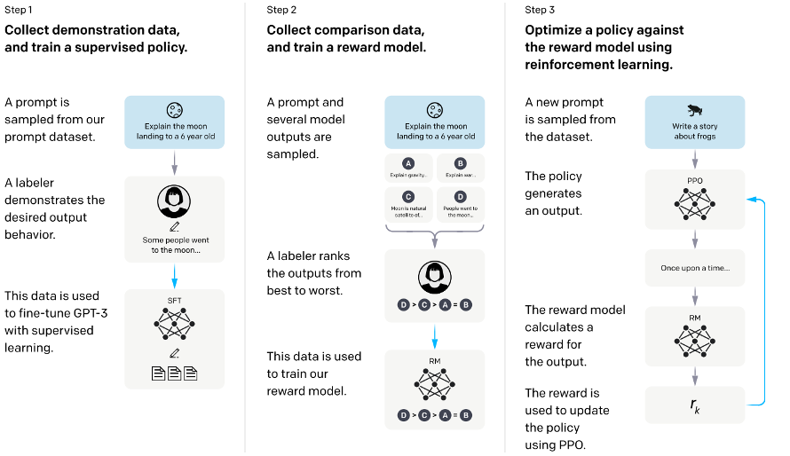{fig-align="center" width="85%"}

[@ouyang2022training]{.citation}

## Examples: Natural Languages

OpenAI Experiments with RLHF

:::: {.columns}
::: {.column width="40%"}
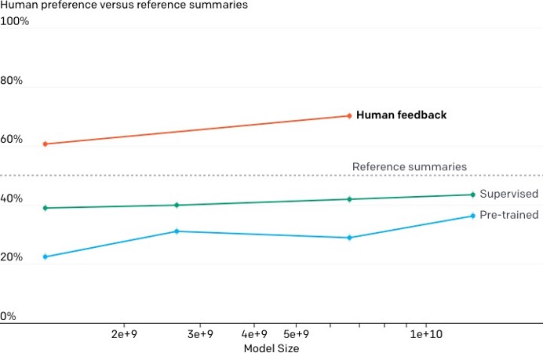
:::
::: {.column width="60%"}

:::
::::

[@stiennon2020learning]{.citation}

## Motivation

- Provides a mechanism for gathering signals about correctness that are difficult to describe via data or cost functions, e.g., what does it mean to be funny?
- Provides signals best defined by stakeholders, e.g., helpfulness, fairness, safety training, and alignment.
- Useful when evaluation is easier than modeling ideal behavior.
- Sometimes, we do not care about human preferences per se; we care about fixing model mistakes.

## Motivation

We have not figured out how to do it quite right, or we need new approaches

- Human preferences data reflects human biases, such as length and authoritative tone.
- Human preferences can be unreliable, e.g., reward hacking in RL.

:::: {.columns}
::: {.column width="45%"}
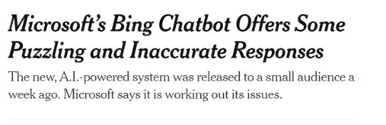
:::
::: {.column width="55%"}

:::
::::

## Ethical Issues

- Labeling often depends on low-cost human labor
- The line between economic opportunity and employment is unclear
- May cause psychological issues for some workers

{fig-align="center" width="60%"}

## Ethical Issues

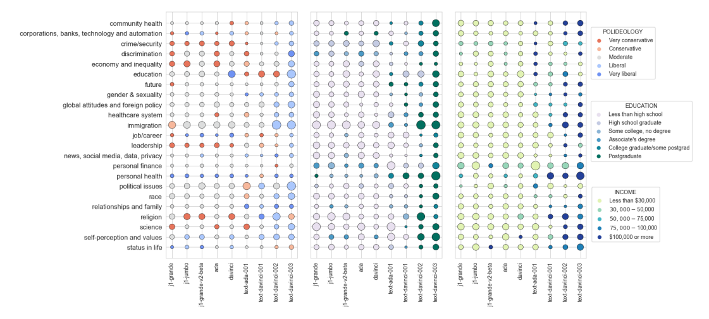

[@santurkar_whose_2023]{.citation}

## Examples: Dueling Bandits

Personalize therapy

:::: {.columns}
::: {.column width="50%"}
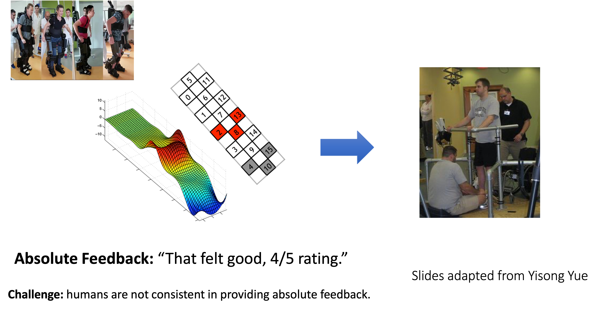
:::
::: {.column width="50%"}
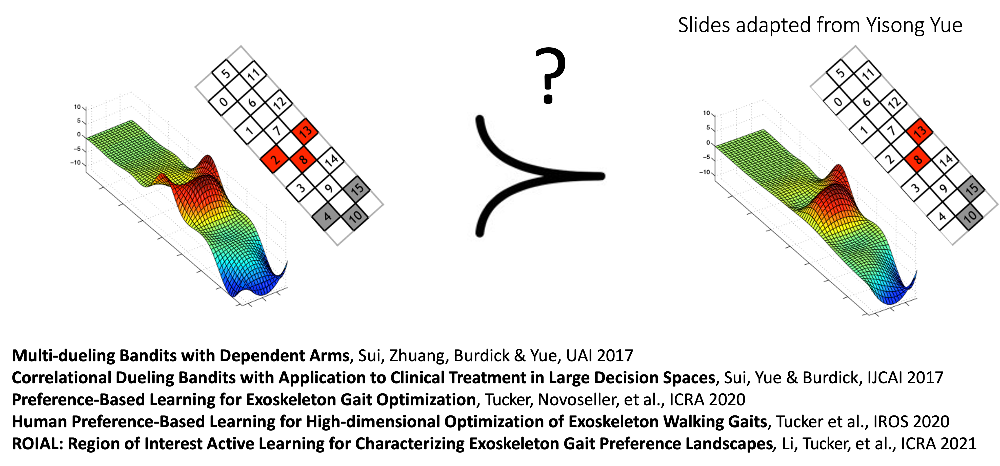
:::
::::

## Examples: Metric Elicitation

- Determine the fairness and performance metric by interacting with individual stakeholders [@NEURIPS2019_1fd09c5f; @pmlr-v89-hiranandani19a]
- Metric elicitation from stakeholder groups [@robertson2023probabilistic]

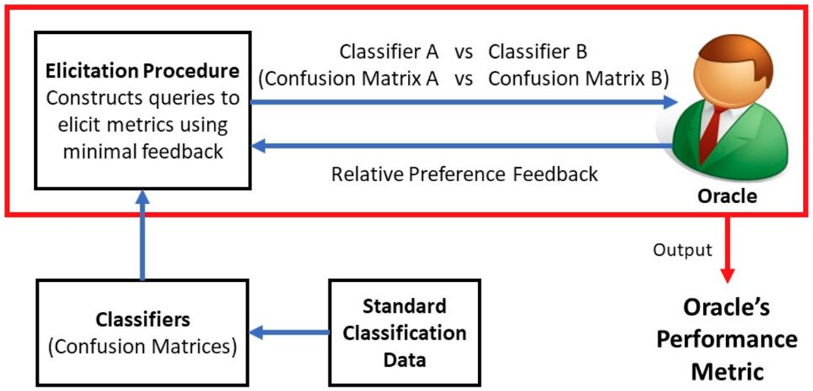{fig-align="center" width="25%"}

## Examples: Metric Elicitation

Why elicit metric preferences?

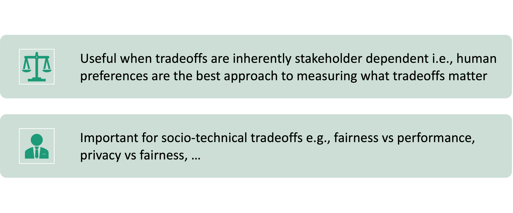

## Examples: Inverse RL

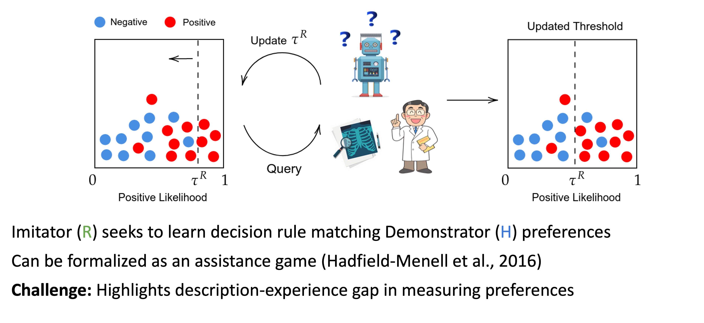

[@robertson2023cooperative]{.citation}

## Examples: Recommender Systems

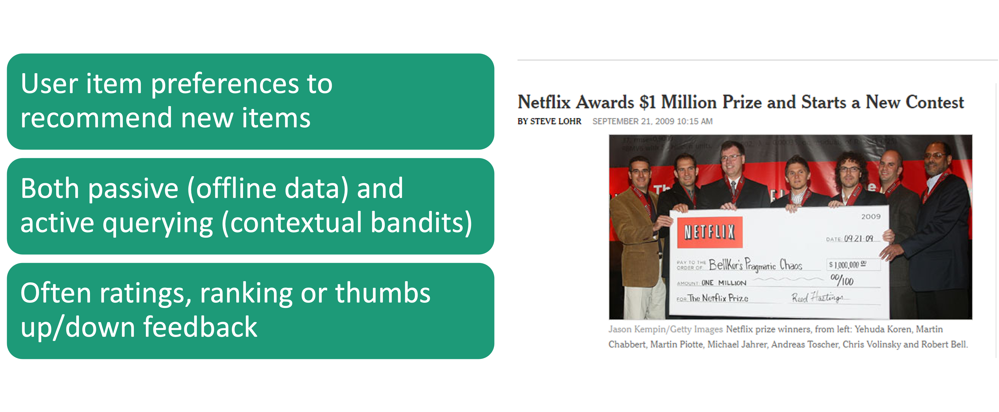

## Examples: RLHF

:::: {.columns}
::: {.column width="50%"}
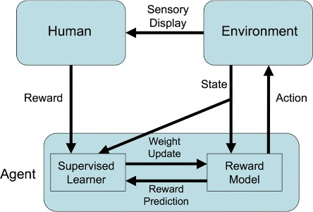

[@Tamer]{.citation}
:::
::: {.column width="50%"}
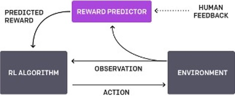

[@christiano2017deep]{.citation}
:::
::::

## Examples: Inverse RL

Flying helicopters using imitation learning and inverse reinforcement learning (IRL)



[@coates2008learning]{.citation}

## Examples: Inverse RL

:::: {.columns}
::: {.column width="50%"}

:::
::: {.column width="50%"}

:::
::::

[@pmlr-v87-biyik18a]{.citation}

## Examples: Inverse RL



[@biyik2022aprel]{.citation}

## Examples: Inverse RL

Reward hacking



## Tradeoffs

Design of tools for eliciting feedback from humans often has to tradeoff several factors

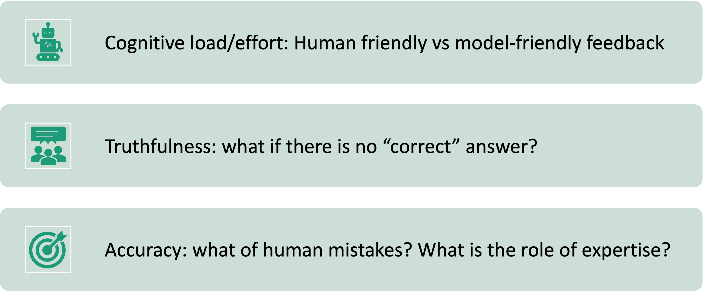

## Key Assumptions & Discussion

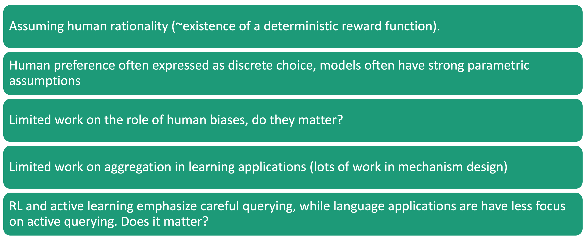

## Book Structure

::: {.smaller}
| Part | Focus | Chapters |
|------|-------|----------|
| **Part 1: Foundations** | Mathematical groundwork for preference modeling | Ch 1: Foundations |
| **Part 2: Learning** | How to learn from and act on preferences | Ch 2: Learning, Ch 3: Elicitation, Ch 4: Decisions |
| **Part 3: Society** | Aggregating preferences and whose preferences count | Ch 5: Aggregation, Ch 6: Whose? |
| **Conclusion** | Open challenges | Ch 7: Conclusion |
:::

## Chapter Overview

::: {.smaller}
- **Ch 1 -- Foundations:** Random preference models, Bradley-Terry, IIA axiom, DPO derivation
- **Ch 2 -- Learning:** MLE, Bayesian inference, Elo ratings, regularization, LLM preference learning
- **Ch 3 -- Elicitation:** Fisher information, optimal query selection, active DPO
- **Ch 4 -- Decisions:** Thompson Sampling, dueling bandits, preferential Bayesian optimization, CIRL
- **Ch 5 -- Aggregation:** Arrow's theorem, social choice theory, Borda-DPO connection, Community Notes, mechanism design
- **Ch 6 -- Whose?:** Fairness, value judgments, AI alignment, human-centered design
- **Ch 7 -- Conclusion:** Open challenges
:::

## Reading Pathways

::: {.smaller}
| Pathway | Chapters | Audience |
|---------|----------|----------|
| **Practitioners / Applied AI** | 1, 2, 4 | Early graduate ML course |
| **Discrete Choice Background** | Skim 1, study 2 & 4 | Economics, IO, demand models |
| **ML-Heavy** | 2, 3, 4 | Deep learning course |
| **Society & Theory** | 1, 5, 6 | Computation and society course |

Chapter 1 is foundational to all pathways.
:::

## Logistics: Course Goals

- **Part 1 -- Foundations:** Preference models, Bradley-Terry, IIA, utility theory
- **Part 2 -- Learning:** Parameter estimation, active elicitation, sequential decisions, bandits
- **Part 3 -- Society:** Social choice theory, aggregation, fairness, AI alignment
- **Applications throughout:** Recommender systems, language models, reinforcement learning
- **Approach:** Breadth across foundations, learning methods, and societal considerations

## Logistics: Prerequisites

CS 221, CS 229, or equivalent. You are expected to:

- Be proficient in Python and LaTeX. Most homework and projects will include a programming component.
- Be comfortable with machine learning concepts, such as train and test set, model fitting, function class, and loss functions.

## Logistics: Books

Our textbook is available online at: [mlhp.stanford.edu](https://mlhp.stanford.edu)

## Next Topics

Chapter 1: Foundations (Preference Models)

## Welcome to CS329H!
