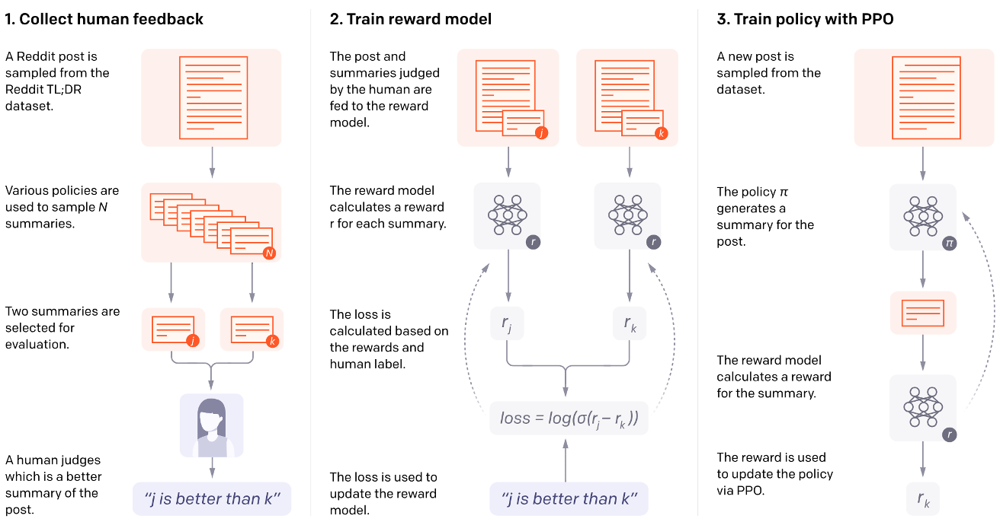
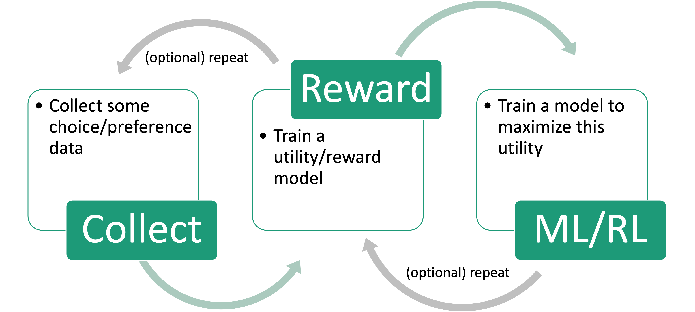
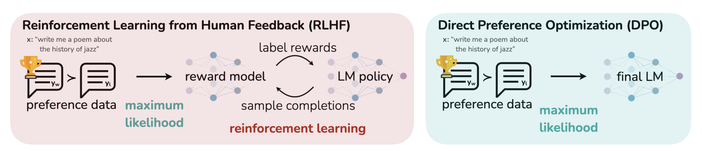
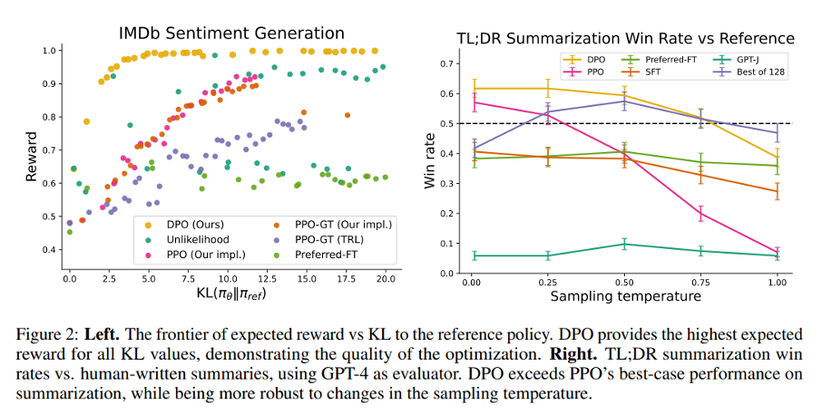

## Overview

- This chapter lays the theoretical foundation for modeling and predicting choice behavior
- Historical roots: Thurstone (1920s), Luce (1959), Bradley & Terry (1952), McFadden (Nobel 2000)
- Central question: **Why is the Bradley-Terry model a reasonable assumption? Where does it come from? When does it fail?**

{fig-align="center" width="45%"}

## Preference Learning Across ML

Preference data appears throughout machine learning:

- **Recommender systems**: clicks, purchases, ratings reveal $A \succ B$
- **Information retrieval**: search click on result 3 $\Rightarrow$ preferred over results 1, 2
- **Robotics & control**: preferences over trajectories (smooth > jerky)
- **Language model alignment**: annotators compare candidate outputs
- **Game playing**: Elo ratings = Bradley-Terry model for match outcomes

Despite the diversity, all share a common mathematical structure: **pairwise comparisons** or **choices from sets** that reveal underlying preferences.

## Application: Marketing & Recommender Systems

- Predict demand for new products before production
- What features affect a car purchase?

{fig-align="center" width="55%"}

## Application: Economics & Transportation

- **Microeconomics**: Random Utility Theory; McFadden: 2000 Nobel Prize
- **Transportation**: Predicted BART demand before it was built

:::: {.columns}
::: {.column width="50%"}
{width="60%"}
:::
::: {.column width="50%"}
{width="60%"}
:::
::::

## Application: RL, Robotics, and Language Models

- **Robotics**: Preferences over trajectories guide policy learning
- **LLM alignment**: Human feedback drives RLHF and DPO
- **Game playing**: Elo $\equiv$ Bradley-Terry for match outcomes

{fig-align="center" width="35%"}

::: {.citation-center}
https://openai.com/research/learning-to-summarize-with-human-feedback
:::

## Running Example: LLM Alignment

Modern LLMs are trained in two phases:

1. **Pretraining**: Next-token prediction (cross-entropy loss)
    - Proper scoring rule $\Rightarrow$ calibrated probabilities
    - Produces capable models, but not aligned ones

2. **Posttraining (Alignment)**: Learn which outputs humans prefer
    - **RLHF**: Collect preferences $\rightarrow$ train reward model $\rightarrow$ optimize policy
    - **DPO**: Skip explicit reward model, optimize directly on preferences

## RLHF Pipeline

{fig-align="center" width="60%"}

Three steps:

1. **Collect preference data**: Sample pairs of responses, ask which is better
2. **Train a reward model**: $r_\phi(x, y)$ predicts human preference
3. **Optimize the policy**: Fine-tune LM to maximize reward (with KL constraint)

## Random Preferences

- Items $j \in \{1, \ldots, M\}$ (products, trajectories, LM responses)
- Preferences: **random draws** of total orders $\prec$ (total + transitive)
- Full distribution: $(M!-1)$-dimensional vector

| $M$ | Parameters ($M!-1$) |
|-----|---------------------|
| 3   | 5                   |
| 4   | 23                  |
| 10  | 3,628,799           |

**Goal**: Reduce this complexity $\Rightarrow$ IIA collapses it to $M$ parameters

## Why Stochastic Preferences?

- **Deterministic preferences** are clean but fail with noisy data
- Even with randomness, assumptions like transitivity and IIA are strong yet practical

Three interpretations of randomness:

1. **Heterogeneity**: Different decision-makers have different utilities (Economics/IO view)
2. **Bounded rationality**: Errors in optimizing utilities (Behavioral view)
3. **Designer belief**: Uncertainty about true preferences (Bayesian view)

## Types of Comparison Data (1)

**Full preference lists**: $L = (j_1, j_2, \ldots, j_M)$ where $j_1 \succ j_2 \succ \cdots \succ j_M$

- Most informative, but cognitive load is high

**Choices from subsets**: $(j, \mathcal{S})$ — $j$ is the best from subset $\mathcal{S}$

$$
p(j \mid \mathcal{S}) = \sum_{\prec: j \succ k \; \forall k \in \mathcal{S} \setminus \{j\}} p(\prec)
$$

**Binary comparisons**: $\mathcal{S} = \{j, j'\}$, write $Y_{jj'} = 1$

- Convenient, quick to elicit
- Prominently used in LLM finetuning and evaluation

## Types of Comparison Data (2)

**Item-wise responses**: $Y_{ij} \in \{0,1\}$ — user $i$'s response to item $j$

- $Y_{ij} = 1$: acceptance (like, purchase, engagement)
- $Y_{ij} = 0$: rejection

Examples: e-commerce purchases, streaming play/skip, dating swipes, content moderation

**Outside option**: Accept/reject framing with item $0$

- $Y_{j0} = 1$: accepting item $j$
- $Y_{j0} = 0$: rejecting item $j$

## The Response Matrix

$N$ users $\times$ $M$ items yields an $N \times M$ **response matrix** $Y$ with entries $Y_{ij} \in \{0, 1\}$:

$$
Y = \begin{bmatrix} Y_{11} & \cdots & Y_{1M} \\ \vdots & \ddots & \vdots \\ Y_{N1} & \cdots & Y_{NM} \end{bmatrix}
$$

- **Item-wise**: every user-item interaction is one data point — $O(M)$ per user
- **Pairwise**: $O(M^2)$ possible comparisons — more expensive to collect

## Comparison Data Across Domains

| Domain | Data Type | Example |
|--------|-----------|---------|
| Recommender systems | Choice from set | Sees $\{A,B,C\}$, clicks $B$ |
| Information retrieval | Implicit pairwise | Click result 3 $\Rightarrow$ pref. over 1, 2 |
| LLM alignment | Binary comparison | Annotator: $A \succ B$ |
| Sports/Chess | Pairwise | Player $j$ beats $k$ |
| Streaming | Item-wise | Play (1) or skip (0) |

Goal: learn the underlying utility function from observed choices.

---

## Deterministic Utility Models

When different users have different preferences, we need both **user** and **item** parameters:

$$
p(Y_{ij} = 1) = \sigma(H_{ij}), \quad H_{ij} = f(U_i, V_j)
$$

- $U_i$: user $i$'s characteristics
- $V_j$: item $j$'s characteristics
- Stochasticity enters through Bernoulli sampling $Y_{ij} \sim \text{Bernoulli}(\sigma(H_{ij}))$
- The function $f$ and dimensionality of $U_i, V_j$ define different model families

## The Rasch Model

The simplest factor model — $f$ is additive:

$$
p(Y_{ij} = 1 \mid U_i, V_j) = \sigma(U_i + V_j)
$$

- $U_i \in \mathbb{R}$: **user appetite** — general tendency to accept items
    - High $U_i$: enthusiastic user; Low $U_i$: selective user
- $V_j \in \mathbb{R}$: **item appeal** — how universally appealing item $j$ is
    - High $V_j$: crowd-pleaser; Low $V_j$: niche item
- Acceptance depends only on the **sum** $U_i + V_j$

## Rasch Implies Bradley-Terry

For a **single user**, the Rasch model implies Bradley-Terry for pairwise comparisons:

$$
p(j \succ k \mid i) = \sigma((U_i + V_j) - (U_i + V_k)) = \sigma(V_j - V_k)
$$

The user-specific parameter $U_i$ **cancels out**!

::: {.smaller}
| Data Type | What It Reveals | Parameters Identified |
|-----------|-----------------|----------------------|
| Pairwise $(j \succ k)$ | Item differences only | $V_j - V_k$ (up to constant) |
| Item-wise $(Y_{ij})$ | User appetites + item appeals | $U_i$ and $V_j$ (up to constant) |
:::

This explains why recommender systems use item-wise data (clicks, purchases) while ranking systems (chess, LLM eval) can use pairwise comparisons.

## K-Dimensional Factor Models: Dot-Product

Rasch assumes 1D — users might love action but dislike romance.

**Logistic factor model:** $H_{ij} = U_i^\top V_j + Z_j$

- $U_i \in \mathbb{R}^K$: **user embedding**; $V_j \in \mathbb{R}^K$: **item embedding**
- $Z_j \in \mathbb{R}$: item offset (baseline popularity)
- Dot product measures user-item alignment; $K = 1$ reduces to Rasch

Foundation of Netflix Prize, collaborative filtering, two-tower models.

## K-Dimensional Factor Models: Ideal Point

**Ideal point model**: users prefer items **close** to their ideal point:

$$
H_{ij} = -\|U_i - V_j\|_2 + Z_j
$$

- Users and items live in the same $K$-dimensional space
- Pros: Can learn preferences faster by exploiting geometry
- Cons: Embedding assumption may be strong; must select distance function

Natural for: political preferences (voters vs. candidates), music taste, product specs

::: {.citation}
[@jamieson2011active]{.citation}; [@tatli2022learning]{.citation}
:::

## Two Views of Stochastic Choice

:::: {.columns}
::: {.column width="50%"}
**Deterministic utility** (Latent variable):

- $H_{ij} = f(U_i, V_j)$ — fixed
- Randomness in $Y_{ij} \sim \text{Bernoulli}(\sigma(H_{ij}))$
- "User has fixed preferences; responses are noisy"
:::
::: {.column width="50%"}
**Stochastic utility** (Random utility):

- $\tilde{H}_{ij} = f(U_i, V_j) + \varepsilon_{ij}$
- Choice: $j \succ k \iff \tilde{H}_{ij} \gt \tilde{H}_{ik}$
- "User's utility evaluation fluctuates"
:::
::::

Both yield $p(j \succ k \mid i) = \sigma(V_j - V_k)$ for additive $f$ — **observationally equivalent** for pairwise data.

## Stochastic Utility Models

**Random utility**: $\tilde{H}_j = V_j + \varepsilon_j$

- $V_j$: **mean utility** (deterministic)
- $\varepsilon_j$: **noise** (stochastic), typically independent across items

Three interpretations of noise:

1. **Heterogeneity** of decision-makers (Economics/IO)
2. **Errors** in optimization of utilities (Bounded Rationality)
3. **Designer's belief** about preferences (Bayesian)

The key simplifying assumption: when $\varepsilon_j$ are i.i.d. $\Rightarrow$ **IIA**

## Binary Choice Models

**Binary choice with individual attributes**

$$
\begin{cases}
U_n = \beta s_n + \epsilon_n \\
y_n =
    \begin{cases}
    1 & U_n \gt 0 \\
    0 & U_n \leq 0
    \end{cases}
\end{cases}
$$

- $\epsilon \sim$ Logistic: $P_{n1} = \frac{1}{1 + \exp(-\beta s_n)}$
- $\epsilon \sim$ Standard Normal (probit): $P_{n1} = \Phi(\beta s_n)$

## Bradley-Terry Model

**Utility depends on alternative attributes with extreme value noise:**

$$
\begin{cases}
U_{n1} = \beta z_{n1} + \epsilon_{n1} \\
U_{n2} = \beta z_{n2} + \epsilon_{n2} \\
\epsilon_{n1}, \epsilon_{n2} \sim \text{iid extreme value}
\end{cases}
$$
$$
\Rightarrow \quad P_{n1} = \frac{\exp(\beta z_{n1})}{\exp(\beta z_{n1}) + \exp(\beta z_{n2})} = \frac{1}{1 + \exp(-\beta (z_{n1} - z_{n2}))}
$$

- Gaussian noise alternative: $P_{n1} = \Phi(\beta (z_{n1} - z_{n2}))$

## Multiple Alternatives (Softmax)

**With $J$ alternatives and extreme value noise:**

$$
\begin{cases}
U_{ni} = \beta z_{ni} + \epsilon_{ni} \\
\epsilon_{ni} \sim \text{iid extreme value}
\end{cases} \quad \Rightarrow \quad P_{ni} = \frac{\exp(\beta z_{ni})}{\sum_{j=1}^{J} \exp(\beta z_{nj})}
$$

- Equivalent to multiclass logistic regression (multinomial logit)
- Can also replace noise model with Gaussians (multinomial probit)

## Plackett-Luce (Rankings)

The Plackett-Luce model extends to **full rankings** as a sequence of choices:

$$
Pr(\text{ranking } 1, 2, \dots, J) = \prod_{m=1}^{J-1} \frac{\exp(\beta z_m)}{\sum_{j=m}^{J} \exp(\beta z_{nj})}
$$

- Also known as: rank ordered logit, exploded logit
- All extensions apply: nonlinear utility, correlated noise, etc.

## Estimation

- **Linear case**: Maximum likelihood estimators (logistic and probit regression)
- **Complex function classes**: Regularized ML with SGD
- **Standard tradeoffs**: Bias-variance tradeoff
    - More complex models generally require more data
    - Most ML applications pool data across individuals whose differences may matter

---

### Why DPO? {.auto-animate}

{fig-align="center" width="65%"}

- RLHF pipeline is complex and unstable due to the reward model optimization.
- DPO is more stable and can be used to optimize the reward model directly.

[@rafailov2023direct]{.citation}

---

### DPO: Bradley-Terry model {.auto-animate}

- Given prompt $x$ and completions $y_w$ and $y_l$ the choice model gives the preference

$$
p^*(y_w \succ y_l \mid x) = \frac{\exp(r^*(x, y_w))}{\exp(r^*(x, y_w)) + \exp(r^*(x, y_l))}
$$

where $r^*(x, y)$ is some latent reward model that we do not have access to (i.e., the human preference)

---

### DPO: Bradley-Terry model {.auto-animate}

Luckily, we can use parameterize the reward model with some neural networks with parameters $\phi$:

Let us start with the Reward Maximization Objective in RL:
$$
\max_{\pi_\theta} \mathbb{E}_{x \sim \mathcal{D}, y \sim \pi_\theta(y|x)} [r_\phi(x, y) - \beta D_{KL}(\pi_\theta(y|x) \| \pi_{\text{ref}}(y|x))]
$$

::: {.fragment}
- Where $\pi_\theta(y|x)$ is the language model, and $\pi_{\text{ref}}(y|x)$ is the reference model (e.g., the language model before fine-tuning)
:::

---

### {.auto-animate}

$$
\max_{\pi_\theta} \mathbb{E}_{x \sim \mathcal{D}, y \sim \pi_\theta(y|x)} [r_\phi(x, y) - \beta D_{KL}(\pi_\theta(y|x) \| \pi_{\text{ref}}(y|x))]
$$

Recall the definition of KL divergence:
$$
D_{KL}(p \| q) = \sum_{x \in \mathcal{X}} p(x) \log \frac{p(x)}{q(x)} = \mathbb{E}_{x \sim \mathcal{X}} \left[ \log \frac{p(x)}{q(x)} \right]
$$

---

### {.auto-animate}

Substituting the KL divergence, we can rewrite the objective as:
$$
\begin{aligned}
&\max_{\pi_\theta} \mathbb{E}_{x \sim \mathcal{D}, y \sim \pi_\theta(y|x)} \left[ r_\phi(x, y) - \beta \mathbb{E}_{y \sim \pi_\theta(y|x)} \left[\log \frac{\pi_\theta(y|x)}{\pi_{\text{ref}}(y|x)} \right] \right]\\
&=\max_{\pi_\theta} \mathbb{E}_{x \sim \mathcal{D}} \mathbb{E}_{y \sim \pi_\theta(y|x)} \left[ r_\phi(x, y) - \beta \log \frac{\pi_\theta(y|x)}{\pi_{\text{ref}}(y|x)} \right]
\end{aligned}
$$

---

### {.auto-animate}

Then, we can continue to derive the objective as:
$$
\begin{aligned}
    &\max_{\pi_\theta} \mathbb{E}_{x \sim \mathcal{D}} \mathbb{E}_{y \sim \pi_\theta(y|x)} \left[ r_\phi(x, y) - \beta \log \frac{\pi_\theta(y|x)}{\pi_{\text{ref}}(y|x)} \right] \\
    &\propto \min_{\pi_\theta} \mathbb{E}_{x \sim \mathcal{D}} \mathbb{E}_{y \sim \pi_\theta(y|x)} \left[ \log \frac{\pi_\theta(y|x)}{\pi_{\text{ref}}(y|x)} - \frac{1}{\beta} r_\phi(x, y) \right]\\
    &= \min_{\pi_\theta} \mathbb{E}_{x \sim \mathcal{D}} \mathbb{E}_{y \sim \pi_\theta(y|x)} \left[ \log \frac{\pi_\theta(y|x)}{\frac{1}{Z(x)} \pi_{\text{ref}}(y|x) \exp\left(\frac{1}{\beta} r_\phi(x, y)\right)} - \log Z(x) \right]
\end{aligned}
$$
where $Z(x) = \sum_{y} \pi_{\text{ref}}(y|x) \exp\left(\frac{1}{\beta} r_\phi(x, y)\right)$

---

### {.auto-animate}

Because $Z(x)$ is a constant with respect to $\pi_\theta$, we can define:
$$
\pi^*(y|x) = \frac{1}{Z(x)} \pi_{\text{ref}}(y|x) \exp\left(\frac{1}{\beta} r_\phi(x, y)\right)
$$

Then, we can rewrite the optimization problem as:
$$
\begin{aligned}
&\min_{\pi_\theta} \mathbb{E}_{x \sim \mathcal{D}} \mathbb{E}_{y \sim \pi_\theta(y|x)} \left[ \log \frac{\pi_\theta(y|x)}{\pi^*(y|x)} - \log Z(x) \right]\\
&\quad = \mathbb{D}_{KL}\!\left(\pi_\theta(y|x) \,\|\, \pi^*(y|x)\right) - \log Z(x)
\end{aligned}
$$

---

### {.auto-animate}

Thus, the optimal solution (i.e., the optimal language model) is:
$$
\pi_\theta(y|x) = \pi^*(y|x) = \frac{1}{Z(x)} \pi_{\text{ref}}(y|x) \exp\left(\frac{1}{\beta} r_\phi(x, y)\right)
$$

---

### {.auto-animate}

With some algebra, we can show that the optimal reward model is:
$$
\begin{aligned}
\pi_\theta(y|x) &= \frac{1}{Z(x)} \pi_{\text{ref}}(y|x) \exp\left(\frac{1}{\beta} r_\phi(x, y)\right)\\
\log \pi_\theta(y|x) &= \log \pi_{\text{ref}}(y|x) + \frac{1}{\beta} r_\phi(x, y) - \log Z(x) \text{// perform  } \log(.)\\
r_\phi(x, y) &= \beta \log \frac{\pi_\theta(y|x)}{\pi_{\text{ref}}(y|x)} + \beta \log Z(x)\\
\end{aligned}
$$

---

### {.auto-animate}

Recall the Bradley-Terry model:
$$
p_\phi(y_w \succ y_l \mid x) = \frac{\exp(r_\phi(x, y_w))}{\exp(r_\phi(x, y_w)) + \exp(r_\phi(x, y_l))}
$$

And the optimal reward model:
$$
r_\phi(x, y) = \beta \log \frac{\pi_\theta(y|x)}{\pi_{\text{ref}}(y|x)} + \beta \log Z(x)
$$

Substituting, we can rewrite the choice model as:
$$
\begin{aligned}
p_\phi(y_w \succ y_l \mid x) &= \frac{1}{1 + \exp\left( \beta \log \frac{\pi_\theta(y_l | x)}{\pi_{\text{ref}}(y_l | x)} - \beta \log \frac{\pi_\theta(y_w | x)}{\pi_{\text{ref}}(y_w | x)} \right)}\\
&= \sigma\left( \beta \log \frac{\pi_\theta(y_w | x)}{\pi_{\text{ref}}(y_w | x)} - \beta \log \frac{\pi_\theta(y_l | x)}{\pi_{\text{ref}}(y_l | x)} \right)
\end{aligned}
$$

---

### DPO: Bradley-Terry model {.auto-animate}

The reward model loss maximizes the likelihood of the choice model:
$$
\mathcal{L} (r_\theta, \mathcal{D}) = - \mathbb{E}_{(x, y_w, u_l) \sim \mathcal{D}} \left[ \log p_\phi(y_w \succ y_l \mid x) \right]
$$

---

### DPO Loss {.auto-animate}

Substituting the optimal reward, we obtain the **DPO loss**:

$$
\mathcal{L}_{DPO}(\pi_\theta; \pi_{\text{ref}}) = -\mathbb{E}_{(x, y_w, y_l) \sim D} \left[ \log \sigma\left( \beta \log \frac{\pi_\theta(y_w | x)}{\pi_{\text{ref}}(y_w | x)} - \beta \log \frac{\pi_\theta(y_l | x)}{\pi_{\text{ref}}(y_l | x)} \right) \right]
$$

[@rafailov2023direct]{.citation}

---

### {.auto-animate}

{fig-align="center" width="70%"}

---

## Independence of Irrelevant Alternatives (IIA)

IIA assumes the **relative likelihood** of choosing $j$ vs $k$ is unchanged by a third alternative $\ell$:

$$
\frac{p(j \mid \mathcal{S})}{p(k \mid \mathcal{S})} = \frac{p(j \mid \mathcal{S} \cup \{\ell\})}{p(k \mid \mathcal{S} \cup \{\ell\})}
$$

- Introduced by Luce (1959)
- Reduces $(M!-1)$ parameters to just $M$ parameters
- Makes learning feasible!

## IIA-Gumbel Equivalence

**Theorem 1**: A random utility model $H_j$ satisfies IIA **if and only if** $H_j = V_j + \varepsilon_j$ where $\varepsilon_j$ are i.i.d. **Gumbel** distributed.

- Gumbel CDF: $F(x) = e^{-e^{-x}}$

## IIA-Gumbel Equivalence: Proof Sketch

**(⇐) Gumbel $\Rightarrow$ IIA:**
$$
\frac{p(j \mid \mathcal{S})}{p(k \mid \mathcal{S})} = \frac{e^{V_j}/\sum_{\ell} e^{V_\ell}}{e^{V_k}/\sum_{\ell} e^{V_\ell}} = e^{V_j - V_k}
$$
Independent of $\mathcal{S}$ — IIA holds.

**(⇒) IIA $\Rightarrow$ Gumbel:** IIA forces multiplicative structure; only Gumbel is compatible (Yellott, 1977).

## Choice Probabilities under IIA

**Theorem 2**: Under IIA ($H_j = V_j + \varepsilon_j$, i.i.d. Gumbel), the probabilities are:

**Choices from sets (softmax):**
$$
p(j \mid \mathcal{S}) = \frac{e^{V_j}}{\sum_{k \in \mathcal{S}} e^{V_k}} = \operatorname{softmax}_j ((V_k)_{k \in \mathcal{S}})
$$

**Binary comparisons (Bradley-Terry):**
$$
p(Y_{jj'} = 1) = \sigma(V_j - V_{j'}) = \frac{1}{1 + e^{-(V_j - V_{j'})}}
$$

## Choice Probabilities under IIA (cont.)

**Full rankings (Plackett-Luce):**
$$
p(j_1 \succ \cdots \succ j_M) = \prod_{m=1}^{M-1} \frac{e^{V_{j_m}}}{\sum_{k=m}^{M} e^{V_{j_k}}}
$$

**Example**: $V = (0, 1, 2)$

- $p(3 \succ 1) = \sigma(2) \approx 0.88$
- $p(\cdot \mid \{1,2,3\}) \approx (0.09, 0.24, 0.67)$

## Many Names, One Model

All are special cases of random utility with i.i.d. Gumbel noise under IIA:

| Feedback Type | Model Name |
|--------------|------------|
| Binary comparisons | Bradley-Terry |
| Full rankings | Plackett-Luce |
| Accept/reject | Logistic regression |
| Choices from subsets | Logit model |
| Multi-class | Multinomial logit |

## IIA Justifies DPO

DPO assumes Bradley-Terry: $p(y \succ y' \mid x) = \sigma(r(x,y) - r(x,y'))$

Justified by IIA: humans compare implicit rewards with i.i.d. Gumbel noise.

**When BT fails for DPO:**

- **Context effects**: preferences depend on what other options are shown
- **Intransitive preferences**: $A \succ B \succ C \succ A$
- **Annotator disagreement**: mixture model needed

## Identification Problem

Different utility vectors can generate **identical** choice probabilities:

$$
\frac{e^{V_j + c}}{\sum_{k \in \mathcal{S}} e^{V_k + c}} = \frac{e^c \cdot e^{V_j}}{e^c \cdot \sum_{k} e^{V_k}} = \frac{e^{V_j}}{\sum_{k} e^{V_k}}
$$

**Implications:**

1. **Normalization required**: Must fix one value (e.g., $V_0 = 0$)
2. **Only differences matter**: Can only identify $V_j - V_k$, not absolute levels
3. **Connection to DPO**: The reference policy $\pi_{\text{ref}}$ provides normalization
    - Implicit reward: $r^*(x,y) = \beta \log \frac{\pi_\theta(y|x)}{\pi_{\text{ref}}(y|x)}$

## The Rashomon Effect

Even after identification, **many structurally different models** can fit data equally well. Named after Kurosawa's 1950 film.

**Example**: 100 pairwise comparisons, 5 items — all achieve 90% accuracy:

1. Bradley-Terry with utilities $(0, V_2, V_3, V_4, V_5)$
2. 2-group mixture with group-specific utilities
3. Nested logit with correlation parameters

**For alignment**: Many reward functions explain human feedback equally well — which one should we optimize?

## Connecting Item-wise and Pairwise Models

**Rasch $\rightarrow$ Bradley-Terry**: User params cancel ($U_i$ disappears)

**General factor model**: $p(j \succ k \mid i) = \sigma\left(U_i^\top (V_j - V_k) + (Z_j - Z_k)\right)$

- This is **not** standard BT — preference depends on user $U_i$!
- Different users may rank the same items differently

## When Do User Params Cancel?

User-specific parameters $U_i$ cancel when:

1. **Rasch model** (additive structure)
2. **Single user** ($N = 1$)
3. **Homogeneous population** ($U_i = U$ for all $i$)

Use BT for ranking items globally; factor models for personalization.

## IIA Limitation: Population Heterogeneity

Sub-populations satisfying IIA $\not\Rightarrow$ full population satisfies IIA

**Mixture model:**
$$
p(Y_{jj'} = 1) = \sum_{i=1}^N \alpha_i \, \sigma(V_j^{(i)} - V_{j'}^{(i)})
$$

**Intuition**: A mixture of Gumbels is not Gumbel (like a mixture of Gaussians is not Gaussian)

**Solution**: Random coefficients logit $V_j = \beta^\top x_j + \varepsilon_j$, $\beta \sim N(\mu, \Sigma)$

## IIA Limitation: Red Bus / Blue Bus

Items 1, 2 are nearly identical (red bus, blue bus); item 3 is different (train).

Under IIA with $V_1 = V_2$:

- Adding the clone **reduces** $p(\text{train} \mid \{1,2,3\})$ vs $p(\text{train} \mid \{1,3\})$
- Intuitively, demand for train should be unchanged!

**The fix**: Allow correlated noise between similar alternatives

$$
\begin{aligned}
&\bigl(p(1 \mid \{1,2,3\}),\; p(2 \mid \{1,2,3\}),\; p(3 \mid \{1,2,3\})\bigr)\\
&\quad = \left(\tfrac{p(1 \mid \{1,3\})}{2},\; \tfrac{p(2 \mid \{2,3\})}{2},\; p(3 \mid \{1,3\})\right)
\end{aligned}
$$

when errors for items 1, 2 are perfectly correlated.

## Beyond Bradley-Terry (1)

- **Probit**: Gaussian noise $\varepsilon \sim \mathcal{N}(0, \Sigma)$
    - Allows arbitrary correlations; handles red-bus/blue-bus
    - Disadvantage: no closed-form choice probabilities

- **Nested logit**: Group alternatives into "nests" with within-nest correlation
    - IIA within nests, substitution across nests

## Beyond Bradley-Terry (2)

- **Mixed logit** (random coefficients): $\beta \sim F$
    - Can approximate any random utility model [@mcfadden2000mixed]

- **Gaussian Processes**: Nonparametric, nonlinear reward $r(x) \sim \mathcal{GP}(m, k)$
    - RBF kernel: $k(x,x') = \sigma_f^2 \exp(-\|x-x'\|^2 / 2\ell^2)$
    - Useful when linear rewards are too restrictive

---

## Summary (1)

- **Preference data is ubiquitous** in ML: recommenders, IR, robotics, LLMs
- **Random preferences**: $(M!-1)$ parameters — intractable without simplification
- **IIA** reduces complexity to $M$ parameters $\Rightarrow$ i.i.d. Gumbel noise
- **Bradley-Terry**: $p(j \succ k) = \sigma(V_j - V_k)$ — arises from IIA

## Summary (2)

- **Rasch model** connects item-wise and pairwise data; user params cancel
- **DPO** assumes BT, justified by IIA; full derivation from RL objective
- **Limitations**: heterogeneity (mixtures), red-bus/blue-bus (cloning), identification, Rashomon effect
- **Extensions**: probit, nested logit, mixed logit, GPs

## References

::: {.smaller}
- [@train1986qualitative]{.citation}
- [@mcfadden2000mixed]{.citation}
- [@luce1959individual]{.citation}
- [@rafailov2023direct]{.citation}
- [@christiano2017deep]{.citation}
- Additional:
    - [@benakiva1985discrete]{.citation}
    - [@park2017nonparametric]{.citation}
    - [@jamieson2011active]{.citation}
    - [@tatli2022learning]{.citation}
    - [@yellott1977relationship]{.citation}
    - [@breiman2001statistical]{.citation}
:::
