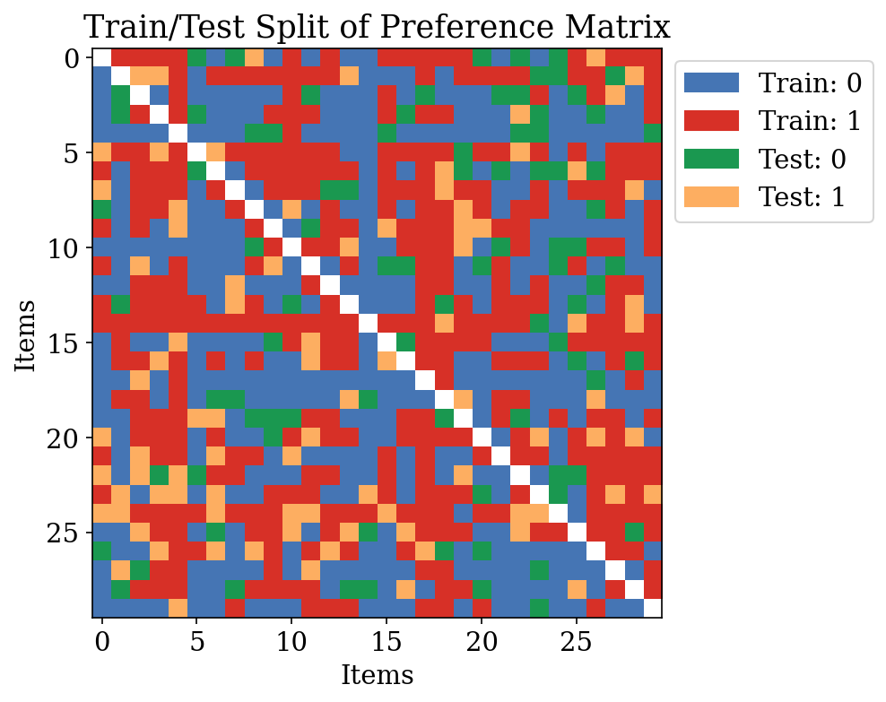
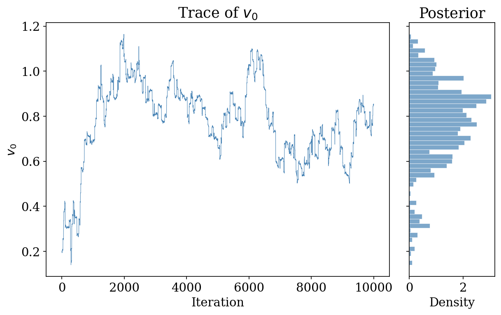
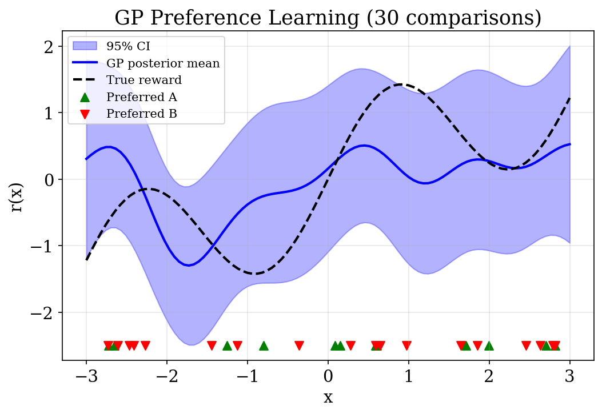
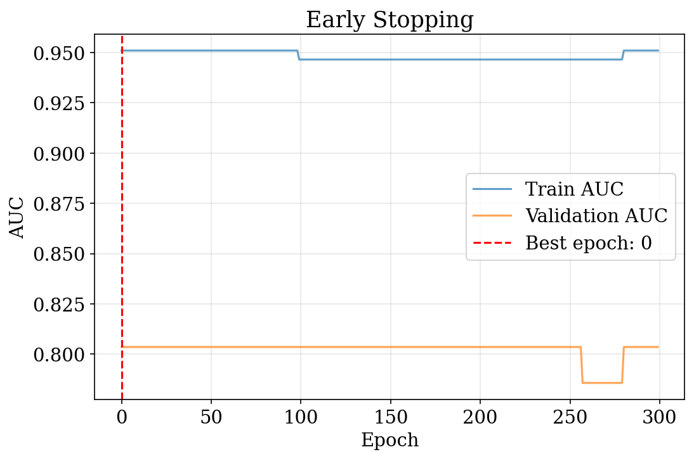
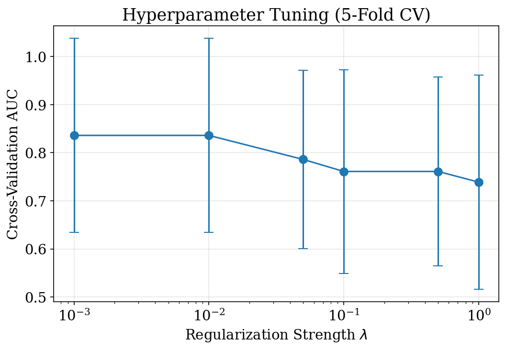
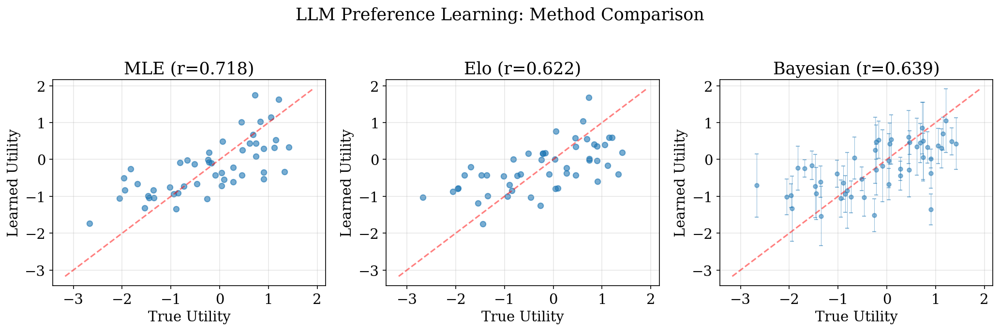

```{pyodide-python}
#| autorun: true
#| echo: false
import numpy as np
import matplotlib.pyplot as plt
plt.rcParams.update({'font.size': 12, 'figure.figsize': (7, 3.5)})

rng = np.random.default_rng(2601)
sigmoid = lambda x: 1.0 / (1.0 + np.exp(-np.clip(x, -500, 500)))

def auc_from_scores(scores, labels):
    pos, neg = scores[labels == 1], scores[labels == 0]
    if pos.size == 0 or neg.size == 0: return np.nan
    return (pos[:, None] > neg[None, :]).mean() + 0.5 * (pos[:, None] == neg[None, :]).mean()

def collect_pairs(Y):
    r, c = np.where(~np.isnan(Y)); upper = r < c
    return r[upper], c[upper], Y[r[upper], c[upper]].astype(float)

def fit_bt(r_idx, c_idx, y_obs, M, lam=0.0, lr=0.05, epochs=200):
    V = np.zeros(M)
    for _ in range(epochs):
        H = V[r_idx] - V[c_idx]; p = sigmoid(H); err = y_obs - p
        grad = np.zeros(M)
        np.add.at(grad, r_idx, err); np.add.at(grad, c_idx, -err)
        V += lr * (grad - lam * V)
    return V

# --- Main dataset (M=30 items) ---
M = 30; V_true = rng.normal(0, 1, M)
diff = V_true[:, None] - V_true[None, :]; P = sigmoid(diff)
Y_BT = np.full((M, M), np.nan)
ti = np.triu_indices(M, k=1)
wins = (rng.random(ti[0].shape[0]) < P[ti]); Y_BT[ti] = wins; Y_BT[(ti[1], ti[0])] = 1.0 - wins
tr, tc = np.triu_indices(M, k=1)
vm = ~np.isnan(Y_BT[tr, tc]); tr, tc = tr[vm], tc[vm]
n_p = tr.shape[0]; n_tr = int(0.8 * n_p)
idx = rng.choice(n_p, n_tr, replace=False)
tm = np.zeros(n_p, dtype=bool); tm[idx] = True
Y_train = np.full_like(Y_BT, np.nan); Y_test = np.full_like(Y_BT, np.nan)
rt, ct = tr[tm], tc[tm]; Y_train[rt, ct] = Y_BT[rt, ct]; Y_train[ct, rt] = 1.0 - Y_BT[rt, ct]
re, ce = tr[~tm], tc[~tm]; Y_test[re, ce] = Y_BT[re, ce]; Y_test[ce, re] = 1.0 - Y_BT[re, ce]
np.fill_diagonal(Y_train, np.nan); np.fill_diagonal(Y_test, np.nan)
r_tr_fit, c_tr_fit, y_tr_fit = collect_pairs(Y_train)
r_te_fit, c_te_fit, y_te_fit = collect_pairs(Y_test)

# --- Small dataset (M=10) for regularization demos ---
rng2 = np.random.default_rng(42); M_s = 10; V_s = rng2.normal(0, 1, M_s)
all_p = [(i,j) for i in range(M_s) for j in range(i+1, M_s)]
si = rng2.choice(len(all_p), 30, replace=False)
tp = [all_p[i] for i in si]; ep = [p for p in all_p if p not in tp]
Y_tr_s = np.full((M_s,M_s), np.nan); Y_te_s = np.full((M_s,M_s), np.nan)
for i,j in tp:
    o = 1.0 if rng2.random() < sigmoid(V_s[i]-V_s[j]) else 0.0
    Y_tr_s[i,j], Y_tr_s[j,i] = o, 1-o
for i,j in ep:
    o = 1.0 if rng2.random() < sigmoid(V_s[i]-V_s[j]) else 0.0
    Y_te_s[i,j], Y_te_s[j,i] = o, 1-o
r_s, c_s, y_s = collect_pairs(Y_tr_s)
rte_s, cte_s, yte_s = collect_pairs(Y_te_s)
```

## Overview

- Chapter 2 established models (Rasch, Bradley-Terry, factor models); now we **learn** their parameters
- Four complementary approaches:
    1. **Maximum Likelihood Estimation** — fast, scalable, point estimates
    2. **Bayesian Inference** — uncertainty quantification via MCMC and GPs
    3. **Online Learning** — incremental updates for streaming data (Elo)
    4. **Practical ML** — regularization, cross-validation, modern optimizers

## Chapter Roadmap

**Lecture 1**: Core parameter estimation

- Maximum likelihood estimation for Bradley-Terry (20 min)
- Bayesian inference: MCMC and Gaussian Processes (20 min)
- Comparison of methods (10 min)

**Lecture 2**: Advanced learning topics

- Online learning with Elo ratings (15 min)
- Regularization and overfitting (15 min)
- Cross-validation and model selection (10 min)
- Optimization: Adam, learning rate schedules (10 min)

---

## Maximum Likelihood Estimation

- Given observed preference data, find parameters that **maximize the probability** of the data
- MLE is the most common approach: fast, scalable, well-understood
- Provides **point estimates** only — no uncertainty quantification
- Steps: train/test split $\rightarrow$ define objective $\rightarrow$ derive gradient $\rightarrow$ optimize

## Train/Test Split for Preference Data

- Randomly partition observed pairwise comparisons: 80% train / 20% test
- For preference data: partition **comparisons** (not items) into splits
- Each entry: $Y_{jj'} \in \{0, 1\}$ — whether item $j$ beats item $j'$

{fig-align="center" width="45%"}

## MLE Objective {.auto-animate}

For Bradley-Terry with items $j \in \{1, \ldots, M\}$:

$$
\hat{V} = \arg\max_{V} \sum_{(j,j') \in \mathcal{D}_{\text{train}}} \log p(Y_{jj'} \mid \sigma(V_j - V_{j'}))
$$

- Log-likelihood is **concave** when the comparison graph is connected
- Optimize with gradient descent
- Each item has a single scalar parameter $V_j$ (its "strength" or "utility")

## MLE Gradient {.auto-animate}

Define **residuals**: $r_{mk} = y_{mk} - \sigma(V_m - V_k)$ (observed $-$ predicted)

$$
\frac{\partial \ell}{\partial V_m} = \sum_{(m,k)\in \mathcal{N}^+_m} r_{mk} - \sum_{(k,m)\in \mathcal{N}^-_m} r_{km}
$$

- $\mathcal{N}^+_m$: pairs where $m$ is listed first; $\mathcal{N}^-_m$: pairs where $m$ is listed second
- If $m$ beats $k$ more than predicted: residual positive $\Rightarrow$ push $V_m$ **up**
- If $m$ loses to $k$ more than predicted: residual negative $\Rightarrow$ push $V_m$ **down**

## MLE Gradient: Intuition

- Each comparison contributes a **residual** = observed $-$ predicted
- Gradient is a sum of residuals across all opponents of item $m$
- **Surprise drives learning**: unexpected outcomes cause large updates
- Expected outcomes cause small updates (residual $\approx 0$)
- This is equivalent to logistic regression on the differences $V_j - V_k$

## MLE Training: AUC Convergence

```{pyodide-python}
#| autorun: true
lr, epochs = 0.01, 100  # Try changing lr to 0.1 or 0.001!
V_hat = np.zeros(M); train_auc = []
for t in range(epochs):
    H = V_hat[r_tr_fit] - V_hat[c_tr_fit]; p = sigmoid(H)
    err = y_tr_fit - p; grad = np.zeros(M)
    np.add.at(grad, r_tr_fit, err); np.add.at(grad, c_tr_fit, -err)
    V_hat += lr * grad; train_auc.append(auc_from_scores(H, y_tr_fit))
test_auc = auc_from_scores(V_hat[r_te_fit] - V_hat[c_te_fit], y_te_fit)
plt.figure()
plt.plot(train_auc, label="Train AUC")
plt.axhline(test_auc, ls="--", color="orange", label=f"Test AUC = {test_auc:.3f}")
plt.xlabel("Epoch"); plt.ylabel("AUC"); plt.legend(); plt.grid(True, alpha=0.3)
plt.tight_layout(); plt.show()
```

## Learned vs True Utilities

```{pyodide-python}
#| autorun: true
V_norm = (V_hat - V_hat.mean()) / (V_hat.std() + 1e-12)
A = np.vstack([V_norm, np.ones_like(V_norm)]).T
a, b = np.linalg.lstsq(A, V_true, rcond=None)[0]
V_aligned = a * V_norm + b; corr = np.corrcoef(V_true, V_aligned)[0, 1]
plt.figure()
plt.scatter(V_true, V_hat, s=30, c="red", alpha=0.6, label="Before alignment")
plt.scatter(V_true, V_aligned, s=30, c="blue", alpha=0.6, label="After alignment")
lims = [V_true.min()-0.5, V_true.max()+0.5]
plt.plot(lims, lims, ls="--", color="gray")
plt.xlabel("True V"); plt.ylabel("Estimated V")
plt.title(f"Learned vs True (r = {corr:.3f})"); plt.legend()
plt.grid(True, alpha=0.3); plt.tight_layout(); plt.show()
```

## Bayes Optimal AUC

- Even with **perfect** parameters, test AUC $\lt 1.0$ due to label noise
- **Bayes optimal**: rank by true win probabilities $P_{jk} = \sigma(V_j - V_k)$
- MLE achieves close to Bayes optimal when data is sufficient
- Fundamental limit from **stochastic** nature of preference data

---

## Bayesian Inference for Preferences

- Alternative to MLE: place a **prior** on parameters, update with data to get **posterior**
- Posterior distribution captures both **central estimates** and **uncertainty**
- Two flavors:
    - **Parametric** (MCMC): finite-dimensional $V$ with Gaussian prior
    - **Nonparametric** (GP + Laplace): function-space prior over reward

## Bayesian Posterior for Bradley-Terry

- **Prior**: $p(V) = \prod_{j=1}^M \mathcal{N}(V_j \mid 0, 1)$

- **Likelihood**: $p(\mathcal{D} \mid V) = \prod_{(j,j')} \sigma(V_j - V_{j'})^{Y_{jj'}} (1 - \sigma(V_j - V_{j'}))^{1 - Y_{jj'}}$

- **Posterior**: $p(V \mid \mathcal{D}) \propto p(\mathcal{D} \mid V) \, p(V)$

- Denominator (evidence) is **intractable** $\Rightarrow$ need MCMC to sample

## Metropolis-Hastings Algorithm {.auto-animate}

General MH acceptance probability:

$$
\alpha = \min\left\{1, \frac{p(V' \mid \mathcal{D}) \cdot q(V^{(t)} \mid V')}{p(V^{(t)} \mid \mathcal{D}) \cdot q(V' \mid V^{(t)})}\right\}
$$

- Propose new state: $V' \sim q(\cdot \mid V^{(t)})$
- Accept with probability $\alpha$; otherwise stay at $V^{(t)}$
- Chain converges to posterior distribution

## MH with Symmetric Proposal {.auto-animate}

With Gaussian proposal $q(V' \mid V^{(t)}) = \mathcal{N}(V^{(t)}, \tau^2 I)$, the proposal terms cancel:

$$
\alpha = \min\left\{1, \frac{p(\mathcal{D} \mid V') \cdot p(V')}{p(\mathcal{D} \mid V^{(t)}) \cdot p(V^{(t)})}\right\}
$$

- Single-coordinate random walk: propose one $V_j$ at a time
- Center after each step (fix shift invariance)
- **Tuning**: proposal scale $\tau$ controls acceptance rate (target $\sim$30-50%)

## MCMC Trace Plot and Posterior

{fig-align="center" width="55%"}

- **Left**: trace of $v_0$ over MH iterations (good mixing)
- **Right**: marginal posterior histogram for $v_0$
- Posterior provides credible intervals for each item's utility

## Gaussian Processes for Preferences

- What if the reward function is **nonlinear** and unknown?
- GP prior: $r \sim \mathcal{GP}(m, k)$ over the reward function
- Combine with Bradley-Terry likelihood: $p(y_i = 1 \mid r) = \sigma(r(x_A) - r(x_B))$
- Sigmoid likelihood is **non-Gaussian** $\Rightarrow$ posterior is not a GP
- Need approximation: **Laplace approximation**

## Laplace Approximation {.auto-animate}

1. Find the **posterior mode** $\mathbf{r}^*$:

$$
\mathbf{r}^* = \arg\max_{\mathbf{r}} \sum_{i=1}^n \log \sigma\bigl(y_i(r(x_A^{(i)}) - r(x_B^{(i)}))\bigr) - \tfrac{1}{2}\mathbf{r}^\top K^{-1}\mathbf{r}
$$

2. Approximate posterior as **Gaussian** centered at the mode
3. Uses **Hessian** of log-posterior as precision matrix

## GP Gradient and Hessian {.auto-animate}

**Gradient**: $\nabla \log p(\mathbf{r} \mid \mathcal{D}) = \mathbf{g} - K^{-1}\mathbf{r}$

**Hessian**: $\nabla^2 \log p(\mathbf{r} \mid \mathcal{D}) = -W - K^{-1}$

where $W = \text{diag}(p_i(1-p_i))$ captures data-dependent precision

- Newton's method iteratively finds the mode: $\mathbf{r} \leftarrow \mathbf{r} - H^{-1} \nabla$
- Each iteration is $O(m^3)$ where $m$ = number of unique points

## Laplace Approximate Posterior {.auto-animate}

After finding $\mathbf{r}^*$:

$$
p(\mathbf{r} \mid \mathcal{D}) \approx \mathcal{N}\left(\mathbf{r}^*, (K^{-1} + W)^{-1}\right)
$$

- Structurally similar to GP regression, but with **data-dependent** precision $W$
- $W$ arises from Bradley-Terry likelihood (not observation noise)
- Enables posterior predictions with **confidence intervals**

## GP Posterior with Confidence Intervals

{fig-align="center" width="55%"}

- GP recovers nonlinear reward from pairwise comparisons
- Uncertainty is **wider** where data is sparse
- True reward (dashed) lies within the 95% confidence band

## Fisher Information Connection

- Observed Fisher information from Laplace: $I_{\text{obs}} = W = \text{diag}(p_i(1-p_i))$
- Comparisons with $p \approx 0.5$ (uncertain outcomes) contribute **most information**
- "Easy" comparisons (clear winner, $p \approx 0$ or $1$) contribute **little**
- Connects to **active learning** (Chapter 4): query the most informative pairs

---

## Online Learning: Motivation

- Many settings: comparisons arrive **sequentially** (chess, online games, LLM evaluations)
- Refitting full MLE after each observation is expensive
- Need an **incremental update rule**: adjust only the two items involved
- This is precisely the **Elo rating system**

## Elo as Stochastic Gradient Ascent {.auto-animate}

SGD gradient of BT log-likelihood for a single comparison $(j, j')$:

$$
\frac{\partial \ell}{\partial V_j} = (y - p), \qquad \frac{\partial \ell}{\partial V_{j'}} = -(y - p)
$$

Update with learning rate $\eta$ (the **K-factor**):

$$
V_j \leftarrow V_j + \eta(y - p), \qquad V_{j'} \leftarrow V_{j'} - \eta(y - p)
$$

## Elo Update: Intuition {.auto-animate}

- If $j$ **wins** ($y=1$) but model predicted **low** $p$: large positive update to $V_j$
- If $j$ **wins** but model predicted **high** $p$: small update (expected outcome)
- If $j$ **loses** ($y=0$): opposite direction
- Update magnitude $\propto$ **surprise** $|y - p|$

::: {.fragment}
**Elo = online learning algorithm for Bradley-Terry, interpretable as SGD with fixed step size**
:::

## Elo Properties

- **K-factor** ($\eta$): controls learning rate
    - Large K: fast adaptation, noisy estimates
    - Small K: stable estimates, slow adaptation
- **Zero-sum updates**: total rating pool is conserved
- **Applications**: chess (FIDE), online gaming (TrueSkill), LLM evaluation (Chatbot Arena)
- Converges to MLE with decreasing step size (Robbins-Monro conditions)

## MLE vs Bayesian vs Online

::: {.smaller}
| | MLE | Bayesian (MCMC) | Online (Elo) |
|---|---|---|---|
| **Output** | Point estimate | Posterior distribution | Point estimate |
| **Uncertainty** | No | Yes | No |
| **Data** | Batch | Batch | Sequential |
| **Compute** | Moderate | Expensive | Cheap per update |
| **Best for** | Large static datasets | Small data, uncertainty | Streaming data |
:::

All three methods estimate the **same** underlying Bradley-Terry parameters

---

## Regularization: Why?

- MLE maximizes **training** fit — can **overfit** with limited data
- Overfitting: learned utilities capture noise, not true strengths
- Symptoms: high training AUC, low test AUC
- **Regularization** penalizes model complexity to improve generalization

## L2 Regularization {.auto-animate}

Add a penalty to the log-likelihood:

$$
\mathcal{L}_{\text{reg}}(V) = \sum_{(j,j')} \log p(Y_{jj'} \mid V_j - V_{j'}) - \frac{\lambda}{2}\|V\|_2^2
$$

- $\lambda = 0$: standard MLE
- $\lambda \to \infty$: all utilities shrink to zero
- $\lambda$ controls the **bias-variance tradeoff**

## Regularized Gradient {.auto-animate}

$$
\frac{\partial \mathcal{L}_{\text{reg}}}{\partial V_m} = \sum_{(m,k)\in \mathcal{N}^+_m} r_{mk} - \sum_{(k,m)\in \mathcal{N}^-_m} r_{km} - \lambda V_m
$$

::: {.fragment}
**Connection to Bayesian inference**:

L2 regularization $=$ MAP estimation with Gaussian prior $\mathcal{N}(0, 1/\lambda)$

$\lambda$ is the **inverse prior variance**: large $\lambda$ $\Rightarrow$ tight prior near zero
:::

## Bias-Variance Tradeoff

- **Small** $\lambda$: low bias, high variance (complex model, may overfit)
- **Large** $\lambda$: high bias, low variance (simple model, may underfit)
- **Optimal** $\lambda$: minimizes test error — balances both
- Most critical when few observations relative to parameters

## Validation Curve

```{pyodide-python}
#| autorun: true
lambdas = [0.001, 0.01, 0.1, 0.5, 1.0, 5.0]  # Try adding more values!
tr_auc, te_auc = [], []
for lam in lambdas:
    Vf = fit_bt(r_s, c_s, y_s, M_s, lam=lam)
    tr_auc.append(auc_from_scores(Vf[r_s]-Vf[c_s], y_s))
    te_auc.append(auc_from_scores(Vf[rte_s]-Vf[cte_s], yte_s))
plt.figure()
plt.semilogx(lambdas, tr_auc, 'o-', label='Train AUC', ms=8)
plt.semilogx(lambdas, te_auc, 's-', label='Test AUC', ms=8)
plt.xlabel(r'Regularization $\lambda$'); plt.ylabel('AUC')
plt.title('Effect of Regularization'); plt.legend()
plt.grid(True, alpha=0.3); plt.tight_layout(); plt.show()
```

## Early Stopping

{fig-align="center" width="50%"}

- Alternative to explicit regularization: **stop when validation performance peaks**
- GD follows a path from simple to complex models
- No hyperparameter $\lambda$ to tune, but requires validation data

---

## Model Selection: Motivation

- A single train/test split has **high variance**: different splits give different results
- We might over-tune to one particular split
- **Cross-validation** systematically evaluates multiple splits
- Enables principled **hyperparameter selection** and **model comparison**

## K-Fold Cross-Validation

1. Partition data into $k$ equally-sized **folds**
2. For each fold $i$: train on all except fold $i$, evaluate on fold $i$
3. CV score: $\text{CV}_k = \frac{1}{k}\sum_{i=1}^k \text{metric}_i$

For preference data: partition **comparisons** (not items) into folds

- Typically $k = 5$ or $k = 10$
- Standard error quantifies uncertainty in the estimate

## Hyperparameter Tuning with CV

{fig-align="center" width="50%"}

- Grid search over $\lambda$ values using 5-fold CV
- Select $\lambda$ with highest mean CV AUC
- Error bars show standard deviation across folds

## Evaluation Metrics: AUC

**Area Under ROC Curve (AUC)**

- Measures **ranking quality**: probability that model correctly orders a random pair
- For scores $s$ and labels $y$:

$$
\text{AUC} = \frac{\sum_{i: y_i=1} \sum_{j: y_j=0} \mathbf{1}[s_i \succ s_j]}{\sum_{i: y_i=1} \sum_{j: y_j=0} 1}
$$

- AUC $= 1.0$: perfect ranking; AUC $= 0.5$: random guessing
- Does **not** capture calibration (probability accuracy)

## Evaluation Metrics: Log-Likelihood and Calibration

:::: {.columns}
::: {.column width="50%"}
**Log-Likelihood**

$$
\begin{aligned}
\text{LL} = \sum &Y_{jj'}\log\sigma(V_j - V_{j'}) \\
+\, &(1\!-\!Y_{jj'})\log(1\!-\!\sigma(V_j\!-\!V_{j'}))
\end{aligned}
$$

Measures probability assigned to observed outcomes; higher is better
:::
::: {.column width="50%"}
**Calibration Error**

- Bin predictions into intervals
- Compare average prediction to observed frequency
- $\text{ECE} = \sum_b \frac{|B_b|}{N}|\bar{p}_b - \bar{y}_b|$
- Perfect calibration: $\bar{p}_b = \bar{y}_b$ in each bin
:::
::::

## Multi-Metric Comparison

- **AUC**: ranking quality — does the model order items correctly?
- **Log-likelihood**: probability quality — are predicted probabilities accurate?
- **Calibration**: frequency matching — do predicted 70% events occur 70% of the time?

Different metrics may favor **different** models — use multiple for comprehensive evaluation

---

## Beyond Vanilla Gradient Descent

Standard GD: $V \leftarrow V + \eta \nabla \mathcal{L}(V)$

Two limitations:

1. **Fixed step size**: large $\eta$ causes instability; small $\eta$ slows convergence
2. **No momentum**: each step ignores the optimization history

Modern optimizers address these through **adaptive learning rates** and **momentum**

## Adam Optimizer {.auto-animate}

**Adam** (Adaptive Moment Estimation):

$$
\begin{aligned}
m_t &\leftarrow \beta_1 m_{t-1} + (1-\beta_1)g_t \\
v_t &\leftarrow \beta_2 v_{t-1} + (1-\beta_2)g_t^2 \\
\hat{m}_t &\leftarrow m_t/(1-\beta_1^t), \quad \hat{v}_t \leftarrow v_t/(1-\beta_2^t) \\
V &\leftarrow V + \alpha\,\hat{m}_t / (\sqrt{\hat{v}_t}+\epsilon)
\end{aligned}
$$

## Adam: Intuition {.auto-animate}

- $m_t$: exponential moving average of gradients (**momentum**)
- $v_t$: exponential moving average of squared gradients (**variance**)
- Bias correction accounts for zero initialization in early iterations
- **Adaptive per-parameter** learning rate: large gradients get smaller steps
- Defaults: $\beta_1 = 0.9$, $\beta_2 = 0.999$, $\epsilon = 10^{-8}$

## GD vs Adam Convergence

```{pyodide-python}
#| autorun: true
lr_gd, lr_adam, epochs = 0.05, 0.1, 150  # Try changing learning rates!
V1 = np.zeros(M_s); loss_gd = []
for _ in range(epochs):
    H = V1[r_s]-V1[c_s]; p = sigmoid(H); err = y_s - p; g = np.zeros(M_s)
    np.add.at(g, r_s, err); np.add.at(g, c_s, -err); V1 += lr_gd * g
    loss_gd.append(-(y_s*np.log(p+1e-12)+(1-y_s)*np.log(1-p+1e-12)).sum())
V2 = np.zeros(M_s); m_v = np.zeros(M_s); v_v = np.zeros(M_s); loss_adam = []
for t in range(1, epochs+1):
    H = V2[r_s]-V2[c_s]; p = sigmoid(H); err = y_s - p; g = np.zeros(M_s)
    np.add.at(g, r_s, err); np.add.at(g, c_s, -err)
    m_v = 0.9*m_v+0.1*g; v_v = 0.999*v_v+0.001*g**2
    V2 += lr_adam*(m_v/(1-0.9**t))/(np.sqrt(v_v/(1-0.999**t))+1e-8)
    loss_adam.append(-(y_s*np.log(p+1e-12)+(1-y_s)*np.log(1-p+1e-12)).sum())
plt.figure()
plt.plot(loss_gd, label=f'GD (lr={lr_gd})'); plt.plot(loss_adam, label=f'Adam (lr={lr_adam})')
plt.xlabel('Epoch'); plt.ylabel('Neg Log-Likelihood'); plt.yscale('log')
plt.legend(); plt.grid(True, alpha=0.3); plt.tight_layout(); plt.show()
```

## Learning Rate Schedules

Instead of fixed $\eta$, **decay** over time for fast initial progress + precise final convergence:

- **Step decay**: $\eta_t = \eta_0 \cdot \gamma^{\lfloor t/k \rfloor}$
- **Exponential decay**: $\eta_t = \eta_0 e^{-\lambda t}$
- **Cosine annealing**: $\eta_t = \eta_{\min} + \tfrac{1}{2}(\eta_0 - \eta_{\min})(1 + \cos(\pi t/T))$

Especially useful for long training runs with Adam or SGD

## Choosing an Optimizer

::: {.smaller}
| Optimizer | When to Use | Learning Rate |
|-----------|------------|---------------|
| Vanilla GD | Simple problems, pedagogical | 0.01 -- 0.1, needs tuning |
| Adam | Default for most problems | 0.001 -- 0.1, robust |
| SGD + momentum | Theoretical guarantees needed | 0.01 -- 0.1, with schedule |
:::

- **Adam** is the recommended default for preference learning
- Use **learning rate schedules** when training for many epochs

---

## Real-World: LLM Preference Learning

Apply all three methods to a realistic preference setting:

- **50** LLM responses with 8D embeddings
- **200** pairwise comparisons with **10% label noise**
- True utility: linear function of embeddings
- Mimics production RLHF data characteristics

## LLM Preference: Method Comparison

{fig-align="center" width="65%"}

- All three methods successfully **recover** utilities correlated with ground truth
- Bayesian provides **credible intervals** (error bars); MLE and Elo give point estimates

## Practical Considerations

- **Data scale**: Production has 10K--100K+ comparisons; MCMC becomes expensive
- **Cold start**: New responses have no history; need initialization strategies
- **Computational cost**: MLE or online methods preferred at scale
- **Temporal drift**: User preferences evolve; online methods naturally adapt
- **Label noise**: All methods are robust to moderate noise ($\sim$10%)

## Connection to DPO

DPO for language models is Bradley-Terry MLE where the "utility" is:

$$
r(x, y) = \beta \log \frac{\pi_\theta(y \mid x)}{\pi_{\text{ref}}(y \mid x)}
$$

All techniques from this chapter **directly apply**:

- **Regularization** prevents overfitting to preference data
- **Adam + LR schedules** accelerate training
- **Cross-validation** tunes hyperparameters ($\beta$, learning rate)

[@rafailov2023direct]{.citation}

---

## Summary (1)

- **MLE**: Find parameters maximizing data likelihood; gradient = sum of residuals
- **Bayesian (MCMC)**: Place prior, sample posterior via Metropolis-Hastings; provides uncertainty
- **GP + Laplace**: Nonparametric reward functions; Gaussian approximation at posterior mode
- **Fisher information**: $W_{ii} = p_i(1-p_i)$ — uncertain comparisons are most informative

## Summary (2)

- **Online (Elo)**: SGD on BT log-likelihood; K-factor = learning rate; ideal for streaming
- **Regularization**: L2 penalty creates bias-variance tradeoff; equivalent to MAP with Gaussian prior
- **Cross-validation**: K-fold for reliable evaluation and hyperparameter tuning
- **Adam**: Default optimizer; adaptive learning rates; faster than vanilla GD

## Key Connections

- **L2 regularization** $=$ MAP with Gaussian prior $\mathcal{N}(0, 1/\lambda)$
- **Elo** $=$ SGD on Bradley-Terry log-likelihood
- **Fisher information** $=$ Laplace approximation precision matrix $W$
- **DPO** $=$ Bradley-Terry MLE on policy log-ratios

These connections unify the chapter: **all methods estimate the same model**, differing only in computation, data access, and uncertainty quantification.

## References

::: {.smaller}
- [@bradley1952rank]{.citation}
- [@elo1978rating]{.citation}
- [@kingma2014adam]{.citation}
- [@rafailov2023direct]{.citation}
- [@christiano2017deep]{.citation}
- Additional:
    - [@herbrich2006trueskill]{.citation}
    - [@hunter2004mm]{.citation}
    - [@caron2012bayesian]{.citation}
    - [@murphy2012machine]{.citation}
    - [@hastie2009elements]{.citation}
:::
