## Overview

- Chapters 2--3 established models and learned their parameters
- Now: **which queries should we ask?**
- Human feedback is expensive — strategically chosen comparisons can save 80% of annotation cost
- Central tool: **Fisher information** + **optimal experimental design**
- Key insight: not all comparisons are equally informative

## Chapter Roadmap

**Lecture 1** — Preference Vectors & Metric Elicitation

- Fisher information & Rasch model (15 min)
- Factor models & D/A/E-optimal design (15 min)
- Pairwise preferences & Sherman-Morrison (10 min)
- Metric elicitation via binary search (10 min)

**Lecture 2** — Preference Functions & Active DPO

- Linear & nonlinear preference functions (15 min)
- GP active learning (15 min)
- Active DPO for LLM alignment (15 min)
- Summary (5 min)

## Connections to Prior Chapters

| Concept (Ch 2--3) | This Chapter |
|---|---|
| Bradley-Terry model | Fisher information, query selection |
| Factor models $U^\top V$ | D-optimal pair selection |
| GP preference models | Information-gain acquisition |
| DPO loss | ADPO active selection |

> "The purpose of optimal design is to achieve the desired precision with minimum cost." — V.V. Fedorov (1972)

---

## 1. Fisher Information

**Definition.** For a parametric model $p(Y \mid \theta)$, the Fisher Information is:

$$
\mathcal{I}(\theta) = \mathbb{E}\left[-\frac{\partial^2}{\partial \theta^2} \log p(Y \mid \theta)\right]
$$

- Quantifies how much a single observation reveals about $\theta$
- **Cramér-Rao bound**: variance of any unbiased estimator $\geq \mathcal{I}(\theta)^{-1}$
- Higher Fisher information $\Rightarrow$ more precise estimation per observation

## 1. Fisher Info for the Rasch Model

For item $j$ with $p_j(U) = \sigma(U + V_j)$:

$$
\mathcal{I}_j(U) = p_j(U)(1 - p_j(U))
$$

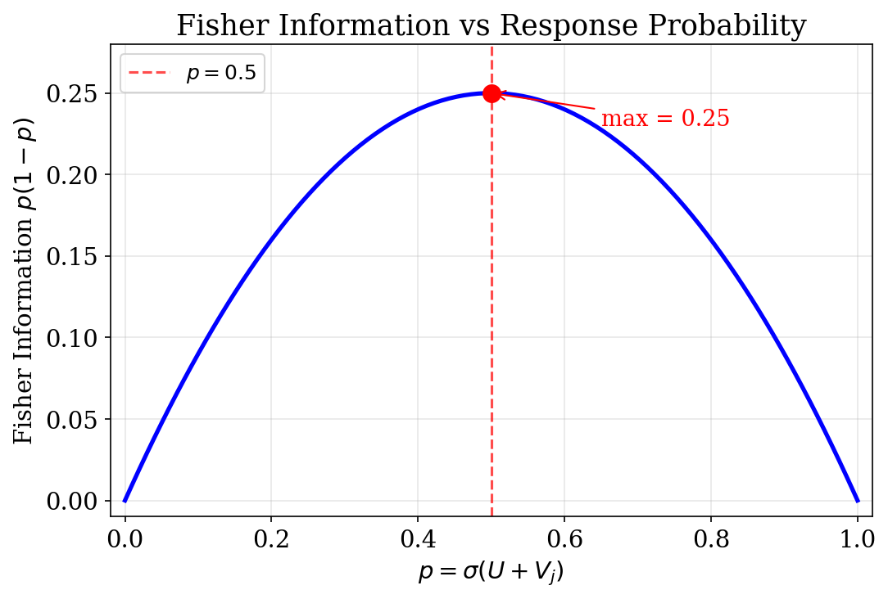{fig-align="center" width="45%"}

## 1. Optimal Item Difficulty {.auto-animate}

**Proposition.** $\mathcal{I}_j(U) = p_j(1 - p_j)$ is **maximized when $p_j = 0.5$**, i.e., item difficulty $-V_j$ equals user ability $U$.

- Items that are **too easy** ($p \approx 1$): near-deterministic, teach little
- Items that are **too hard** ($p \approx 0$): also uninformative
- Items **matched to ability** ($p \approx 0.5$): maximally informative
- Best next item: difficulty $-V_j$ close to current estimate of $U$

## 1. Active Item Selection {.auto-animate}

Score and cumulative information with prior $U \sim \mathcal{N}(0, \sigma_0^2)$:

$$
\begin{aligned}
S(U) &= \sum_{j \in \mathcal{J}} (y_j - p_j(U)) \\
\mathcal{I}(U) &= \sum_{j \in \mathcal{J}} p_j(U)(1 - p_j(U)) + \tau_0
\end{aligned}
$$

- **Newton update**: $\hat{U} \leftarrow \hat{U} + S(\hat{U}) / \mathcal{I}(\hat{U})$
- **Selection rule**: $j_t = \arg\max_j \; p_j(\hat{U})(1 - p_j(\hat{U}))$
- **Posterior variance**: $\widehat{\text{Var}}(U) \approx \mathcal{I}(\hat{U})^{-1}$
- **Reliability**: $\text{Rel} \approx 1 - \tfrac{1}{N}\sum_i \widehat{\text{Var}}(U_i) / \sigma_U^2$

## 1. Fisher-Active vs Random

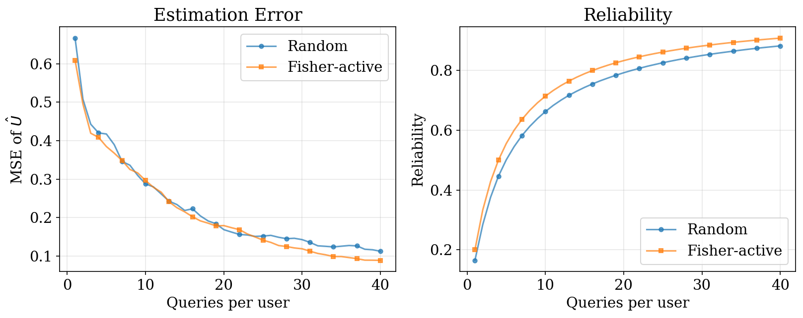{fig-align="center" width="55%"}

Fisher-active selection achieves higher reliability with fewer queries by targeting items near $p = 0.5$.

## 1. Key Insight

**Measure where uncertainty is highest.**

- Items near $p = 0.5$ are maximally informative
- Active selection "hovers" around the user's current location
- This principle underlies **all** active learning methods in this chapter:
    - Rasch $\rightarrow$ Factor models $\rightarrow$ Pairwise $\rightarrow$ GPs $\rightarrow$ DPO

---

## 2. Factor Models: Multi-Dimensional Preferences

Generalize Rasch to $K$ dimensions: $H_{ij} = U_i^\top V_j + Z_j$

- User embedding $U_i \in \mathbb{R}^K$, item embedding $V_j \in \mathbb{R}^K$
- Fisher information per item is a **rank-1 matrix**:

$$
\mathcal{I}_j(U) = \sigma(H)(1 - \sigma(H)) \; V_j V_j^\top
$$

- Cumulative: $\mathcal{I}(U) = \sum_t \sigma(H_{j_t})(1 - \sigma(H_{j_t})) \; V_{j_t} V_{j_t}^\top$
- Each item contributes information **in the direction** of $V_j$

## 2. Optimal Design Criteria (D/A/E)

Given Fisher information matrix $\mathcal{I}(U)$:

| Criterion | Objective | Intuition |
|---|---|---|
| **A-Optimal** | min tr($\mathcal{I}^{-1}$) | Average variance |
| **D-Optimal** | max det($\mathcal{I}$) | Volume shrinkage of posterior ellipsoid |
| **E-Optimal** | max $\lambda_{\min}(\mathcal{I})$ | Worst-case precision |

- All three reduce uncertainty, but emphasize different aspects
- D-optimal naturally **encourages diversity** — redundant directions give diminishing gain

## 2. D-Optimal Selection for Factor Models

- Pick next item maximizing $\det(\mathcal{I} + \mathcal{I}_j)$
- Reliability generalized: $\text{Rel} = 1 - \text{tr}(\hat{\Sigma}_{\text{err}}) / \text{tr}(\Sigma_U)$

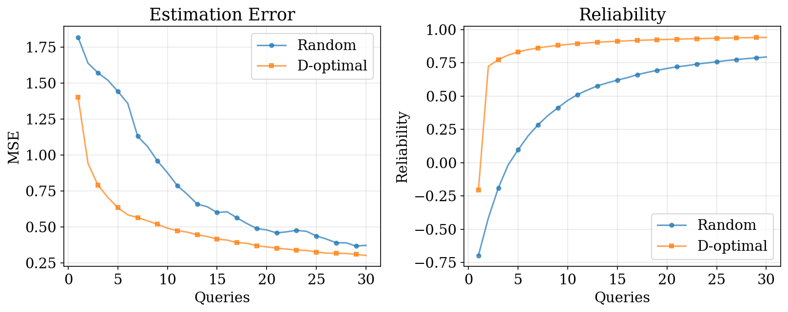{fig-align="center" width="55%"}

---

## 3. Pairwise Preferences

Bradley-Terry for pairs: $p(j \succ k) = \sigma(U^\top(V_j - V_k) + Z_j - Z_k)$

- Feature difference: $x_{jk} = V_j - V_k$
- Fisher information per pair:

$$
\mathcal{I}_{jk}(U) = w \cdot x_{jk} x_{jk}^\top, \quad w = p(1 - p)
$$

- Posterior precision accumulates additively:

$$
\Lambda_t = \Sigma_0^{-1} + \sum_{s \leq t} w_s \, x_s x_s^\top
$$

## 3. D-Optimal via Sherman-Morrison

**Proposition.** The D-optimal acquisition has closed form:

$$
\Delta_D(j,k) = \log\det(\Lambda + w\,xx^\top) - \log\det(\Lambda) = \log(1 + w \, x^\top \Sigma \, x)
$$

- Follows from the matrix determinant lemma: $\det(A + uv^\top) = (1 + v^\top A^{-1} u)\det(A)$
- Only requires a **vector-matrix-vector product** — efficient for online selection
- A-optimal: $\Delta_A = \tfrac{w \, x^\top \Sigma^2 x}{1 + w \, x^\top \Sigma \, x}$
- E-optimal proxy: $\Delta_E^{\text{proxy}} = w \, x^\top \Sigma \, x$

## 3. Pairwise D-Optimal: Results

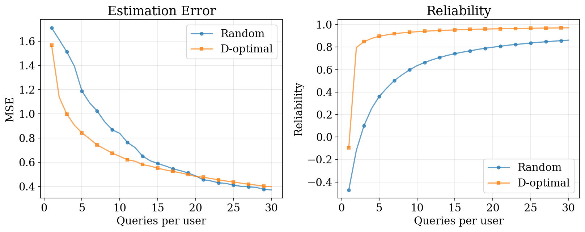{fig-align="center" width="55%"}

D-optimal selection shrinks the posterior ellipsoid efficiently in all directions.

---

## 4. Metric Elicitation: Motivation

:::: {.columns}
::: {.column width="65%"}
- Different classifiers trade off error types differently
- Which is "best" depends on the implicit **metric**
- Medical diagnosis: false negatives (missed disease) are costly
- Spam filtering: false positives (lost email) are costly
- The practitioner's metric $\mathbf{m}^*$ is **unknown**
:::
::: {.column width="35%"}
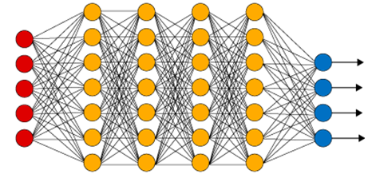{width="90%"}
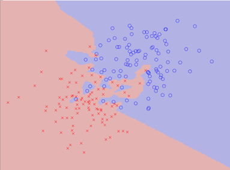{width="90%"}
:::
::::

## 4. Metric Elicitation as Factor Model

Metric elicitation is a **$K=2$ factor model** with known item parameters:

- "Items" = classifiers with known confusion matrices $V_\theta = (\text{TP}_\theta, \text{TN}_\theta)$
- "User preference" = unknown metric weights $\mathbf{m} = (m_{11}, m_{00})$
- Linear Performance Metric: $\phi(C) = m_{11} \cdot \text{TP} + m_{00} \cdot \text{TN} + m_0$
- Parametrize: $\mathbf{m} = (\cos\theta, \sin\theta)$ for $\theta \in [0, 2\pi]$

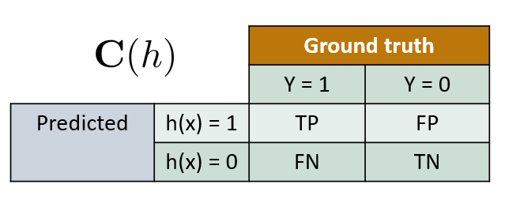{fig-align="center" width="35%"}

## 4. Quasiconcavity & Binary Search

**Proposition.** For a quasiconcave LPM, the composition $\phi \circ \rho^+$ with the upper boundary of the confusion matrix space is **unimodal**.

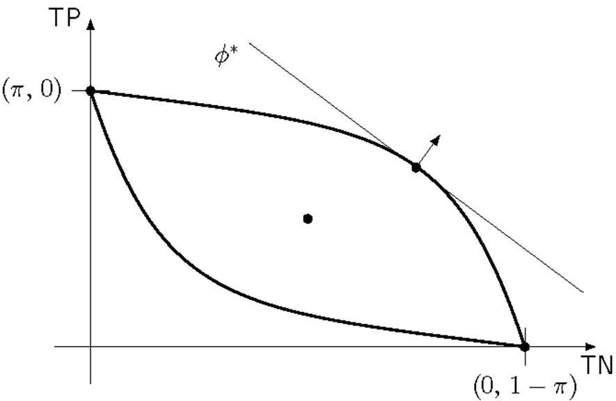{fig-align="center" width="35%"}

- Unimodality $\Rightarrow$ no local maxima $\Rightarrow$ **binary search** works
- Each iteration: 4 queries, shrinks interval by factor 2

## 4. Binary Search Algorithm

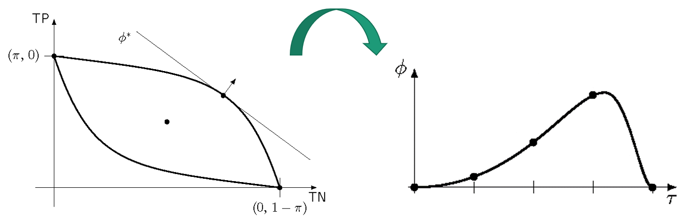{fig-align="center" width="50%"}

- **Query complexity**: $O(\log(1/\epsilon))$ — exponentially better than general 2D estimation at $O(1/\epsilon^2)$
- Works even under noise with probabilistic oracle responses

## 4. Metric Elicitation: Extensions

- **Bayes optimal classifier**: $\bar{h}(x) = \mathbf{1}[\eta(x) \geq m_{00}/(m_{11} + m_{00})]$
    - Learning the metric = learning the optimal classification threshold
- **Linear-fractional metrics** ($F_\beta$, Jaccard): two binary searches, still $O(\log(1/\epsilon))$
- **Multiclass**: diagonal LPMs with $K$ classes $\Rightarrow$ $O(K^2 \log(1/\epsilon))$ queries

---

## 5. Linear Preference Functions

Items scored by shared weight vector: $V_j = W^\top X_j$

$$
p(j \succ k) = \sigma(W^\top(X_j - X_k))
$$

- This is **logistic regression** on pairwise feature differences $x_{jk} = X_j - X_k$
- Fisher information: $\mathcal{I}(W) = p(1-p) \, x_{jk} x_{jk}^\top$
- Laplace posterior: $\Sigma \approx (\sigma_0^{-2}I + \sum_t p_t(1-p_t) \, x_t x_t^\top)^{-1}$
- Same D-optimal criterion: $\Delta_D(j,k) = \log(1 + w \, x^\top \Sigma \, x)$

## 5. Linear Preference: Results

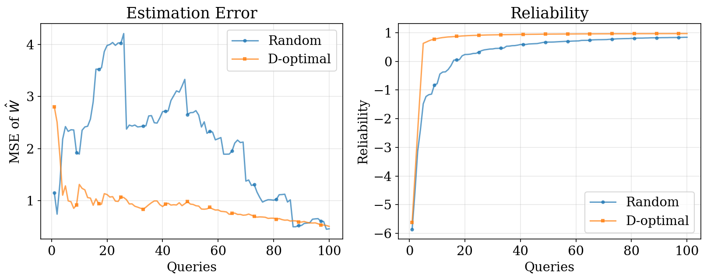{fig-align="center" width="55%"}

D-optimal selection converges faster with the same mathematical framework as before.

## 5. Robotic Trajectory Learning

:::: {.columns}
::: {.column width="65%"}
Trajectory reward: $R(\xi) = w^\top \phi(\xi)$

- Unknown weights $w$, known features $\phi(\xi)$
- Each comparison "prefer $\xi_A$ over $\xi_B$" gives a **half-space** constraint: $w^\top(\phi(\xi_A) - \phi(\xi_B)) \succ 0$
- Acquisition: maximize minimum volume removed regardless of answer

[@pmlr-v87-biyik18a]{.citation}
:::
::: {.column width="35%"}
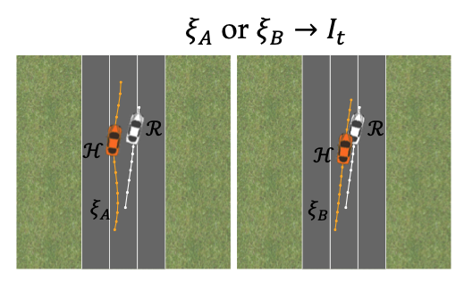{width="100%"}
:::
::::

## 5. Trajectory Learning: Results & Extensions

- **Driving simulator**: 0 queries $\rightarrow$ erratic; 30 queries $\rightarrow$ lane following; 70 queries $\rightarrow$ collision avoidance
- Active selection achieves target performance **faster** — critical for time-sensitive applications (e.g., exoskeleton rehabilitation)
- **Foundation models** (R3M, Voltron): pretrained representations give 2--3x higher success with 5--10x fewer demos

## 5. Non-Linear Scoring Functions {.auto-animate}

For non-linear scorer $V_j = f_\theta(X_j)$, linearize around $\hat\theta$:

$$
f_\theta(X_j) \approx f_{\hat\theta}(X_j) + J_j \,\Delta\theta, \quad J_j = \left.\frac{\partial f_\theta(X_j)}{\partial \theta}\right|_{\hat\theta}
$$

Pairwise logit:

$$
\underbrace{f_\theta(X_j) - f_\theta(X_k)}_{\text{logit}} \approx \underbrace{f_{\hat\theta}(X_j) - f_{\hat\theta}(X_k)}_{\text{offset}} + \underbrace{(J_j - J_k)}_{\phi_{jk}} \Delta\theta
$$

## 5. D-Optimal for Nonlinear Models {.auto-animate}

Replace $x_{jk}$ with Jacobian difference $\phi_{jk} = J_j - J_k$:

$$
\Sigma^{-1} = \sigma_0^{-2}I + \sum_t w_t \, \phi_t^\top \phi_t
$$

- D-optimal: $\Delta_D(j,k) = \log(1 + w \, \phi \, \Sigma \, \phi^\top)$
- A-optimal: $\Delta_A(j,k) = \tfrac{w \, \phi \, \Sigma^2 \, \phi^\top}{1 + w \, \phi \, \Sigma \, \phi^\top}$
- Only needs **Jacobian rows** + vector-matrix-vector product
- Same structure as linear case — local linearization is the key trick

---

## 6. GP Active Learning: Motivation

- Previous sections: **parametric** models (Rasch, linear, neural net)
- Gaussian Processes: **nonparametric**, flexible, natural uncertainty
- GP posterior variance varies across input space
- Key question: how to actively select queries for GP preference models?
- Insight: GP uncertainty naturally guides query selection

## 6. Information-Theoretic Acquisition

Mutual information between reward $r$ and observation $y$:

$$
a(Q) = I(r; y \mid \mathcal{D}, Q) = H(y \mid \mathcal{D}, Q) - \mathbb{E}_{r}[H(y \mid r, Q)]
$$

**Two terms:**

1. $H(y \mid \mathcal{D}, Q)$: **predictive entropy** — high when $p(A \succ B) \approx 0.5$
2. $\mathbb{E}_r[H(y \mid r, Q)]$: **expected conditional entropy** — low for "easy" comparisons

Want: model is uncertain, but human can give a clear answer.

## 6. Practical Computation

Using Laplace approximation:

$$
a(x_A, x_B) = h\!\left(\Phi\!\left(\frac{\mu_A - \mu_B}{\sqrt{2\sigma_{\text{noise}}^2 + g(x_A, x_B)}}\right)\right) - m(x_A, x_B)
$$

where $g(x_A, x_B) = \sigma_A^2 + \sigma_B^2 - 2\text{Cov}(r(x_A), r(x_B))$

- $h(p)$: binary entropy; $\Phi$: normal CDF
- **Key property**: trivial query $(x, x)$ is a global **minimizer** — avoids degenerate queries

## 6. GP Active Learning Algorithm

1. **Initialize** GP prior over reward function
2. **For each round** $t = 1, \ldots, T$:
    a. Compute acquisition $a(x_A, x_B)$ for all candidate pairs
    b. Select pair $(x_A^*, x_B^*)$ maximizing acquisition
    c. Query oracle for preference
    d. Update GP posterior via Laplace approximation
3. **Return** learned reward function with uncertainty

## 6. GP Active Learning: Results

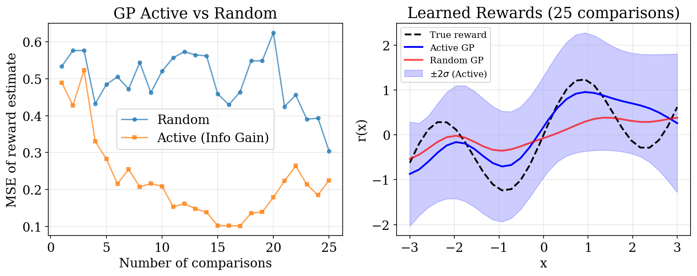{fig-align="center" width="55%"}

Active selection targets uncertain regions, achieving lower error with fewer comparisons.

## 6. When to Use GP Active Learning

| Scenario | Recommendation |
|---|---|
| Nonlinear reward structure | GP strongly preferred |
| Low-to-moderate dimensions ($d \lesssim 10$) | GP works well |
| Expensive human feedback | Active learning essential |
| Need uncertainty quantification | GP provides naturally |
| Large datasets ($n \succ 1000$) | Consider sparse GP |
| Very high dimensions | Linear models more practical |

---

## 7. Active DPO: Motivation

Recall DPO assumes Bradley-Terry preferences:

$$
p(y_w \succ y_l \mid x) = \sigma\!\left(\beta \log \frac{\pi_\theta(y_w \mid x)}{\pi_{\text{ref}}(y_w \mid x)} - \beta \log \frac{\pi_\theta(y_l \mid x)}{\pi_{\text{ref}}(y_l \mid x)}\right)
$$

- LLMs have **billions** of parameters — exact Fisher information is intractable
- How can we apply D-optimal design principles from Sections 1--5?

## 7. Log-Linear Policy Assumption

Approximate policy as **log-linear** in last-layer features:

$$
\pi(y \mid x; \theta) \propto \exp(\phi(x, y)^\top \theta)
$$

- Justified by **neural tangent kernel** perspective
- DPO loss Hessian takes the form:

$$
H(\theta) = \sum_{i=1}^n p_i(1 - p_i) \cdot \Delta\phi_i \, \Delta\phi_i^\top
$$

where $\Delta\phi_i = \phi(x_i, y_{w,i}) - \phi(x_i, y_{l,i})$

**This IS the Fisher information matrix!**

## 7. DPO D-Optimal Criterion

D-optimal selection for DPO:

$$
\max_S \; \log\det\!\left(\sum_{i \in S} p_i(1 - p_i) \cdot \Delta\phi_i \, \Delta\phi_i^\top\right)
$$

- **Same mathematical structure** as all previous sections
- Feature difference: $\Delta\phi_i = \phi(x_i, y_{w,i}) - \phi(x_i, y_{l,i})$
- Sherman-Morrison still applies for sequential selection

## 7. ADPO Algorithm

**Active DPO (ADPO):**

1. **Compute features**: $\Delta\phi_i = \phi(x_i, y_{i,1}) - \phi(x_i, y_{i,2})$
2. **D-optimal selection**:
$$
i^* = \arg\max_i \; \log\det\!\left(I + p_i(1 - p_i) \, H_t^{-1} \Delta\phi_i \, \Delta\phi_i^\top\right)
$$
3. **Query oracle**: obtain human preference for pair $i^*$
4. **Update**: add to training set, retrain with DPO loss

## 7. ADPO Convergence

**Theorem.** Under log-linear policy + regularity conditions:

$$
\|\hat\theta_n - \theta^*\| = O\!\left(\frac{d}{\sqrt{n}}\right)
$$

- Matches the **minimax optimal rate** for $d$-dimensional estimation
- D-optimal ensures Fisher information grows proportionally to $n$
- Key: effective dimension $d$ is the rank of the Fisher information matrix (last-layer features), not the full parameter count

## 7. ADPO+ for Offline Settings

- **Pool-based**: select from existing unlabeled pairs (fixed response pool)
- **Batch selection**: select $b$ queries at once for parallel annotation
- **Diversity**: D-optimal naturally encourages diversity — redundant queries give diminishing log-det gain
- Practical for production RLHF pipelines with fixed candidate pairs

## 7. When Does Active Learning Help for DPO?

| Factor | Active Learning Beneficial? |
|---|---|
| **Annotation cost** | High cost $\rightarrow$ essential |
| **Data heterogeneity** | Diverse prompts $\rightarrow$ more room for selection |
| **Budget constraints** | Limited budget ($\lt$ 10K) $\rightarrow$ largest gains |
| **Model capacity** | Larger models $\rightarrow$ helps reduce overfitting |
| **Query pool size** | Large pool $\rightarrow$ more room for intelligent selection |

## 7. GP Active Learning vs ADPO

| Aspect | GP Active Learning | ADPO |
|---|---|---|
| Model | Nonparametric (GP) | Parametric (neural) |
| Scalability | $O(n^3)$ | $O(d^2 n)$ |
| Use case | Small datasets, uncertainty | LLM alignment, large models |
| Acquisition | Information gain | D-optimal design |
| Theory | Mutual information | Fisher information |

Both share the core insight: **use model uncertainty to guide query selection**.

---

## Summary: Fisher Information Everywhere

The unifying theme — Fisher information quantifies "informativeness":

| Model | Fisher Information |
|---|---|
| Rasch (scalar) | $p(1-p)$ |
| Factor ($K$-dim) | $p(1-p) \, V V^\top$ |
| Pairwise | $p(1-p) \, x \, x^\top$ |
| GP preferences | Predictive entropy $-$ conditional entropy |
| DPO (LLM) | $p(1-p) \, \Delta\phi \, \Delta\phi^\top$ |

## Summary: Key Equations

- **D-optimal (Sherman-Morrison)**: $\Delta_D = \log(1 + w \, x^\top \Sigma \, x)$
- **Metric elicitation**: $O(\log(1/\epsilon))$ queries via binary search on unimodal boundary
- **ADPO convergence**: $\|\hat\theta_n - \theta^*\| = O(d / \sqrt{n})$

All use the same principle: **measure where uncertainty is highest**, whether that's item difficulty, posterior covariance, or GP predictive variance.

## Practical Guidance

| Setting | Recommended Method |
|---|---|
| Scalar ability (testing, psychometrics) | Rasch + Fisher active |
| Multi-dimensional preferences | Factor model + D-optimal |
| Known item features | Linear preference + D-optimal |
| Unknown nonlinear reward | GP active learning |
| LLM alignment | ADPO |
| Metric design | Binary search on LPM |

## References

::: {.smaller}
- [@pmlr-v89-hiranandani19a]{.citation}
- [@pmlr-v87-biyik18a]{.citation}
- [@sadigh2017active]{.citation}
- [@houlsby2011bayesian]{.citation}
- [@rafailov2023direct]{.citation}
- Additional:
    - [@cohn1996active]{.citation}
    - [@nair2022r3m]{.citation}
    - [@karamcheti2023voltron]{.citation}
    - [@gandhi2022eliciting]{.citation}
:::
