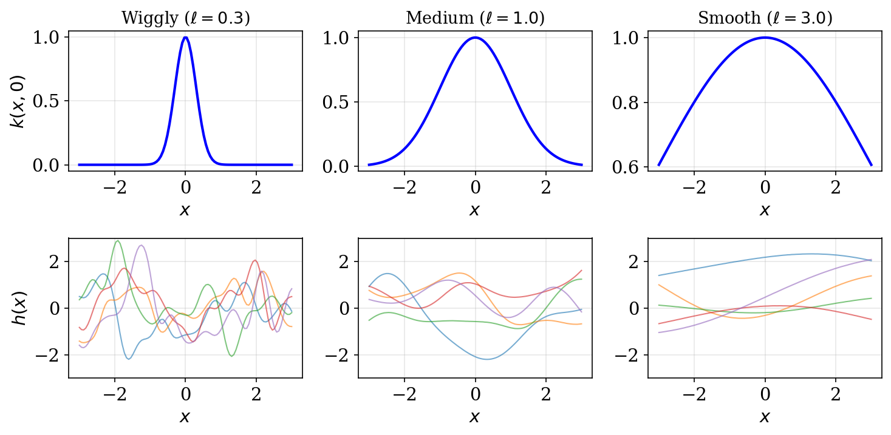
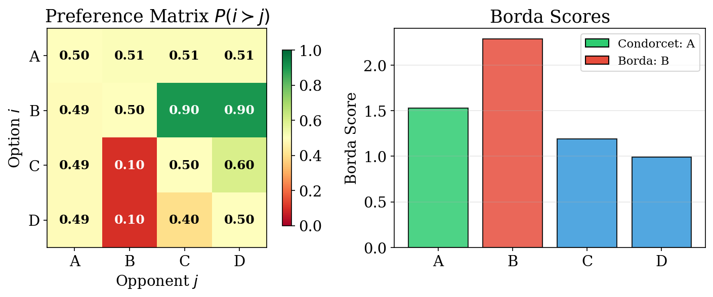
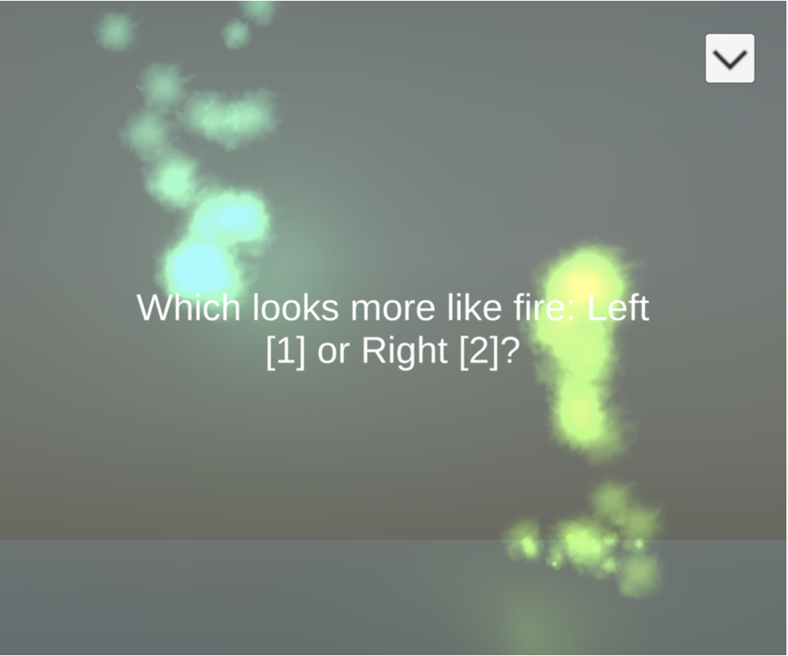
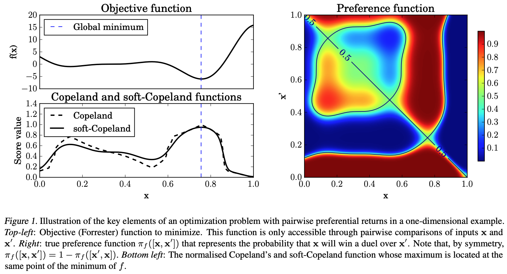
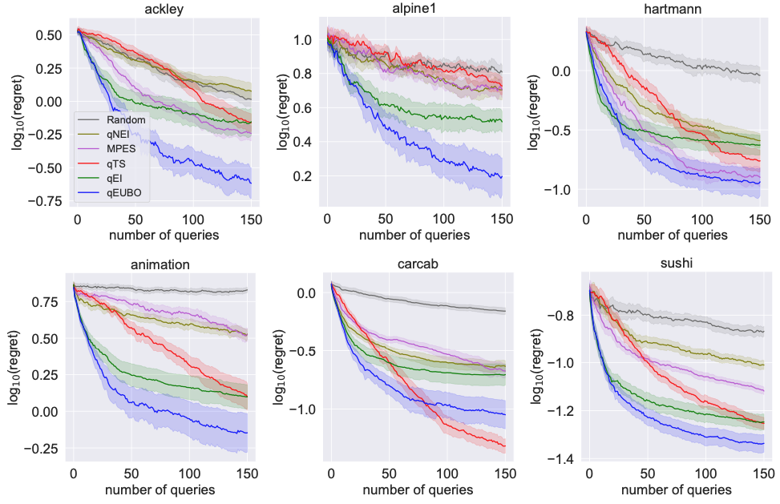
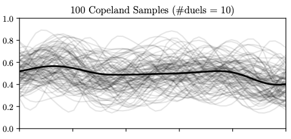
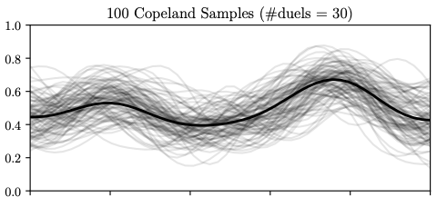
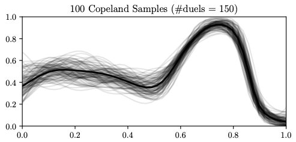

## Chapter Overview

- **Chapter 3**: the *measurement* perspective --- reduce uncertainty to learn preferences accurately
- **Chapter 4**: the *reward maximization* perspective --- manage uncertainty to make good decisions now

. . .

**Structure of this chapter:**

1. **Thompson Sampling** --- Bayesian exploration-exploitation via posterior sampling
2. **Dueling Bandits** --- sequential decisions from pairwise comparisons
3. **Preferential Bayesian Optimization** --- black-box optimization with preference feedback
4. **Cooperative Inverse Reinforcement Learning** --- learning from an active human partner

## Exploration vs Exploitation

Two competing goals in sequential decision-making:

- **Exploitation**: choose the action believed best given current knowledge
  - Greedy --- maximizes immediate expected reward
- **Exploration**: try uncertain actions to gather information for better future decisions
  - Informative --- reduces uncertainty about the environment

. . .

**The core tension:**

- Purely exploitative $\Rightarrow$ risk missing superior options forever
- Purely explorative $\Rightarrow$ waste resources on suboptimal actions
- Good algorithms **balance** both, concentrating exploration where it matters most

## Thompson Sampling --- Core Idea

> "Sample a plausible world from your beliefs, then act optimally within it."

. . .

**The recipe:**

1. Maintain a posterior over unknown parameters: $p(U_i \mid \mathcal{D}_t)$
2. **Sample** from the posterior: $\tilde{U}_i^{(t)} \sim p(U_i \mid \mathcal{D}_t)$
3. **Act optimally** under the sample: $j^* = \arg\max_j \tilde{U}_i^{(t)\top} V_j$

. . .

**Why it works:**

- When posterior is **wide** (uncertain) $\Rightarrow$ samples vary wildly $\Rightarrow$ exploration
- When posterior is **concentrated** $\Rightarrow$ samples cluster near MAP $\Rightarrow$ exploitation
- Automatically balances the two --- no tuning parameter needed

## Linear Model Setup

Recall the latent factor model from Chapter 2:

- User embedding: $U_i \in \mathbb{R}^K$, item features: $V_j \in \mathbb{R}^K$
- Latent utility: $H_{ij} = U_i^\top V_j$
- Binary feedback via logistic link:

$$
p(Y_{ij} = 1 \mid U_i, V_j) = \sigma(U_i^\top V_j)
$$

. . .

**Challenge for Thompson Sampling:**

- We need the posterior $p(U_i \mid \mathcal{D}_t)$
- Logistic likelihood $\times$ Gaussian prior $\Rightarrow$ posterior is **not Gaussian**
- Exact inference is intractable $\Rightarrow$ need approximation

## Laplace Approximation

**Idea:** Approximate a non-Gaussian posterior with a Gaussian centered at its mode.

The log-posterior is:

$$
\ell(U_i) = \log p(U_i) + \sum_{j \in \mathcal{D}_t} \log p(Y_{ij} \mid U_i)
$$

. . .

Second-order Taylor expansion around the MAP estimate $\hat{U}_i$:

$$
\ell(U_i) \approx \ell(\hat{U}_i) - \tfrac{1}{2}(U_i - \hat{U}_i)^\top G\, (U_i - \hat{U}_i)
$$

where $G = -\nabla^2_{U_i} \ell(\hat{U}_i)$ is the **negative Hessian** (precision matrix) evaluated at the mode.

## Laplace Approximation --- Result

Exponentiating the quadratic gives a Gaussian:

$$
p(U_i \mid \mathcal{D}_t) \approx \mathcal{N}(\hat{U}_i,\; G^{-1})
$$

. . .

For the logistic model with prior $p(U_i) = \mathcal{N}(0, I)$:

$$
G = I + \sum_{j \in \mathcal{D}_t} p_j(1 - p_j)\, V_j V_j^\top
$$

where $p_j = \sigma(\hat{U}_i^\top V_j)$ is the predicted probability at the MAP.

. . .

**Interpretation:** $I$ is the prior contribution; $\sum p_j(1-p_j) V_j V_j^\top$ is data information. Items with $p_j \approx 0.5$ contribute most to precision (most informative comparisons).

## Linear Thompson Sampling Algorithm

At each time step $t$:

. . .

**Step 1 --- Update posterior:**

Compute MAP estimate $\hat{U}_i = \arg\max_{U_i} \ell(U_i)$ via gradient ascent

. . .

**Step 2 --- Compute Hessian:**

$$
G = I + \sum_{j \in \mathcal{D}_t} p_j(1 - p_j)\, V_j V_j^\top
$$

. . .

**Step 3 --- Sample:**

$$
\tilde{U}_i^{(t)} \sim \mathcal{N}(\hat{U}_i,\; G^{-1})
$$

. . .

**Step 4 --- Select item:**

$$
j^* = \arg\max_j\; \tilde{U}_i^{(t)\top} V_j
$$

## From Linear to Nonlinear --- GP Motivation

- **Linear model**: utility $= U_i^\top V_j$ is a linear function of item features
- **Limitation**: real preference landscapes are often highly nonlinear
  - Saturation effects (diminishing returns)
  - Interaction effects between features
  - Complex decision boundaries

. . .

**Solution:** Move from a parametric user vector $U_i$ to a **nonparametric** utility function $h_i$

- Instead of $H_{ij} = U_i^\top V_j$, model $H_{ij} = h_i(V_j)$
- Place a **Gaussian Process** prior over $h_i$
- Flexibility to capture arbitrary smooth utility functions

## Gaussian Processes

A GP defines a distribution over functions:

$$
h_i \sim \mathcal{GP}(m(\cdot),\; k(\cdot, \cdot))
$$

For any finite set of inputs $\{V_1, \ldots, V_M\}$, the function values are jointly normal:

$$
H_{i,1:M} = [h_i(V_1), \ldots, h_i(V_M)] \sim \mathcal{N}(m_{1:M},\; K_{1:M})
$$

. . .

where:

- $m_{1:M} = [m(V_1), \ldots, m(V_M)]$ is the mean vector
- $[K_{1:M}]_{jk} = k(V_j, V_k)$ is the covariance matrix
- Kernel $k(V, V')$ encodes similarity: **similar items $\Rightarrow$ similar utilities**

## RBF Kernel

The Radial Basis Function (squared exponential) kernel:

$$
k(V, V') = \sigma^2 \exp\!\left(-\tfrac{\|V - V'\|^2}{2\ell^2}\right)
$$

- $\ell$ (**lengthscale**): controls smoothness --- small $\ell \Rightarrow$ wiggly, large $\ell \Rightarrow$ smooth
- $\sigma^2$ (**amplitude**): controls the magnitude of function variations

. . .

{fig-align="center" width="55%"}

## GP Classification with Laplace

Binary observations through a logistic link:

$$
p(Y_{ij} = 1 \mid h_i(V_j)) = \sigma(h_i(V_j))
$$

. . .

**Problem:** Non-Gaussian likelihood $\Rightarrow$ intractable posterior over $H_i$

**Solution:** Laplace approximation again!

Log-posterior over function values:

$$
\ell(H_i) = \sum_{j \in \mathcal{D}_t} \log p(Y_{ij} \mid H_{i,j}) - \tfrac{1}{2} H_i^\top K_t^{-1} H_i
$$

- First term: log-likelihood (data fit)
- Second term: log-prior from GP (smoothness penalty)

Expand around mode $\hat{H}_i$, define $W = -\nabla^2 \ell(\hat{H}_i)$

## GP Laplace Result

Approximate posterior over observed function values:

$$
p(H_i \mid \mathcal{D}_t) \approx \mathcal{N}(\hat{H}_i,\; (K_t^{-1} + W)^{-1})
$$

. . .

**Predictive distribution** at a new input $V_*$:

$$
\begin{aligned}
\mu_t(V_*) &= k_*^\top K_t^{-1} \hat{H}_i \\
\sigma_t^2(V_*) &= k(V_*, V_*) - k_*^\top (K_t + W^{-1})^{-1} k_*
\end{aligned}
$$

where $k_* = [k(V_1, V_*), \ldots, k(V_t, V_*)]^\top$.

. . .

- $\mu_t(V_*)$: best guess of utility at $V_*$
- $\sigma_t^2(V_*)$: uncertainty about utility at $V_*$ --- drives exploration

## GP Thompson Sampling Algorithm

**Step 1 --- Approximate posterior** via Laplace:

$$
p(h_i \mid \mathcal{D}_t) \approx \mathcal{GP}(\mu_t(\cdot),\; k_t(\cdot, \cdot))
$$

. . .

**Step 2 --- Sample function:**

$$
\tilde{h}_i \sim \mathcal{GP}(\mu_t(\cdot),\; k_t(\cdot, \cdot))
$$

. . .

**Step 3 --- Select item:**

$$
j^* = \arg\max_j\; \tilde{h}_i(V_j)
$$

. . .

**Exploration-exploitation mechanism:**

- Uncertain regions $\Rightarrow$ high variance in $\tilde{h}_i(V_j)$ $\Rightarrow$ occasionally sampled high $\Rightarrow$ **exploration**
- As posterior concentrates with data $\Rightarrow$ samples cluster near mean $\Rightarrow$ **exploitation**

## Key Insight --- Thompson Sampling

> "Sample a plausible world, act optimally within it."

. . .

**Properties:**

- Automatically balances exploration (high posterior variance) and exploitation (concentrated posterior)
- No explicit exploration bonus or tuning parameter
- Works with both **linear** and **nonlinear** (GP) models
- Combined with **Laplace approximation** $\Rightarrow$ tractable posteriors for logistic models

. . .

**Versatility:**

| Model | Posterior | Sample | Select |
|-------|-----------|--------|--------|
| Linear | $\mathcal{N}(\hat{U}_i, G^{-1})$ | $\tilde{U}_i \sim \mathcal{N}$ | $\arg\max_j \tilde{U}_i^\top V_j$ |
| GP | $\mathcal{GP}(\mu_t, k_t)$ | $\tilde{h}_i \sim \mathcal{GP}$ | $\arg\max_j \tilde{h}_i(V_j)$ |

## Motivation --- Dueling Bandits

In many settings, **reward is not directly observable** --- only relative comparisons are available.

. . .

**Example:** Which movie do you prefer?

. . .

### ***Which one do you prefer?***

It is often easier and more reliable for humans to **compare** than to assign absolute scores.

## From MABs to Dueling Bandits

:::: {.columns}
::: {.column width="50%"}
**Multi-Armed Bandits:**

- Select one arm $\rightarrow$ observe scalar reward
- Goal: maximize total reward
- Feedback: $r_t \in \mathbb{R}$
:::
::: {.column width="50%"}
**Dueling Bandits:**

- Select a **pair** of arms $\rightarrow$ observe which is preferred
- Goal: identify the best arm
- Feedback: $b_i \succ b_j$ or $b_j \succ b_i$
:::
::::

. . .

{fig-align="center" width="30%"}

. . .

**Applications:** dietary preference learning, video recommendation, exoskeleton gait optimization, information retrieval

## Formal Definition

Consider $K$ bandits $\mathcal{B} = \{b_1, \ldots, b_K\}$. The preference model:

$$
P(b_i \succ b_j) = \epsilon(b_i, b_j) + \tfrac{1}{2}
$$

. . .

**Properties of $\epsilon$:**

- $\epsilon(b_i, b_i) = 0$ (no self-preference)
- $\epsilon(b_i, b_j) = -\epsilon(b_j, b_i)$ (antisymmetry)
- $\epsilon \in (-\tfrac{1}{2},\; \tfrac{1}{2})$ (proper probabilities)

. . .

**Structural assumptions:** Strong Stochastic Transitivity (SST) and Stochastic Triangle Inequality ensure a coherent preference ordering.

## Empirical Estimation

After $t$ comparisons between $b_i$ and $b_j$:

**Running estimate:**

$$
\hat{P}_{i,j} = \frac{\#\{b_i \text{ wins}\}}{\#\{\text{comparisons of } b_i \text{ vs } b_j\}}
$$

. . .

**Confidence interval:**

$$
\hat{C}_t = (\hat{P}_t - c_t,\; \hat{P}_t + c_t)
$$

where $c_t = \sqrt{\tfrac{4\log(1/\delta)}{t}}$ and $\delta = \tfrac{1}{TK^2}$.

Width shrinks as $O(1/\sqrt{t})$; union bound over all $K^2$ pairs and $T$ rounds ensures simultaneous coverage.

## Regret Definitions

Assuming a best bandit $b^*$, three notions of regret:

. . .

**Strong regret** --- penalizes the *worst* option shown:

$$
R_T = \sum_{t=1}^T \max\!\big\{\epsilon(b^*, b_1^{(t)}),\; \epsilon(b^*, b_2^{(t)})\big\}
$$

. . .

**Weak regret** --- penalizes the *best* option shown:

$$
\tilde{R}_T = \sum_{t=1}^T \min\!\big\{\epsilon(b^*, b_1^{(t)}),\; \epsilon(b^*, b_2^{(t)})\big\}
$$

. . .

**Bayesian regret** --- averaged over prior uncertainty:

$$
\mathbb{E}_{\text{Prior}}[\text{Regret}(\mu_1, \ldots, \mu_K)]
$$

An efficient algorithm achieves **sublinear** regret: $\lim_{T \to \infty} R(T)/T = 0$.

## Condorcet Winner

The bandit $b^*$ that beats **every** other bandit in a head-to-head duel:

$$
P(b^* \succ b_j) \gt \tfrac{1}{2} \quad \text{for all } j \neq *
$$

. . .

**Strongest winner concept** --- but may **not exist!**

When preferences are **cyclic:**

- A beats B, B beats C, C beats A
- No single bandit dominates all others
- Classic example: Rock-Paper-Scissors

. . .

**Preference cycle in practice:** Consider pizza topping preferences with three voter groups:

- Group 1: Pepperoni $\succ$ Mushroom $\succ$ Hawaiian
- Group 2: Mushroom $\succ$ Hawaiian $\succ$ Pepperoni
- Group 3: Hawaiian $\succ$ Pepperoni $\succ$ Mushroom

## Borda Winner

The bandit with the highest **total vote count** across all pairwise matchups:

$$
j^* = \arg\max_{i} \sum_{k \neq i} P(b_i \succ b_k)
$$

. . .

**Properties:**

- Always exists (ties possible, but can be broken)
- Measures **overall popularity** rather than head-to-head dominance
- Can differ from the Condorcet winner
- Intuition: "the most popular option on average"

. . .

**When Borda $\neq$ Condorcet:**

- Condorcet winner barely beats everyone (e.g., 51% in each duel)
- Borda winner strongly beats most but loses to one (higher total score)

## Von Neumann Winner

A **probability distribution** $W$ over bandits such that sampling from $W$ beats any fixed arm with probability $\gt \tfrac{1}{2}$:

$$
\sum_{i} W(i)\, P(b_i \succ b_j) \gt \tfrac{1}{2} \quad \text{for all } j
$$

. . .

**Properties:**

- Most **general** winner concept --- allows **mixed strategies**
- Always exists (by the minimax theorem)
- Reduces to Condorcet winner when one exists (point mass on $b^*$)
- Useful when preferences are cyclic or context-dependent

## When Winners Diverge

{fig-align="center" width="55%"}

. . .

- **Arm A**: Condorcet winner --- barely beats all others at 0.51
- **Arm B**: Borda winner --- dominates C, D strongly but loses to A

. . .

**Key lesson:** Different winner concepts can give **different answers**. The choice of winner concept should match the application:

- Condorcet: when head-to-head dominance matters
- Borda: when overall popularity matters
- Von Neumann: when mixed strategies are allowable

## Acquisition Functions

Classical strategies for bandit exploration:

. . .

**Uniform** --- pure exploration, no exploitation:

$$
P(a_t = a) = \tfrac{1}{K}
$$

. . .

**$\epsilon$-Greedy** --- mostly exploit, sometimes explore:

$$
a_t = \begin{cases} \arg\max_a \hat{\mu}_a & \text{with probability } 1 - \epsilon \\ \text{random arm} & \text{with probability } \epsilon \end{cases}
$$

. . .

**Upper Confidence Bound (UCB)** --- optimism under uncertainty:

$$
a_t = \arg\max_a \left(\hat{\mu}_a + \sqrt{\tfrac{2\ln t}{N_t(a)}}\right)
$$

- Explores arms with few observations (large bonus) or high estimated reward

## Interleaved Filter

Algorithm for finding the **Condorcet winner:**

. . .

1. Randomly choose initial best guess $\hat{b}$, set $W = \mathcal{B} \setminus \{\hat{b}\}$

. . .

2. Compare $\hat{b}$ against candidates in $W$, update estimates $\hat{P}$ and confidence $\hat{C}$

. . .

3. **Prune:** Remove $b$ from $W$ if $\hat{b}$ is confidently better
$$
\hat{P}_{\hat{b}, b} - c_t \gt \tfrac{1}{2}
$$

. . .

4. **Promote:** If candidate $b'$ confidently beats $\hat{b}$, set $\hat{b} \leftarrow b'$, reset $W$
$$
\hat{P}_{b', \hat{b}} - c_t \gt \tfrac{1}{2}
$$

. . .

5. **Repeat** until $W = \emptyset$ --- $\hat{b}$ is the Condorcet winner

## Interleaved Filter --- Properties

**Correctness guarantee:**

- Returns the correct Condorcet winner with probability $\geq 1 - 1/T$

. . .

**Regret bound:**

$$
\mathbb{E}[R_T] \leq (1 - \tfrac{1}{T})\,\mathbb{E}[R_T^{IF}] + \mathcal{O}(1)
$$

. . .

**Key properties:** Simple to implement; bounds hold for both **strong** and **weak** regret; total comparisons scale as $O(K \log K)$ to find the winner.

## DBGD --- Continuous Action Spaces

**Dueling Bandit Gradient Descent:** Extends dueling bandits to **continuous** parameter spaces.

. . .

**Setting:** Optimize $w \in \mathbb{R}^d$ using only pairwise comparison feedback

At each step $t$:

1. Sample random direction: $u_t \sim \text{Uniform}(\mathbb{S}^{d-1})$
2. Create perturbation: $w_t' = w_t + \delta\, u_t$
3. **Duel:** Compare $w_t$ vs $w_t'$ via human feedback

. . .

**Update rule:**

$$
w_{t+1} = \begin{cases}
w_t + \gamma\, u_t & \text{if } w_t' \text{ is preferred} \\
w_t & \text{otherwise}
\end{cases}
$$

. . .

- Achieves **sublinear regret** in $T$ under smooth, concave reward
- No gradient computation needed --- only comparison feedback

## Contextual Dueling Bandits

When preferences **depend on context** (user features, situational variables):

. . .

**Sparring EXP4:**

- Two independent EXP4 instances "duel" each other
- Each maintains a distribution over a set of expert policies
- **Adversarial robustness** --- no distributional assumptions on contexts
- Finds the **Copeland winner** (arm that beats the most other arms)

. . .

**Feel-Good Thompson Sampling:**

- Posterior sampling with a "feel-good" exploration bonus
- Bonus ensures sufficient exploration of undersampled arms
- Finds the **Von Neumann winner** (optimal mixed strategy)
- **Bayesian** --- leverages prior knowledge for faster convergence

## Algorithm Comparison {.smaller}

| Algorithm | Space | Context? | Winner | Key Strength |
|-----------|-------|----------|--------|--------------|
| Interleaved Filter | Finite | No | Condorcet | Simple, provable |
| DBGD | Continuous | No | Reward max | Gradient-free |
| Sparring EXP4 | Finite | Yes | Copeland | Adversarial |
| Feel-good TS | Finite | Yes | Von Neumann | Bayesian |

. . .

**How to choose:**

- **Finite arms, no context** $\Rightarrow$ Interleaved Filter (simple, effective)
- **Continuous space** $\Rightarrow$ DBGD (gradient-free optimization)
- **Context + adversarial** $\Rightarrow$ Sparring EXP4 (worst-case guarantees)
- **Context + Bayesian** $\Rightarrow$ Feel-good TS (sample-efficient with good prior)

## Application --- LLM Response Selection

:::: {.columns}
::: {.column width="55%"}
**Setup:**

- Context $= $ user prompt $x_t$
- Actions $= K$ candidate responses
- Preference model: Bradley-Terry over response embeddings

. . .

**Key insight:**

- **Online DPO $\equiv$ Thompson Sampling on a Bradley-Terry model**
- TS balances showing confident responses vs learning user preferences
:::
::: {.column width="45%"}
**Pipeline:**

1. User sends prompt $x_t$
2. Generate $K$ candidate responses
3. Select pair via TS posterior
4. User indicates preference
5. Update BT posterior
6. Repeat
:::
::::

. . .

As more preferences are collected, the model concentrates on generating responses that align with user values --- the essence of **RLHF**.

## Application --- Clinical Trial Dosing

:::: {.columns}
::: {.column width="55%"}
**Setup:**

- Context $= $ patient features $x_t$ (age, weight, genetics)
- Actions $= $ dosage levels (low, medium, high)
- Reward model: $r(x_t, a_t) = x_t^\top \theta_{a_t}$
:::
::: {.column width="45%"}
**Key challenge:**

- Exploration cost is **high** --- suboptimal dose can cause harm
- Must learn quickly with few patients
- Safety constraints are critical
:::
::::

. . .

**Why Thompson Sampling works well here:**

- Concentrates exploration where uncertainty is **highest**
- Naturally cautious: only explores when posterior is genuinely uncertain
- Can incorporate **safety priors** (e.g., avoid extreme doses early)
- Converges faster than uniform exploration --- fewer patients exposed to suboptimal treatments

## Summary --- Thompson Sampling and Dueling Bandits

**Thompson Sampling:**

- "Sample a plausible world, act optimally" --- elegant Bayesian exploration
- Works for **linear** models (Laplace on $U_i$) and **GP** models (Laplace on $h_i$)
- Automatically balances exploration and exploitation via posterior variance

. . .

**Dueling Bandits:**

- Extend multi-armed bandits to **pairwise comparison** feedback
- Winner concepts: **Condorcet** (strongest), **Borda** (most popular), **Von Neumann** (mixed)
- Algorithms: Interleaved Filter, DBGD, Sparring EXP4, Feel-good TS

. . .

**Applications:** LLM alignment (online DPO), clinical trials, robotic control, recommendation

## Motivation — Fire Rendering
### ***Which looks more like fire? Left or Right?***

- Rendering realistic visual effects requires tuning many parameters
- Hard to define a numeric objective — but easy for humans to compare two renderings
- **Preferential Bayesian Optimization (PBO)**: optimize a black-box function via pairwise comparisons

::: {style="font-size: 0.7em; text-align: left;"}
[@astudillo2023qeubo]{.citation}
:::

## Problem Statement
- Black-box function $g: \mathcal{X} \rightarrow \mathbb{R}$ on bounded $\mathcal{X} \subseteq \mathbb{R}^q$
- Goal: find $\mathbf{x}_{\min} = \arg\min_{\mathbf{x} \in \mathcal{X}} g(\mathbf{x})$
- We cannot evaluate $g$ directly — only query via **duels** $[\mathbf{x}, \mathbf{x}']$
- Binary feedback $y \in \{0, 1\}$: $y = 1$ if $\mathbf{x}$ is preferred (i.e., lower $g$ value)
- Goal: find $\mathbf{x}_{\min}$ with **minimal number of duels**

::: {style="font-size: 0.7em; text-align: left;"}
[@gonzalez2017preferential]{.citation}
:::

## Preference Model
- Define the duel reward as the difference in objective values:
$$f([\mathbf{x}, \mathbf{x}']) = g(\mathbf{x}') - g(\mathbf{x})$$
- Logistic preference probability:
$$\pi_f([\mathbf{x}, \mathbf{x}']) = \sigma(f([\mathbf{x}, \mathbf{x}']))$$
- **Key property**: $\pi_f([\mathbf{x}, \mathbf{x}']) \geq 0.5 \iff g(\mathbf{x}) \leq g(\mathbf{x}')$
- The preferred option has lower $g$ value (i.e., closer to the minimizer)
- Place a **GP prior** on $f$ and update from observed duel outcomes

::: {style="font-size: 0.7em; text-align: left;"}
[@gonzalez2017preferential]{.citation}
:::

## Copeland Score
How do we identify the best option from pairwise preferences?

- **Hard Copeland score** (fraction of pairwise wins):
$$S(\mathbf{x}) = \text{Vol}(\mathcal{X})^{-1} \int_{\mathcal{X}} \mathbb{I}_{\{\pi_f([\mathbf{x}, \mathbf{x}']) \geq 0.5\}} \, d\mathbf{x}'$$
- **Soft Copeland score** (smoother, more tractable):
$$C(\mathbf{x}) = \text{Vol}(\mathcal{X})^{-1} \int_{\mathcal{X}} \pi_f([\mathbf{x}, \mathbf{x}']) \, d\mathbf{x}'$$
- **Condorcet winner**: $\mathbf{x}_c = \arg\max_{\mathbf{x}} C(\mathbf{x})$
- Finding the Condorcet winner $\equiv$ solving the optimization problem

::: {style="font-size: 0.7em; text-align: left;"}
[@gonzalez2017preferential]{.citation}; [@zoghi2015copeland]{.citation}
:::

## Copeland Visualization

{fig-align="center" width="60%"}

::: {style="font-size: 0.7em; text-align: left;"}
The soft Copeland score (bottom) provides a smooth landscape for optimization
compared to the hard Copeland score (top). The Condorcet winner corresponds to
the peak of the soft Copeland surface.
:::

::: {style="font-size: 0.7em; text-align: left;"}
[@gonzalez2017preferential]{.citation}
:::

## Learning the Preference Function
- Place a **GP surrogate** on the duel space with posterior:
$$p(f_t \mid \mathcal{D}, [\mathbf{x}_t, \mathbf{x}_t'])$$
- Compute preference probability by marginalizing over the posterior:
$$\pi([\mathbf{x}_t, \mathbf{x}_t']) = \int \sigma(f_t) \, p(f_t \mid \mathcal{D}) \, df_t$$
- Approximate the soft Copeland score via **Monte Carlo**:
$$C(\mathbf{x}) \approx \tfrac{1}{M} \sum_{i=1}^{M} \pi([\mathbf{x}, \mathbf{x}_i])$$
- Use **Laplace approximation** for GP binary classification (as in Chapter 4.1)

## PBO Algorithm Overview

**Input:** Initial dataset $\mathcal{D}_0$, acquisition function $\alpha$, budget $T$

**For** $t = 1, \ldots, T$:

1. Fit GP to current data $\mathcal{D}_{t-1}$, obtain posterior $p(f \mid \mathcal{D}_{t-1})$
2. Select next duel by optimizing acquisition function:
$$[\mathbf{x}_t, \mathbf{x}_t'] = \arg\max_{[\mathbf{x}, \mathbf{x}']} \alpha([\mathbf{x}, \mathbf{x}'] \mid \mathcal{D}_{t-1})$$
3. Query human: observe $y_t \in \{0, 1\}$
4. Update dataset: $\mathcal{D}_t = \mathcal{D}_{t-1} \cup \{([\mathbf{x}_t, \mathbf{x}_t'], y_t)\}$

**Output:** $\hat{\mathbf{x}}_{\min} = \arg\max_{\mathbf{x}} C(\mathbf{x}; \mathcal{D}_T)$

## Acquisition Functions for PBO
Goal: design a sequential policy for querying duels to find $\mathbf{x}_{\min}$ quickly.

We will cover five approaches:

| Method | Strategy |
|--------|----------|
| **Pure Exploration** | Maximize preference uncertainty |
| **POP-BO** | Optimistic selection with confidence sets |
| **qEUBO** | Expected utility of best option |
| **qEI** | Expected improvement (and its failure) |
| **Dueling-TS** | Thompson sampling for duels |

## Pure Exploration
- Select the duel that maximizes **variance of the preference probability**:
$$\alpha_{PE}([\mathbf{x}, \mathbf{x}'] \mid \mathcal{D}) = \mathbb{V}[\sigma(f_*) \mid [\mathbf{x}_*, \mathbf{x}_*'], \mathcal{D}]$$
- Expanding the variance:
$$\begin{aligned}
\mathbb{V}[\sigma(f_*)] &= \int \sigma(f_*)^2 \, p(f_* \mid \mathcal{D}) \, df_* - \mathbb{E}[\sigma(f_*)]^2
\end{aligned}$$
- **Intuition**: previously visited duels have lower uncertainty, so they are
less likely to be revisited
- Requires MC approximation in practice

::: {style="font-size: 0.7em; text-align: left;"}
[@gonzalez2017preferential]{.citation}
:::

## POP-BO — Principled Optimistic PBO
- Assume $g$ lies in an RKHS with $\|g\|_k \leq B$
- **MLE update**: $\hat{g}_t^{\text{MLE}} = \arg\max_{\tilde{g} \in \mathcal{B}_g^t} \ell_t(\tilde{g})$
- **Confidence set** (contains true $g$ w.p. $\geq 1 - \delta$):
$$\mathcal{B}_g^{t+1} = \{\tilde{g} \mid \ell_t(\tilde{g}) \geq \ell_t(\hat{g}^{\text{MLE}}) - \beta_1\}$$
- **Optimistic selection**: pick the point that looks best under the most
favorable model:
$$\mathbf{x}_t \in \arg\max_{\mathbf{x}} \max_{\tilde{g} \in \mathcal{B}_g^t} \left(\tilde{g}(\mathbf{x}) - \tilde{g}(\mathbf{x}_t')\right)$$
- Analogous to UCB in standard bandits, but adapted for preferences

::: {style="font-size: 0.7em; text-align: left;"}
[@xu2024principledpreferentialbayesianoptimization]{.citation}
:::

## qEUBO — Expected Utility of Best Option
- Extends duels to **$q \gt 2$ options** per query (e.g., show $q$ options,
user picks best)
- **qEUBO** acquisition function:
$$\text{qEUBO}_n(X) = \mathbb{E}_n\left[\max\{g(x_1), \ldots, g(x_q)\}\right]$$
- **One-step Bayes optimal value**:
$$V_n(X) = \mathbb{E}_n\left[\max_{x \in \mathcal{X}} \mathbb{E}_{n+1}[g(x)] \mid X_{n+1} = X\right]$$
- $V_n$ measures the best posterior mean achievable after observing feedback
on query set $X$
- qEUBO is a tractable surrogate for $V_n$

::: {style="font-size: 0.7em; text-align: left;"}
[@astudillo2023qeubo]{.citation}
:::

## qEUBO — One-Step Bayes Optimality
**Theorem (noise-free):** $\arg\max_{X} \text{qEUBO}_n(X) \subseteq \arg\max_{X} V_n(X)$

- Any maximizer of qEUBO is also a maximizer of the one-step Bayes optimal
value $V_n$
- This means qEUBO is **one-step Bayes optimal** in the noise-free setting

**Proof sketch:**

- For any query $X$, let $x^+(X, i) = \arg\max_{x} \mathbb{E}_n[g(x) \mid (X, i)]$
- Show $V_n(X) \leq \text{qEUBO}_n(X^+(X))$ and
$\text{qEUBO}_n(X) \leq V_n(X)$
- If $X^*$ maximizes qEUBO but not $V_n$, these inequalities yield a
contradiction

::: {style="font-size: 0.7em; text-align: left;"}
[@astudillo2023qeubo]{.citation}
:::

## qEUBO — Noisy Setting
**With noise** ($\lambda$-logistic): the gap between qEUBO and the Bayes
optimal value is bounded.

$$V_t^\lambda(X^*) \geq \max_X V_t^0(X) - \lambda C$$

where $C = L_W\!\left(\tfrac{q-1}{e}\right)$ involves the Lambert W function.

- As noise $\lambda \to 0$, the bound becomes tight
- The bound degrades gracefully: more options ($q$) or more noise ($\lambda$)
increases the gap, but only logarithmically in $q$
- In practice, qEUBO remains effective even with moderate noise levels

::: {style="font-size: 0.7em; text-align: left;"}
[@astudillo2023qeubo]{.citation}
:::

## qEI and Its Failure
- **qEI**: expected improvement over current best posterior mean $\mu_{\min}$:
$$\text{qEI} = \sum_{i=1}^{q} \mathbb{E}_{\mathbf{y}}\left[(\mu_{\min} - y_i)_+\right]$$
- **Counterexample** showing qEI can get permanently trapped:
  - 4 options $\{1, 2, 3, 4\}$ with carefully chosen prior
  - qEI **always queries** $(3, 4)$ — never explores other pairs
  - Constant regret $R \gt 0$ for all $n$, regardless of iterations
- **Key lesson**: qEI can fail because it only considers improvement over the
current estimate, not the value of information gained
- qEUBO avoids this by maximizing the **utility of the best option shown**

::: {style="font-size: 0.7em; text-align: left;"}
[@astudillo2023qeubo]{.citation}
:::

## qEUBO — Empirical Results

{fig-align="center" width="55%"}

::: {style="font-size: 0.7em; text-align: left;"}
Comparison of qEUBO against baselines on benchmark functions.
qEUBO consistently finds better solutions with fewer queries, confirming its
theoretical advantages in practice.
:::

::: {style="font-size: 0.7em; text-align: left;"}
[@astudillo2023qeubo]{.citation}
:::

## Dueling-Thompson Sampling
**Step 1** — Select $\mathbf{x}_t$: Sample $\tilde{f}$ from posterior,
maximize soft Copeland:
$$\mathbf{x}_t = \arg\max_{\mathbf{x}} \int_{\mathcal{X}} \pi_{\tilde{f}}([\mathbf{x}, \mathbf{x}']) \, d\mathbf{x}'$$

**Step 2** — Select $\mathbf{x}_t'$: Maximize uncertainty in the direction
of $\mathbf{x}_t$:
$$\mathbf{x}_t' = \arg\max_{\mathbf{x}'} \mathbb{V}[\sigma(f_t) \mid [\mathbf{x}_t, \mathbf{x}'], \mathcal{D}]$$

- Step 1 is **exploitation** (pick the likely Condorcet winner under the
sample)
- Step 2 is **exploration** (find the most informative opponent for
$\mathbf{x}_t$)

::: {style="font-size: 0.7em; text-align: left;"}
[@gonzalez2017preferential]{.citation}
:::

## Thompson Sampling Visualization

::: {style="font-size: 0.7em; text-align: left;"}
Soft Copeland score samples (grey curves) after 10, 30, and 150 duels.
As more data is collected, the posterior concentrates and the algorithm shifts
from exploration to exploitation. The Condorcet winner estimate (dashed line)
stabilizes.
:::

::: {style="font-size: 0.7em; text-align: left;"}
[@gonzalez2017preferential]{.citation}
:::

## Regret Comparison

| Method | Simple Regret | Key Feature |
|--------|---------------|-------------|
| **qEUBO** | $o(1/n)$ | Bayes optimal (noise-free) |
| **qEI** | Can be $\geq R \gt 0$ | May fail to converge! |
| **POP-BO** | $\mathcal{O}(\sqrt{\beta_T \gamma_T^{ff'} / T})$ | Provable with confidence sets |

- **qEUBO**: convergence guaranteed under mild assumptions; one-step Bayes
optimal
- **qEI**: counterexample shows it can be permanently trapped with constant
regret
- **POP-BO**: regret depends on kernel complexity ($\gamma_T$ = information
gain)

## POP-BO Kernel-Specific Rates
Base rate: $T^{3/4}$ — the **price of preference feedback** (vs $T^{1/2}$
for direct evaluation).

$$\begin{aligned}
\text{Linear}: \quad R_T &= \mathcal{O}(T^{3/4}(\log T)^{3/4}) \\
\text{SE}: \quad R_T &= \mathcal{O}(T^{3/4}(\log T)^{3/4(d+1)}) \\
\text{Mat\acute{e}rn}: \quad &\text{Additional polynomial in } d, \nu
\end{aligned}$$

- Smoother kernels (e.g., SE) yield tighter bounds
- The extra $T^{1/4}$ factor compared to standard BO reflects the information
cost of only receiving binary comparisons rather than function values

::: {style="font-size: 0.7em; text-align: left;"}
[@xu2024principledpreferentialbayesianoptimization]{.citation}
:::

## Beyond Passive Oracles
- All PBO algorithms so far assume human $=$ **passive oracle** who simply
responds to queries
- In practice, humans are **active agents** who shape the learning process:
  - A user may deliberately pick challenging examples to teach the system
  - Humans' feedback depends on their beliefs about how it will be used
  - Experts may sacrifice short-term accuracy to convey long-term information
- This motivates a **game-theoretic** perspective on preference learning
- Key question: what happens when both the human and the robot optimize
jointly?

## CIRL Framework
**Cooperative Inverse Reinforcement Learning** — a two-player cooperative
game:

:::: {.columns}
::: {.column width="50%"}
**Human H**:

- Knows true reward parameters $\theta \in \Theta$
- Chooses actions to help the robot learn
:::
::: {.column width="50%"}
**Robot R**:

- Does not know $\theta$
- Maintains belief $b_R^t(\theta)$
- Chooses actions to maximize shared payoff
:::
::::

- **Shared payoff**: $R(s, a_H, a_R; \theta)$ — interests are fully aligned
- Unlike standard IRL (expert demonstrates $\to$ agent imitates), CIRL models
**joint optimization** where both agents reason about each other's strategies

## CIRL — Formal Definition
A CIRL game is a tuple $\mathcal{M} = (\mathcal{S}, \{\mathcal{A}_H,
\mathcal{A}_R\}, T, R, \Theta, P_0)$:

- $\mathcal{S}$: state space; $\mathcal{A}_H, \mathcal{A}_R$: action spaces
- $T(s' \mid s, a_H, a_R)$: transition dynamics
- $R(s, a_H, a_R; \theta)$: shared reward parameterized by $\theta$
- $\Theta$: space of reward parameters with prior $P_0(\theta)$

**Key distinction from standard IRL:**

- IRL: observe expert, then imitate offline
- CIRL: human and robot **interact in real time**, both optimizing the
shared objective
- The human's policy $\pi_H(a_H \mid s, \theta)$ depends on $\theta$, giving
the robot information through observation

## Teaching vs Demonstrating
Key insight: expert demonstrations can be **suboptimal** for joint value!

:::: {.columns}
::: {.column width="50%"}
**Demonstrating**:

- Human always acts optimally given $\theta$
- Robot observes and imitates
- Ignores the teaching opportunity
:::
::: {.column width="50%"}
**Teaching**:

- Human sometimes sacrifices immediate reward to **reveal** $\theta$
- Instructive actions help the robot learn faster
- Higher cumulative shared reward
:::
::::

- When the robot is uncertain, an action that clearly reveals $\theta$ can
yield much higher long-term reward than the myopically optimal action
- CIRL captures this: the human's optimal policy depends on the robot's
current belief

## Choice Architecture
As designers of preference elicitation systems, we are **choice architects**:

- **Order effects**: first and last items receive disproportionate attention
- **Framing effects**: how options are described changes their perceived value
- **Default effects**: pre-selected options are chosen significantly more
often
- **Anchoring effects**: initial reference points skew subsequent judgments

Standard choice models (e.g., IIA) do **not** capture these systematic biases.

Responsible deployment of preference learning systems requires:

- Awareness of how query design influences responses
- Testing for sensitivity to presentation order and framing
- Transparent reporting of elicitation methodology

## Summary
- **PBO**: optimize black-box functions via pairwise comparisons when numeric
objectives are unavailable
- **Copeland score**: measures how often an option wins; the Condorcet
winner = optimizer
- **Acquisition functions**: Pure Exploration, POP-BO, qEUBO, Dueling-TS
each balance exploration and exploitation differently
- **qEUBO**: one-step Bayes optimal (noise-free); **qEI**: can fail to
converge (counterexample)
- **Regret**: preference feedback costs an extra $T^{1/4}$ factor compared
to direct evaluation
- **CIRL**: humans are strategic agents, not passive oracles — joint
optimization matters
- **Looking ahead**: Chapter 5 — from individual preferences to collective
aggregation

## Discussion and Q&A
### **Next Chapter:**
#### Aggregated Preference Optimization via Mechanism Design
